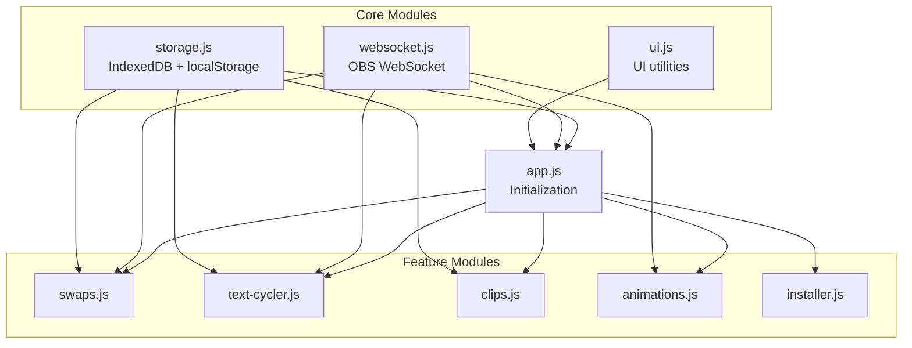

# Control Panel Architecture & Modularization Guide

This document explains the architecture of `control_panel.html` and provides guidance for splitting it into modular components.

## Current Structure (v3.0)

The control panel is currently a **single HTML file** (~5300+ lines) containing:

| Section | Lines | Description |
|---------|-------|-------------|
| CSS Styles | 7-790 | All styling in `<style>` block |
| HTML Body | 791-1691 | Page structure and components |
| JavaScript | 1692-end | All application logic |

### Why Single File?

The single-file approach was chosen for:
1. **OBS Compatibility** - Simpler path resolution with `file://` protocol
2. **No Build Step** - Streamers can use immediately without npm/webpack
3. **Easy Distribution** - One file to copy/share

## OBS Browser Source Compatibility

OBS browser sources **CAN** load external files via relative paths. This is proven by `twitch_clips_player/clips.html` which uses:

```html
<script src="assets/js/clips.js"></script>
<link rel="stylesheet" href="assets/css/clips.css">
```

### Requirements for External Files

1. Files must be in the **same directory or subdirectory** as the HTML
2. Use **relative paths** (not absolute)
3. Files must exist when OBS loads the page
4. **Cache-busting** recommended for development: `?v=1.0.0`

## Recommended Modular Structure

```
control_panel/
├── control_panel.html          # Main HTML (slim)
├── assets/
│   ├── css/
│   │   └── control-panel.css   # All styles
│   └── js/
│       ├── storage.js          # IndexedDB + localStorage system
│       ├── websocket.js        # OBS WebSocket communication
│       ├── ui.js               # UI utilities (log, renderX functions)
│       ├── app.js              # Main app initialization
│       └── modules/
│           ├── swaps.js        # Swap functionality
│           ├── text-cycler.js  # Text cycler functionality
│           ├── clips.js        # Clips player functionality
│           ├── animations.js   # Source animations functionality
│           └── installer.js    # Script installer wizard
```

## JavaScript Module Dependencies



## How to Split (Step by Step)

### Step 1: Extract CSS

1. Cut everything between `<style>` and `</style>` tags
2. Save to `assets/css/control-panel.css`
3. Replace `<style>...</style>` with:

```html
<link rel="stylesheet" href="assets/css/control-panel.css">
```

### Step 2: Extract Storage Module

The storage system (lines ~1693-1970) is self-contained:

```javascript
// assets/js/storage.js
const STORAGE_PREFIX = 'sss_';
const IDB_NAME = 'StrixunStreamSuite';
// ... rest of storage code
```

In HTML, add before other scripts:
```html
<script src="assets/js/storage.js"></script>
```

### Step 3: Extract Feature Modules

Each feature section can be extracted:

1. **Swap Functions** - `executeSwap()`, `renderSavedSwaps()`, etc.
2. **Text Cycler** - `startConfigCycling()`, `renderTextCyclerConfigs()`, etc.
3. **Clips Player** - `renderClipsConfigs()`, `generateClipsUrl()`, etc.

### Step 4: Create App Entry Point

```javascript
// assets/js/app.js
document.addEventListener('DOMContentLoaded', async () => {
    await initStorage();
    await loadConfigs();
    initUI();
    initWebSocket();
});
```

## Global Variables to Consider

When splitting, these globals need to be accessible across modules:

```javascript
// Storage
let storageCache = {};
let idbInstance = null;

// WebSocket
let ws = null;
let connected = false;
let pendingRequests = {};

// Data
let swapConfigs = [];
let textCyclerConfigs = [];
let clipsConfigs = [];
let sources = [];
let textSources = [];

// State
let currentScene = '';
let scriptStatus = { ... };
```

### Options for Sharing State

1. **Global Window Object** (simplest):
   ```javascript
   window.SSS = { storage, ws, configs };
   ```

2. **Module Pattern** (cleaner):
   ```javascript
   const SSS = (function() {
       const state = {};
       return { getState, setState };
   })();
   ```

3. **ES Modules** (modern, requires HTTPS/localhost):
   ```javascript
   // storage.js
   export const storage = { ... };
   
   // app.js
   import { storage } from './storage.js';
   ```

> ⚠️ **Note**: ES Modules (`import`/`export`) require HTTPS or localhost.
> For `file://` protocol, use global variables or IIFE modules.

## Testing After Split

1. Load control panel in OBS dock
2. Verify all tabs work
3. Test WebSocket connection
4. Create/save/load configs
5. Check browser console for errors
6. Test after OBS restart

## Rollback Plan

Keep a backup of the original `control_panel.html` before splitting.
If anything breaks, revert to the single-file version.

## Future Improvements

1. **TypeScript** - Add type safety (requires build step)
2. **Bundler** - Use Vite/Rollup for development, bundle for distribution
3. **Hot Reload** - Development server with live reload
4. **Unit Tests** - Test storage, WebSocket, and UI functions

---

## References

- [OBS Browser Source Documentation](https://github.com/obsproject/obs-browser)
- [IndexedDB API](https://developer.mozilla.org/en-US/docs/Web/API/IndexedDB_API)
- [OBS WebSocket Protocol](https://github.com/obsproject/obs-websocket/blob/master/docs/generated/protocol.md)

