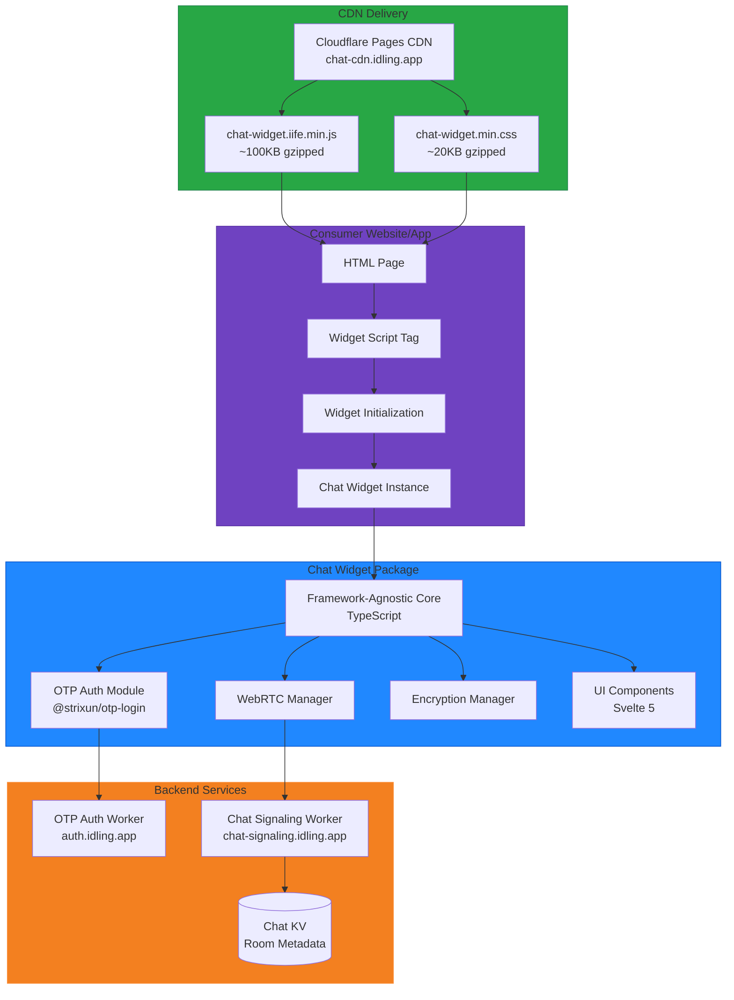

# Chat CDN Widget - Technical Architecture Specification

**Version:** 1.0.0-draft  
**Date:** 2026-01-11  
**Status:** Pre-Implementation Design

---

## Overview

This document specifies the technical architecture for the Strixun Chat Widget as a CDN-deliverable, framework-agnostic component with baked-in OTP authentication.

---

## Architecture Diagram



---

## Package Structure

```
packages/chat-widget/
├── src/
│   ├── core/                      # Framework-agnostic core logic
│   │   ├── ChatCore.ts            # Main chat client class
│   │   ├── RoomManager.ts         # Room lifecycle management
│   │   ├── MessageManager.ts      # Message sending/receiving
│   │   ├── WebRTCManager.ts       # WebRTC connection management
│   │   ├── SignalingClient.ts     # Signaling server communication
│   │   ├── EncryptionManager.ts   # Message encryption/decryption
│   │   ├── EmoteManager.ts        # 7TV + custom emote handling
│   │   ├── AuthManager.ts         # OTP auth integration
│   │   ├── StateManager.ts        # Observable state management
│   │   ├── EventEmitter.ts        # Event system
│   │   └── types.ts               # TypeScript type definitions
│   │
│   ├── svelte/                    # Svelte 5 wrapper
│   │   ├── ChatWidget.svelte      # Main widget component
│   │   ├── components/
│   │   │   ├── AuthFlow.svelte    # OTP auth UI
│   │   │   ├── ChatClient.svelte  # Main chat interface
│   │   │   ├── RoomList.svelte    # Room browser
│   │   │   ├── ChatMessage.svelte # Message component
│   │   │   ├── ChatInput.svelte   # Message input
│   │   │   └── EmotePicker.svelte # Emote picker
│   │   ├── stores/
│   │   │   └── widget-state.svelte.ts  # Svelte 5 $state management
│   │   └── index.ts               # Svelte exports
│   │
│   ├── react/                     # React wrapper (future)
│   │   ├── ChatWidget.tsx
│   │   ├── components/
│   │   └── index.ts
│   │
│   ├── vanilla/                   # Vanilla JS API
│   │   ├── index.ts               # Browser API entry
│   │   └── dom-renderer.ts        # DOM manipulation
│   │
│   ├── styles/                    # Shared styles
│   │   ├── variables.scss         # CSS custom properties
│   │   ├── base.scss              # Base styles
│   │   ├── components.scss        # Component styles
│   │   └── themes/
│   │       ├── dark.scss          # Dark theme
│   │       └── light.scss         # Light theme
│   │
│   └── index.ts                   # Main entry point
│
├── dist/                          # Built bundles (gitignored)
│   ├── cdn/                       # CDN-ready IIFE bundles
│   │   ├── v1/                    # Versioned directory
│   │   │   ├── chat-widget.iife.js
│   │   │   ├── chat-widget.iife.min.js
│   │   │   ├── chat-widget.iife.min.js.map
│   │   │   ├── chat-widget.css
│   │   │   └── chat-widget.min.css
│   │   └── latest/                # Latest stable
│   │       └── ... (same files)
│   │
│   ├── esm/                       # ES modules
│   │   └── chat-widget.esm.js
│   │
│   ├── cjs/                       # CommonJS (Node.js)
│   │   └── chat-widget.cjs.js
│   │
│   ├── svelte/                    # Svelte component bundle
│   │   └── index.js
│   │
│   └── types/                     # TypeScript declarations
│       └── index.d.ts
│
├── scripts/                       # Build scripts
│   ├── build-cdn.ts               # Build CDN bundles
│   ├── build-svelte.ts            # Build Svelte components
│   ├── build-react.ts             # Build React components
│   ├── version-assets.ts          # Version management
│   └── deploy-cdn.ts              # Deploy to Cloudflare Pages
│
├── tests/                         # Test files
│   ├── unit/
│   │   ├── ChatCore.test.ts
│   │   ├── RoomManager.test.ts
│   │   └── MessageManager.test.ts
│   ├── integration/
│   │   └── chat-flow.test.ts
│   └── e2e/
│       └── cdn-widget.spec.ts
│
├── docs/                          # Documentation
│   ├── CDN_USAGE.md               # CDN integration guide
│   ├── API_REFERENCE.md           # API documentation
│   ├── SECURITY.md                # Security considerations
│   ├── TESTING.md                 # Testing guide
│   └── MIGRATION.md               # Migration guide
│
├── vite.config.cdn.ts             # CDN build configuration
├── vite.config.svelte.ts          # Svelte build configuration
├── vite.config.react.ts           # React build configuration
├── tsconfig.json                  # TypeScript configuration
├── vitest.config.ts               # Vitest test configuration
├── package.json                   # Package metadata
└── README.md                      # Package overview
```

---

## Core Architecture

### 1. ChatCore Class (Framework-Agnostic)

**File:** `src/core/ChatCore.ts`

```typescript
import { EventEmitter } from './EventEmitter';
import { RoomManager } from './RoomManager';
import { MessageManager } from './MessageManager';
import { WebRTCManager } from './WebRTCManager';
import { SignalingClient } from './SignalingClient';
import { EncryptionManager } from './EncryptionManager';
import { EmoteManager } from './EmoteManager';
import { AuthManager } from './AuthManager';
import { StateManager } from './StateManager';
import type { ChatConfig, ChatState, ChatMessage, RoomMetadata } from './types';

/**
 * ChatCore - Framework-agnostic chat client
 * 
 * This is the core chat logic that works across all frameworks.
 * It uses an observable state pattern and event emitter for reactivity.
 */
export class ChatCore extends EventEmitter {
  private config: ChatConfig;
  private state: StateManager<ChatState>;
  private authManager: AuthManager;
  private roomManager: RoomManager;
  private messageManager: MessageManager;
  private webrtcManager: WebRTCManager;
  private signalingClient: SignalingClient;
  private encryptionManager: EncryptionManager;
  private emoteManager: EmoteManager;

  constructor(config: ChatConfig) {
    super();
    this.validateConfig(config);
    this.config = config;

    // Initialize state
    this.state = new StateManager<ChatState>({
      status: 'disconnected',
      authenticated: false,
      room: null,
      messages: [],
      participants: [],
      emotes: [],
    });

    // Initialize managers
    this.authManager = new AuthManager({
      apiUrl: config.authApiUrl,
      otpEncryptionKey: config.otpEncryptionKey,
      onAuthChange: (authenticated, token) => {
        this.state.update({ authenticated, token });
        this.emit('auth:change', { authenticated, token });
      },
    });

    this.encryptionManager = new EncryptionManager({
      getToken: () => this.state.get().token,
    });

    this.signalingClient = new SignalingClient({
      baseUrl: config.signalingUrl,
      getToken: () => this.state.get().token,
    });

    this.webrtcManager = new WebRTCManager({
      iceServers: config.iceServers || this.getDefaultIceServers(),
      onMessage: (message) => this.handleIncomingMessage(message),
      onConnectionStateChange: (state) => {
        this.state.update({ status: state });
        this.emit('connection:change', state);
      },
    });

    this.roomManager = new RoomManager({
      signalingClient: this.signalingClient,
      webrtcManager: this.webrtcManager,
      onRoomChange: (room) => {
        this.state.update({ room });
        this.emit('room:change', room);
      },
    });

    this.messageManager = new MessageManager({
      encryptionManager: this.encryptionManager,
      webrtcManager: this.webrtcManager,
      onMessage: (message) => this.handleIncomingMessage(message),
    });

    this.emoteManager = new EmoteManager({
      cache: config.emoteCache !== false,
    });
  }

  /**
   * Get current state (immutable)
   */
  getState(): Readonly<ChatState> {
    return this.state.get();
  }

  /**
   * Subscribe to state changes
   */
  subscribe(callback: (state: ChatState) => void): () => void {
    return this.state.subscribe(callback);
  }

  /**
   * Authenticate user (shows OTP UI if needed)
   */
  async authenticate(): Promise<void> {
    if (this.state.get().authenticated) {
      return;
    }

    await this.authManager.authenticate();
  }

  /**
   * Check if user is authenticated
   */
  isAuthenticated(): boolean {
    return this.state.get().authenticated;
  }

  /**
   * Logout user
   */
  async logout(): Promise<void> {
    await this.authManager.logout();
    await this.leaveRoom();
    this.state.update({
      authenticated: false,
      token: null,
      room: null,
      messages: [],
    });
    this.emit('auth:logout');
  }

  /**
   * Create a new room
   */
  async createRoom(options?: {
    customName?: string;
    isPublic?: boolean;
  }): Promise<RoomMetadata> {
    if (!this.isAuthenticated()) {
      throw new Error('Not authenticated. Call authenticate() first.');
    }

    const room = await this.roomManager.createRoom(options);
    return room;
  }

  /**
   * Join an existing room
   */
  async joinRoom(roomId: string): Promise<RoomMetadata> {
    if (!this.isAuthenticated()) {
      throw new Error('Not authenticated. Call authenticate() first.');
    }

    const room = await this.roomManager.joinRoom(roomId);
    return room;
  }

  /**
   * Leave current room
   */
  async leaveRoom(): Promise<void> {
    await this.roomManager.leaveRoom();
    this.state.update({ room: null, messages: [] });
  }

  /**
   * Send a message
   */
  async sendMessage(
    content: string,
    options?: {
      emoteIds?: string[];
      customEmojiIds?: string[];
    }
  ): Promise<void> {
    if (!this.state.get().room) {
      throw new Error('Not in a room. Call createRoom() or joinRoom() first.');
    }

    await this.messageManager.sendMessage(content, options);
  }

  /**
   * Get active public rooms
   */
  async getActiveRooms(): Promise<RoomMetadata[]> {
    return await this.roomManager.getActiveRooms();
  }

  /**
   * Parse emotes in a message
   */
  async parseEmotes(content: string): Promise<{
    parsed: string;
    emoteIds: string[];
  }> {
    return await this.emoteManager.parseMessage(content);
  }

  /**
   * Destroy instance and cleanup
   */
  destroy(): void {
    this.leaveRoom();
    this.authManager.destroy();
    this.roomManager.destroy();
    this.messageManager.destroy();
    this.webrtcManager.destroy();
    this.signalingClient.destroy();
    this.emoteManager.destroy();
    this.removeAllListeners();
  }

  // Private methods

  private validateConfig(config: ChatConfig): void {
    if (!config.authApiUrl) {
      throw new Error('authApiUrl is required');
    }
    if (!config.signalingUrl) {
      throw new Error('signalingUrl is required');
    }
    if (!config.otpEncryptionKey) {
      throw new Error('otpEncryptionKey is required');
    }
  }

  private handleIncomingMessage(message: ChatMessage): void {
    const currentMessages = this.state.get().messages;
    this.state.update({
      messages: [...currentMessages, message],
    });
    this.emit('message:received', message);
  }

  private getDefaultIceServers() {
    return [
      { urls: 'stun:stun.l.google.com:19302' },
      { urls: 'stun:stun1.l.google.com:19302' },
    ];
  }
}
```

### 2. Type Definitions

**File:** `src/core/types.ts`

```typescript
/**
 * Chat Widget Configuration
 */
export interface ChatConfig {
  /** OTP Auth API URL */
  authApiUrl: string;
  
  /** Chat Signaling Server URL */
  signalingUrl: string;
  
  /** OTP Encryption Key */
  otpEncryptionKey: string;
  
  /** Custom ICE servers (optional) */
  iceServers?: RTCIceServer[];
  
  /** Enable emote caching (default: true) */
  emoteCache?: boolean;
  
  /** Custom headers for API requests */
  customHeaders?: Record<string, string>;
  
  /** Theme ('dark' | 'light') */
  theme?: 'dark' | 'light';
  
  /** Auto-authenticate on mount (default: false) */
  autoAuth?: boolean;
  
  /** Callback when ready */
  onReady?: (instance: ChatCore) => void;
  
  /** Callback when auth required */
  onAuthRequired?: () => void;
  
  /** Callback when error occurs */
  onError?: (error: Error) => void;
}

/**
 * Chat State
 */
export interface ChatState {
  /** Connection status */
  status: 'disconnected' | 'connecting' | 'connected' | 'error';
  
  /** Authentication status */
  authenticated: boolean;
  
  /** JWT token */
  token?: string | null;
  
  /** Current room */
  room: RoomMetadata | null;
  
  /** Messages in current room */
  messages: ChatMessage[];
  
  /** Participants in current room */
  participants: Participant[];
  
  /** Available emotes */
  emotes: EmoteData[];
  
  /** Error message */
  error?: string | null;
}

/**
 * Room Metadata
 */
export interface RoomMetadata {
  roomId: string;
  broadcasterId: string;
  broadcasterName: string;
  createdAt: string;
  participantCount: number;
  isPublic: boolean;
  customName?: string;
}

/**
 * Chat Message
 */
export interface ChatMessage {
  id: string;
  roomId: string;
  senderId: string;
  senderName: string;
  timestamp: string;
  content: string;
  encrypted: boolean;
  emoteIds?: string[];
  customEmojiIds?: string[];
  type?: 'message' | 'system' | 'join' | 'leave';
}

/**
 * Participant
 */
export interface Participant {
  userId: string;
  userName: string;
  joinedAt: string;
  isOnline: boolean;
}

/**
 * Emote Data
 */
export interface EmoteData {
  id: string;
  name: string;
  url: string;
  animated: boolean;
  width: number;
  height: number;
  provider: '7tv' | 'custom';
}

/**
 * Custom Emoji
 */
export interface CustomEmoji {
  id: string;
  name: string;
  url: string;
  domain: string;
  uploadedBy: string;
  uploadedAt: string;
}
```

---

## CDN Build Configuration

**File:** `vite.config.cdn.ts`

```typescript
import { defineConfig } from 'vite';
import { svelte } from '@sveltejs/vite-plugin-svelte';
import { resolve } from 'path';

export default defineConfig({
  plugins: [
    svelte({
      compilerOptions: {
        // Svelte 5 runes mode
        runes: true,
        // Hydratable for SSR (future)
        hydratable: false,
      },
    }),
  ],
  
  build: {
    outDir: 'dist/cdn/v1',
    emptyOutDir: true,
    
    // Library mode - IIFE for CDN
    lib: {
      entry: resolve(__dirname, 'src/vanilla/index.ts'),
      name: 'StrixunChat',
      formats: ['iife', 'es'],
      fileName: (format) => {
        if (format === 'iife') return 'chat-widget.iife.js';
        if (format === 'es') return 'chat-widget.esm.js';
        return `chat-widget.${format}.js`;
      },
    },
    
    rollupOptions: {
      // Bundle everything (no externals for CDN)
      external: [],
      
      output: {
        // Asset naming
        assetFileNames: (assetInfo) => {
          if (assetInfo.name === 'style.css') {
            return 'chat-widget.css';
          }
          return 'assets/[name]-[hash][extname]';
        },
        
        // Chunk naming
        chunkFileNames: 'chunks/[name]-[hash].js',
        
        // Entry naming
        entryFileNames: '[name].js',
        
        // Inline dynamic imports for simpler bundle
        inlineDynamicImports: true,
      },
    },
    
    // Minification
    minify: 'terser',
    terserOptions: {
      compress: {
        drop_console: true,
        drop_debugger: true,
        pure_funcs: ['console.log', 'console.debug'],
      },
      format: {
        comments: false,
      },
    },
    
    // Source maps for debugging
    sourcemap: true,
    
    // Target modern browsers
    target: 'es2020',
    
    // CSS code split
    cssCodeSplit: false, // Bundle all CSS into single file
  },
  
  // Resolve aliases
  resolve: {
    alias: {
      '@core': resolve(__dirname, 'src/core'),
      '@svelte': resolve(__dirname, 'src/svelte'),
      '@styles': resolve(__dirname, 'src/styles'),
    },
  },
  
  // CSS preprocessing
  css: {
    preprocessorOptions: {
      scss: {
        additionalData: `
          @use "./src/styles/variables" as *;
        `,
      },
    },
  },
  
  // Optimization
  optimizeDeps: {
    include: ['@strixun/otp-login'],
  },
});
```

---

## CDN Usage Example

### Zero-Config CDN Usage

```html
<!DOCTYPE html>
<html lang="en">
<head>
  <meta charset="UTF-8">
  <meta name="viewport" content="width=device-width, initial-scale=1.0">
  <title>My Site with Chat</title>
  
  <!-- Chat Widget CSS -->
  <link rel="stylesheet" href="https://chat-cdn.idling.app/v1/chat-widget.min.css">
</head>
<body>
  <h1>My Website</h1>
  
  <!-- Chat widget will render here -->
  <div id="chat-widget"></div>
  
  <!-- Chat Widget JS -->
  <script src="https://chat-cdn.idling.app/v1/chat-widget.iife.min.js"></script>
  
  <!-- Initialize Chat Widget -->
  <script>
    // Widget is available as window.StrixunChat
    const chat = new StrixunChat.ChatWidget({
      // Required config
      containerId: 'chat-widget',
      authApiUrl: 'https://auth.idling.app',
      signalingUrl: 'https://chat-signaling.idling.app',
      otpEncryptionKey: 'your-encryption-key-here',
      
      // Optional config
      theme: 'dark', // or 'light'
      autoAuth: true, // Show auth UI if not logged in
      
      // Callbacks
      onReady: (chatInstance) => {
        console.log('Chat widget ready!', chatInstance);
      },
      
      onAuthRequired: () => {
        console.log('User needs to authenticate');
      },
      
      onError: (error) => {
        console.error('Chat error:', error);
      },
    });
    
    // Programmatic API
    // chat.authenticate();
    // chat.createRoom({ customName: 'My Room' });
    // chat.joinRoom('room-id');
    // chat.sendMessage('Hello, world!');
    // chat.logout();
    // chat.destroy();
  </script>
</body>
</html>
```

### Advanced Usage with Events

```html
<script>
  const chat = new StrixunChat.ChatWidget({
    containerId: 'chat-widget',
    authApiUrl: 'https://auth.idling.app',
    signalingUrl: 'https://chat-signaling.idling.app',
    otpEncryptionKey: 'your-key',
    theme: 'dark',
  });
  
  // Listen to events
  chat.on('auth:change', ({ authenticated, token }) => {
    console.log('Auth state changed:', authenticated);
    if (authenticated) {
      // User logged in, show chat features
      document.getElementById('create-room-btn').style.display = 'block';
    }
  });
  
  chat.on('message:received', (message) => {
    console.log('New message:', message);
    // Update your UI, send notification, etc.
  });
  
  chat.on('room:change', (room) => {
    console.log('Room changed:', room);
    // Update room info in your UI
  });
  
  chat.on('connection:change', (status) => {
    console.log('Connection status:', status);
    // Show connection indicator
  });
  
  // Subscribe to state changes
  const unsubscribe = chat.subscribe((state) => {
    console.log('State updated:', state);
    // React to any state change
  });
  
  // Later: unsubscribe
  // unsubscribe();
</script>
```

---

## Deployment Strategy

### GitHub Actions Workflow

**File:** `.github/workflows/deploy-chat-widget-cdn.yml`

```yaml
name: Deploy Chat Widget CDN

on:
  push:
    branches: [main]
    paths:
      - 'packages/chat-widget/**'
      - '.github/workflows/deploy-chat-widget-cdn.yml'
  workflow_dispatch:

jobs:
  build-and-deploy:
    runs-on: ubuntu-latest
    
    steps:
      - name: Checkout
        uses: actions/checkout@v3
      
      - name: Setup Node.js
        uses: actions/setup-node@v3
        with:
          node-version: '20'
      
      - name: Install pnpm
        run: npm install -g pnpm@9
      
      - name: Install dependencies
        run: pnpm install --frozen-lockfile
      
      - name: Build chat widget (CDN)
        run: |
          cd packages/chat-widget
          pnpm build:cdn
      
      - name: Version assets
        run: |
          cd packages/chat-widget
          pnpm run version-assets
      
      - name: Deploy to Cloudflare Pages
        uses: cloudflare/pages-action@v1
        with:
          apiToken: ${{ secrets.CF_API_TOKEN }}
          accountId: ${{ secrets.CF_ACCOUNT_ID }}
          projectName: chat-widget-cdn
          directory: packages/chat-widget/dist/cdn
          branch: main
      
      - name: Purge CDN cache
        run: |
          curl -X POST "https://api.cloudflare.com/client/v4/zones/${{ secrets.CF_ZONE_ID }}/purge_cache" \
            -H "Authorization: Bearer ${{ secrets.CF_API_TOKEN }}" \
            -H "Content-Type: application/json" \
            --data '{"purge_everything":true}'
```

---

## Version Management

### Version Strategy

**URL Structure:**
```
https://chat-cdn.idling.app/
├── latest/                       # Always latest stable (auto-updates)
│   ├── chat-widget.iife.min.js
│   ├── chat-widget.esm.js
│   └── chat-widget.min.css
│
├── v1/                           # Major version (v1.x.x)
│   └── ... (same files)
│
├── v1.2/                         # Minor version (v1.2.x)
│   └── ... (same files)
│
└── v1.2.3/                       # Specific version
    └── ... (same files)
```

**Cache Headers:**
```
# Versioned paths (immutable)
Cache-Control: public, max-age=31536000, immutable

# /latest/ path (short cache)
Cache-Control: public, max-age=300, must-revalidate
```

### Version Script

**File:** `scripts/version-assets.ts`

```typescript
import fs from 'fs-extra';
import path from 'path';
import { fileURLToPath } from 'url';

const __dirname = path.dirname(fileURLToPath(import.meta.url));
const pkg = JSON.parse(fs.readFileSync('../package.json', 'utf-8'));
const version = pkg.version; // e.g., "1.2.3"

const [major, minor, patch] = version.split('.').map(Number);

const distDir = path.resolve(__dirname, '../dist/cdn');
const baseDir = path.resolve(distDir, 'v1'); // Built files are here

// Create version directories
const versionDirs = [
  path.resolve(distDir, 'latest'),
  path.resolve(distDir, `v${major}`),
  path.resolve(distDir, `v${major}.${minor}`),
  path.resolve(distDir, `v${major}.${minor}.${patch}`),
];

// Copy files to each version directory
for (const dir of versionDirs) {
  fs.ensureDirSync(dir);
  fs.copySync(baseDir, dir, { overwrite: true });
  console.log(`✓ Copied assets to ${path.relative(distDir, dir)}/`);
}

console.log(`✓ Version ${version} deployed to all directories`);
```

---

## Security Considerations

### 1. Content Security Policy (CSP)

Consumers must allow:
```html
<meta http-equiv="Content-Security-Policy" content="
  default-src 'self';
  script-src 'self' https://chat-cdn.idling.app;
  style-src 'self' https://chat-cdn.idling.app;
  connect-src 'self' https://auth.idling.app https://chat-signaling.idling.app wss://chat-signaling.idling.app;
  img-src 'self' https://cdn.7tv.app https://*.r2.dev data:;
">
```

### 2. Subresource Integrity (SRI)

Provide SRI hashes for CDN files:
```html
<script 
  src="https://chat-cdn.idling.app/v1/chat-widget.iife.min.js"
  integrity="sha384-oqVuAfXRKap7fdgcCY5uykM6+R9GqQ8K/ux..."
  crossorigin="anonymous">
</script>
```

Generate hashes in build script.

### 3. CORS Configuration

Cloudflare Pages `_headers` file:
```
/*
  Access-Control-Allow-Origin: *
  Access-Control-Allow-Methods: GET, OPTIONS
  Access-Control-Allow-Headers: Content-Type
  Cross-Origin-Resource-Policy: cross-origin
  X-Content-Type-Options: nosniff
  X-Frame-Options: SAMEORIGIN
```

---

## Performance Targets

### Bundle Size
- Core JS (IIFE minified + gzipped): < 100KB
- CSS (minified + gzipped): < 20KB
- Total: < 120KB

### Load Time
- First Contentful Paint (FCP): < 1.5s
- Time to Interactive (TTI): < 3s

### Runtime Performance
- Message render time: < 16ms (60fps)
- WebRTC connection time: < 5s
- Emote load time: < 100ms (cached)

---

## Browser Support

### Minimum Requirements
- Chrome/Edge 90+
- Firefox 88+
- Safari 14+
- Opera 76+

### Required APIs
- WebRTC (RTCPeerConnection, RTCDataChannel)
- Web Crypto API
- IndexedDB
- WebSockets (for signaling)

---

*End of Technical Architecture Specification* 🧙‍♂️⚡
