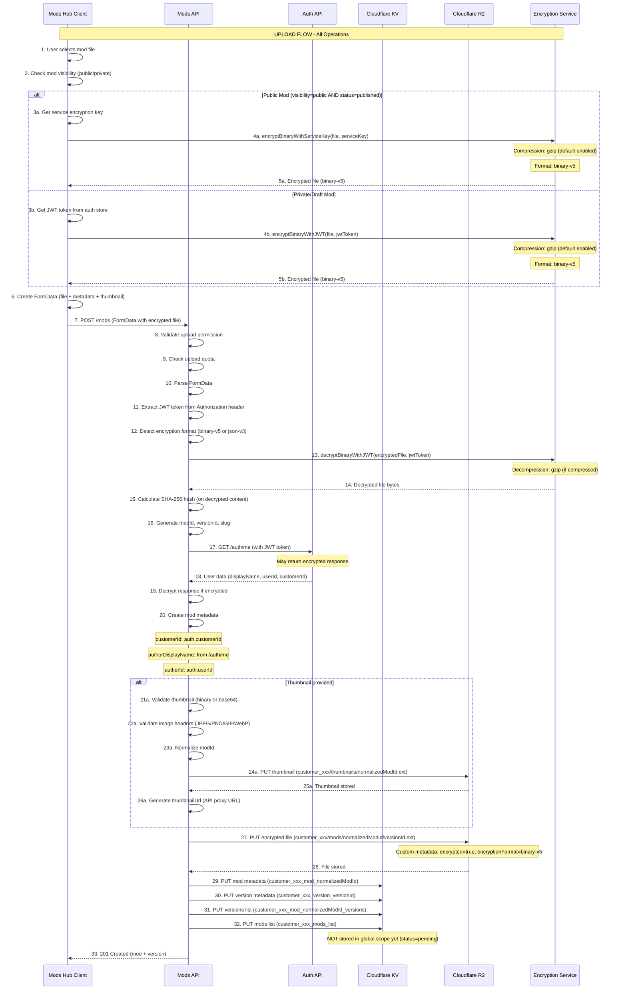
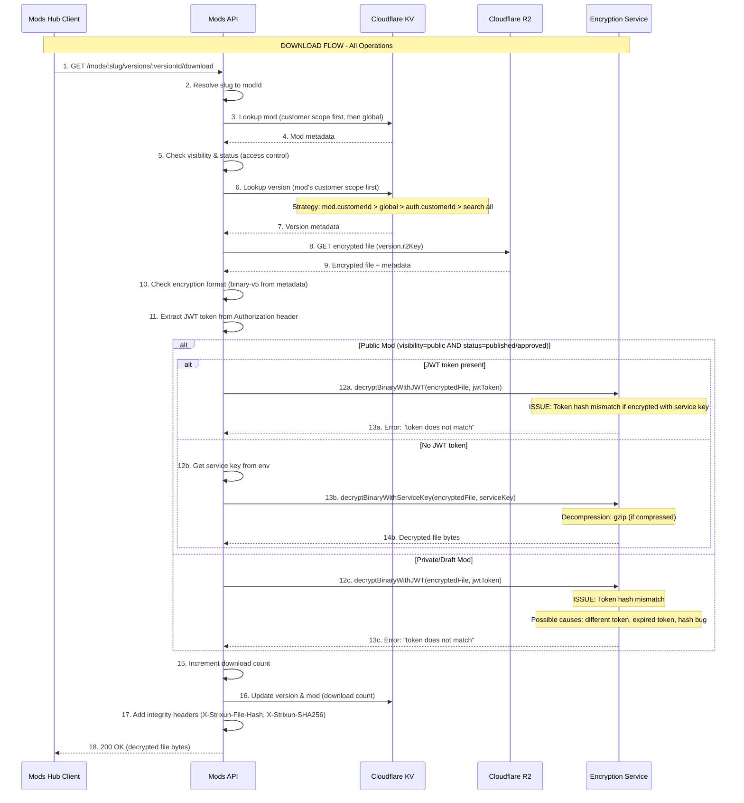
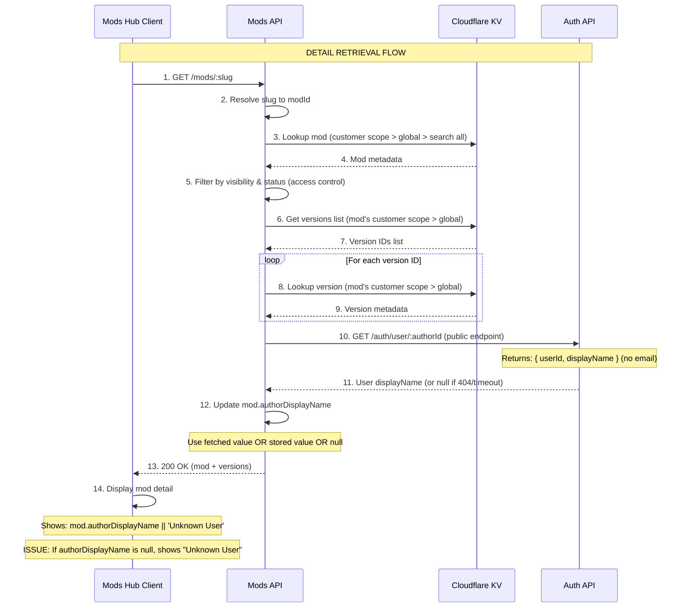
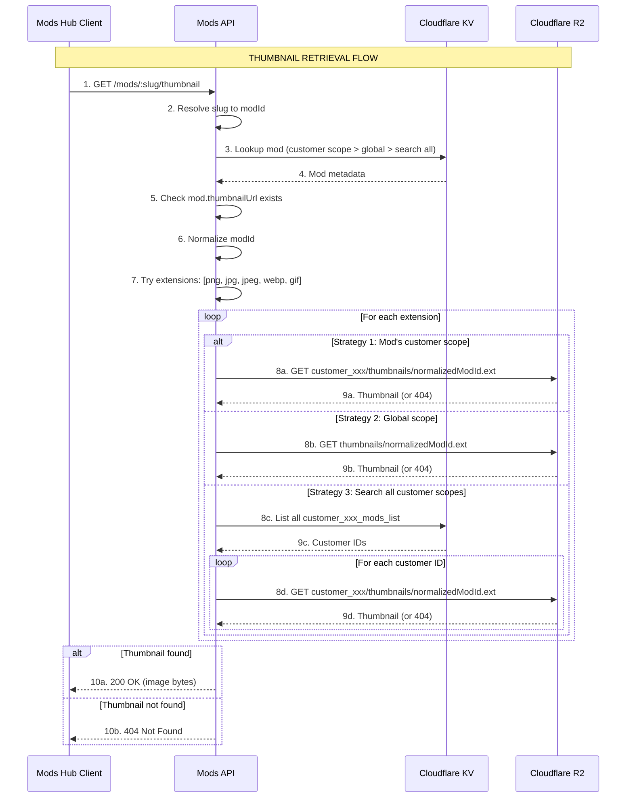
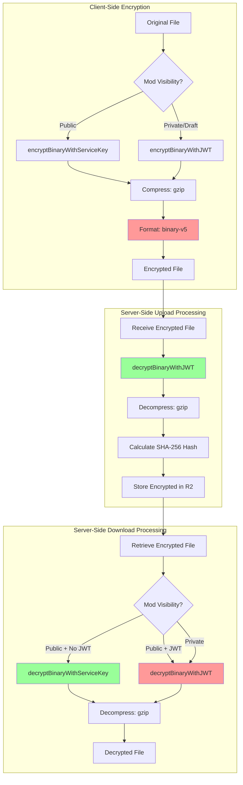
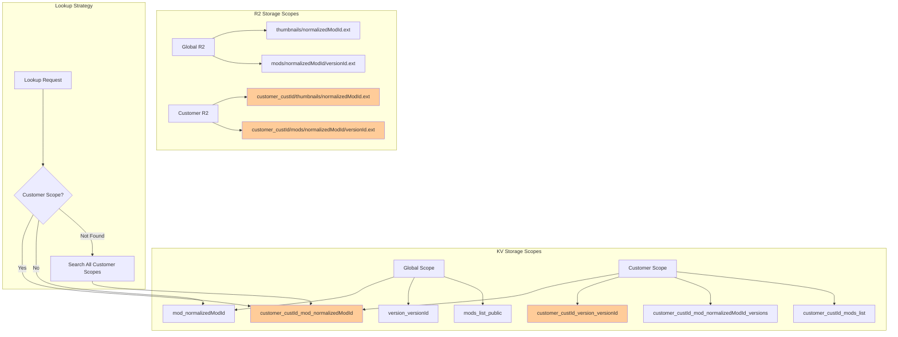

# Mods Hub & Mods API Comprehensive Audit

**Date:** 2025-12-30  
**Status:** [AUDIT] Complete - Issues Identified  
**Scope:** End-to-end data flow analysis with encryption/decryption, compression/decompression, and all operations

---

## Executive Summary

This audit provides a comprehensive analysis of the mods-hub and mods-api data flows, including all encryption/decryption, compression/decompression operations, and identifies critical defects in the current implementation.

### Critical Issues Identified

1. **[CRITICAL] Download Decryption Failure**: Files encrypted with JWT during upload fail to decrypt during download due to token hash mismatch
2. **[HIGH] Unknown User Display**: `authorDisplayName` is null in mod metadata, causing "Unknown User" to display despite correct header displayName
3. **[MEDIUM] CustomerId Association**: Mods may not be properly associated with customerId during upload or lookup
4. **[MEDIUM] Thumbnail Retrieval**: Thumbnail lookup may fail due to scope/key resolution issues

---

## Data Flow Diagrams

### 1. Mod Upload Flow (Complete)



### 2. Mod Download Flow (Complete)



### 3. Mod Detail Retrieval Flow



### 4. Thumbnail Retrieval Flow



### 5. Encryption/Decryption Operations Map



### 6. Data Scoping Architecture



---

## Critical Issues Analysis

### Issue 1: Download Decryption Failure

**Symptoms:**
- Error: "Decryption failed - token does not match. Only authenticated users (with email OTP access) can decrypt this data."
- User is authenticated (hasAuth: true, customerId present)
- File is encrypted with binary-v5 format
- JWT token is present (hasToken: true, tokenLength: 524)

**Root Cause Analysis:**

1. **Encryption Key Mismatch**: Files are encrypted with JWT during upload, but the JWT token used for decryption may be different or expired.

2. **Token Hash Verification**: The binary-v5 format stores a token hash (32 bytes) derived from the JWT token. During decryption, the current JWT token is hashed and compared. If they don't match, decryption fails.

3. **Public Mod Encryption Logic**: The client-side encryption checks `metadata.visibility === 'public' && (metadata.status === 'published' || !metadata.status)`, but new mods start with `status: 'pending'`, so they're always encrypted with JWT even if visibility is 'public'.

**Code References:**
- Upload encryption: `mods-hub/src/services/api.ts:236-257`
- Download decryption: `serverless/mods-api/handlers/versions/download.ts:412-424`
- Token hash verification: `packages/api-framework/encryption/jwt-encryption.ts:483-489`

**Fix Required:**
1. Ensure JWT token used for decryption matches the token used for encryption
2. For public mods, use service key encryption even if status is 'pending'
3. Add token refresh logic if token expires between upload and download
4. Consider re-encrypting public mods with service key after status changes to 'published'

### Issue 2: Unknown User Display

**Symptoms:**
- Mod detail page shows "Unknown User" instead of author display name
- Header correctly shows display name (from /auth/me)
- Mod metadata has `authorDisplayName: null`

**Root Cause Analysis:**

1. **Upload Time Fetch Failure**: During upload, the `/auth/me` endpoint may timeout or fail, resulting in `authorDisplayName: null` being stored.

2. **Detail Time Fetch Failure**: The detail handler tries to fetch displayName again via `/auth/user/:userId`, but if it fails again, it falls back to the stored value (null).

3. **Race Condition**: The mod is stored before the displayName fetch completes, so if it fails, null is stored.

**Code References:**
- Upload displayName fetch: `serverless/mods-api/handlers/mods/upload.ts:504-641`
- Detail displayName fetch: `serverless/mods-api/handlers/mods/detail.ts:245-252`
- Display logic: `mods-hub/src/pages/ModDetailPage.tsx:247`

**Fix Required:**
1. Make displayName fetch synchronous before storing mod (wait for result)
2. Add retry logic with exponential backoff
3. Store displayName in a separate KV key for faster lookup
4. Use header displayName as fallback if mod metadata has null

### Issue 3: CustomerId Association

**Symptoms:**
- Mods may not be properly associated with customerId
- Lookup may fail to find mods in customer scope

**Root Cause Analysis:**

1. **Upload Sets CustomerId**: The upload handler correctly sets `customerId: auth.customerId` on line 665.

2. **Lookup Strategy**: The lookup strategy checks customer scope first, then global scope, then searches all customer scopes. This should work, but there may be issues with:
   - Normalized modId consistency
   - Customer scope key generation
   - Race conditions during lookup

**Code References:**
- Upload customerId: `serverless/mods-api/handlers/mods/upload.ts:665`
- Lookup strategy: `serverless/mods-api/handlers/mods/detail.ts:32-65`
- Key generation: `serverless/mods-api/utils/customer.ts`

**Fix Required:**
1. Verify customerId is always set during upload (add validation)
2. Ensure normalized modId is consistent across all operations
3. Add logging to track customerId association
4. Verify lookup strategy handles all edge cases

### Issue 4: Thumbnail Retrieval

**Symptoms:**
- Thumbnails may fail to load
- "[WARNING] Thumbnail unavailable Image failed to load" message

**Root Cause Analysis:**

1. **R2 Key Resolution**: The thumbnail handler tries multiple strategies to find the thumbnail, but there may be issues with:
   - Extension mismatch (stored as .png but trying .jpg)
   - Customer scope key mismatch
   - Normalized modId inconsistency

2. **Thumbnail URL Generation**: The thumbnailUrl is generated during upload using the slug, but if the slug changes or the mod isn't found, the URL may be invalid.

**Code References:**
- Thumbnail upload: `serverless/mods-api/handlers/mods/upload.ts:763-920`
- Thumbnail retrieval: `serverless/mods-api/handlers/mods/thumbnail.ts:15-411`

**Fix Required:**
1. Store extension in mod metadata for faster lookup
2. Verify R2 key generation matches lookup strategy
3. Add fallback to try all extensions if stored extension fails
4. Cache thumbnail URLs in mod metadata

---

## OpenAPI Specification

```yaml
openapi: 3.0.3
info:
  title: Mods API
  version: 1.0.0
  description: |
    Comprehensive API specification for Mods Hub and Mods API.
    Includes all endpoints, encryption/decryption operations, and data flows.
    
    **Critical Operations:**
    - File encryption/decryption (binary-v5 format with gzip compression)
    - Customer scoping (KV and R2 storage)
    - User display name resolution
    - Thumbnail management

servers:
  - url: https://mods-api.idling.app
    description: Production server
  - url: http://localhost:8787
    description: Local development server

tags:
  - name: Mods
    description: Mod management operations
  - name: Versions
    description: Version management operations
  - name: Thumbnails
    description: Thumbnail operations
  - name: Authentication
    description: Authentication and authorization

paths:
  /mods:
    post:
      tags:
        - Mods
      summary: Upload a new mod
      description: |
        Uploads a new mod with initial version. Files must be encrypted before upload.
        
        **Encryption:**
        - Public mods: Use service key encryption (allows anonymous downloads)
        - Private/draft mods: Use JWT encryption (requires authentication)
        - Format: binary-v5 (with gzip compression by default)
        
        **Operations:**
        1. Client encrypts file (binary-v5 format)
        2. Server decrypts temporarily to calculate SHA-256 hash
        3. Server stores encrypted file in R2
        4. Server stores metadata in KV (customer scope)
        5. Server fetches author displayName from /auth/me
      operationId: uploadMod
      security:
        - bearerAuth: []
      requestBody:
        required: true
        content:
          multipart/form-data:
            schema:
              type: object
              required:
                - file
                - metadata
              properties:
                file:
                  type: string
                  format: binary
                  description: Encrypted mod file (binary-v5 format)
                metadata:
                  type: string
                  description: JSON string with mod metadata
                  example: '{"title":"My Mod","version":"1.0.0","category":"utility","visibility":"public","status":"pending"}'
                thumbnail:
                  type: string
                  format: binary
                  description: Optional thumbnail image (JPEG/PNG/GIF/WebP)
      responses:
        '201':
          description: Mod created successfully
          content:
            application/json:
              schema:
                $ref: '#/components/schemas/ModUploadResponse'
        '400':
          $ref: '#/components/responses/BadRequest'
        '401':
          $ref: '#/components/responses/Unauthorized'
        '403':
          $ref: '#/components/responses/Forbidden'
        '409':
          description: Slug already exists
        '413':
          description: File too large
        '429':
          description: Upload quota exceeded

    get:
      tags:
        - Mods
      summary: List mods
      description: |
        Lists mods with pagination and filtering. Only returns published/approved mods for non-admin users.
      operationId: listMods
      parameters:
        - name: page
          in: query
          schema:
            type: integer
            default: 1
        - name: pageSize
          in: query
          schema:
            type: integer
            default: 20
        - name: category
          in: query
          schema:
            type: string
        - name: search
          in: query
          schema:
            type: string
        - name: authorId
          in: query
          schema:
            type: string
        - name: featured
          in: query
          schema:
            type: boolean
        - name: visibility
          in: query
          schema:
            type: string
            enum: [public, unlisted, private]
      responses:
        '200':
          description: List of mods
          content:
            application/json:
              schema:
                $ref: '#/components/schemas/ModListResponse'

  /mods/{slug}:
    get:
      tags:
        - Mods
      summary: Get mod detail
      description: |
        Gets mod detail by slug. Resolves slug to modId internally.
        
        **Operations:**
        1. Resolve slug to modId (searches all scopes)
        2. Lookup mod metadata (customer scope > global > search all)
        3. Filter by visibility & status
        4. Fetch versions (mod's customer scope > global)
        5. Fetch author displayName from /auth/user/:userId
      operationId: getModDetail
      parameters:
        - name: slug
          in: path
          required: true
          schema:
            type: string
      responses:
        '200':
          description: Mod detail
          content:
            application/json:
              schema:
                $ref: '#/components/schemas/ModDetailResponse'
        '404':
          $ref: '#/components/responses/NotFound'

    put:
      tags:
        - Mods
      summary: Update mod
      operationId: updateMod
      security:
        - bearerAuth: []
      parameters:
        - name: slug
          in: path
          required: true
          schema:
            type: string
      requestBody:
        content:
          multipart/form-data:
            schema:
              type: object
              properties:
                metadata:
                  type: string
                  description: JSON string with mod updates
                thumbnail:
                  type: string
                  format: binary
      responses:
        '200':
          description: Mod updated
        '404':
          $ref: '#/components/responses/NotFound'

    delete:
      tags:
        - Mods
      summary: Delete mod
      operationId: deleteMod
      security:
        - bearerAuth: []
      parameters:
        - name: slug
          in: path
          required: true
          schema:
            type: string
      responses:
        '204':
          description: Mod deleted
        '404':
          $ref: '#/components/responses/NotFound'

  /mods/{slug}/thumbnail:
    get:
      tags:
        - Thumbnails
      summary: Get mod thumbnail
      description: |
        Gets mod thumbnail by slug. Resolves slug to modId internally.
        
        **Operations:**
        1. Resolve slug to modId
        2. Lookup mod metadata
        3. Try multiple R2 key strategies:
           - Mod's customer scope
           - Global scope
           - Search all customer scopes
        4. Try multiple extensions: [png, jpg, jpeg, webp, gif]
      operationId: getThumbnail
      parameters:
        - name: slug
          in: path
          required: true
          schema:
            type: string
      responses:
        '200':
          description: Thumbnail image
          content:
            image/png: {}
            image/jpeg: {}
            image/webp: {}
            image/gif: {}
        '404':
          $ref: '#/components/responses/NotFound'

  /mods/{slug}/versions/{versionId}/download:
    get:
      tags:
        - Versions
      summary: Download mod version
      description: |
        Downloads a mod version file. Files are decrypted on-the-fly.
        
        **Operations:**
        1. Resolve slug to modId
        2. Lookup mod & version (customer scope > global > search all)
        3. Check visibility & status (access control)
        4. Retrieve encrypted file from R2
        5. Decrypt file:
           - Public mods: Try service key if no JWT, else JWT
           - Private mods: Require JWT
        6. Decompress if compressed (gzip)
        7. Return decrypted file with integrity headers
      operationId: downloadVersion
      parameters:
        - name: slug
          in: path
          required: true
          schema:
            type: string
        - name: versionId
          in: path
          required: true
          schema:
            type: string
      security:
        - bearerAuth: []
      responses:
        '200':
          description: Decrypted file
          headers:
            X-Strixun-File-Hash:
              schema:
                type: string
              description: Strixun hash format (strixun:sha256:hash)
            X-Strixun-SHA256:
              schema:
                type: string
              description: SHA-256 hash of decrypted file
            Content-Disposition:
              schema:
                type: string
          content:
            application/zip: {}
            application/octet-stream: {}
        '401':
          $ref: '#/components/responses/Unauthorized'
        '404':
          $ref: '#/components/responses/NotFound'
        '500':
          description: Decryption failed

components:
  securitySchemes:
    bearerAuth:
      type: http
      scheme: bearer
      bearerFormat: JWT
      description: JWT token from OTP authentication

  schemas:
    ModMetadata:
      type: object
      required:
        - modId
        - slug
        - authorId
        - title
        - description
        - category
        - createdAt
        - updatedAt
        - latestVersion
        - downloadCount
        - visibility
        - featured
        - customerId
        - status
      properties:
        modId:
          type: string
          description: Unique mod identifier
        slug:
          type: string
          description: URL-friendly identifier
        authorId:
          type: string
          description: User ID from OTP auth service
        authorDisplayName:
          type: string
          nullable: true
          description: Display name from customer account (never email)
        title:
          type: string
        description:
          type: string
        category:
          type: string
        tags:
          type: array
          items:
            type: string
        thumbnailUrl:
          type: string
          nullable: true
        createdAt:
          type: string
          format: date-time
        updatedAt:
          type: string
          format: date-time
        latestVersion:
          type: string
        downloadCount:
          type: integer
        visibility:
          type: string
          enum: [public, unlisted, private]
        featured:
          type: boolean
        customerId:
          type: string
          nullable: true
          description: Customer ID for data scoping
        status:
          type: string
          enum: [pending, approved, published, rejected, archived, draft]

    ModVersion:
      type: object
      required:
        - versionId
        - modId
        - version
        - fileSize
        - fileName
        - r2Key
        - sha256
        - createdAt
        - downloads
      properties:
        versionId:
          type: string
        modId:
          type: string
        version:
          type: string
          description: Semantic version
        changelog:
          type: string
        fileSize:
          type: integer
          description: Size in bytes (decrypted)
        fileName:
          type: string
        r2Key:
          type: string
          description: R2 storage key (customer-scoped)
        downloadUrl:
          type: string
        sha256:
          type: string
          description: SHA-256 hash of decrypted file
        createdAt:
          type: string
          format: date-time
        downloads:
          type: integer
        gameVersions:
          type: array
          items:
            type: string
        dependencies:
          type: array
          items:
            type: string

    ModUploadRequest:
      type: object
      required:
        - title
        - version
        - category
      properties:
        title:
          type: string
        version:
          type: string
        category:
          type: string
        description:
          type: string
        tags:
          type: array
          items:
            type: string
        visibility:
          type: string
          enum: [public, unlisted, private]
          default: public
        status:
          type: string
          enum: [pending, draft]
          default: pending
        gameVersions:
          type: array
          items:
            type: string
        dependencies:
          type: array
          items:
            type: string
        changelog:
          type: string
        thumbnail:
          type: string
          description: Base64-encoded image (legacy support)

    ModUploadResponse:
      type: object
      properties:
        mod:
          $ref: '#/components/schemas/ModMetadata'
        version:
          $ref: '#/components/schemas/ModVersion'

    ModDetailResponse:
      type: object
      properties:
        mod:
          $ref: '#/components/schemas/ModMetadata'
        versions:
          type: array
          items:
            $ref: '#/components/schemas/ModVersion'

    ModListResponse:
      type: object
      properties:
        mods:
          type: array
          items:
            $ref: '#/components/schemas/ModMetadata'
        total:
          type: integer
        page:
          type: integer
        pageSize:
          type: integer

  responses:
    BadRequest:
      description: Bad request
      content:
        application/problem+json:
          schema:
            $ref: '#/components/schemas/Problem'

    Unauthorized:
      description: Unauthorized
      content:
        application/problem+json:
          schema:
            $ref: '#/components/schemas/Problem'

    Forbidden:
      description: Forbidden
      content:
        application/problem+json:
          schema:
            $ref: '#/components/schemas/Problem'

    NotFound:
      description: Not found
      content:
        application/problem+json:
          schema:
            $ref: '#/components/schemas/Problem'

    Problem:
      type: object
      properties:
        type:
          type: string
        title:
          type: string
        status:
          type: integer
        detail:
          type: string
```

---

## Recommendations

### Immediate Fixes (Priority 1)

1. **Fix Download Decryption**
   - Ensure JWT token consistency between upload and download
   - For public mods, always use service key encryption (even if status is 'pending')
   - Add token refresh logic
   - Consider re-encrypting public mods with service key after status changes

2. **Fix Unknown User Display**
   - Make displayName fetch synchronous before storing mod
   - Add retry logic with exponential backoff
   - Store displayName in separate KV key for faster lookup
   - Use header displayName as fallback

### Short-Term Improvements (Priority 2)

3. **Improve CustomerId Association**
   - Add validation to ensure customerId is always set
   - Add logging to track customerId association
   - Verify lookup strategy handles all edge cases

4. **Improve Thumbnail Retrieval**
   - Store extension in mod metadata
   - Cache thumbnail URLs
   - Add fallback to try all extensions

### Long-Term Enhancements (Priority 3)

5. **Optimize Lookup Performance**
   - Add caching layer for frequently accessed mods
   - Optimize customer scope searches
   - Consider indexing strategy for faster lookups

6. **Enhance Error Handling**
   - Add detailed error messages for decryption failures
   - Add retry logic for transient failures
   - Add monitoring and alerting for critical operations

---

## Conclusion

This audit provides a comprehensive analysis of the mods-hub and mods-api data flows, identifying critical issues that need immediate attention. The mermaid diagrams illustrate the complete flow including all encryption/decryption and compression/decompression operations, and the OpenAPI specification documents all endpoints and operations.

The most critical issue is the download decryption failure, which prevents users from downloading mods they've uploaded. This should be addressed immediately, followed by the unknown user display issue and customerId association improvements.

