# strixun's script suite [SSS]

An OBS Animation Suite for source-level animation(s)  

A comprehensive suite of Lua scripts and browser sources for OBS Studio that provides smooth, professional animations for sources, text cycling with effects, and integrated Twitch clip playback.

---

## Table of Contents

- [Features](#features)
- [Architecture](#architecture)
- [Requirements](#requirements)
- [Installation](#installation)
- [Scripts](#scripts)
- [Control Panel (Dock)](#control-panel-dock)
- [Data Persistence](#data-persistence)
- [Twitch Clips Player](#twitch-clips-player)
- [Troubleshooting](#troubleshooting)
- [Version History](#version-history)
- [References](#references)

---

## Features

| Script | Description |
|--------|-------------|
| **Source Animations** | Fade, slide, zoom, pop effects on visibility toggle |
| **Source Swap** | Swap position and size of two sources with animation |
| **Text Cycler** | Cycle text with animated transitions (obfuscate, typewriter, glitch, wave) |
| **Quick Controls** | Hotkey to cycle aspect override mode |
| **Script Manager** | Unified dashboard for all animation scripts |
| **Control Panel** | Web-based dock UI to control everything |
| **Twitch Clips Player** | Auto-play Twitch clips with chat command support |

---

## Architecture

### System Overview


### Component Communication


### Data Flow & Storage


### File Structure

```mermaid
flowchart TD
    Root[OBS-Animation-Suite/]
    
    Root --> Lua[📜 Lua Scripts]
    Root --> Browser[🌐 Browser Sources]
    Root --> Clips[🎬 Twitch Clips Player]
    Root --> Config[⚙️ Config]
    Root --> Docs[📖 README.md]
    
    Lua --> SA[source_animations.lua<br/>v2.8.0]
    Lua --> SS[source_swap.lua<br/>v3.1.0]
    Lua --> TC_L[text_cycler.lua<br/>v1.0.0]
    Lua --> QC[quick_controls.lua<br/>v1.0.0]
    Lua --> SM[script_manager.lua<br/>v1.0.0]
    
    Browser --> CP[control_panel.html]
    Browser --> TCD[text_cycler_display.html]
    
    Clips --> Assets[assets/]
    Assets --> CSS[css/]
    Assets --> JS[js/]
    Assets --> Img[images/]
    
    style Root fill:#1a1a2e,stroke:#e94560
    style Lua fill:#9b59b6,stroke:#8e44ad
    style Browser fill:#3498db,stroke:#2980b9
    style Clips fill:#e74c3c,stroke:#c0392b
```



### Animation State Machine


### Text Cycler Modes


---

## Requirements

- OBS Studio 28+ (includes WebSocket support)
- No additional plugins needed

---

## File Inventory

```
OBS-Animation-Suite/
│
├── 📜 Lua Scripts (install to OBS scripts folder)
│   ├── source_animations.lua   - Visibility animations (v2.8.0)
│   ├── source_swap.lua         - Position swap animations (v3.1.0)
│   ├── text_cycler.lua         - Text cycling effects (v1.0.0)
│   ├── quick_controls.lua      - Hotkey controls (v1.0.0)
│   └── script_manager.lua      - Script dashboard (v1.0.0)
│
├── 🌐 Browser Sources (keep in suite folder)
│   ├── control_panel.html       - Main dock / control panel
│   └── text_cycler_display.html - Animated text browser source
│
├── 🎬 Twitch Clips Player (keep in suite folder)
│   └── twitch_clips_player/
│       ├── clips.html           - Browser source for clips
│       ├── index.html           - Configuration page
│       └── assets/              - CSS, JS, images
│
├── ⚙️ Config
│   └── animations.json          - Animation configurations
│
└── 📖 README.md
```

---

## Installation

### Quick Start

1. Download/clone the suite to a folder on your computer
2. In OBS: **View → Docks → Custom Browser Docks**
3. Add a dock with URL: `file:///C:/path/to/suite/control_panel.html`
4. Use the **📥 Installer** tab in the dock to install scripts

### Installation Flow

```mermaid
flowchart LR
    A[Download Suite] --> B[Add Dock to OBS]
    B --> C[Open Installer Tab]
    C --> D[Generate Install Script]
    D --> E[Run Script]
    E --> F[Restart OBS]
    F --> G[Configure Scripts]
    G --> H[🎉 Done!]
    
    style A fill:#e74c3c
    style H fill:#2ecc71
```



### Manual Installation

If you prefer to skip the wizard:

1. Copy all `.lua` files to your OBS scripts folder:
   - **Windows:** `%AppData%\obs-studio\basic\scripts\`
   - **macOS:** `~/Library/Application Support/obs-studio/basic/scripts/`
   - **Linux:** `~/.config/obs-studio/basic/scripts/`

2. In OBS: **Tools → Scripts → + → Select all .lua files**

3. Add the control panel as a Custom Browser Dock

---

## Scripts

### Source Animations (v2.8.0)

Animates sources when their visibility is toggled.

**Animation Types:**
- Fade - opacity transition
- Slide - move from direction
- Zoom - scale in/out
- Pop - bouncy scale

**New in v2.8.0:**
- Fixed position drift bug with canonical transforms
- Sources now reliably return to their "home" position
- Added "Recapture Home Positions" button

### Source Swap (v3.1.0)

Swap position and size between two sources with smooth animation.

**Features:**
- Unlimited swap configurations
- Per-config hotkeys
- Temporary aspect override
- Works with grouped sources

### Text Cycler (v1.0.0)

Cycle through text strings with animated transitions.

**Transitions:**
- None, Obfuscate, Typewriter, Glitch, Scramble, Wave, Fade, Slide, Pop

---

## Control Panel (Dock)

The main interface for controlling the entire suite.

### Tabs

| Tab | Description |
|-----|-------------|
| 🏠 Dashboard | Quick access to common actions |
| 🎬 Sources | Source visibility animations |
| 📝 Text | Text cycler with multiple configs |
| 🎥 Clips | Twitch clips player management |
| 🔄 Swaps | Source swap configurations |
| 📜 Scripts | Script status and management |
| 📥 Install | Installation wizard |
| ⚙️ Setup | Connection and storage settings |

---

## Data Persistence

### The Storage Challenge

> ⚠️ **OBS browser docks use an embedded Chromium browser that can lose localStorage data during:**
> - OBS cache clears
> - OBS updates
> - Browser source setting changes
> - Debugging operations

### Our Solution: Multi-Layer Storage

We implement a **triple-redundancy storage system** specifically designed for OBS dock reliability:


### Storage Implementation Details

| Storage | Purpose | Persistence Level |
|---------|---------|-------------------|
| **IndexedDB** | Primary data store | High - survives most cache clears |
| **localStorage** | Backup & sync | Medium - can be wiped by OBS |
| **Recovery Snapshot** | Emergency fallback | Medium - separate key, auto-restored |
| **JSON Export** | User backup | Highest - external file |

### Backup Recommendations

1. **Export backups regularly** - especially before OBS updates
2. **Use the "Force Sync" button** after major config changes
3. **Keep the exported JSON file** in a safe location
4. The system will **automatically offer recovery** if it detects data loss

---

## Twitch Clips Player

Auto-play Twitch clips during BRB/Starting screens.

### Setup

1. Open the **🎬 Clips** tab in the control panel
2. Create a new config with your channel name
3. Configure options (limit, date range, theme)
4. Copy the generated browser source URL
5. Add as a Browser Source in OBS

---

## Troubleshooting

**Scripts not appearing in OBS?**
- Ensure `.lua` files are in the correct scripts folder
- Restart OBS after adding scripts
- Check **Tools → Scripts** for error messages

**Animations not playing?**
- First visibility toggle caches state, second triggers animation
- Check "Animate on SHOW/HIDE" is enabled
- Click "Refresh Sources" in script settings

**Sources drifting out of position?**
- Click "🎯 Recapture Home Positions" in source_animations settings
- This resets the canonical transform cache

**Control panel lost all configs?**
- Check Setup tab for Recovery options
- Use "Import Backup" if you have an export
- The system should auto-offer recovery on empty load

---

## Version History

### Source Animations
- v2.8.0 - Fixed position drift with canonical transforms
- v2.7.0 - Config changes reset filter state properly
- v2.6.0 - Fixed hide flicker with faster polling
- v2.5.0 - Persistent opacity filter approach

### Source Swap
- v3.1.0 - Temporary aspect override in settings
- v3.0.0 - Simplified to local coordinates
- v2.8.0 - Fixed grouped source sizing

### Control Panel
- v3.0.0 - Multi-layer storage system (IndexedDB + localStorage + Recovery)
- v2.0.0 - Added installer wizard, script manager, Twitch clips integration
- v1.0.0 - Initial release with swap controls and text cycler

---

## References

### OBS Documentation & Resources

The storage system was designed based on research into OBS browser source behavior:

1. **OBS Browser Source Cache Behavior**
   - GitHub Issue: [obsproject/obs-browser#66](https://github.com/obsproject/obs-browser/issues/66) - Local files don't reload when updated
   - Insight: OBS uses an embedded Chromium browser with its own cache

2. **localStorage Volatility in OBS**
   - OBS Forum: [Does localStorage get cleared during OBS updates?](https://obsproject.com/forum/threads/does-localstorage-get-cleared-during-obs-updates.159835/)
   - Finding: localStorage is considered "bad practice" for critical data as debugging steps can clear cache

3. **WebSocket Settings Persistence**
   - GitHub Issue: [obsproject/obs-studio#11665](https://github.com/obsproject/obs-studio/issues/11665) - WebSocket settings resetting
   - Related: Configuration persistence issues in OBS

4. **Browser Source Sizing Issues**  
   - GitHub Issue: [obsproject/obs-studio#5830](https://github.com/obsproject/obs-studio/issues/5830) - Cache refresh resets size

### Why IndexedDB + localStorage + Recovery?

Based on our research:

| Storage Method | Survives Cache Clear | Survives OBS Update | Complexity |
|---------------|---------------------|---------------------|------------|
| localStorage only | ❌ Often cleared | ❌ Can be wiped | Low |
| IndexedDB only | ✅ Usually survives | ⚠️ Sometimes wiped | Medium |
| IndexedDB + localStorage | ✅ Redundant | ⚠️ One may survive | Medium |
| Triple redundancy + Export | ✅ Multiple fallbacks | ✅ Manual recovery | Higher |

We chose the **triple redundancy approach** because OBS streamers cannot afford to lose their configurations during a live stream.

### Mermaid Diagram Types Used

This documentation uses [Mermaid.js](https://mermaid.js.org/) diagrams:

- **Flowchart** (`flowchart`) - System architecture and data flow
- **Sequence Diagram** (`sequenceDiagram`) - Component communication
- **State Diagram** (`stateDiagram-v2`) - Animation state machine
- **Subgraphs** - Grouping related components

For more diagram types, see: [Mermaid.js Documentation](https://mermaid.js.org/syntax/examples.html)

---

## License

MIT License - feel free to use and modify.
