# Strixun Stream Suite - Architectural Overview

> **Succinct technical architecture documentation with mermaid diagrams and code examples**

**Document Version:** 1.0.0  
**Last Updated:** 2025-01-01

---

## System Architecture

### High-Level Overview

```mermaid
graph TB
    subgraph Client["Client Environment"]
        OBS[OBS Studio<br/>Lua Runtime]
        Browser[Browser CEF<br/>Chromium]
        Panel[Control Panel<br/>Svelte 5 + TS]
    end
    
    subgraph Storage["Storage Layer"]
        IDB[(IndexedDB<br/>Primary)]
        LS[(localStorage<br/>Backup)]
        Recovery[(Recovery<br/>Snapshot)]
    end
    
    subgraph Network["Network"]
        WS[OBS WebSocket<br/>localhost:4455]
        HTTP[HTTPS<br/>Cloudflare Edge]
    end
    
    subgraph Cloud["Cloudflare Workers"]
        Auth[OTP Auth]
        Chat[Chat Signaling]
        API[Twitch API Proxy]
        Storage[Cloud Storage]
        URL[URL Shortener]
        Notes[Notes Storage]
    end
    
    subgraph KV["Cloudflare KV"]
        AuthKV[(Auth Data)]
        ChatKV[(Chat Metadata)]
        StorageKV[(Cloud Saves)]
        URLKV[(URL Mappings)]
        NotesKV[(Notebooks)]
    end
    
    OBS --> Browser
    Browser --> Panel
    Panel --> IDB
    Panel --> LS
    Panel --> Recovery
    Panel --> WS
    Panel --> HTTP
    HTTP --> Auth
    HTTP --> Chat
    HTTP --> API
    HTTP --> Storage
    HTTP --> URL
    HTTP --> Notes
    Auth --> AuthKV
    Chat --> ChatKV
    API --> StorageKV
    Storage --> StorageKV
    URL --> URLKV
    Notes --> NotesKV
    
    style Client fill:#1a1611,stroke:#edae49,stroke-width:2px
    style Storage fill:#4caf50,stroke:#2e7d32,stroke-width:2px
    style Network fill:#2196f3,stroke:#1976d2,stroke-width:2px
    style Cloud fill:#ff9800,stroke:#f57c00,stroke-width:2px
    style KV fill:#9c27b0,stroke:#7b1fa2,stroke-width:2px
```

---

## Component Architecture

### Client-Side Components

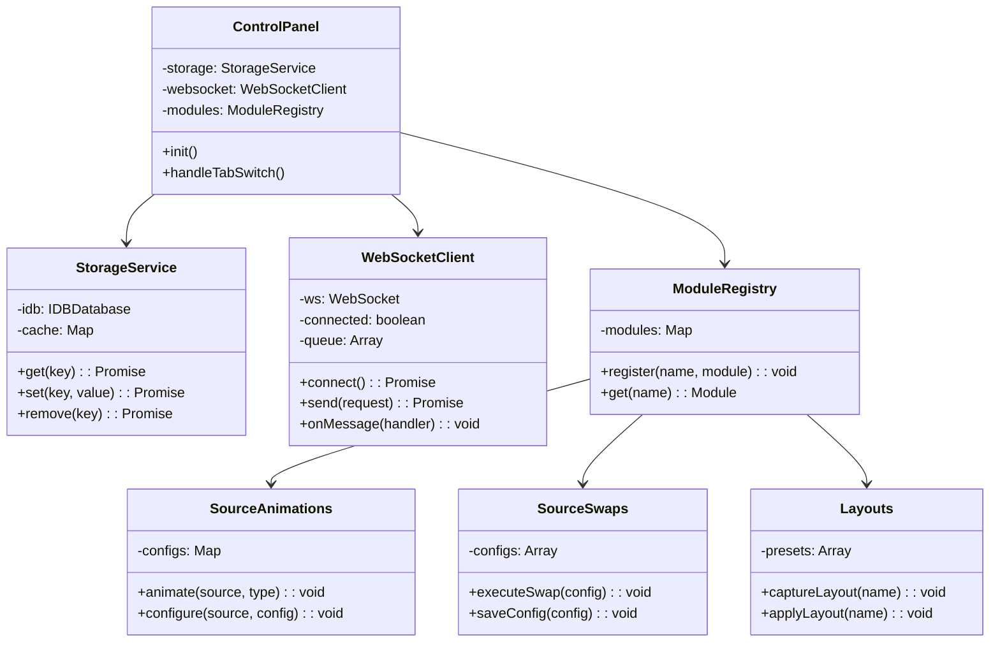

### Serverless Services

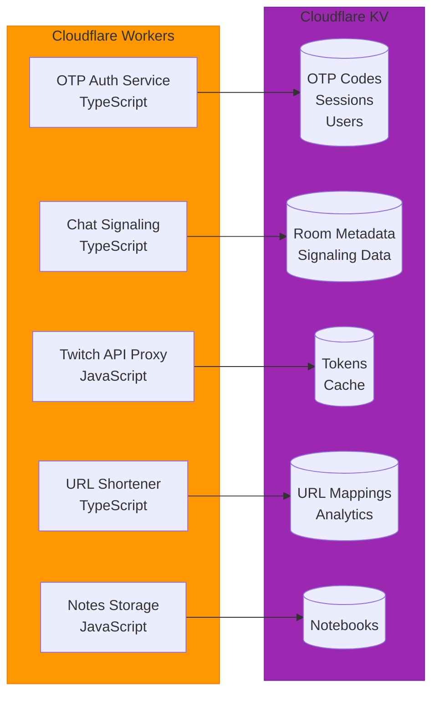

---

## Data Flow Diagrams

### Source Animation Flow

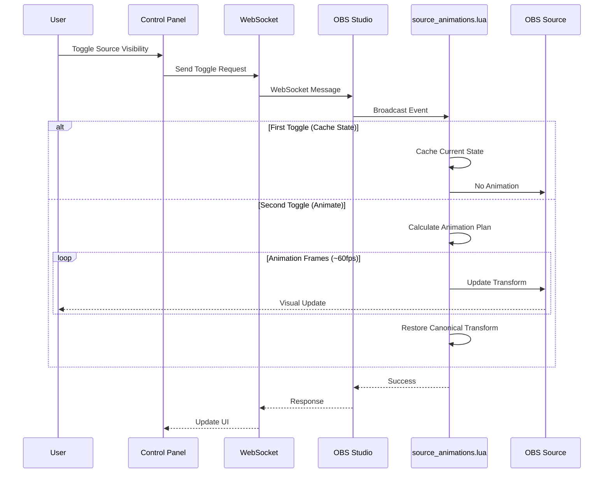

### Cloud Storage Flow

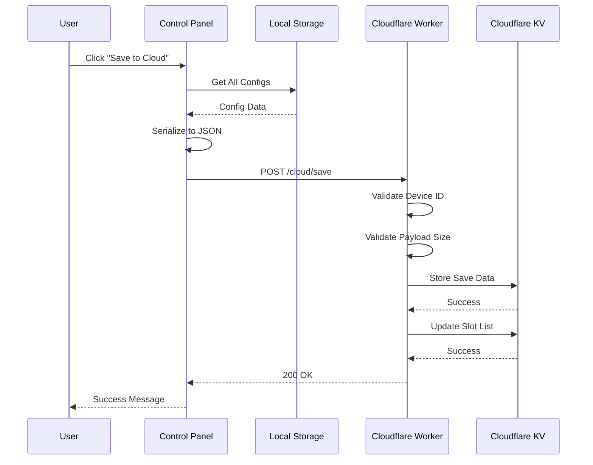

### Authentication Flow

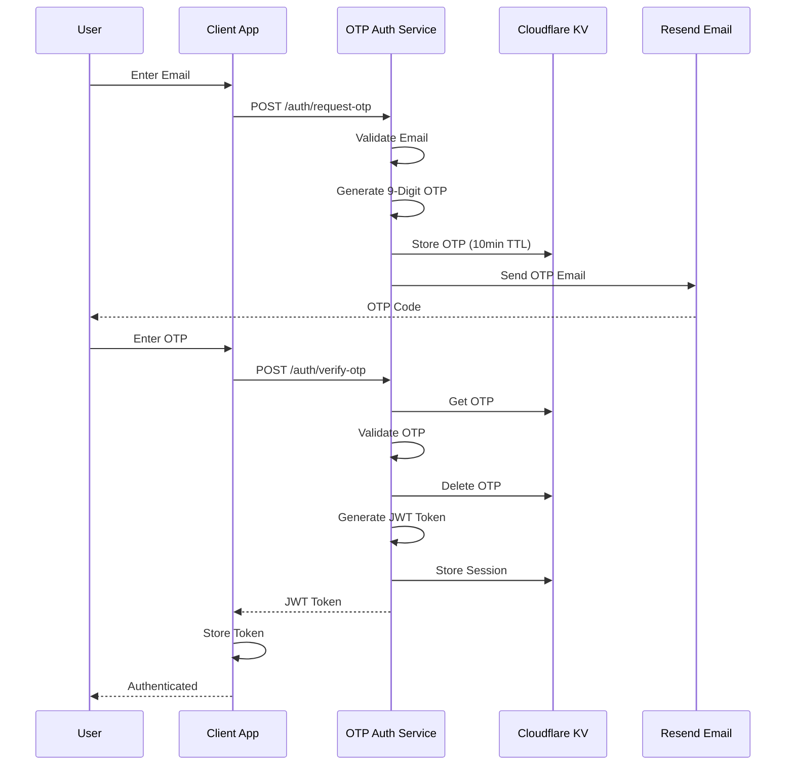

### Chat Message Flow

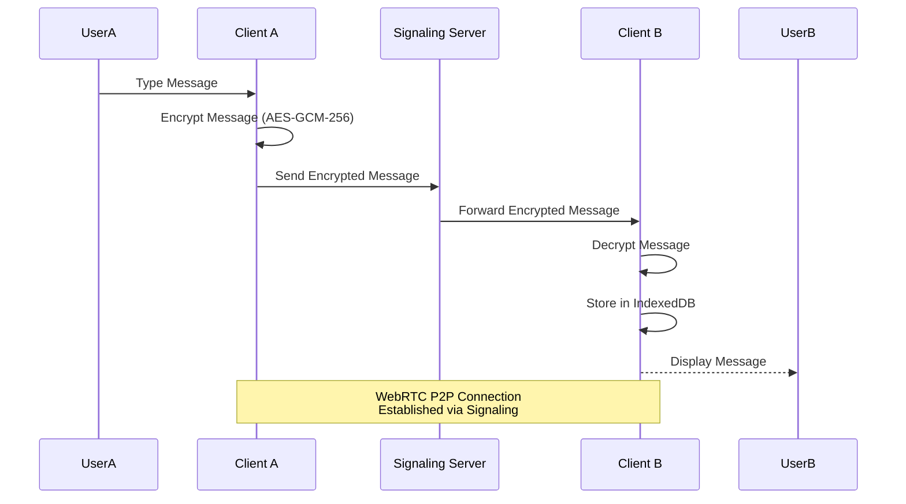

---

## Storage Architecture

### Multi-Layer Storage System

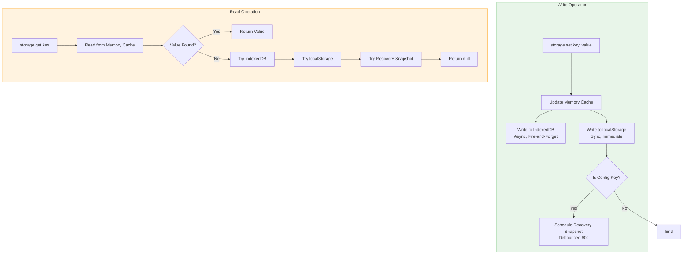

### Cloud Storage Schema

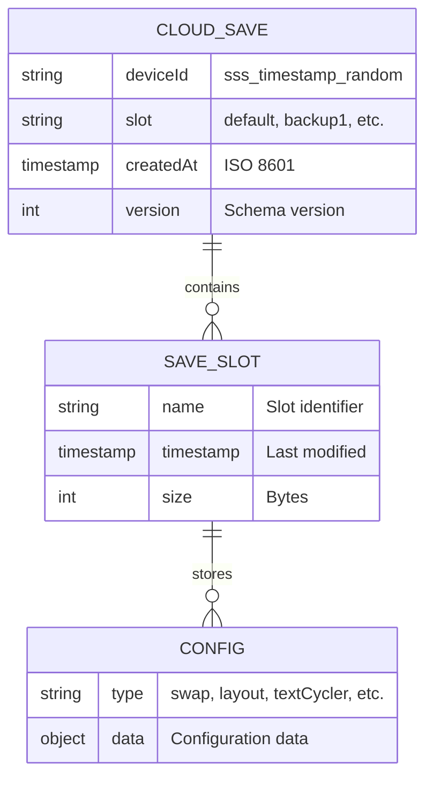

---

## API Architecture

### Enhanced API Framework

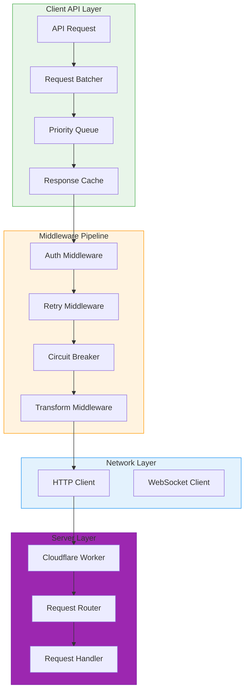

### Request Lifecycle

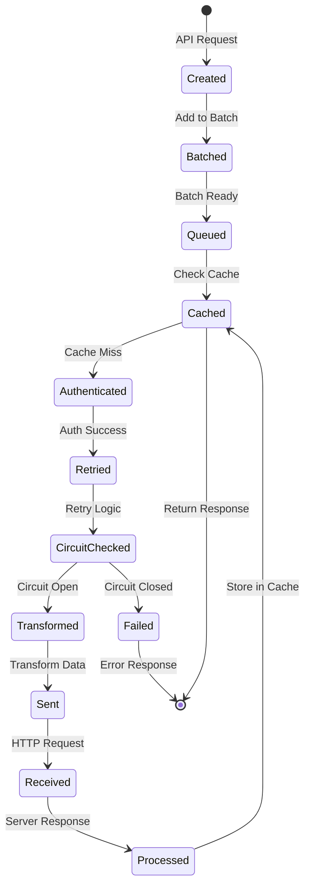

---

## Code Examples

### Source Animation Configuration

```typescript
// src/core/animations/types.ts
export interface AnimationConfig {
  type: 'fade' | 'slide' | 'zoom' | 'pop';
  duration: number; // 50-5000ms
  easing: EasingFunction;
  direction?: 'left' | 'right' | 'up' | 'down';
  offset?: number; // pixels
  animateOnShow: boolean;
  animateOnHide: boolean;
}

// Usage in Lua script
local function animate_source(source_name, config)
    local source = obs.obs_get_source_by_name(source_name)
    if not source then return end
    
    local scene_item = get_scene_item(source_name)
    if not scene_item then return end
    
    -- Calculate animation based on config
    local start_time = obs.obs_get_video_info().video_time
    local duration_ms = config.duration or 300
    local easing = get_easing(config.easing or "ease_out")
    
    -- Animation loop
    obs.timer_add(function()
        local elapsed = (obs.obs_get_video_info().video_time - start_time) / 1000
        local progress = math.min(elapsed / (duration_ms / 1000), 1.0)
        local eased = easing(progress)
        
        -- Apply transform based on animation type
        apply_animation_transform(scene_item, config, eased)
        
        if progress >= 1.0 then
            obs.timer_remove(obs.timer_callback)
        end
    end, ANIM_FRAME_MS)
end
```

### Storage Service Usage

```typescript
// src/modules/storage.ts
export const storage = {
  async get<T>(key: string): Promise<T | null> {
    // Check memory cache first
    if (cache.has(key)) {
      return cache.get(key) as T;
    }
    
    // Try IndexedDB
    try {
      const value = await idb.get(key);
      if (value) {
        cache.set(key, value);
        return value as T;
      }
    } catch (e) {
      console.warn('[Storage] IndexedDB read failed:', e);
    }
    
    // Try localStorage
    try {
      const value = localStorage.getItem(key);
      if (value) {
        const parsed = JSON.parse(value);
        cache.set(key, parsed);
        return parsed as T;
      }
    } catch (e) {
      console.warn('[Storage] localStorage read failed:', e);
    }
    
    return null;
  },
  
  async set(key: string, value: unknown): Promise<void> {
    // Update memory cache
    cache.set(key, value);
    
    // Write to IndexedDB (async, fire-and-forget)
    idb.set(key, value).catch(e => {
      console.error('[Storage] IndexedDB write failed:', e);
    });
    
    // Write to localStorage (sync)
    try {
      localStorage.setItem(key, JSON.stringify(value));
    } catch (e) {
      console.error('[Storage] localStorage write failed:', e);
    }
    
    // Schedule recovery snapshot if config key
    if (key.startsWith('sss_') && isConfigKey(key)) {
      scheduleRecoverySnapshot();
    }
  }
};
```

### API Client Usage

```typescript
// src/core/api/enhanced-client.ts
import { createEnhancedClient } from './enhanced-client';

const api = createEnhancedClient({
  baseURL: 'https://api.example.com',
  encryption: {
    enabled: true,
    algorithm: 'AES-GCM-256'
  },
  retry: {
    attempts: 3,
    backoff: 'exponential'
  },
  circuitBreaker: {
    threshold: 5,
    timeout: 60000
  }
});

// Usage
const response = await api.get('/user/profile', {
  tags: ['user', 'profile'],
  cache: {
    ttl: 300000 // 5 minutes
  }
});
```

---

## Deployment Architecture

### CI/CD Pipeline

```mermaid
flowchart LR
    subgraph GitHub["GitHub Repository"]
        Code[Source Code]
        Push[Push to main]
    end
    
    subgraph Actions["GitHub Actions"]
        Trigger[Workflow Triggered]
        Build[Build & Test]
        DeployPages[Deploy Pages]
        DeployWorker[Deploy Worker]
    end
    
    subgraph Cloudflare["Cloudflare"]
        Pages[GitHub Pages<br/>Static Assets]
        Worker[Cloudflare Worker<br/>Serverless]
        KV[(Cloudflare KV<br/>Storage)]
    end
    
    Code --> Push
    Push --> Trigger
    Trigger --> Build
    Build --> DeployPages
    Build --> DeployWorker
    DeployPages --> Pages
    DeployWorker --> Worker
    Worker --> KV
    
    style GitHub fill:#24292e,stroke:#0366d6
    style Actions fill:#2088ff,stroke:#0052cc
    style Cloudflare fill:#f38020,stroke:#fa8e39
```

### Environment Structure

```mermaid
graph TB
    subgraph Dev["Development"]
        LocalOBS[Local OBS Studio]
        LocalWorker[wrangler dev<br/>Local Worker]
        LocalKV[Local KV<br/>Simulation]
    end
    
    subgraph Staging["Staging"]
        StagingPages[GitHub Pages<br/>Preview Branch]
        StagingWorker[Worker Preview<br/>wrangler dev --remote]
        StagingKV[Preview KV<br/>Namespace]
    end
    
    subgraph Prod["Production"]
        ProdPages[GitHub Pages<br/>Production]
        ProdWorker[Worker Production<br/>wrangler deploy]
        ProdKV[Production KV<br/>Namespace]
    end
    
    LocalOBS --> LocalWorker
    LocalWorker --> LocalKV
    
    StagingPages --> StagingWorker
    StagingWorker --> StagingKV
    
    ProdPages --> ProdWorker
    ProdWorker --> ProdKV
    
    style Dev fill:#e8f5e9,stroke:#4caf50
    style Staging fill:#fff3e0,stroke:#ff9800
    style Prod fill:#f3e5f5,stroke:#9c27b0
```

---

## Security Architecture

### Authentication & Authorization

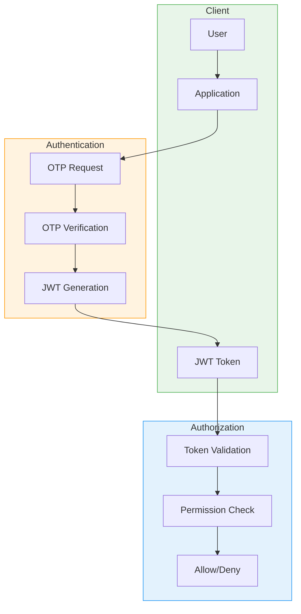

### Encryption Flow

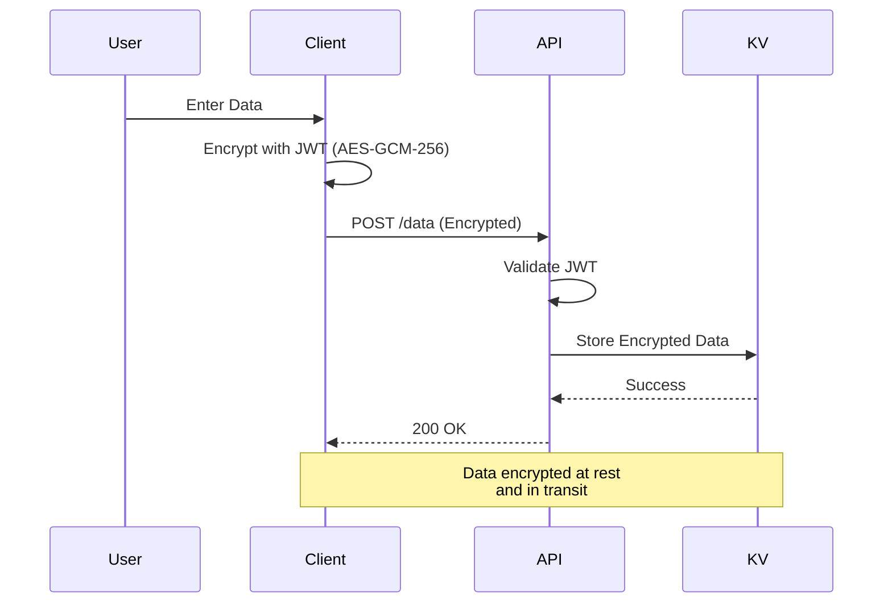

---

## Performance Considerations

### Caching Strategy

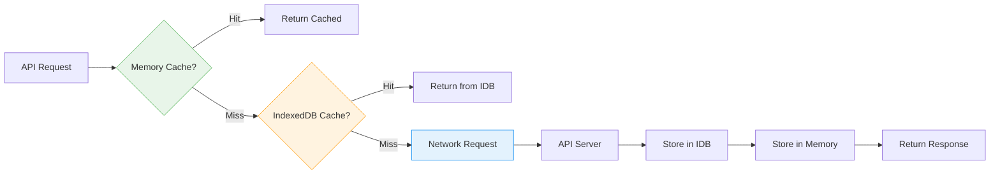

### Request Optimization

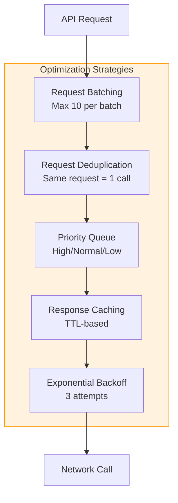

---

## Technology Stack

### Frontend
- **Framework:** Svelte 5
- **Language:** TypeScript
- **Build Tool:** Vite
- **Styling:** SCSS
- **State Management:** Svelte Stores
- **Testing:** Vitest

### Backend
- **Runtime:** Cloudflare Workers (V8 Isolates)
- **Language:** TypeScript / JavaScript
- **Storage:** Cloudflare KV
- **Email:** Resend API
- **Authentication:** JWT (HMAC-SHA256)

### OBS Integration
- **Scripting:** Lua 5.1 (obslua)
- **Communication:** OBS WebSocket API
- **Browser:** Chromium Embedded Framework (CEF)

---

**Document End**
