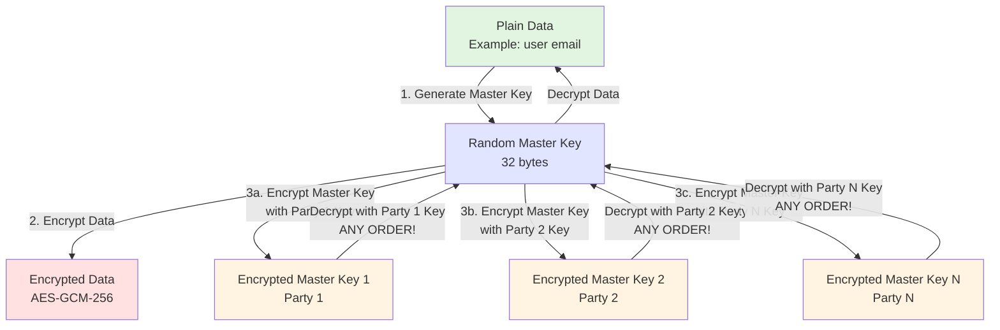
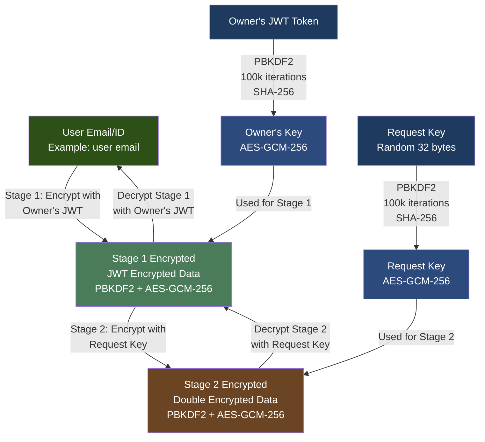
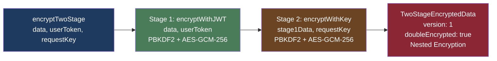
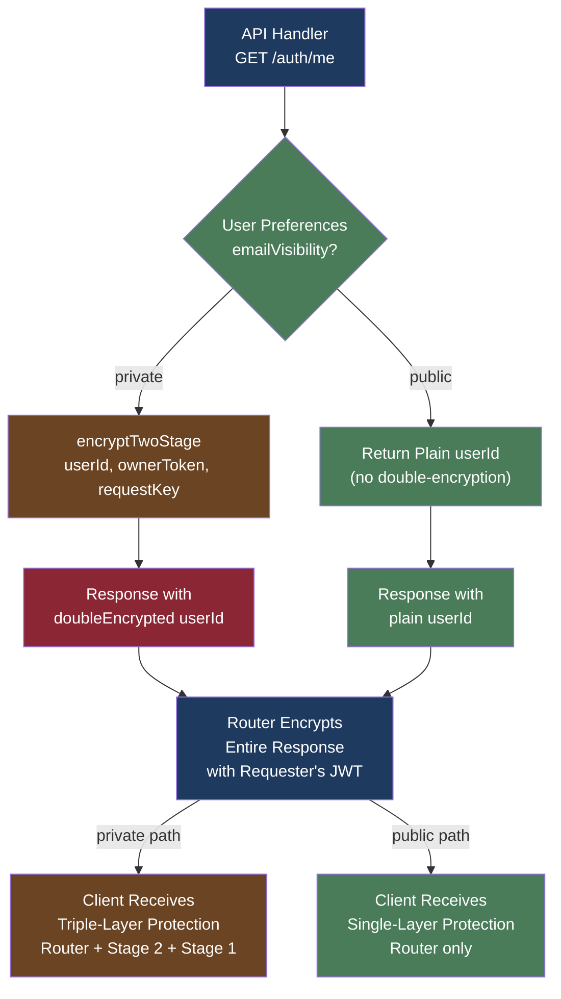

# Multi-Stage Encryption Architecture 🔒

> **Comprehensive diagram and explanation of multi-stage encryption system and two-stage implementation for user sensitive information**

---

## 📊 Architecture Diagram

### Multi-Stage Encryption Flow (Order-Independent)



### Two-Stage Encryption for User Data (Nested Encryption)



### Implementation Flow



### Real-World Usage Flow



---

## 🎯 Core Concepts

### Multi-Stage Encryption (General)

**Purpose:** Provides multi-party encryption where ALL parties' keys are required to decrypt.

**Key Properties:**
- **N-party support:** Each party encrypts the master key independently (parallel encryption)
- **Master key architecture:** Random master key encrypts data, each party encrypts master key
- **Decryption order: COMPLETELY ORDER-INDEPENDENT** - can decrypt in any order
- **All keys required:** Cannot decrypt without ALL parties' keys
- **Party order:** Parties can be provided in any order (matched by key hash)
- **Version 3+:** Uses order-independent master key approach (backward compatible with version 2)

**Use Cases:**
- **Two-stage:** Owner's JWT + Request key (2 parties) - most common
- **Multi-party:** Owner + Requester + Auditor + ... (N parties) - future use

---

## 🔐 Two-Stage Encryption Implementation

### Overview

Two-stage encryption is a specialized case of multi-stage encryption designed for protecting user-sensitive information (like email/userId) where the data owner controls access.

### Encryption Process

#### Stage 1: Owner's JWT Encryption

```
Plain Data → encryptWithJWT(data, ownerToken) → Stage 1 Encrypted
```

**Details:**
- **Key Source:** Owner's JWT token
- **Key Derivation:** PBKDF2 (100,000 iterations, SHA-256)
- **Encryption:** AES-GCM-256
- **Security:** Only the owner's JWT can decrypt this stage
- **Purpose:** Ensures only the data owner can access their data

**Implementation:**
```typescript
const stage1Encrypted = await encryptWithJWT(data, userToken);
// Returns: { encrypted: true, algorithm: 'AES-GCM-256', iv, salt, tokenHash, data }
```

#### Stage 2: Request Key Encryption

```
Stage 1 Encrypted → Encrypt with Request Key → Stage 2 Encrypted
```

**Details:**
- **Key Source:** Request key (random 32-byte key, base64 encoded)
- **Key Derivation:** PBKDF2 (100,000 iterations, SHA-256)
- **Encryption:** AES-GCM-256
- **Security:** Requires approved request key to decrypt
- **Purpose:** Requires owner approval (via request key) to access data

**Implementation:**
```typescript
const stage2Salt = crypto.getRandomValues(new Uint8Array(16));
const stage2IV = crypto.getRandomValues(new Uint8Array(12));
const stage2Key = await deriveKeyFromRequestKey(requestKey, stage2Salt);
const stage2Encrypted = await crypto.subtle.encrypt(
  { name: 'AES-GCM', iv: stage2IV },
  stage2Key,
  encoder.encode(JSON.stringify(stage1Encrypted))
);
```

### Decryption Process

#### Two-Stage Nested Decryption

Two-stage encryption uses **nested decryption** (not master key approach):

```
Stage 2 Encrypted → Decrypt with Request Key → Stage 1 Encrypted
Stage 1 Encrypted → Decrypt with Owner's JWT → Plain Data
```

**Requirements:**
1. **Both Keys Required:** Must have BOTH owner's JWT token AND request key
2. **Order Matters:** Must decrypt Stage 2 first, then Stage 1 (reverse of encryption order)
3. **Key Hash Verification:** Each stage verifies the key hash matches
4. **Nested Structure:** Stage 2 contains encrypted Stage 1 data, Stage 1 contains encrypted original data

**Implementation:**
```typescript
// Two-stage decryption (nested):
// 1. Decrypt Stage 2 with request key to get Stage 1 encrypted data
const stage1EncryptedData = await decryptWithKey(
  encryptedData.stage2.data,
  encryptedData.stage2.iv,
  encryptedData.stage2.salt,
  requestKey,
  'request-key'
) as EncryptedData;

// 2. Decrypt Stage 1 with owner's JWT to get original data
const decrypted = await decryptWithJWT(stage1EncryptedData, ownerToken);
```

**Key Points:**
- Uses nested encryption (not master key architecture)
- Requires both keys in correct order
- Stage 2 must be decrypted first to reveal Stage 1 data
- Stage 1 then decrypts to reveal original data

#### Multi-Stage Order-Independent Decryption (Version 3+, 3+ parties)

For multi-stage encryption with 3+ parties, the system uses **master key architecture** with order-independent decryption:

```
For EACH party (order doesn't matter):
  Encrypted Master Key → Decrypt with Party's Key → Master Key
  
Verify ALL parties can decrypt (all master keys must match)
  
Once ALL parties verified:
  Master Key → Decrypt Data → Plain Data
```

**Requirements:**
1. **All Party Keys:** Must have ALL parties' keys (order does NOT matter)
2. **All Parties Must Verify:** ALL parties must successfully decrypt their encrypted master keys
3. **Key Hash Verification:** Each stage verifies the key hash matches
4. **Master Key Verification:** All decrypted master keys must match (verifies data integrity)
5. **Data Decryption:** Only after ALL parties verified, use master key to decrypt the actual data

**Key Advantage:** 
- ALL parties must provide their keys and successfully decrypt
- You can verify parties in ANY order (Party1 then Party2, or Party2 then Party1)
- Data is only decrypted after ALL parties are verified

---

## ✅ Implementation Architecture

### Function Hierarchy

#### Two-Stage Encryption (Nested)

```
encryptTwoStage(data, ownerToken, requestKey)
    ↓
1. Stage 1: encryptWithJWT(data, ownerToken)
   → Stage 1 Encrypted Data
    ↓
2. Stage 2: encryptWithKey(stage1Data, requestKey, 'request-key')
   → Stage 2 Encrypted Data (contains encrypted Stage 1)
    ↓
TwoStageEncryptedData { stage1, stage2 }
```

#### Multi-Stage Encryption (Master Key, 3+ parties)

```
encryptMultiStage(data, parties)
    ↓
1. Generate random master key (32 bytes)
2. Encrypt data with master key → Encrypted Data
3. For each party (parallel, not nested):
   - Encrypt master key with party's key → Encrypted Master Key
    ↓
encryptWithKey() for each party (parallel encryption)
    ↓
encryptWithJWT() for JWT keys
PBKDF2 + AES-GCM for request keys / custom keys
```

### Data Structure

**Two-Stage Encrypted Data Format:**
```typescript
interface TwoStageEncryptedData {
  version: 1;
  doubleEncrypted: true;
  stage1: {
    encrypted: true;
    algorithm: 'AES-GCM-256';
    iv: string;           // Base64 encoded
    salt: string;         // Base64 encoded
    tokenHash: string;    // SHA-256 hash of owner's JWT
    data: string;         // Base64 encrypted data (encrypted with owner's JWT)
  };
  stage2: {
    encrypted: true;
    algorithm: 'AES-GCM-256';
    iv: string;           // Base64 encoded
    salt: string;         // Base64 encoded
    keyHash: string;      // SHA-256 hash of request key
    data: string;         // Base64 encrypted data (contains Stage 1 encrypted data)
  };
  timestamp: string;      // ISO timestamp
}
```

---

## 🔄 Real-World Usage Flow

### API Response Flow

```
1. API Handler (GET /auth/me)
   ↓
2. Check User Preferences (emailVisibility)
   ↓
3a. If 'private': encryptTwoStage(userId, ownerToken, requestKey)
3b. If 'public': Return plain userId (router will encrypt)
   ↓
4. Response includes doubleEncrypted userId field
   ↓
5. Router automatically encrypts ENTIRE response with requester's JWT
   ↓
6. Client receives triple-layer protection:
   - Router encryption (requester's JWT)
   - Stage 2 encryption (request key)
   - Stage 1 encryption (owner's JWT)
```

### Example Response Structure

**With Double-Encrypted userId:**
```json
{
  "id": "req_123...",
  "customerId": "cust_abc...",
  "userId": {
    "doubleEncrypted": true,
    "stage1": {
      "encrypted": true,
      "algorithm": "AES-GCM-256",
      "iv": "base64_iv...",
      "salt": "base64_salt...",
      "tokenHash": "sha256_hash...",
      "data": "base64_encrypted_data..."
    },
    "stage2": {
      "encrypted": true,
      "algorithm": "AES-GCM-256",
      "iv": "base64_iv...",
      "salt": "base64_salt...",
      "keyHash": "sha256_hash...",
      "data": "base64_encrypted_data..."
    },
    "timestamp": "2024-12-25T12:00:00.000Z"
  }
}
```

**Note:** The entire response is then encrypted again by the router with the requester's JWT token.

---

## 🔒 Security Properties

### Three Layers of Protection

1. **🔒 Router-Level Encryption**
   - **Key:** Requester's JWT token
   - **Protection:** Only authenticated requester can decrypt the response
   - **Scope:** Entire API response
   - **Automatic:** Handled by router middleware

2. **🔒 Stage 2 Encryption (Request Key)**
   - **Key:** Approved request key
   - **Protection:** Requires owner approval to access
   - **Scope:** Sensitive fields (userId/email)
   - **Control:** Owner must approve request to get request key

3. **🔒 Stage 1 Encryption (Owner's JWT)**
   - **Key:** Data owner's JWT token
   - **Protection:** Only the data owner can decrypt
   - **Scope:** Sensitive fields (userId/email)
   - **Control:** Owner always has access to their own data

### Key Security Features

- **Key Hash Verification:** Each stage stores a hash of the key used, preventing key substitution attacks
- **Unique Salt/IV:** Each encryption uses random salt and IV, preventing pattern analysis
- **PBKDF2 Key Derivation:** 100,000 iterations make brute-force attacks computationally expensive
- **AES-GCM-256:** Authenticated encryption provides both confidentiality and integrity
- **Order Enforcement:** Decryption must happen in reverse order, preventing partial decryption

---

## 📝 Code Examples

### Encrypting User Email

```typescript
import { encryptTwoStage } from '@strixun/api-framework';

// User's email to protect
const userEmail = 'user@example.com';

// Owner's JWT token (the user whose email it is)
const ownerToken = 'eyJhbGciOiJIUzI1NiIsInR5cCI6IkpXVCJ9...';

// Request key (from approved request)
const requestKey = generateRequestKey(); // Random 32-byte key

// Encrypt
const encrypted = await encryptTwoStage(userEmail, ownerToken, requestKey);

// Result: TwoStageEncryptedData with doubleEncrypted: true
```

### Decrypting User Email

```typescript
import { decryptTwoStage } from '@strixun/api-framework';

// Encrypted data from API response
const encryptedData = response.userId; // TwoStageEncryptedData

// Owner's JWT token (MUST be the data owner's token)
const ownerToken = 'eyJhbGciOiJIUzI1NiIsInR5cCI6IkpXVCJ9...';

// Request key (from approved request)
const requestKey = 'approved_request_key_from_owner';

// Decrypt
const decrypted = await decryptTwoStage(encryptedData, ownerToken, requestKey);

// Result: 'user@example.com'
```

### Using in API Handler

```typescript
import { buildResponseWithEncryption } from '../utils/response-builder';

export async function handleGetMe(request: Request, env: Env): Promise<Response> {
  // Get user data
  const userData = await getUserData(userId);
  
  // Build response with encryption based on preferences
  const response = await buildResponseWithEncryption(
    {
      id: userData.id,
      customerId: userData.customerId,
      userId: userData.email, // Will be double-encrypted if private
    },
    userId,           // Owner's user ID
    ownerToken,       // Owner's JWT token
    customerId,       // Customer ID for preferences lookup
    env
  );
  
  return new Response(JSON.stringify(response), {
    headers: { 'Content-Type': 'application/json' }
  });
}
```

---

## ✅ Key Takeaways

1. **Multi-stage encryption** (3+ parties) uses master key architecture - random master key encrypts data, each party encrypts master key independently
2. **Order-independent decryption** (Version 3+, multi-stage) - can decrypt in ANY order for 3+ parties
3. **Two-stage encryption** (2 parties) uses nested encryption - Stage 1 encrypts data, Stage 2 encrypts Stage 1 result
4. **Two-stage decryption** requires reverse order - Stage 2 first, then Stage 1
5. **Stage 1** (two-stage) uses owner's JWT - only owner can decrypt Stage 1 data
6. **Stage 2** (two-stage) uses request key - requires owner approval to decrypt Stage 2 to reveal Stage 1
7. **Router encryption** adds a third layer for the entire response
8. **Owner control** - users control who can access their sensitive data
9. **Architecture difference** - Two-stage uses nested encryption, Multi-stage (3+) uses master key architecture

---

## 📚 Related Files

- **Implementation:** `serverless/shared/encryption/multi-stage-encryption.ts`
- **JWT Encryption:** `serverless/shared/encryption/jwt-encryption.ts`
- **Two-Stage (OTP Service):** `serverless/otp-auth-service/utils/two-stage-encryption.ts`
- **Response Builder:** `serverless/otp-auth-service/utils/response-builder.ts`
- **Types:** `serverless/shared/encryption/types.ts`

---

*Last Updated: 2024-12-25*

