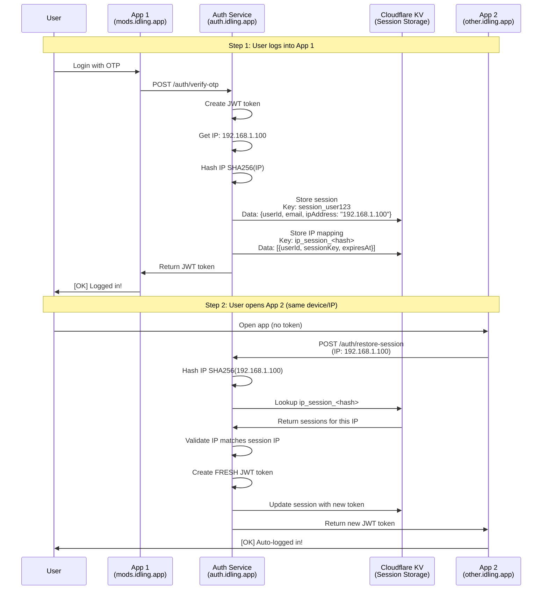

# IP-Based Session Restoration - Complete Guide

## [EMOJI] How It Works

IP-based session restoration enables **Single Sign-On (SSO)** across multiple applications on the same device/IP address. When you log into one app, other apps can automatically discover and restore your session.

---

## [EMOJI] Architecture Diagram



---

## [EMOJI] Detailed Flow

### **Step 1: User Logs In (First App)**

```typescript
// User logs into mods.idling.app
POST /auth/verify-otp
{
  email: "user@example.com",
  otp: "123456"
}

// Auth service:
1. Validates OTP
2. Gets IP from CF-Connecting-IP header: "192.168.1.100"
3. Creates JWT token (expires in 7 hours)
4. Stores session in KV:
   Key: "session_user_abc123"
   Value: {
     userId: "user_abc123",
     email: "user@example.com",
     ipAddress: "192.168.1.100",  //  Stored for validation
     expiresAt: "2025-01-28T10:00:00Z"
   }

5. Stores IP mapping in KV:
   Key: "ip_session_<SHA256(192.168.1.100)>"
   Value: [{
     userId: "user_abc123",
     sessionKey: "session_user_abc123",
     expiresAt: "2025-01-28T10:00:00Z",
     email: "user@example.com"
   }]

6. Returns JWT token to App 1
```

### **Step 2: User Opens Second App (Same Device)**

```typescript
// User opens other.idling.app (same browser/device)
POST /auth/restore-session
// No auth token needed!

// Auth service:
1. Gets IP from CF-Connecting-IP: "192.168.1.100"
2. Hashes IP: SHA256("192.168.1.100")  "abc123..."
3. Looks up: ip_session_abc123...
4. Finds session for user_abc123
5. Validates: session.ipAddress === requestIP [OK]
6. Creates FRESH JWT token (new token, not reused)
7. Updates session with new token
8. Returns new JWT token to App 2

// App 2 now has valid token - user is logged in!
```

---

## [OK] What WILL Work

### **1. Same Device, Same Network**
```
Scenario: User logs into mods.idling.app on laptop, then opens other.idling.app
IP: 192.168.1.100 (same for both)
Result: [OK] Session restored automatically
```

### **2. Multiple Tabs, Same Browser**
```
Scenario: User has mods.idling.app open in Tab 1, opens other.idling.app in Tab 2
IP: 192.168.1.100 (same for both)
Result: [OK] Session restored automatically
```

### **3. Multiple Apps, Same Device**
```
Scenario: User logs into app1.idling.app, then opens app2.idling.app, app3.idling.app
IP: 192.168.1.100 (same for all)
Result: [OK] All apps restore session automatically
```

### **4. Same WiFi Network, Different Devices**
```
Scenario: User logs into mods.idling.app on laptop, then opens other.idling.app on phone
IP: 192.168.1.100 (same public IP from router)
Result: [OK] Session restored (if router uses same public IP)
Note: This works because both devices share the same public IP from the router
```

---

## [ERROR] What WILL NOT Work

### **1. Different IP Address**
```
Scenario: User logs in at home (IP: 192.168.1.100), then opens app at coffee shop (IP: 203.0.113.50)
Result: [ERROR] Session NOT restored
Reason: IP addresses don't match
Security: This prevents cross-location session hijacking
```

### **2. VPN Changes IP**
```
Scenario: User logs in with VPN off (IP: 192.168.1.100), then turns on VPN (IP: 10.0.0.50)
Result: [ERROR] Session NOT restored
Reason: IP addresses don't match
Security: VPN IP changes are treated as different devices
```

### **3. Mobile Data vs WiFi**
```
Scenario: User logs in on WiFi (IP: 192.168.1.100), then switches to mobile data (IP: 203.0.113.50)
Result: [ERROR] Session NOT restored
Reason: IP addresses don't match
Security: Different networks = different security context
```

### **4. Expired Session**
```
Scenario: User logged in 8 hours ago (session expired after 7 hours)
Result: [ERROR] Session NOT restored
Reason: Session expired (TTL expired in KV)
Security: Expired sessions are automatically cleaned up
```

### **5. User Logged Out**
```
Scenario: User logged out from App 1, then opens App 2
Result: [ERROR] Session NOT restored
Reason: IP mapping was deleted on logout
Security: Logout invalidates all sessions for that IP
```

### **6. Rate Limit Exceeded**
```
Scenario: User makes 61 restore-session requests in 1 hour
Result: [ERROR] Request blocked (429 Too Many Requests)
Reason: Rate limit is 60 requests/hour per IP
Security: Prevents abuse and enumeration attacks
```

---

## [EMOJI] Security Features

### **1. IP Address Validation**
```typescript
// When restoring session, validates IP matches:
if (sessionData.ipAddress !== requestIP) {
    // IP mismatch - don't restore
    return { restored: false, message: 'IP address mismatch' };
}
```

**Why:** Prevents session hijacking from different locations

### **2. IP Address Hashing**
```typescript
// IP addresses are hashed before storage:
const ipHash = await hashIP("192.168.1.100");
// Stores: ip_session_<SHA256_hash>
```

**Why:** Privacy protection - IP addresses aren't stored in plaintext

### **3. Fresh Token Generation**
```typescript
// Creates NEW JWT token (doesn't reuse old one):
const newToken = await createAuthToken(user, customerId, env, request);
```

**Why:** Each app gets a unique token, prevents token reuse attacks

### **4. Rate Limiting**
```typescript
// Limits restore-session requests:
Rate limit: 60 requests/hour per IP
```

**Why:** Prevents brute force attacks and enumeration

### **5. Session Expiration**
```typescript
// Sessions expire after 7 hours:
expiresAt: new Date(Date.now() + 7 * 60 * 60 * 1000)
```

**Why:** Limits exposure window if token is compromised

### **6. Cloudflare IP Headers**
```typescript
// Uses CF-Connecting-IP (cannot be spoofed):
const ip = request.headers.get('CF-Connecting-IP');
```

**Why:** IP address comes from Cloudflare proxy, cannot be forged by client

---

## [EMOJI] Real-World Examples

### **Example 1: Home WiFi Network**
```
Device: Laptop on home WiFi
Public IP: 203.0.113.50 (from ISP)
Private IP: 192.168.1.100 (from router)

User logs into mods.idling.app:
   Auth service sees: 203.0.113.50 (public IP)
   Stores session with IP: 203.0.113.50

User opens other.idling.app:
   Auth service sees: 203.0.113.50 (same public IP)
   [OK] Session restored!
```

### **Example 2: Office Network**
```
Device 1: Desktop at desk
Device 2: Laptop at desk
Both on same office WiFi
Public IP: 198.51.100.25 (shared by router)

User logs into mods.idling.app on Desktop:
   Auth service sees: 198.51.100.25
   Stores session with IP: 198.51.100.25

User opens other.idling.app on Laptop:
   Auth service sees: 198.51.100.25 (same public IP)
   [OK] Session restored!
  
Note: Both devices share the same public IP, so SSO works
```

### **Example 3: Mobile Network**
```
Device: Phone on mobile data
IP: 203.0.113.100 (from mobile carrier)

User logs into mods.idling.app:
   Auth service sees: 203.0.113.100
   Stores session with IP: 203.0.113.100

User switches to WiFi (different IP: 192.168.1.50):
   Auth service sees: 192.168.1.50 (different IP)
   [ERROR] Session NOT restored (different network)
```

### **Example 4: VPN Usage**
```
Device: Laptop with VPN
Without VPN: IP = 203.0.113.50
With VPN: IP = 10.0.0.100

User logs into mods.idling.app (VPN off):
   Auth service sees: 203.0.113.50
   Stores session with IP: 203.0.113.50

User turns on VPN, opens other.idling.app:
   Auth service sees: 10.0.0.100 (different IP)
   [ERROR] Session NOT restored (VPN changed IP)
```

---

## [EMOJI] Key Takeaways

1. **IP-Based Matching**: Sessions are matched by IP address (hashed for privacy)
2. **Same IP = Same Device**: If two requests come from the same IP, they're treated as the same device
3. **Security First**: IP validation prevents cross-location session hijacking
4. **Fresh Tokens**: Each app gets a new JWT token (not reused)
5. **Rate Limited**: 60 requests/hour per IP prevents abuse
6. **Auto-Expiry**: Sessions expire after 7 hours automatically

---

## [EMOJI] Technical Details

### **IP Address Source**
```typescript
// Priority order:
1. CF-Connecting-IP (Cloudflare - most reliable, cannot be spoofed)
2. X-Forwarded-For (fallback)
3. X-Real-IP (fallback)
4. 'unknown' (if none available)
```

### **Storage Structure**
```typescript
// Session storage:
Key: "session_user_abc123"
Value: {
  userId: "user_abc123",
  email: "user@example.com",
  ipAddress: "192.168.1.100",  //  Used for validation
  expiresAt: "2025-01-28T10:00:00Z"
}

// IP index storage:
Key: "ip_session_<SHA256(IP)>"
Value: [{
  userId: "user_abc123",
  sessionKey: "session_user_abc123",
  expiresAt: "2025-01-28T10:00:00Z",
  email: "user@example.com"
}]
```

### **Restore Session Flow**
```typescript
1. Get request IP from CF-Connecting-IP
2. Hash IP: SHA256(IP)  hash
3. Lookup: ip_session_<hash>
4. Filter expired sessions
5. Validate: session.ipAddress === requestIP
6. Create fresh JWT token
7. Update session with new token
8. Return token to client
```

---

## [WARNING] Limitations

1. **NAT Networks**: Multiple devices behind same router share public IP
   - [OK] Works: All devices can restore each other's sessions
   - [WARNING] Security: Less isolation between devices

2. **Dynamic IPs**: IP addresses can change
   - [ERROR] Doesn't work: If IP changes, session won't restore
   - [OK] Security: Prevents stale session restoration

3. **Mobile Networks**: IP changes when switching networks
   - [ERROR] Doesn't work: WiFi  Mobile data = different IP
   - [OK] Security: Different network = different security context

4. **VPN Usage**: VPN changes IP address
   - [ERROR] Doesn't work: VPN on/off = different IP
   - [OK] Security: VPN IP changes are treated as different devices

---

## [EMOJI]️ Security Considerations

### **Why IP-Based is Secure:**
- [OK] IP addresses come from Cloudflare (cannot be spoofed)
- [OK] IP validation prevents cross-location attacks
- [OK] Rate limiting prevents enumeration
- [OK] Fresh tokens prevent token reuse
- [OK] Session expiration limits exposure

### **Potential Risks:**

#### [WARNING] **Risk 1: NAT Networks (Multiple Devices Share IP)**

**The Problem:**
- Home/office routers use Network Address Translation (NAT)
- Multiple devices (laptop, phone, tablet) share the same public IP address
- All devices appear to have the same IP from the server's perspective

**Attack Scenario:**
```
Scenario: Family member logs into mods.idling.app on their laptop
 Session stored with IP: 203.0.113.50
 Another family member opens other.idling.app on their phone
 Both devices share IP: 203.0.113.50
 [WARNING] Second user could potentially restore first user's session
```

**Why This Is Risky:**
- Unauthorized session access between devices on the same network
- Family members, roommates, or coworkers could access each other's sessions
- No device-level isolation when IP is the only identifier

**Mitigation Strategies:**

1. **Rate Limiting (Already Implemented)**
   ```typescript
   // Limits restore attempts: 60 requests/hour per IP
   // Prevents rapid enumeration of sessions
   Rate limit: 60 requests/hour per IP
   ```

2. **IP Validation (Already Implemented)**
   ```typescript
   // Validates stored IP matches request IP
   if (sessionData.ipAddress !== requestIP) {
       return { restored: false };
   }
   ```

3. **Fresh Token Generation (Already Implemented)**
   ```typescript
   // Each restore creates a NEW token (not reused)
   // Prevents token replay attacks
   const newToken = await createAuthToken(user, customerId, env, request);
   ```

4. **Additional Mitigations (Recommended):**

   **a. User-Agent Fingerprinting**
   ```typescript
   // Store browser fingerprint with session
   const userAgent = request.headers.get('User-Agent');
   const fingerprint = hashUserAgent(userAgent);
   
   // Validate fingerprint matches on restore
   if (sessionData.fingerprint !== requestFingerprint) {
       // Require explicit login if device changed
       return { restored: false, requiresLogin: true };
   }
   ```

   **b. Session Scoping by Email**
   ```typescript
   // When multiple sessions exist for same IP:
   // - Return only sessions matching request context
   // - Require email confirmation for ambiguous cases
   const sessions = await getSessionsForIP(ipHash);
   if (sessions.length > 1) {
       // Multiple users on same IP - require explicit selection
       return { 
           restored: false, 
           requiresSelection: true,
           availableSessions: sessions.map(s => s.email)
       };
   }
   ```

   **c. Time-Based Session Isolation**
   ```typescript
   // Only restore sessions created within last 30 minutes
   // Prevents restoring old sessions from different users
   const recentSessions = sessions.filter(s => {
       const age = Date.now() - s.createdAt;
       return age < 30 * 60 * 1000; // 30 minutes
   });
   ```

   **d. Device Cookie Validation**
   ```typescript
   // Store device ID cookie on first login
   // Validate device ID matches on restore
   const deviceId = getDeviceId(request);
   if (sessionData.deviceId && sessionData.deviceId !== deviceId) {
       // Different device - require explicit login
       return { restored: false, requiresLogin: true };
   }
   ```

---

#### [WARNING] **Risk 2: Public WiFi (Multiple Users Share IP)**

**The Problem:**
- Coffee shops, airports, hotels use public WiFi
- Hundreds of users share the same public IP address
- Any user on the network could potentially access another user's session

**Attack Scenario:**
```
Scenario: User A logs into mods.idling.app at coffee shop
 Session stored with IP: 203.0.113.50
 User B (stranger) opens other.idling.app at same coffee shop
 Both users share IP: 203.0.113.50
 [WARNING] User B could potentially restore User A's session
```

**Why This Is Risky:**
- Complete strangers could access each other's accounts
- No network-level trust in public WiFi environments
- High risk of unauthorized access and data breach

**Mitigation Strategies:**

1. **Rate Limiting (Already Implemented)**
   ```typescript
   // Prevents rapid session enumeration
   // Limits attacker's ability to discover sessions
   Rate limit: 60 requests/hour per IP
   ```

2. **IP Validation (Already Implemented)**
   ```typescript
   // Ensures IP matches stored session
   // Prevents cross-location attacks
   if (sessionData.ipAddress !== requestIP) {
       return { restored: false };
   }
   ```

3. **Fresh Token Generation (Already Implemented)**
   ```typescript
   // New token per restore prevents token reuse
   // Limits exposure if token is intercepted
   const newToken = await createAuthToken(user, customerId, env, request);
   ```

4. **Additional Mitigations (Critical for Public WiFi):**

   **a. Strict Time Window (Recommended)**
   ```typescript
   // Only restore sessions created in last 5 minutes
   // Prevents restoring sessions from other users
   const recentSessions = sessions.filter(s => {
       const age = Date.now() - s.createdAt;
       return age < 5 * 60 * 1000; // 5 minutes (very strict)
   });
   ```

   **b. User-Agent + Screen Resolution Fingerprinting**
   ```typescript
   // Combine multiple browser characteristics
   const fingerprint = {
       userAgent: request.headers.get('User-Agent'),
       screenWidth: request.headers.get('X-Screen-Width'),
       screenHeight: request.headers.get('X-Screen-Height'),
       timezone: request.headers.get('X-Timezone')
   };
   const fingerprintHash = hashFingerprint(fingerprint);
   
   // Require exact match for public IPs
   if (isPublicIP(ip) && sessionData.fingerprint !== fingerprintHash) {
       return { restored: false, requiresLogin: true };
   }
   ```

   **c. Require Explicit Login for Public IPs**
   ```typescript
   // Detect public WiFi by checking IP ranges
   const isPublicNetwork = isPublicIP(ip) || isKnownPublicWiFi(ip);
   
   if (isPublicNetwork) {
       // Disable auto-restore for public networks
       // Require explicit login every time
       return { 
           restored: false, 
           requiresLogin: true,
           reason: 'Public network detected - login required'
       };
   }
   ```

   **d. Session Count Limits**
   ```typescript
   // Limit number of active sessions per IP
   // Prevents session enumeration attacks
   const maxSessionsPerIP = 5;
   if (sessions.length > maxSessionsPerIP) {
       // Too many sessions - require explicit login
       return { restored: false, requiresLogin: true };
   }
   ```

   **e. IP Reputation Checking**
   ```typescript
   // Check if IP is from known public WiFi provider
   // Use stricter rules for public networks
   const ipReputation = await checkIPReputation(ip);
   if (ipReputation.isPublicWiFi) {
       // Apply stricter session restoration rules
       return applyStrictRestoreRules(sessions, request);
   }
   ```

---

#### [OK] **Comprehensive Mitigation Summary**

**Current Protections:**
- [OK] Rate limiting (60 requests/hour per IP)
- [OK] IP address validation (CF-Connecting-IP cannot be spoofed)
- [OK] Fresh token generation (new JWT per restore)
- [OK] Session expiration (7 hours TTL)
- [OK] IP hashing (privacy protection)

**Recommended Additional Protections:**

1. **For NAT Networks:**
   - User-Agent fingerprinting
   - Device cookie validation
   - Time-based session isolation (30 minutes)
   - Email-based session scoping

2. **For Public WiFi:**
   - Strict time window (5 minutes)
   - Multi-factor fingerprinting (User-Agent + screen + timezone)
   - Disable auto-restore for public IPs (require explicit login)
   - Session count limits per IP
   - IP reputation checking

3. **General Enhancements:**
   - Session activity logging (audit trail)
   - Anomaly detection (unusual restore patterns)
   - User notification on session restore (email/SMS alert)
   - Optional 2FA requirement for sensitive operations

**Risk Assessment:**

| Scenario | Risk Level | Current Mitigation | Recommended Enhancement |
|----------|-----------|-------------------|------------------------|
| Home NAT (family) | [EMOJI] Medium | Rate limiting + IP validation | User-Agent fingerprinting |
| Office NAT (coworkers) | [EMOJI] Medium | Rate limiting + IP validation | Device cookie validation |
| Public WiFi (strangers) | [EMOJI] High | Rate limiting + IP validation | Disable auto-restore, require login |
| Mobile carrier NAT | [EMOJI] Medium | Rate limiting + IP validation | Time-based isolation |

**Best Practice Recommendation:**
- For **private networks** (home/office): Current mitigations + User-Agent fingerprinting
- For **public networks** (coffee shops/airports): **Disable auto-restore entirely**, require explicit login

---

## [EMOJI] Summary

**IP-based session restoration enables SSO across apps on the same device/IP address.**

- [OK] **Works**: Same device, same network, same IP
- [ERROR] **Doesn't work**: Different IP, expired session, logged out
- [EMOJI] **Secure**: IP validation, rate limiting, fresh tokens, expiration

This is a **convenience feature** that provides seamless SSO while maintaining security through IP validation and rate limiting.
