# E2E Testing Architecture - Local Workers

> **Complete guide to E2E testing architecture using local Cloudflare Workers**

**Last Updated:** 2025-12-30  
**Status:** [SUCCESS] Complete - Local workers fully configured

---

## [*] What's This All About?

E2E (End-to-End) tests verify your entire application works correctly by testing it like a real user would. Our E2E tests use **completely local Cloudflare Workers** - no deployment needed! Everything runs on your machine, perfectly mimicking production without touching production data.

**Think of it like this:** Instead of testing your car on a real highway (production), you test it on a private test track (local workers) that's identical to the highway. Same conditions, zero risk.

---

## [>] Why Should You Care?

### For Non-Technical Users

- **[+] Safe Testing:** Tests never touch production data or services
- **[+] Fast Feedback:** Get test results in seconds, not minutes
- **[+] No Setup Required:** Everything starts automatically
- **[+] Complete Isolation:** Your tests can't break anything important

### For Developers

- **[+] Local Development:** Test against real workers without deploying
- **[+] Production Parity:** Local workers behave exactly like production
- **[+] Fast Iteration:** No deployment wait times
- **[+] Debugging:** Full access to logs and worker state
- **[+] Cost-Free:** No Cloudflare usage during testing

---

## [*] What Makes This Special?

1. **[>] Zero Deployment Required** - All workers run locally with `wrangler dev --local`
2. **[>] Automatic Setup** - Test secrets generated automatically via `setup:test-secrets`
3. **[>] Production Parity** - Local workers use same code as production
4. **[>] Complete Isolation** - Local KV and R2 storage, no shared state
5. **[>] Fast Execution** - No network latency, tests run at localhost speed

---

## [>] Quick Start

```bash
# Run E2E tests - everything starts automatically!
pnpm test:e2e
```

That's it! Playwright will:
1. Start all local workers (OTP Auth, Mods API, etc.)
2. Start frontend and mods-hub dev servers
3. Generate test secrets automatically
4. Run all E2E tests
5. Clean up when done

---

## [=] E2E Architecture Overview

### Complete System Architecture

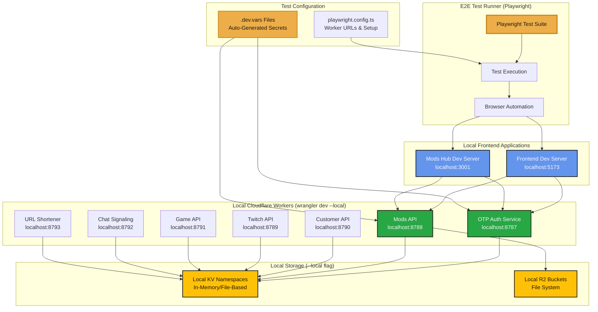

---

## [=] E2E vs Production Comparison

### Side-by-Side Architecture Comparison

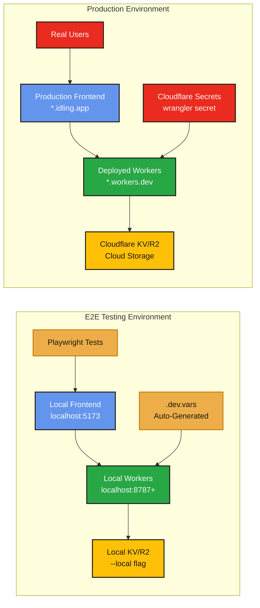

### Detailed Comparison Table

| Aspect | E2E Testing | Production |
|--------|-------------|------------|
| **Workers** | Local (`wrangler dev --local`) | Deployed (`wrangler deploy`) |
| **URLs** | `localhost:8787+` | `*.workers.dev` or `*.idling.app` |
| **Storage** | Local KV/R2 (file system) | Cloudflare KV/R2 (cloud) |
| **Secrets** | `.dev.vars` (auto-generated) | `wrangler secret` (cloud) |
| **Frontend** | `localhost:5173` / `localhost:3001` | `*.idling.app` (Cloudflare Pages) |
| **Data Isolation** | Complete (local storage) | Complete (separate namespaces) |
| **Network** | Localhost (no latency) | Internet (network latency) |
| **Cost** | Free (local execution) | Cloudflare usage costs |
| **Setup** | Automatic (Playwright starts workers) | Manual deployment required |
| **Debugging** | Full access to logs/state | Limited (wrangler tail) |
| **Speed** | Fast (localhost) | Slower (network round-trips) |

---

## [=] Complete E2E Test Flow

### Test Execution Flow

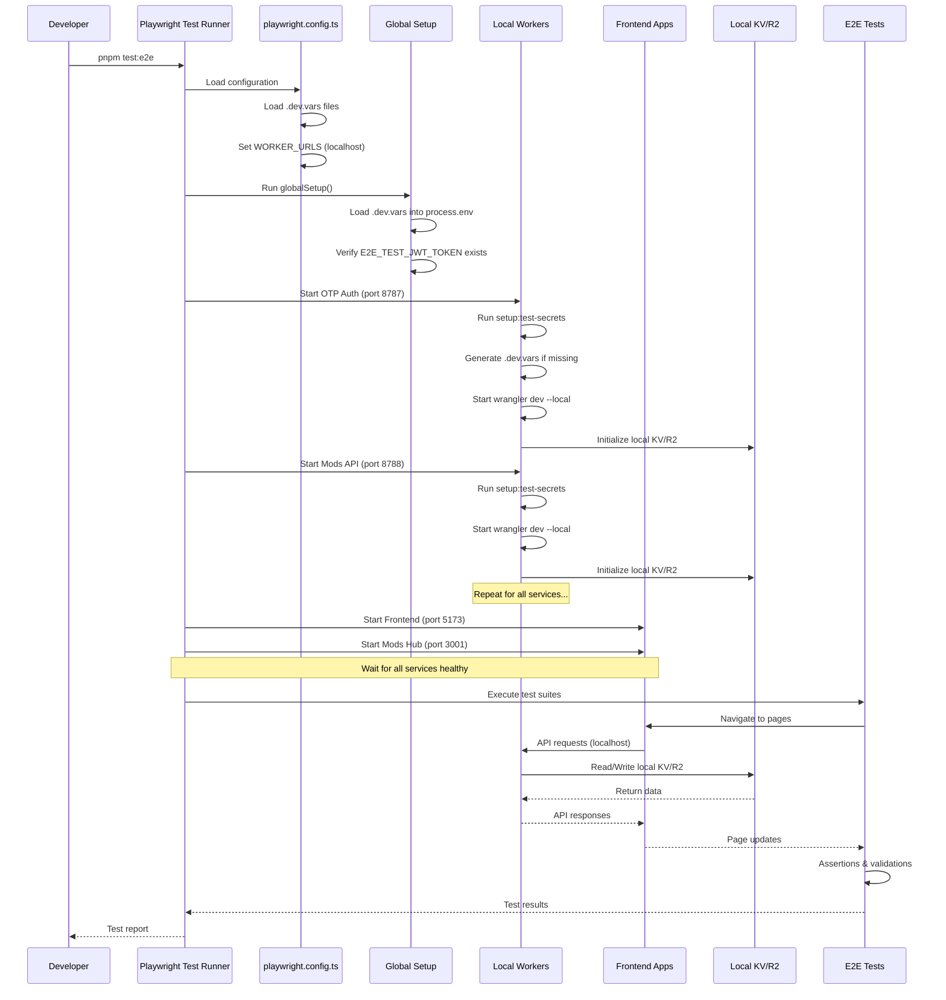

### Worker Startup Sequence

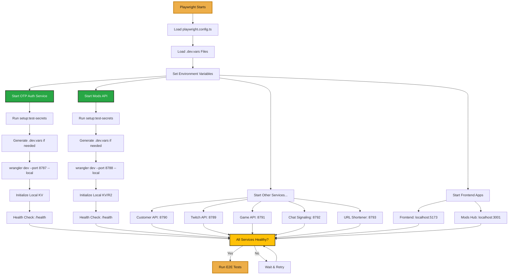

---

## [=] Data Flow Diagrams

### Mod Upload Flow (E2E)

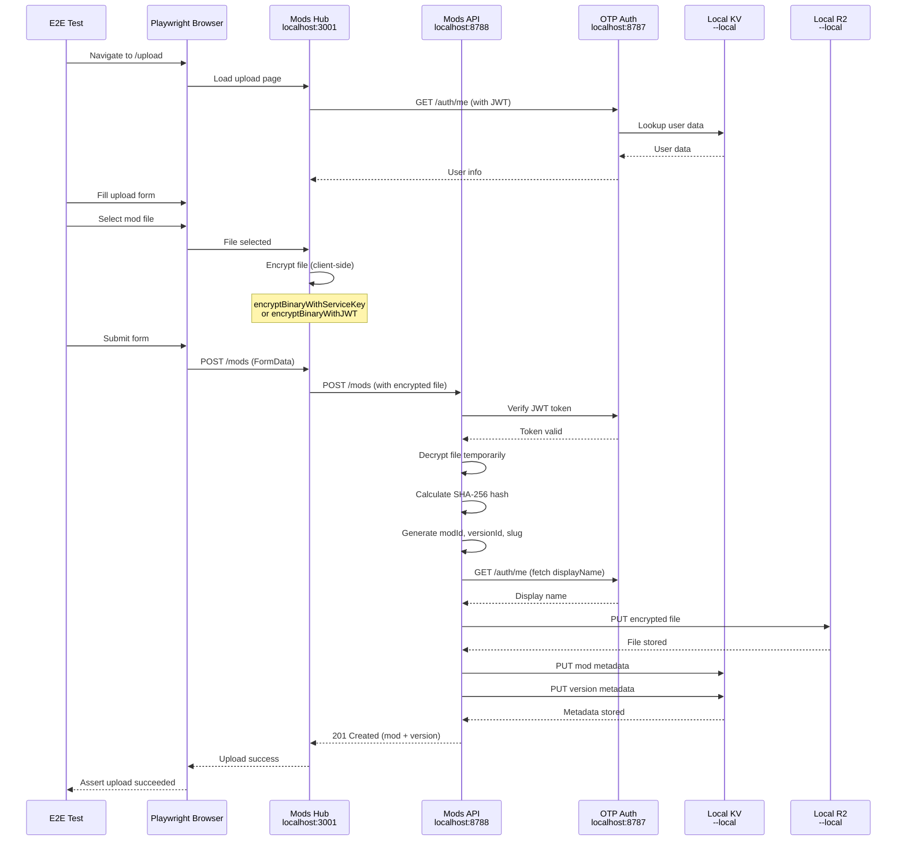

### Mod Download Flow (E2E)

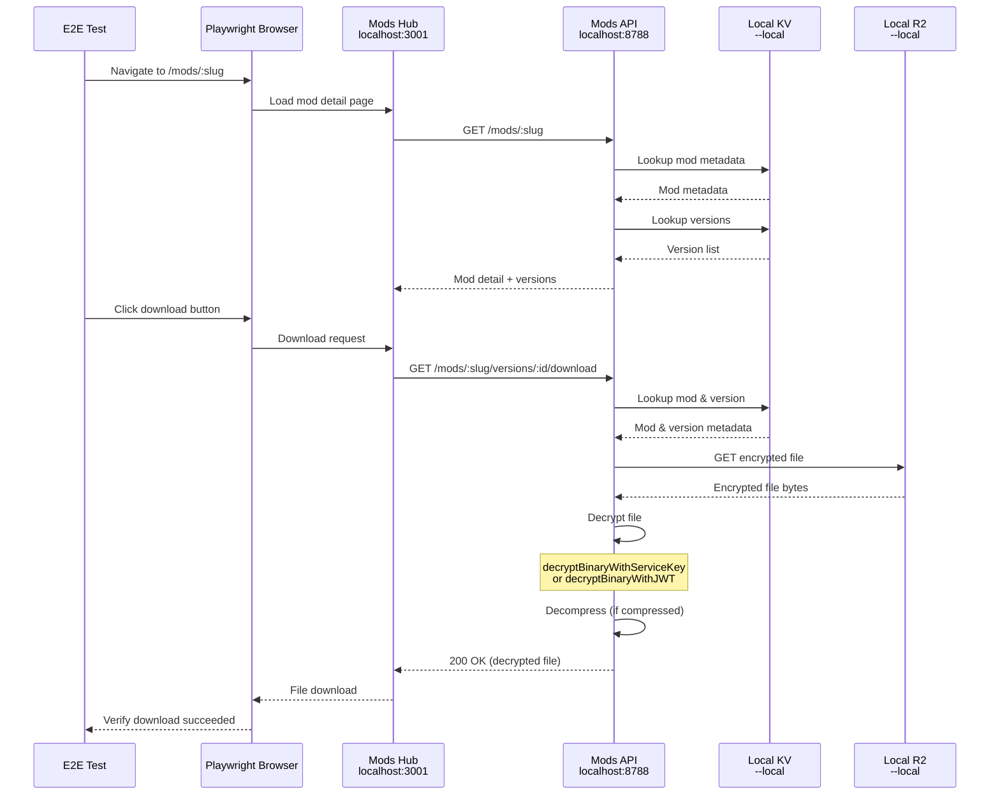

---

## [=] Local Storage Architecture

### KV Namespace Structure (Local)

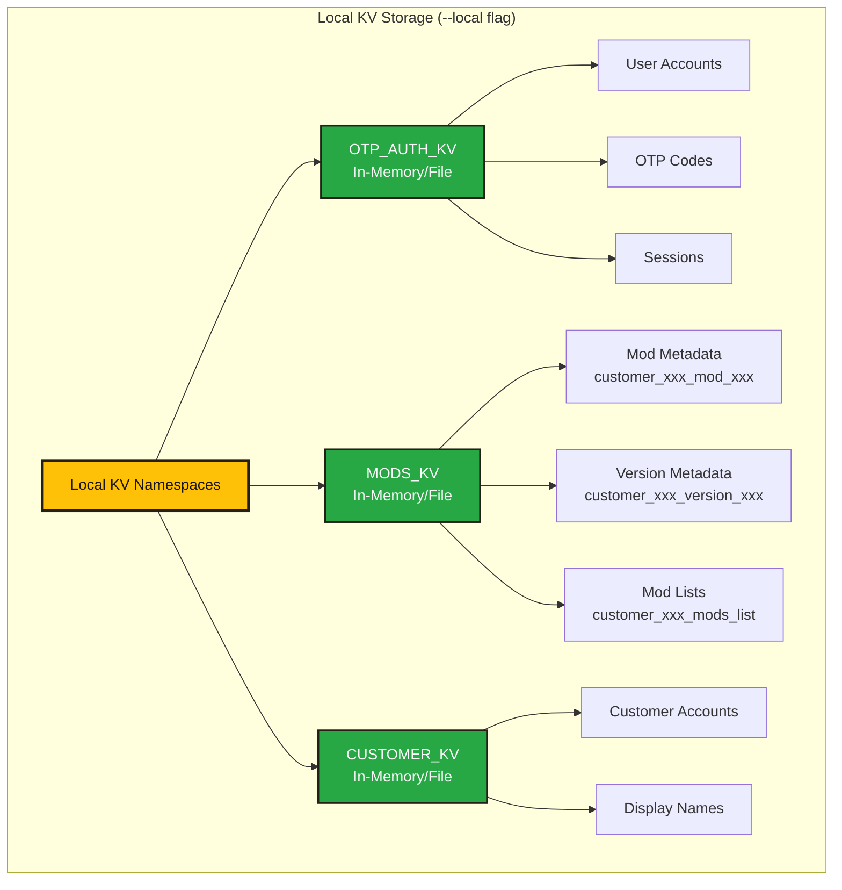

### R2 Bucket Structure (Local)

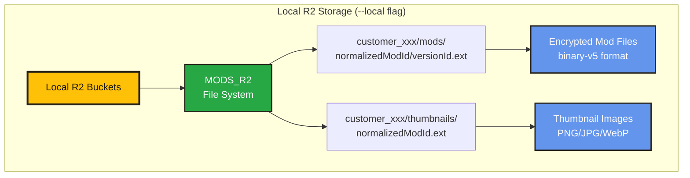

---

## [=] Test Secret Management

### Automatic Secret Generation

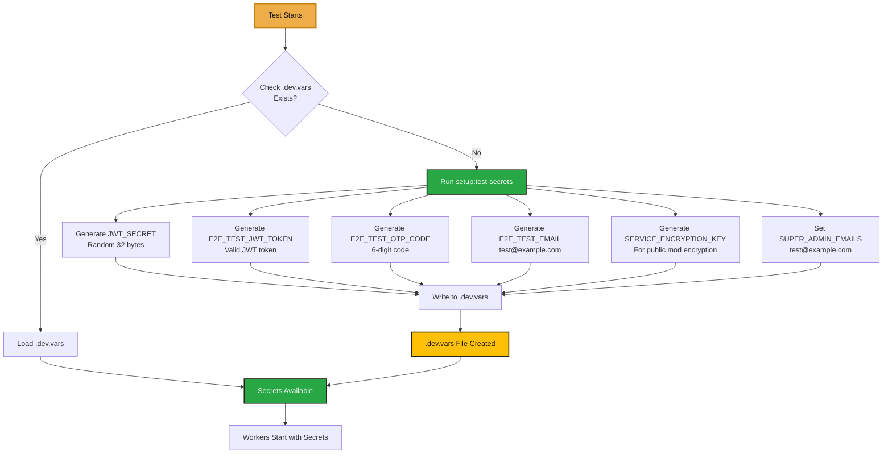

### Secret File Structure

**Location:** `serverless/mods-api/.dev.vars` and `serverless/otp-auth-service/.dev.vars`

```bash
# Auto-generated test secrets (DO NOT COMMIT)
JWT_SECRET=test_jwt_secret_32_bytes_random...
E2E_TEST_JWT_TOKEN=eyJhbGciOiJIUzI1NiIsInR5cCI6IkpXVCJ9...
E2E_TEST_OTP_CODE=123456
E2E_TEST_EMAIL=test@example.com
SERVICE_ENCRYPTION_KEY=test_service_key_32_bytes...
SUPER_ADMIN_EMAILS=test@example.com
ALLOWED_EMAILS=test@example.com
```

---

## [=] Configuration Details

### Playwright Configuration

**File:** `playwright.config.ts`

```typescript
// Worker URLs - all point to localhost
const WORKER_URLS = {
  OTP_AUTH: 'http://localhost:8787',      // Local worker
  MODS_API: 'http://localhost:8788',       // Local worker
  CUSTOMER_API: 'http://localhost:8790',   // Local worker
  // ... etc
  FRONTEND: 'http://localhost:5173',       // Local dev server
  MODS_HUB: 'http://localhost:3001',       // Local dev server
};

// Web servers automatically started
webServer: [
  {
    command: 'pnpm dev',
    url: 'http://localhost:5173',
  },
  {
    command: 'cd mods-hub && pnpm dev',
    url: 'http://localhost:3001',
  },
  {
    command: 'cd serverless/otp-auth-service && wrangler dev --port 8787 --local',
    url: 'http://localhost:8787/health',
  },
  // ... etc for all workers
]
```

### Worker Startup Commands

Each worker starts with:
```bash
cd serverless/{worker-name}
CI=true NO_INPUT=1 pnpm setup:test-secrets
CI=true NO_INPUT=1 wrangler dev --port {port} --local
```

**Key Flags:**
- `--local`: Use local KV/R2 storage (file system)
- `CI=true`: Non-interactive mode
- `NO_INPUT=1`: Skip prompts

---

## [=] Data Isolation

### Complete Isolation Guarantees

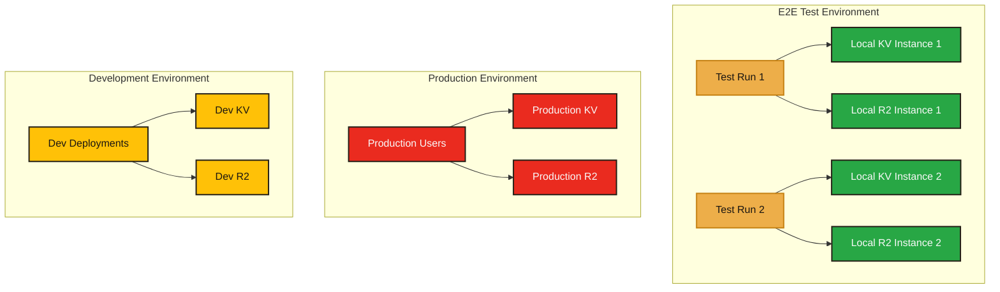

**[+] Complete Isolation:**
- E2E tests use local storage (file system)
- Production uses cloud storage (Cloudflare)
- Development deployments use separate cloud storage
- No data can leak between environments

---

## [~] Running E2E Tests

### Basic Commands

```bash
# Run all E2E tests
pnpm test:e2e

# Run specific test file
pnpm test:e2e mods-hub/src/pages/mod-upload.e2e.spec.ts

# Run in UI mode (interactive)
pnpm test:e2e:ui

# Run in debug mode (step through)
pnpm test:e2e:debug

# View test report
pnpm test:e2e:report
```

### What Happens When You Run Tests

1. **Playwright loads configuration** (`playwright.config.ts`)
2. **Global setup runs** (`playwright.global-setup.ts`)
   - Loads `.dev.vars` files
   - Verifies test secrets exist
3. **Web servers start** (automatic)
   - Frontend: `localhost:5173`
   - Mods Hub: `localhost:3001`
4. **Local workers start** (automatic)
   - OTP Auth: `localhost:8787`
   - Mods API: `localhost:8788`
   - All other services on sequential ports
5. **Health checks** verify all services are ready
6. **Tests execute** against local services
7. **Cleanup** happens automatically when tests finish

---

## [=] Troubleshooting

### Workers Not Starting

**Symptom:** Tests fail with "Worker not accessible"

**Solutions:**
1. Check ports are available: `netstat -an | findstr "8787 8788"`
2. Kill existing workers: `taskkill /F /IM node.exe` (Windows)
3. Verify `.dev.vars` files exist
4. Check `wrangler` is installed: `wrangler --version`

### Test Secrets Missing

**Symptom:** `E2E_TEST_JWT_TOKEN not found`

**Solutions:**
1. Run setup manually: `cd serverless/mods-api && pnpm setup:test-secrets`
2. Check `.dev.vars` file exists and contains secrets
3. Verify global setup is loading files correctly

### Frontend Not Starting

**Symptom:** `WebServer failed to start`

**Solutions:**
1. Ensure ports 5173 and 3001 are free
2. Try starting manually: `pnpm dev` and `cd mods-hub && pnpm dev`
3. Check for port conflicts

### Tests Timing Out

**Symptom:** Tests exceed timeout waiting for services

**Solutions:**
1. Increase timeout in `playwright.config.ts`
2. Check worker logs for errors
3. Verify all services start successfully (check health endpoints)

---

## [=] Key Differences: E2E vs Production

### Storage Comparison

| Storage Type | E2E (Local) | Production |
|--------------|-------------|------------|
| **KV** | File system (`--local`) | Cloudflare KV (cloud) |
| **R2** | File system (`--local`) | Cloudflare R2 (cloud) |
| **Persistence** | Ephemeral (cleared on restart) | Persistent (cloud storage) |
| **Location** | `~/.wrangler/state/` | Cloudflare data centers |
| **Access** | Direct file access | API only |

### Network Comparison

| Aspect | E2E (Local) | Production |
|--------|-------------|------------|
| **Latency** | < 1ms (localhost) | 50-200ms (network) |
| **Bandwidth** | Unlimited (local) | Limited (internet) |
| **Reliability** | 100% (no network issues) | Variable (network conditions) |
| **Cost** | Free | Cloudflare usage costs |

### Secret Management

| Aspect | E2E (Local) | Production |
|--------|-------------|------------|
| **Source** | `.dev.vars` files | `wrangler secret` (cloud) |
| **Generation** | Automatic (`setup:test-secrets`) | Manual (`wrangler secret put`) |
| **Storage** | Local files (gitignored) | Cloudflare secrets API |
| **Security** | Test values only | Production secrets |

---

## [*] Benefits of Local Workers

1. **[+] Zero Deployment Time** - No waiting for Cloudflare deployments
2. **[+] Fast Execution** - Localhost speed, no network latency
3. **[+] Complete Control** - Full access to logs, state, debugging
4. **[+] Cost-Free** - No Cloudflare usage during testing
5. **[+] Safe Testing** - Can't affect production or development data
6. **[+] Reproducible** - Same conditions every test run
7. **[+] Offline Capable** - Works without internet connection

---

## [=] Production Parity

### How Local Workers Match Production

Local workers use the **exact same code** as production:

1. **Same Source Code** - No mocks or stubs
2. **Same Worker Runtime** - Cloudflare Workers runtime
3. **Same API** - Identical request/response handling
4. **Same Storage APIs** - KV and R2 APIs behave identically
5. **Same Encryption** - Real encryption/decryption (not mocked)

**Only Differences:**
- Storage location (local file vs cloud)
- Network (localhost vs internet)
- Secrets source (`.dev.vars` vs cloud secrets)

---

## [=] Test Data Lifecycle

### Test Data Creation and Cleanup

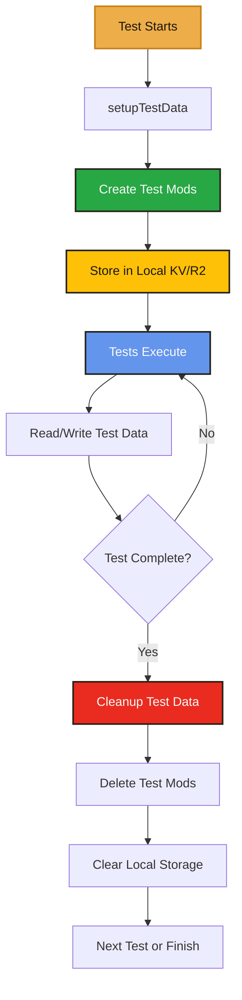

---

## [*] Summary

**[+] E2E tests use completely local workers** - no deployment needed  
**[+] All services run on localhost** - fast and isolated  
**[+] Local storage (KV/R2)** - file system based, ephemeral  
**[+] Automatic secret generation** - no manual setup required  
**[+] Production parity** - same code, same behavior  
**[+] Complete isolation** - can't affect production or development  

**The E2E testing architecture provides a safe, fast, and accurate way to test your entire application stack without any deployment overhead or risk to production systems.**

---

## [=] Related Documentation

- [E2E Testing Guide](./E2E_TESTING_GUIDE.md) - Complete E2E testing guide
- [E2E Test Structure](./E2E_TEST_STRUCTURE.md) - Test file organization
- [E2E Quick Start](./e2E_QUICK_START.md) - Quick reference
- [E2E Environment Verification](./E2E_ENVIRONMENT_VERIFICATION.md) - Environment checks

---

**Last Updated:** 2025-12-30

