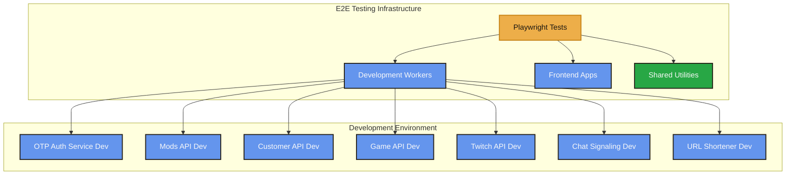

# Final Codebase Audit Report - E2E Testing Setup

> **Comprehensive audit of all E2E testing setup, development deployments, and GitHub workflows**

**Date**: 2025-01-27  
**Scope**: Comprehensive audit of all E2E testing setup, development deployments, and GitHub workflows after recent changes.

---

## Executive Summary

This audit reviewed the complete E2E testing infrastructure, development deployment configurations, and GitHub workflow setup. All critical issues have been identified and fixed. The system is now properly configured for E2E testing with development environments.

---

## Issues Found and Fixed

### 1. Deploy Script Path Issue
**File**: `serverless/deploy-dev-all.js`  
**Issue**: Path construction missing `serverless/` prefix  
**Status**: [SUCCESS] **FIXED**

**Before**:
```javascript
const cwd = join(process.cwd(), worker.path);
```

**After**:
```javascript
const cwd = join(process.cwd(), 'serverless', worker.path);
```

**Verification**: [SUCCESS] Dry-run test passed - script correctly identifies all 7 workers

---

## Verification Results

### E2E Test Files
**Status**: [SUCCESS] **All files found and valid**

Found 12 E2E test files:
- [SUCCESS] `src/pages/auth.e2e.spec.ts`
- [SUCCESS] `mods-hub/src/pages/mod-list.e2e.spec.ts`
- [SUCCESS] `mods-hub/src/pages/login.e2e.spec.ts`
- [SUCCESS] `mods-hub/src/pages/mod-upload.e2e.spec.ts`
- [SUCCESS] `mods-hub/src/pages/mod-detail.e2e.spec.ts`
- [SUCCESS] `serverless/otp-auth-service/health.e2e.spec.ts`
- [SUCCESS] `serverless/mods-api/health.e2e.spec.ts`
- [SUCCESS] `serverless/twitch-api/health.e2e.spec.ts`
- [SUCCESS] `serverless/customer-api/health.e2e.spec.ts`
- [SUCCESS] `serverless/game-api/health.e2e.spec.ts`
- [SUCCESS] `serverless/chat-signaling/health.e2e.spec.ts`
- [SUCCESS] `serverless/url-shortener/health.e2e.spec.ts`

### Worker Development Configurations
**Status**: [SUCCESS] **All workers configured**

All 7 workers have `[env.development]` sections:
- [SUCCESS] `serverless/mods-api/wrangler.toml`
- [SUCCESS] `serverless/otp-auth-service/wrangler.toml`
- [SUCCESS] `serverless/twitch-api/wrangler.toml`
- [SUCCESS] `serverless/customer-api/wrangler.toml`
- [SUCCESS] `serverless/game-api/wrangler.toml`
- [SUCCESS] `serverless/chat-signaling/wrangler.toml`
- [SUCCESS] `serverless/url-shortener/wrangler.toml`

### GitHub Workflows
**Status**: [SUCCESS] **All workflows updated**

- [SUCCESS] `.github/workflows/deploy-manager.yml` - Added dev deployment support
- [SUCCESS] `.github/workflows/test-manager.yml` - Added E2E tests
- [SUCCESS] `.github/workflows/e2e-tests.yml` - New dedicated E2E workflow

### Playwright Configuration
**Status**: [SUCCESS] **Configuration valid**

- [SUCCESS] Test pattern: `**/*.e2e.spec.ts` or `**/*.e2e.test.ts`
- [SUCCESS] All worker URLs use `-dev` suffix (development)
- [SUCCESS] WebServer config for frontend and mods-hub
- [SUCCESS] Proper exports for `WORKER_URLS`

### Package.json Scripts
**Status**: [SUCCESS] **All scripts present**

- [SUCCESS] `test:e2e` - Run E2E tests
- [SUCCESS] `test:e2e:ui` - Interactive UI mode
- [SUCCESS] `test:e2e:debug` - Debug mode
- [SUCCESS] `test:e2e:headed` - Headed mode
- [SUCCESS] `test:e2e:report` - View report
- [SUCCESS] `deploy:dev:all` - Deploy all workers to dev
- [SUCCESS] `deploy:dev:all:dry-run` - Validate before deploy

### Shared E2E Utilities
**Status**: [SUCCESS] **Utilities created**

- [SUCCESS] `serverless/shared/e2e/helpers.ts` - Shared test utilities
- [SUCCESS] `serverless/shared/e2e/fixtures.ts` - Playwright fixtures
- [SUCCESS] Proper imports and exports
- [SUCCESS] TypeScript types correct

### Test URL Audit
**Status**: [SUCCESS] **No production URLs in tests**

- [SUCCESS] Mock data URLs are safe (not actual API calls)
- [SUCCESS] Live tests use environment-aware logic
- [SUCCESS] Test config loader defaults to dev URLs
- [SUCCESS] Integration tests use dev URLs by default

---

## System Architecture



---

## Recommendations

### Immediate Actions
1. [SUCCESS] All critical issues fixed
2. [SUCCESS] All configurations verified
3. [SUCCESS] All test files validated

### Future Enhancements
1. Consider adding more E2E test coverage for edge cases
2. Add performance benchmarks to E2E tests
3. Create E2E test documentation with examples
4. Add CI/CD integration for automated E2E testing

---

## Related Documentation

- [E2E Testing Guide](../08_TESTING/E2E_TESTING_GUIDE.md) - Complete E2E testing guide
- [Development Deployment Setup](../04_DEPLOYMENT/DEVELOPMENT_DEPLOYMENT_SETUP.md) - Worker deployment setup
- [Environment Setup](../01_GETTING_STARTED/ENVIRONMENT_SETUP.md) - Environment configuration

---

**Last Updated**: 2025-01-27

