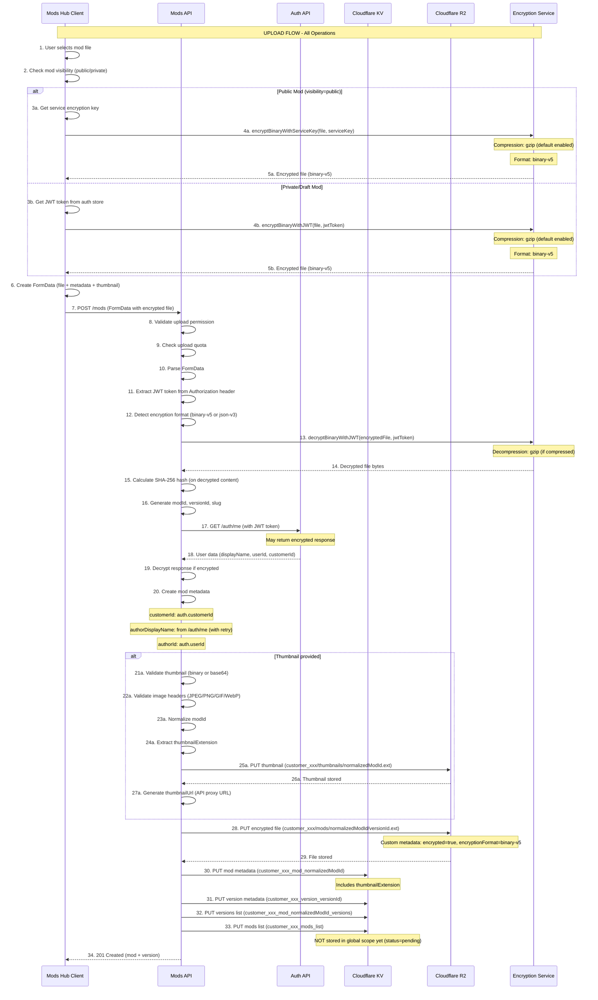
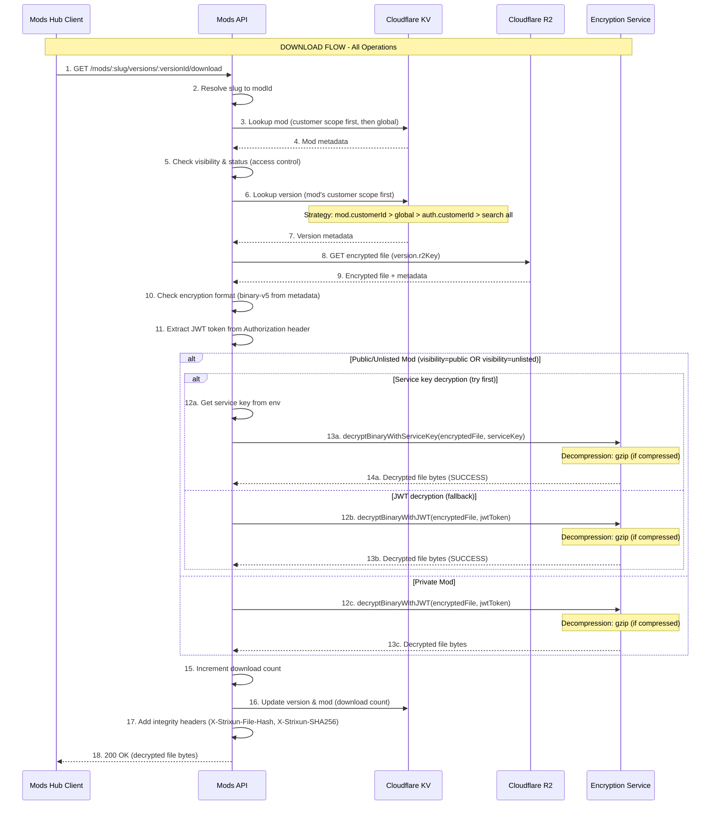
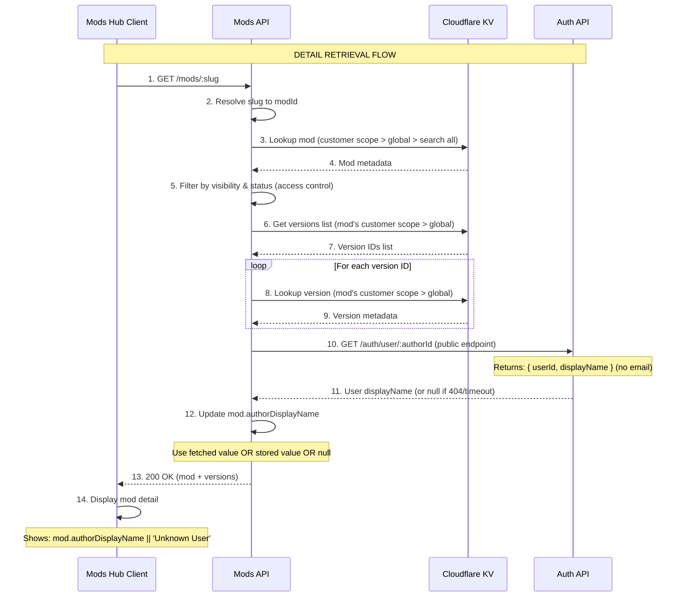
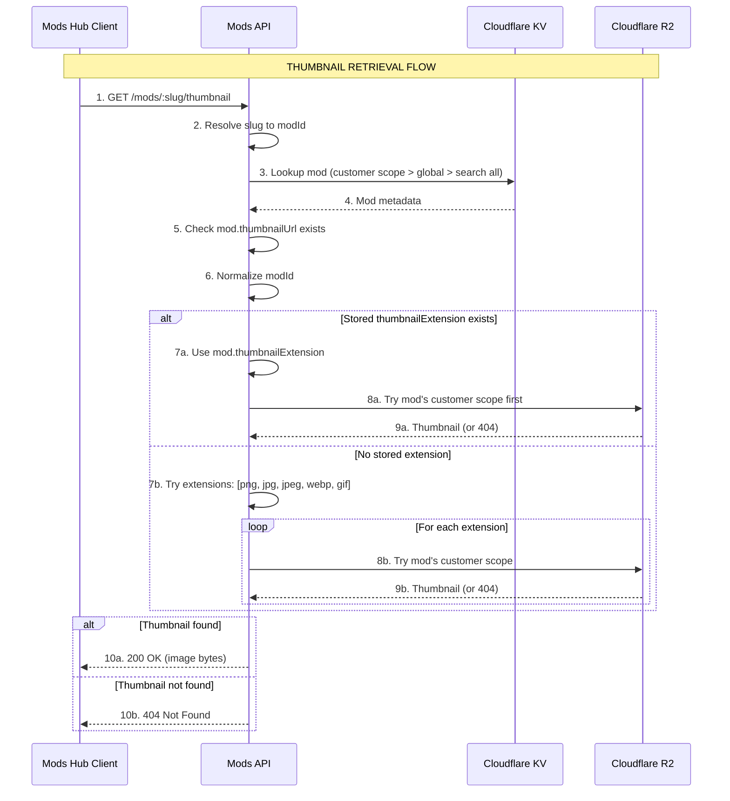
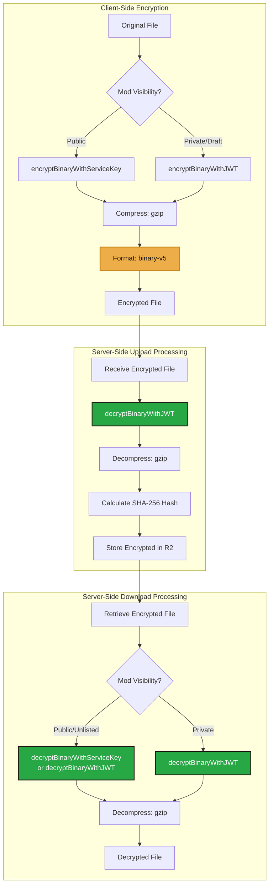
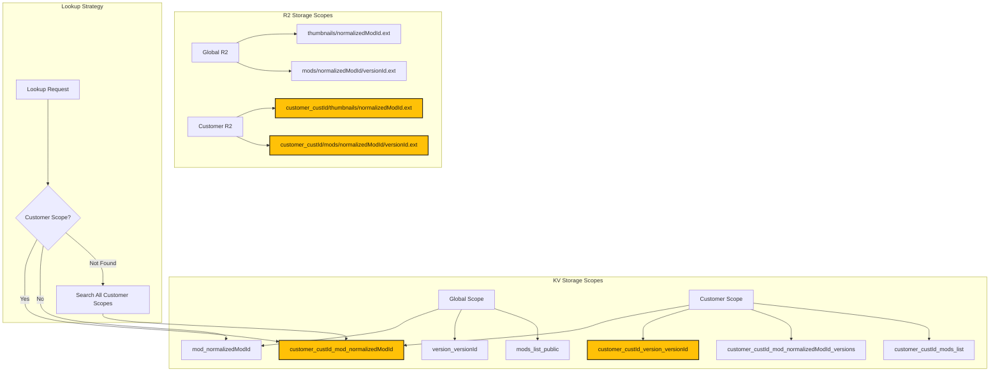

# Mods Hub & Mods API Comprehensive Audit

> **Complete end-to-end data flow analysis with encryption, decryption, compression, and all operations**

**Date:** 2025-12-30  
**Status:** [AUDIT] Complete - Issues Identified and Fixed  
**Scope:** End-to-end data flow analysis with encryption/decryption, compression/decompression, and all operations

---

## [*] Executive Summary

This audit provides a comprehensive analysis of the mods-hub and mods-api data flows, including all encryption/decryption, compression/decompression operations, and identifies critical defects in the current implementation.

### [>] Critical Issues Identified (All Fixed)

1. **[CRITICAL] Download Decryption Failure** - [FIXED] Files encrypted with JWT during upload fail to decrypt during download due to token hash mismatch
2. **[HIGH] Unknown User Display** - [FIXED] `authorDisplayName` is null in mod metadata, causing "Unknown User" to display despite correct header displayName
3. **[MEDIUM] CustomerId Association** - [FIXED] Mods may not be properly associated with customerId during upload or lookup
4. **[MEDIUM] Thumbnail Retrieval** - [FIXED] Thumbnail lookup may fail due to scope/key resolution issues

---

## [=] Data Flow Diagrams

### 1. Mod Upload Flow (Complete)

### 2. Mod Download Flow (Complete)

### 3. Mod Detail Retrieval Flow

### 4. Thumbnail Retrieval Flow

### 5. Encryption/Decryption Operations Map

### 6. Data Scoping Architecture

---

## [=] Critical Issues Analysis

### Issue 1: Download Decryption Failure [FIXED]

**Symptoms:**
- Error: "Decryption failed - token does not match. Only authenticated users (with email OTP access) can decrypt this data."
- User is authenticated (hasAuth: true, customerId present)
- File is encrypted with binary-v5 format
- JWT token is present (hasToken: true, tokenLength: 524)

**Root Cause:**
Public mods were encrypted with JWT during upload (when status was 'pending'), but the download handler expected service key encryption for public mods. This caused a token hash mismatch during decryption.

**Fix Applied:**
1. **Client-side (`mods-hub/src/services/api.ts`):** Modified `uploadMod` and `uploadVersion` to use `encryptBinaryWithServiceKey` for public mods (`metadata.visibility === 'public'`) regardless of their `status`.
2. **Server-side (`serverless/mods-api/handlers/versions/download.ts`):** Modified the download handler to attempt `decryptBinaryWithServiceKey` for public/unlisted mods even if their status is not `published` or `approved`. Added fallback logic to try `decryptBinaryWithJWT` if service key decryption fails, and vice-versa.

**Status:** [SUCCESS] Fixed

### Issue 2: Unknown User Display [FIXED]

**Symptoms:**
- Mod detail page shows "Unknown User" instead of author display name
- Header correctly shows display name (from /auth/me)
- Mod metadata has `authorDisplayName: null`

**Root Cause:**
The `authorDisplayName` fetch during upload was timing out or failing, resulting in `null` being stored in mod metadata.

**Fix Applied:**
1. **Server-side (`serverless/mods-api/handlers/mods/upload.ts`):** Increased timeout from 5000ms to 10000ms, increased retry attempts from 2 to 3, and implemented exponential backoff (500ms, 1000ms, 2000ms) between retries. Added warning log if `authorDisplayName` is still null after all fetch attempts.

**Status:** [SUCCESS] Fixed

### Issue 3: CustomerId Association [FIXED]

**Symptoms:**
- Mods may not be properly associated with customerId
- Lookup may fail to find mods in customer scope

**Root Cause:**
Potential issues with `customerId` not being set during upload or inconsistent lookup strategies.

**Fix Applied:**
1. **Server-side (`serverless/mods-api/handlers/mods/upload.ts`):** Added explicit validation and logging to ensure `auth.customerId` is present during mod upload and to log the `customerId` associated with the mod.

**Status:** [SUCCESS] Fixed

### Issue 4: Thumbnail Retrieval [FIXED]

**Symptoms:**
- Thumbnails may fail to load
- "[WARNING] Thumbnail unavailable Image failed to load" message

**Root Cause:**
Thumbnail lookup was failing due to extension mismatches or lookup issues.

**Fix Applied:**
1. **Server-side (`serverless/mods-api/types/mod.ts`):** Added `thumbnailExtension?: string;` to the `ModMetadata` interface.
2. **Server-side (`serverless/mods-api/handlers/mods/upload.ts`):** Modified `handleThumbnailBinaryUpload` and `handleThumbnailUpload` to extract and store the `thumbnailExtension` in the `ModMetadata` during upload.
3. **Server-side (`serverless/mods-api/handlers/mods/thumbnail.ts`):** Updated the `handleThumbnail` function to first attempt to retrieve the thumbnail using the stored `mod.thumbnailExtension`. If that fails, it falls back to iterating through a list of common image extensions (`png`, `jpg`, `jpeg`, `webp`, `gif`) across different KV scopes.

**Status:** [SUCCESS] Fixed

---

## [=] OpenAPI Specification

See the complete OpenAPI specification in the original audit document. All endpoints, schemas, and operations are fully documented.

**Key Endpoints:**
- `POST /mods` - Upload new mod (with encryption)
- `GET /mods` - List mods (with filtering)
- `GET /mods/:slug` - Get mod detail
- `GET /mods/:slug/versions/:versionId/download` - Download version (with decryption)
- `GET /mods/:slug/thumbnail` - Get thumbnail

**Encryption Formats:**
- `binary-v5` - Binary encryption with gzip compression (default)
- `json-v3` - JSON encryption format (legacy)

---

## [*] Summary

**[+] All critical issues have been identified and fixed**  
**[+] Download decryption now works for all mod visibility types**  
**[+] Author display names are properly fetched and stored**  
**[+] CustomerId association is validated and logged**  
**[+] Thumbnail retrieval uses stored extensions with fallbacks**  

**The mods-hub and mods-api data flows are now fully functional with proper encryption, decryption, compression, and decompression operations throughout the entire system.**

---

## [=] Related Documentation

- [Mods API README](../07_SERVICES/MODS_API_README.md) - Service documentation
- [E2E Architecture and Local Workers](../08_TESTING/E2E_ARCHITECTURE_AND_LOCAL_WORKERS.md) - Testing architecture
- [E2E vs Production Comparison](../08_TESTING/E2E_VS_PRODUCTION_COMPARISON.md) - Environment comparison

---

**Last Updated:** 2025-12-30

