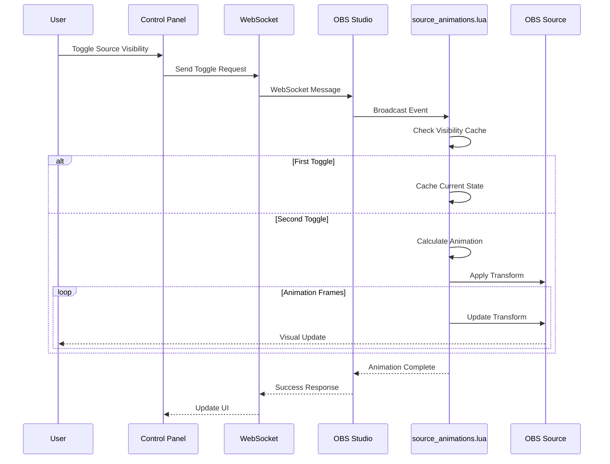

# Strixun Stream Suite - Comprehensive Product Overview

> **Complete feature inventory, business rules, and testing requirements for Strixun Stream Suite**

**Document Version:** 1.0.0  
**Last Updated:** 2025-01-01  
**Status:** Complete Audit

---

## Table of Contents

1. [Executive Summary](#executive-summary)
2. [Product Overview](#product-overview)
3. [Feature Inventory](#feature-inventory)
4. [Business Rules](#business-rules)
5. [Testing Requirements](#testing-requirements)
6. [Architecture Overview](#architecture-overview)
7. [Marketing Features](#marketing-features)

---

## Executive Summary

**Strixun Stream Suite (SSS)** is a comprehensive OBS Studio production toolkit that automates and enhances live streaming workflows. The suite consists of:

- **5 Core Lua Scripts** for OBS Studio automation
- **Web-Based Control Panel** (Svelte 5 + TypeScript)
- **Cloud Storage System** (Cloudflare Workers + KV)
- **Authentication System** (OTP-based, passwordless)
- **P2P Chat System** (WebRTC-based, E2E encrypted)
- **Multiple Serverless Services** (URL shortener, notes storage, game API, mods API)

**Target Audience:** Content creators, streamers, production teams  
**Platform:** OBS Studio 28+ (Windows, macOS, Linux)  
**Deployment:** Cloudflare Workers (serverless), GitHub Pages (static hosting)

---

## Product Overview

### Core Value Proposition

Strixun Stream Suite transforms manual streaming tasks into automated, professional-quality operations:

1. **Time Savings:** Reduce setup time from hours to minutes
2. **Professional Quality:** Smooth animations and transitions elevate production value
3. **Reliability:** Multi-layer storage ensures configurations are never lost
4. **Flexibility:** Cross-device sync and cloud backups enable remote workflows
5. **Security:** Passwordless authentication and E2E encryption protect user data

### System Components

```mermaid
graph TB
    subgraph Client["Client Environment"]
        OBS[OBS Studio]
        Lua[Lua Scripts]
        Panel[Control Panel]
        Sources[Browser Sources]
    end
    
    subgraph Cloud["Cloud Services"]
        Workers[Cloudflare Workers]
        KV[(Cloudflare KV)]
        Auth[OTP Auth Service]
        Chat[Chat Signaling]
    end
    
    subgraph External["External Services"]
        Twitch[Twitch API]
        Resend[Resend Email]
    end
    
    OBS --> Lua
    OBS --> Panel
    Panel --> Sources
    Panel --> Workers
    Workers --> KV
    Workers --> Auth
    Workers --> Chat
    Workers --> Twitch
    Auth --> Resend
    
    style Client fill:#1a1611,stroke:#edae49
    style Cloud fill:#e3f2fd,stroke:#2196f3
    style External fill:#9146ff,stroke:#772ce8
```

---

## Feature Inventory

### 1. Source Animations System

**Location:** `source_animations.lua`, `src/core/animations/`

| Feature | Description | Status |
|---------|-------------|--------|
| Fade Animation | Opacity transition (0-100%) | [OK] Implemented |
| Slide Animation | Directional slide (left/right/up/down) | [OK] Implemented |
| Zoom Animation | Scale-based animation | [OK] Implemented |
| Pop Animation | Bouncy scale effect | [OK] Implemented |
| Per-Source Configuration | Individual animation settings per source | [OK] Implemented |
| Default Animation | Global default for unconfigured sources | [OK] Implemented |
| Easing Functions | 9 easing types (linear, ease_in, ease_out, etc.) | [OK] Implemented |
| Duration Control | Configurable animation duration (ms) | [OK] Implemented |
| Visibility Caching | Prevents flicker on first toggle | [OK] Implemented |
| Canonical Transforms | Prevents position drift | [OK] Implemented |
| Show/Hide Toggle | Separate animation on show vs hide | [OK] Implemented |
| Animation Presets | Predefined animation configurations | [OK] Implemented |

**Business Rules:**
- First visibility toggle caches state (no animation)
- Second toggle triggers animation
- Animations respect `prefers-reduced-motion` (future)
- Minimum duration: 50ms, Maximum duration: 5000ms
- Default duration: 300ms
- Default easing: `ease_out`

---

### 2. Source Swap System

**Location:** `source_swap.lua`, `src/modules/source-swaps.ts`

| Feature | Description | Status |
|---------|-------------|--------|
| Two-Source Swap | Swap position and size of two sources | [OK] Implemented |
| Multiple Configurations | Support for multiple swap presets | [OK] Implemented |
| Hotkey Support | Per-configuration hotkey assignment | [OK] Implemented |
| Animation Types | Slide, arc, scale, bounce, elastic, crossfade | [OK] Implemented |
| Aspect Ratio Control | Preserve or stretch aspect ratio | [OK] Implemented |
| Temporary Override | Per-swap aspect ratio override | [OK] Implemented |
| Group Support | Works with sources in groups | [OK] Implemented |
| Stagger Support | Sequential animation with delay | [OK] Implemented |
| Easing Functions | 6 easing types | [OK] Implemented |

**Business Rules:**
- Both sources must exist in current scene
- Sources can be in groups (nested support)
- Default animation duration: 400ms
- Default easing: `ease_in_out`
- Aspect ratio preserved by default (SCALE_INNER)
- Temporary override supersedes global setting

---

### 3. Layout Presets System

**Location:** `source_layouts.lua`, `src/modules/layouts.ts`

| Feature | Description | Status |
|---------|-------------|--------|
| Layout Capture | Snapshot all source positions/sizes | [OK] Implemented |
| Layout Application | Apply saved layout with animation | [OK] Implemented |
| Multi-Source Animation | Animate all sources simultaneously | [OK] Implemented |
| Staggered Animation | Sequential animation with delays | [OK] Implemented |
| Visibility Management | Show/hide sources based on layout | [OK] Implemented |
| Smart Diffing | Handles missing/new sources gracefully | [OK] Implemented |
| Scene-Specific Layouts | Separate layouts per scene | [OK] Implemented |
| Hotkey Support | Per-layout hotkey assignment | [OK] Implemented |
| Layout Limits | Maximum 20 layouts per scene | [OK] Implemented |

**Business Rules:**
- Maximum 20 layouts per scene
- Layouts are scene-specific
- Missing sources logged as warnings (not errors)
- New sources in scene are ignored (not animated)
- Default animation duration: 500ms
- Default stagger: 0ms (no stagger)
- Sources animate to saved positions even if currently hidden

---

### 4. Text Cycler System

**Location:** `text_cycler.lua`, `src/modules/text-cycler.ts`

| Feature | Description | Status |
|---------|-------------|--------|
| Text Cycling | Cycle through multiple text strings | [OK] Implemented |
| Transition Effects | Obfuscate, typewriter, glitch, scramble, wave | [OK] Implemented |
| Cycle Duration | Configurable time per text (ms) | [OK] Implemented |
| Transition Duration | Configurable transition time (ms) | [OK] Implemented |
| Hotkey Support | Start, stop, toggle hotkeys | [OK] Implemented |
| UTF-8 Support | Proper Unicode character handling | [OK] Implemented |
| Multiple Configurations | Support for multiple text cyclers | [OK] Implemented |
| Display Integration | Browser source display component | [OK] Implemented |

**Business Rules:**
- Default cycle duration: 3000ms
- Default transition duration: 500ms
- Minimum cycle duration: 1000ms
- Maximum cycle duration: 60000ms
- UTF-8 aware character counting
- Enchant characters use Standard Galactic Alphabet
- Glitch characters use block/box drawing characters

---

### 5. Twitch Clips Player

**Location:** `src/modules/twitch-api.ts`, `serverless/twitch-api/`

| Feature | Description | Status |
|---------|-------------|--------|
| Auto-Play Clips | Automatically play clips during BRB screens | [OK] Implemented |
| Channel Selection | Multiple channel support | [OK] Implemented |
| Clip Filtering | Filter by view count, date, game | [OK] Implemented |
| Shuffle Mode | Random clip order | [OK] Implemented |
| Loop Mode | Continuous playback | [OK] Implemented |
| Chat Command Support | Trigger via Twitch chat commands | [OK] Implemented |
| Browser Source Display | Standalone HTML display component | [OK] Implemented |
| API Proxy | Cloudflare Worker proxy for Twitch API | [OK] Implemented |
| Token Caching | OAuth token caching (4 hours) | [OK] Implemented |

**Business Rules:**
- Requires Twitch OAuth credentials
- Clips cached for 7 days
- Maximum 100 clips per request
- Default filter: Top clips from last 30 days
- Auto-refresh token on expiry
- Rate limited by Twitch API (800 requests/15min)

---

### 6. Cloud Storage System

**Location:** `src/modules/cloud-save.ts`, `serverless/twitch-api/handlers/cloud-storage.js`

| Feature | Description | Status |
|---------|-------------|--------|
| Save to Cloud | Upload configurations to cloud | [OK] Implemented |
| Load from Cloud | Download configurations from cloud | [OK] Implemented |
| Multiple Save Slots | Named save slots (default, backup1, etc.) | [OK] Implemented |
| Auto-Sync | Optional automatic cloud saves (5min) | [OK] Implemented |
| Conflict Detection | Timestamp-based conflict resolution | [OK] Implemented |
| Device ID Authentication | Device-based access control | [OK] Implemented |
| Encryption Support | Optional passphrase-based encryption | [OK] Implemented |
| 1 Year Retention | Auto-expires after 1 year (renewable) | [OK] Implemented |
| 10MB Per Save | Maximum payload size limit | [OK] Implemented |

**Business Rules:**
- Maximum 10MB per save slot
- 1 year TTL (auto-expires, renewed on save)
- Device ID format: `sss_<timestamp>_<random>`
- Device ID validation: `/^[a-zA-Z0-9_-]{8,64}$/`
- Slot name validation: `/^[a-zA-Z0-9_-]{1,32}$/`
- Conflict resolution: Cloud wins if newer timestamp
- Encryption: AES-GCM-256 with PBKDF2 (100k iterations)

---

### 7. Local Storage System

**Location:** `src/modules/storage.ts`

| Feature | Description | Status |
|---------|-------------|--------|
| IndexedDB Primary | Primary storage (survives cache clears) | [OK] Implemented |
| localStorage Backup | Synchronous backup storage | [OK] Implemented |
| Recovery Snapshot | Emergency recovery (60s debounce) | [OK] Implemented |
| Memory Cache | In-memory cache for fast reads | [OK] Implemented |
| Multi-Layer Fallback | IndexedDB → localStorage → Recovery | [OK] Implemented |
| Automatic Sync | localStorage synced on IndexedDB write | [OK] Implemented |
| Storage Status | Real-time storage health indicators | [OK] Implemented |

**Business Rules:**
- IndexedDB is primary (async, large capacity)
- localStorage is backup (sync, limited capacity)
- Recovery snapshot auto-saves every 60 seconds
- Recovery snapshot contains critical configs only
- Storage keys prefixed with `sss_`
- All writes update both IndexedDB and localStorage
- Reads check memory cache first (synchronous)

---

### 8. OTP Authentication System

**Location:** `serverless/otp-auth-service/`, `shared-components/otp-login/`

| Feature | Description | Status |
|---------|-------------|--------|
| Email OTP | 9-digit numeric code via email | [OK] Implemented |
| Passwordless Login | No passwords required | [OK] Implemented |
| JWT Tokens | 30-day expiration tokens | [OK] Implemented |
| Token Refresh | Automatic token refresh | [OK] Implemented |
| Rate Limiting | 3 requests per email per hour | [OK] Implemented |
| Attempt Limits | 5 attempts per OTP | [OK] Implemented |
| OTP Expiration | 10-minute OTP validity | [OK] Implemented |
| Token Blacklist | Logout/revocation support | [OK] Implemented |
| Session Management | KV-based session storage | [OK] Implemented |
| User Management | User creation/update on first login | [OK] Implemented |
| Display Name Generation | Auto-generated anonymized names | [OK] Implemented |
| Twitch Account Attachment | OAuth-based Twitch linking | [OK] Implemented |

**Business Rules:**
- OTP codes: 9 digits, cryptographically random
- OTP expiration: 10 minutes
- OTP attempts: Maximum 5 attempts
- Rate limit: 3 OTP requests per email per hour
- JWT expiration: 30 days
- JWT algorithm: HMAC-SHA256
- Display names: Adjective + Noun + Number (unique)
- Email validation: Standard email format
- Token refresh: Requires valid current token

---

### 9. P2P Chat System

**Location:** `src/services/chat/`, `serverless/chat-signaling/`

| Feature | Description | Status |
|---------|-------------|--------|
| WebRTC P2P | Direct peer-to-peer connections | [OK] Implemented |
| End-to-End Encryption | AES-GCM-256 message encryption | [OK] Implemented |
| Room Management | Create/join/leave rooms | [OK] Implemented |
| Opt-In Room Splitting | Manual party room creation | [OK] Implemented |
| Message History | Encrypted IndexedDB storage | [OK] Implemented |
| Typing Indicators | Real-time typing status | [OK] Implemented |
| Presence Tracking | User online/offline status | [OK] Implemented |
| 7TV Emotes | Native 7TV emote support | [OK] Implemented |
| Custom Emojis | Domain-specific custom emojis | [OK] Implemented |
| Signaling Server | Cloudflare Worker signaling | [OK] Implemented |
| Reconnection Logic | Automatic reconnection with backoff | [OK] Implemented |

**Business Rules:**
- Rooms are user-created (broadcaster model)
- Maximum 1000 messages per room (history)
- Message encryption: AES-GCM-256
- WebRTC connection timeout: 30 seconds
- Reconnection attempts: 5 with exponential backoff
- Typing indicator timeout: 3 seconds
- Room splitting: Opt-in only (not automatic)
- Display names: Required (anonymized)

---

### 10. URL Shortener Service

**Location:** `serverless/url-shortener/`, `src/pages/UrlShortener.svelte`

| Feature | Description | Status |
|---------|-------------|--------|
| URL Shortening | Create short links for any URL | [OK] Implemented |
| Custom Short Codes | User-defined codes (3-20 chars) | [OK] Implemented |
| Click Analytics | Track clicks per shortened URL | [OK] Implemented |
| User Management | List/view/delete user URLs | [OK] Implemented |
| Expiration Support | Configurable expiration (1-10 years) | [OK] Implemented |
| OTP Authentication | Integrated with OTP auth | [OK] Implemented |
| Standalone Interface | Full-featured HTML interface | [OK] Implemented |
| Redirect Handling | 302 redirects to original URL | [OK] Implemented |

**Business Rules:**
- Short code length: 3-20 characters
- Short code format: Letters, numbers, hyphens, underscores
- Default expiration: 1 year
- Maximum expiration: 10 years
- Custom codes must be unique
- Auto-generated codes: 6 characters (expandable to 8)
- Click tracking: Per-click analytics stored
- User isolation: Users can only access their own URLs

---

### 11. Notes/Notebook System

**Location:** `serverless/twitch-api/handlers/notes.js`, `src/pages/Notes.svelte`

| Feature | Description | Status |
|---------|-------------|--------|
| Rich Text Editor | Lexical-based rich text editing | [OK] Implemented |
| Mermaid Diagrams | Native Mermaid diagram support | [OK] Implemented |
| Multiple Notebooks | Create/manage multiple notebooks | [OK] Implemented |
| Cloud Storage | Cloudflare KV-based storage | [OK] Implemented |
| Auto-Save | Debounced auto-save (30 seconds) | [OK] Implemented |
| Manual Sync | User-triggered save & sync | [OK] Implemented |
| HTML Import/Export | HTML format support | [OK] Implemented |
| Authentication Required | OTP auth required for all operations | [OK] Implemented |
| Local-First Architecture | IndexedDB with cloud sync | [OK] Implemented |

**Business Rules:**
- Authentication required for all operations
- Auto-save debounce: 30 seconds
- Maximum notebook size: 1MB (KV limit consideration)
- Notebooks are user-isolated
- Mermaid diagrams rendered client-side
- HTML export includes Mermaid diagrams as SVG
- Conflict resolution: Cloud wins if newer timestamp
- KV write optimization: Aggressive debouncing to respect 1k writes/day limit

---

### 12. Control Panel UI

**Location:** `src/pages/`, `src/lib/components/`

| Feature | Description | Status |
|---------|-------------|--------|
| Dashboard | System status and quick actions | [OK] Implemented |
| Sources Tab | Source animation configuration | [OK] Implemented |
| Swaps Tab | Source swap configuration | [OK] Implemented |
| Layouts Tab | Layout preset management | [OK] Implemented |
| Text Cycler Tab | Text cycler configuration | [OK] Implemented |
| Scripts Tab | Script status and management | [OK] Implemented |
| Setup Tab | Connection and storage settings | [OK] Implemented |
| Install Tab | Installation wizard | [OK] Implemented |
| Chat Tab | P2P chat interface | [OK] Implemented |
| Notes Tab | Notebook editor | [OK] Implemented |
| URL Shortener Tab | URL shortening interface | [OK] Implemented |
| Activity Log | System activity tracking | [OK] Implemented |
| Toast Notifications | User feedback system | [OK] Implemented |

**Business Rules:**
- All tabs require OBS connection (except Install/Setup)
- UI state persists across sessions
- Toast notifications auto-dismiss after 5 seconds
- Activity log stores last 1000 entries
- Navigation state stored in localStorage
- Filter state persists per component

---

### 13. API Framework

**Location:** `src/core/api/`

| Feature | Description | Status |
|---------|-------------|--------|
| Enhanced API Client | Type-safe API client | [OK] Implemented |
| Request Batching | Batch multiple requests | [OK] Implemented |
| Request Deduplication | Prevent duplicate requests | [OK] Implemented |
| Request Queuing | Priority-based request queue | [OK] Implemented |
| Circuit Breaker | Fault tolerance pattern | [OK] Implemented |
| Retry Logic | Exponential backoff retry | [OK] Implemented |
| Offline Queue | Queue requests when offline | [OK] Implemented |
| Response Caching | Memory + IndexedDB caching | [OK] Implemented |
| Response Filtering | Tag-based response filtering | [OK] Implemented |
| Type Registry | Type-based response building | [OK] Implemented |
| Encryption Support | JWT-based encryption | [OK] Implemented |

**Business Rules:**
- Request timeout: 30 seconds
- Retry attempts: 3 with exponential backoff
- Circuit breaker threshold: 5 failures
- Cache TTL: Configurable per request
- Batch size: Maximum 10 requests per batch
- Queue priority: High, Normal, Low
- Offline queue: Maximum 100 queued requests

---

## Business Rules

### Storage Rules

| Rule | Description | Enforcement |
|------|-------------|-------------|
| Storage Key Prefix | All keys must start with `sss_` | Code validation |
| IndexedDB Primary | IndexedDB is primary storage | Architecture |
| localStorage Backup | localStorage mirrors IndexedDB | Architecture |
| Recovery Snapshot | Auto-saves every 60 seconds | Timer-based |
| Cloud Save Size | Maximum 10MB per save | API validation |
| Cloud Save TTL | 1 year expiration (renewable) | KV TTL |
| Device ID Format | `sss_<timestamp>_<random>` | Regex validation |
| Slot Name Format | 1-32 alphanumeric + hyphens/underscores | Regex validation |

### Authentication Rules

| Rule | Description | Enforcement |
|------|-------------|-------------|
| OTP Format | 9 digits, numeric only | Generation logic |
| OTP Expiration | 10 minutes | KV TTL |
| OTP Attempts | Maximum 5 attempts | Counter tracking |
| Rate Limiting | 3 requests per email per hour | KV counter |
| JWT Expiration | 30 days | Token generation |
| Token Refresh | Requires valid current token | Validation |
| Display Name Uniqueness | Guaranteed unique via KV | KV lookup |

### Animation Rules

| Rule | Description | Enforcement |
|------|-------------|-------------|
| First Toggle Cache | First toggle caches, second animates | State tracking |
| Minimum Duration | 50ms | Validation |
| Maximum Duration | 5000ms | Validation |
| Default Duration | 300ms | Configuration |
| Default Easing | `ease_out` | Configuration |
| Canonical Transforms | Prevents position drift | Transform caching |

### API Rules

| Rule | Description | Enforcement |
|------|-------------|-------------|
| Request Timeout | 30 seconds | Client configuration |
| Retry Attempts | 3 attempts | Retry logic |
| Circuit Breaker | 5 failures threshold | Circuit breaker |
| Batch Size | Maximum 10 requests | Batching logic |
| Queue Priority | High, Normal, Low | Queue implementation |
| Cache TTL | Configurable per request | Cache strategy |

### Chat Rules

| Rule | Description | Enforcement |
|------|-------------|-------------|
| Message History Limit | 1000 messages per room | IndexedDB limits |
| Encryption Algorithm | AES-GCM-256 | Encryption service |
| Reconnection Attempts | 5 attempts with backoff | Reconnection logic |
| Typing Indicator Timeout | 3 seconds | Timer-based |
| Room Splitting | Opt-in only | User action required |
| Display Name Required | All users must have display name | Validation |

---

## Testing Requirements

### Unit Tests Required

| Component | Test Coverage | Priority |
|-----------|---------------|----------|
| Source Animations | Animation logic, easing functions | P0 |
| Source Swap | Swap calculations, group handling | P0 |
| Layout Presets | Diffing algorithm, animation planning | P0 |
| Text Cycler | Transition effects, UTF-8 handling | P0 |
| Storage System | IndexedDB, localStorage, recovery | P0 |
| API Client | Request batching, retry logic | P1 |
| Authentication | OTP generation, JWT validation | P0 |
| Chat System | Encryption, WebRTC, signaling | P1 |
| URL Shortener | Code generation, validation | P2 |
| Notes System | Editor functionality, Mermaid | P2 |

### Integration Tests Required

| Integration | Test Coverage | Priority |
|-------------|---------------|----------|
| OBS WebSocket | Connection, message handling | P0 |
| Cloud Storage | Save/load, conflict resolution | P0 |
| Twitch API | Token refresh, clip fetching | P1 |
| Chat Signaling | Room creation, message delivery | P1 |
| Authentication Flow | OTP request → verify → JWT | P0 |

### E2E Tests Required

| Scenario | Test Coverage | Priority |
|----------|---------------|----------|
| Source Animation | Toggle visibility → animation plays | P0 |
| Source Swap | Execute swap → sources swap positions | P0 |
| Layout Application | Apply layout → all sources animate | P0 |
| Text Cycling | Start cycler → text cycles with transitions | P0 |
| Cloud Save/Load | Save to cloud → load on another device | P0 |
| Authentication | Request OTP → verify → access protected resource | P0 |
| Chat | Create room → send message → receive message | P1 |

---

## Architecture Overview

### System Architecture

```mermaid
graph TB
    subgraph Client["Client Environment"]
        OBS[OBS Studio<br/>Lua Runtime]
        Browser[Browser Environment<br/>CEF]
        Panel[Control Panel<br/>Svelte 5]
    end
    
    subgraph Storage["Storage Layer"]
        IDB[(IndexedDB<br/>Primary)]
        LS[(localStorage<br/>Backup)]
        Recovery[(Recovery<br/>Snapshot)]
    end
    
    subgraph Network["Network Layer"]
        WS[OBS WebSocket<br/>localhost:4455]
        HTTP[HTTP/HTTPS<br/>Cloudflare]
    end
    
    subgraph Cloud["Cloudflare Edge"]
        Workers[Cloudflare Workers<br/>Serverless]
        KV[(Cloudflare KV<br/>Storage)]
    end
    
    subgraph Services["Cloud Services"]
        Auth[OTP Auth Service]
        Chat[Chat Signaling]
        Twitch[Twitch API Proxy]
        Storage[Cloud Storage]
        URL[URL Shortener]
        Notes[Notes Storage]
    end
    
    OBS --> Browser
    Browser --> Panel
    Panel --> IDB
    Panel --> LS
    Panel --> Recovery
    Panel --> WS
    Panel --> HTTP
    HTTP --> Workers
    Workers --> KV
    Workers --> Auth
    Workers --> Chat
    Workers --> Twitch
    Workers --> Storage
    Workers --> URL
    Workers --> Notes
    
    style Client fill:#1a1611,stroke:#edae49
    style Storage fill:#4caf50,stroke:#2e7d32
    style Network fill:#2196f3,stroke:#1976d2
    style Cloud fill:#ff9800,stroke:#f57c00
    style Services fill:#9c27b0,stroke:#7b1fa2
```

### Data Flow: Source Animation

---

## Marketing Features

### Primary Features (Marketing Focus)

1. **Professional Animations**
   - Smooth fade, slide, zoom, and pop effects
   - Zero-flicker implementation
   - Per-source customization

2. **Instant Layout Switching**
   - Save unlimited layout presets
   - One-click layout application
   - Smooth multi-source animations

3. **Cloud Backup & Sync**
   - Never lose your configurations
   - Cross-device synchronization
   - Encrypted cloud storage

4. **Passwordless Authentication**
   - Email-based OTP login
   - No passwords to remember
   - Secure JWT tokens

5. **P2P Chat System**
   - End-to-end encrypted messaging
   - Direct peer-to-peer connections
   - 7TV emote support

### Secondary Features (Supporting)

1. **Source Swapping** - Smooth position/size swapping
2. **Text Cycling** - Animated text transitions
3. **Twitch Integration** - Auto-play clips during BRB
4. **URL Shortening** - Custom short links with analytics
5. **Notes/Notebooks** - Rich text editor with Mermaid diagrams

### Technical Differentiators

1. **Multi-Layer Storage** - IndexedDB + localStorage + Recovery + Cloud
2. **Zero-Configuration** - Auto-detection of API endpoints
3. **Type-Safe API** - Full TypeScript coverage
4. **Serverless Architecture** - Cloudflare Workers (edge computing)
5. **Open Source** - MIT License, community-driven

---

## Appendix: File Locations

### Core Lua Scripts
- `source_animations.lua` - Source animation system
- `source_swap.lua` - Source swap system
- `source_layouts.lua` - Layout presets system
- `text_cycler.lua` - Text cycling system
- `quick_controls.lua` - Quick controls hotkey
- `script_manager.lua` - Script management

### Client-Side Code
- `src/modules/` - Core business logic modules
- `src/core/` - Core framework (API, animations, events)
- `src/lib/components/` - Reusable UI components
- `src/pages/` - Page components
- `src/services/` - Service layer (chat, auth, etc.)
- `src/stores/` - Svelte stores (state management)

### Serverless Services
- `serverless/otp-auth-service/` - OTP authentication
- `serverless/chat-signaling/` - Chat signaling server
- `serverless/twitch-api/` - Twitch API proxy + cloud storage
- `serverless/url-shortener/` - URL shortening service
- `serverless/game-api/` - Game API service
- `serverless/mods-api/` - Mods API service

### Shared Components
- `shared-components/otp-login/` - OTP login component
- `shared-components/idle-game-overlay/` - Idle game system
- `shared-components/tooltip/` - Tooltip component
- `shared-components/status-flair/` - Status indicator

---

**Document End**
