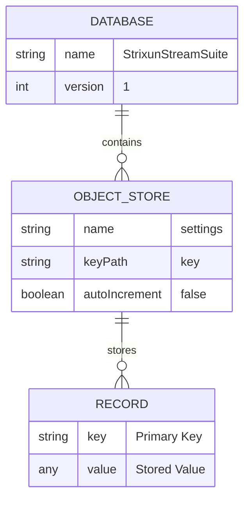
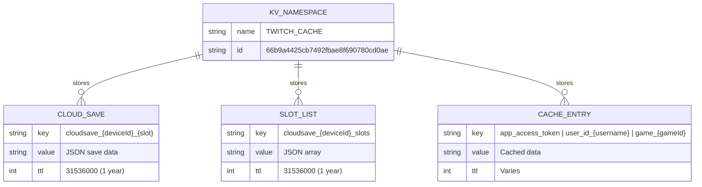
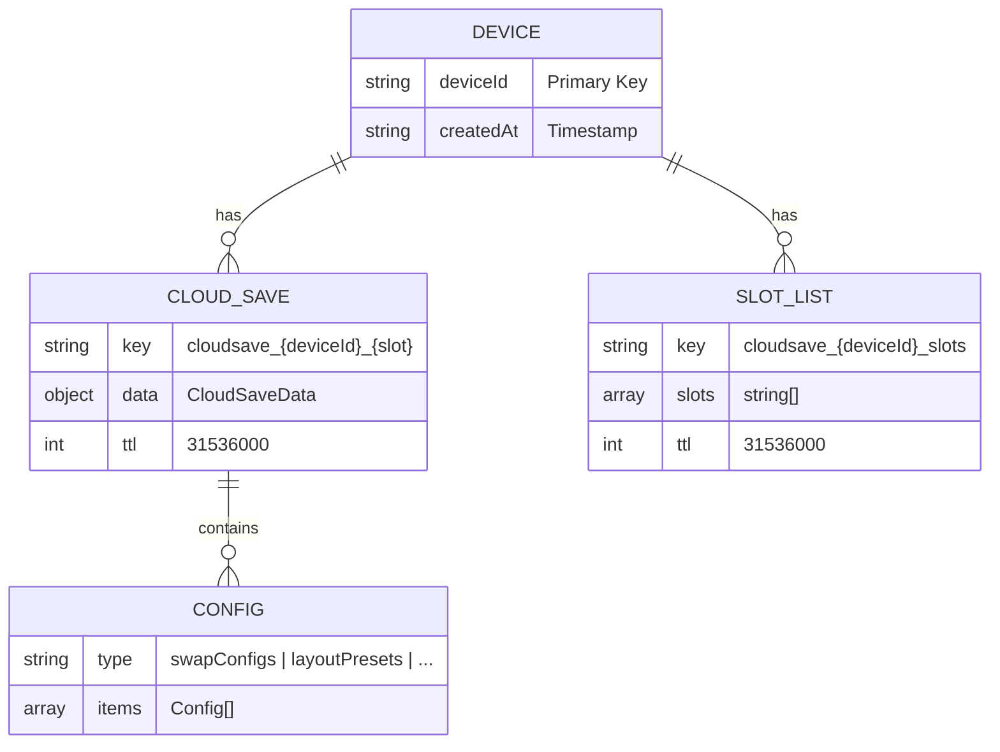
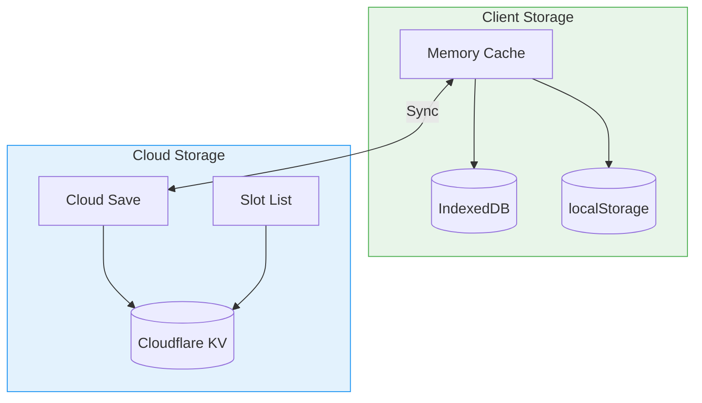
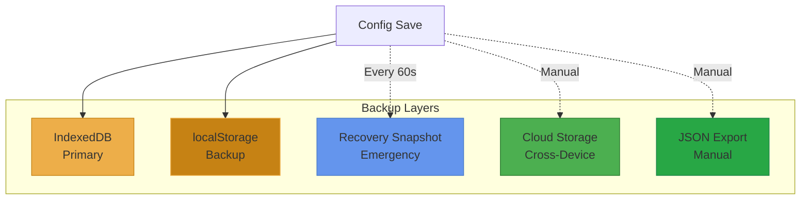

# Strixun Stream Suite - Database Schema

> **Complete database and storage schema documentation**

This document provides detailed schemas for all storage systems used in Strixun Stream Suite.

---

## Table of Contents

1. [Local Storage Schema](#local-storage-schema)
2. [Cloud Storage Schema](#cloud-storage-schema)
3. [Cache Schema](#cache-schema)
4. [Data Relationships](#data-relationships)
5. [Migration Guide](#migration-guide)

---

## Local Storage Schema

### IndexedDB Database

**Database Name:** `StrixunStreamSuite`  
**Version:** `1`  
**Object Store:** `settings`



**IndexedDB Record Structure:**

```typescript
interface IDBRecord {
    key: string;      // Storage key (without prefix)
    value: any;       // Stored value (JSON-serializable)
}
```

### Storage Keys Reference

All keys are prefixed with `sss_` in localStorage, but stored without prefix in IndexedDB.

#### Configuration Keys

| Key | Type | Description | Example |
|-----|------|-------------|---------|
| `swapConfigs` | `SwapConfig[]` | Source swap configurations | `[{id: "swap1", sourceA: "Webcam", ...}]` |
| `textCyclerConfigs` | `TextCyclerConfig[]` | Text cycler configurations | `[{id: "cycler1", texts: [...], ...}]` |
| `clipsConfigs` | `ClipsConfig[]` | Twitch clips player configurations | `[{id: "clips1", channel: "ninja", ...}]` |
| `sourceOpacityConfigs` | `Record<string, number>` | Source opacity settings | `{"Webcam": 100, "Overlay": 80}` |
| `layoutPresets` | `LayoutPreset[]` | Layout preset configurations | `[{id: "layout1", sources: [...], ...}]` |

#### System Keys

| Key | Type | Description | Example |
|-----|------|-------------|---------|
| `obs_connection` | `object` | OBS WebSocket connection settings | `{host: "localhost", port: 4455, password: ""}` |
| `ui_state` | `object` | UI state (active tab, etc.) | `{activeTab: "dashboard", ...}` |
| `sss_device_id` | `string` | Cloud storage device identifier | `"sss_1234567890_abcdefghij"` |
| `sss_auto_sync_enabled` | `boolean` | Auto-sync preference | `true` |
| `sss_last_cloud_sync` | `string` | Last sync timestamp (ISO 8601) | `"2024-12-22T10:30:00.000Z"` |
| `sss_recovery_snapshot` | `object` | Emergency recovery snapshot | `{swapConfigs: [...], textCyclerConfigs: [...]}` |

### localStorage Structure

**Prefix:** `sss_`

**Storage Pattern:**
```javascript
localStorage.setItem('sss_swapConfigs', JSON.stringify([...]));
localStorage.setItem('sss_textCyclerConfigs', JSON.stringify([...]));
// etc.
```

**Recovery Snapshot:**
- Key: `sss_recovery_snapshot`
- Auto-saved every 60 seconds
- Contains critical configs only
- Used for emergency recovery

### Data Type Definitions

#### SwapConfig

```typescript
interface SwapConfig {
    id: string;                    // Unique identifier (UUID or timestamp-based)
    name?: string;                 // Display name (optional)
    sourceA: string;               // First source name (OBS source name)
    sourceB: string;               // Second source name (OBS source name)
    hotkey?: string;                // OBS hotkey identifier (optional)
    enabled: boolean;               // Whether swap is active
    scene?: string;                 // Scene name (optional, for scene-specific swaps)
}
```

**Example:**
```json
{
  "id": "swap_1703234567890",
  "name": "Webcam ↔ Game Swap",
  "sourceA": "Webcam",
  "sourceB": "Game Capture",
  "hotkey": "OBS_KEY_F1",
  "enabled": true
}
```

#### LayoutPreset

```typescript
interface LayoutPreset {
    id: string;                     // Unique identifier
    name: string;                   // Display name
    scene: string;                   // OBS scene name
    sources: Array<{                 // Source positions and states
        name: string;                // Source name
        x: number;                   // X position (pixels)
        y: number;                   // Y position (pixels)
        width: number;               // Width (pixels)
        height: number;              // Height (pixels)
        visible: boolean;            // Visibility state
        rotation?: number;           // Rotation in degrees (optional)
        scaleX?: number;             // X scale factor (optional)
        scaleY?: number;             // Y scale factor (optional)
    }>;
    animationDuration?: number;     // Animation duration in milliseconds
    staggerDelay?: number;          // Delay between source animations (ms)
    hotkey?: string;                 // OBS hotkey identifier (optional)
    createdAt?: string;              // ISO 8601 timestamp
    updatedAt?: string;              // ISO 8601 timestamp
}
```

**Example:**
```json
{
  "id": "layout_1703234567890",
  "name": "Gaming Layout",
  "scene": "Main Scene",
  "sources": [
    {
      "name": "Game Capture",
      "x": 0,
      "y": 0,
      "width": 1920,
      "height": 1080,
      "visible": true
    },
    {
      "name": "Webcam",
      "x": 1600,
      "y": 800,
      "width": 320,
      "height": 180,
      "visible": true
    }
  ],
  "animationDuration": 500,
  "staggerDelay": 50
}
```

#### TextCyclerConfig

```typescript
interface TextCyclerConfig {
    id: string;                     // Unique identifier
    name: string;                   // Display name
    texts: string[];                 // Array of text strings to cycle
    interval: number;                // Cycle interval in milliseconds
    transition: 'none' | 'obfuscate' | 'typewriter' | 'glitch' | 'scramble' | 'wave' | 'fade' | 'slide' | 'pop';
    enabled: boolean;                // Whether cycler is active
    sourceName?: string;             // OBS text source name (legacy mode)
    displayMode?: 'browser' | 'obs'; // Display mode
}
```

**Example:**
```json
{
  "id": "cycler_1703234567890",
  "name": "Social Media Links",
  "texts": [
    "@twitch_username",
    "@twitter_handle",
    "youtube.com/channel/..."
  ],
  "interval": 10000,
  "transition": "typewriter",
  "enabled": true,
  "displayMode": "browser"
}
```

#### ClipsConfig

```typescript
interface ClipsConfig {
    id: string;                     // Unique identifier
    name: string;                   // Display name
    channel: string;                 // Twitch channel name
    limit: number;                   // Max clips to fetch (1-100)
    shuffle: boolean;                // Randomize clip order
    startDate?: string;              // ISO 8601 start date (optional)
    endDate?: string;                // ISO 8601 end date (optional)
    preferFeatured: boolean;         // Prioritize featured clips
    theme?: string;                  // Player theme (optional)
    autoplay: boolean;               // Auto-play clips
    loop: boolean;                   // Loop playlist
    volume?: number;                 // Volume (0-100, optional)
}
```

**Example:**
```json
{
  "id": "clips_1703234567890",
  "name": "Best Clips",
  "channel": "ninja",
  "limit": 20,
  "shuffle": true,
  "preferFeatured": true,
  "autoplay": true,
  "loop": true,
  "volume": 80
}
```

---

## Cloud Storage Schema

### Cloudflare KV Structure

**Namespace:** `TWITCH_CACHE`  
**Namespace ID:** `66b9a4425cb7492fbae8f690780cd0ae`



### Cloud Save Key Pattern

**Format:** `cloudsave_{deviceId}_{slot}`

**Examples:**
- `cloudsave_sss_1234567890_abcdefghij_default`
- `cloudsave_sss_1234567890_abcdefghij_backup1`
- `cloudsave_sss_1234567890_abcdefghij_autosave`

### Slot List Key Pattern

**Format:** `cloudsave_{deviceId}_slots`

**Example:**
- `cloudsave_sss_1234567890_abcdefghij_slots`

**Value:** JSON array of slot names
```json
["default", "backup1", "backup2", "autosave"]
```

### Cloud Save Data Structure

```typescript
interface CloudSaveData {
    version: number;              // Schema version (currently 2)
    deviceId: string;             // Device identifier
    slot: string;                 // Save slot name
    timestamp: string;            // ISO 8601 timestamp
    userAgent: string;            // Browser user agent
    configs: {
        swapConfigs?: SwapConfig[];
        layoutPresets?: LayoutPreset[];
        textCyclerConfigs?: TextCyclerConfig[];
        clipsConfigs?: ClipsConfig[];
        sourceOpacityConfigs?: Record<string, number>;
    };
    metadata?: {
        source?: 'manual' | 'autosave';
        note?: string;
        description?: string;
        configCounts?: {
            swapConfigs?: number;
            layoutPresets?: number;
            textCyclerConfigs?: number;
            clipsConfigs?: number;
        };
    };
}
```

**Example Cloud Save:**
```json
{
  "version": 2,
  "deviceId": "sss_1234567890_abcdefghij",
  "slot": "default",
  "timestamp": "2024-12-22T10:30:00.000Z",
  "userAgent": "Mozilla/5.0 (Windows NT 10.0; Win64; x64) AppleWebKit/537.36",
  "configs": {
    "swapConfigs": [
      {
        "id": "swap_1703234567890",
        "sourceA": "Webcam",
        "sourceB": "Game Capture",
        "enabled": true
      }
    ],
    "layoutPresets": [
      {
        "id": "layout_1703234567890",
        "name": "Gaming Layout",
        "scene": "Main Scene",
        "sources": [...]
      }
    ],
    "textCyclerConfigs": [],
    "clipsConfigs": [],
    "sourceOpacityConfigs": {}
  },
  "metadata": {
    "source": "manual",
    "note": "Main streaming setup",
    "description": "My primary configuration",
    "configCounts": {
      "swapConfigs": 1,
      "layoutPresets": 1,
      "textCyclerConfigs": 0,
      "clipsConfigs": 0
    }
  }
}
```

---

## Cache Schema

### Cloudflare KV Cache Keys

#### Twitch API Cache

| Key Pattern | Type | TTL | Description |
|-------------|------|-----|-------------|
| `app_access_token` | `string` | 4 hours (14400s) | Twitch OAuth app access token |
| `user_id_{username}` | `string` | 24 hours (86400s) | Twitch user ID by username |
| `game_{gameId}` | `JSON` | 7 days (604800s) | Game data by game ID |

**Examples:**
- `app_access_token` → `"abc123def456..."`
- `user_id_ninja` → `"123456789"`
- `game_33214` → `{"id": "33214", "name": "Fortnite", ...}`

### Cache Key Generation

```mermaid
flowchart LR
    A[Request] --> B{Request Type}
    B -->|User Lookup| C[user_id_{lowercase_username}]
    B -->|Game Lookup| D[game_{gameId}]
    B -->|Token| E[app_access_token]
    
    C --> F[Check KV]
    D --> F
    E --> F
    
    F -->|Hit| G[Return Cached]
    F -->|Miss| H[Fetch from API]
    H --> I[Store in KV]
    I --> J[Return Data]
    
    style F fill:#fff3e0,stroke:#ff9800
    style G fill:#e8f5e9,stroke:#4caf50
    style H fill:#e3f2fd,stroke:#2196f3
```

---

## Data Relationships

### Entity Relationship Diagram



### Data Flow Diagram



---

## Migration Guide

### Schema Version History

| Version | Date | Changes |
|--------|------|---------|
| 1 | Initial | Basic cloud save structure |
| 2 | 2024-12-22 | Added metadata, config counts, improved structure |

### Version 1 → Version 2 Migration

**Changes:**
- Added `metadata` object with `source`, `note`, `description`, `configCounts`
- Improved timestamp format (ISO 8601)
- Added `userAgent` field

**Migration Script:**
```javascript
function migrateV1ToV2(v1Data) {
    return {
        version: 2,
        deviceId: v1Data.deviceId,
        slot: v1Data.slot,
        timestamp: v1Data.timestamp || new Date().toISOString(),
        userAgent: navigator.userAgent,
        configs: v1Data.configs,
        metadata: {
            source: 'manual',
            configCounts: {
                swapConfigs: v1Data.configs.swapConfigs?.length || 0,
                layoutPresets: v1Data.configs.layoutPresets?.length || 0,
                textCyclerConfigs: v1Data.configs.textCyclerConfigs?.length || 0,
                clipsConfigs: v1Data.configs.clipsConfigs?.length || 0
            }
        }
    };
}
```

### Local Storage Migration

**No migration needed** - Local storage is backward compatible. New fields are optional.

---

## Storage Limits

### Local Storage

| Storage Type | Limit | Notes |
|-------------|-------|-------|
| IndexedDB | ~50MB (browser dependent) | Usually sufficient for configs |
| localStorage | ~5-10MB (browser dependent) | Used as backup only |
| Recovery Snapshot | ~1MB | Critical configs only |

### Cloud Storage

| Storage Type | Limit | Notes |
|-------------|-------|-------|
| Per Save | 10MB | JSON payload size limit |
| Total Saves | Unlimited | Per device, limited by Cloudflare KV quota |
| KV Namespace | 25MB per value | Worker enforces 10MB limit for safety |
| TTL | 1 year (31536000s) | Auto-expires, renewed on save |

### Best Practices

1. **Keep configs lean** - Don't store large binary data
2. **Use multiple slots** - Split large configs across slots
3. **Regular cleanup** - Delete unused saves
4. **Monitor size** - Check save size before uploading

---

## Indexes & Performance

### IndexedDB Indexes

Currently, IndexedDB uses a simple key-value store with no additional indexes. The `key` field is the primary key.

**Future Optimization:**
- Add index on `timestamp` for sorting
- Add index on `type` for filtering configs

### KV Query Patterns

**Current Patterns:**
- Direct key lookup (O(1))
- Slot list iteration for listing saves

**Optimization Opportunities:**
- Batch operations for multiple saves
- Parallel reads for slot metadata

---

## Backup & Recovery

### Backup Strategy



### Recovery Process

1. **On Page Load:**
   - Try IndexedDB first
   - Fall back to localStorage
   - Check recovery snapshot
   - Offer cloud restore if all empty

2. **Manual Recovery:**
   - Import from JSON file
   - Load from cloud storage
   - Restore from recovery snapshot

---

*For API usage, see [API_REFERENCE.md](../06_API_REFERENCE/API_REFERENCE.md)*  
*For architecture details, see [TECHNICAL_ARCHITECTURE.md](../02_ARCHITECTURE/TECHNICAL_ARCHITECTURE.md)*
