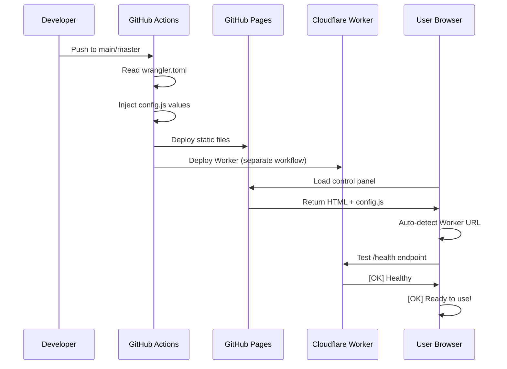
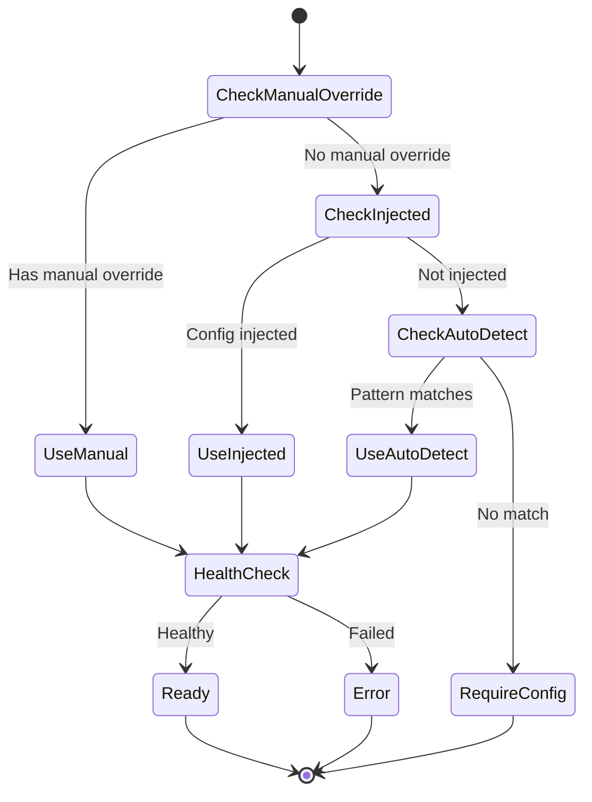

# Auto-Configuration System

## Overview

The Strixun Stream Suite now features an **intelligent auto-configuration system** that eliminates the need for manual URL configuration. The system automatically detects and configures your Cloudflare Worker API URL during GitHub Pages deployment.

## How It Works

### [EMOJI] Priority System

The configuration system uses a **4-tier priority fallback**:

```
1. Manual Override (localStorage)
   
2. Auto-Injected Config (deployment)
   
3. Auto-Detection (pattern matching)
   
4. Null (user configuration required)
```

### [EMOJI] Components

#### 1. `config.js` - Configuration Module

Auto-injected during GitHub Pages deployment with:
- **Worker API URL** - Your Cloudflare Worker endpoint
- **GitHub Pages URL** - Your static site base URL
- **Deployment Metadata** - Timestamp and environment info
- **Feature Flags** - System capabilities

#### 2. GitHub Actions Integration

The `.github/workflows/deploy-pages.yml` workflow:
1. Reads worker name from `wrangler.toml`
2. Constructs the Worker URL: `https://WORKER_NAME.USERNAME.workers.dev`
3. Injects values into `config.js` before deployment
4. Uploads to GitHub Pages

#### 3. Control Panel Integration

The `control_panel.html`:
- Loads `config.js` on startup
- Uses `getClipsApiServer()` to get API URL
- Shows auto-detected URL in Setup tab
- Allows manual override if needed

## [EMOJI] Deployment Flow



## [EMOJI] Configuration Methods

### Method 1: Zero-Config (Recommended)

**Prerequisites:**
- GitHub repository with GitHub Pages enabled
- Cloudflare Worker deployed via GitHub Actions
- Worker name in `wrangler.toml` is `strixun-twitch-api`

**Steps:**
1. Push code to `main` or `master` branch
2. GitHub Actions automatically deploys everything
3. Open control panel from GitHub Pages URL
4. System auto-detects Worker URL
5. [OK] **Done!** No manual configuration needed

**Example URLs:**
```
GitHub Pages:    https://username.github.io/strixun-stream-suite/
Worker Auto-Detected: https://strixun-twitch-api.username.workers.dev
```

### Method 2: Manual Override

**When to use:**
- Custom Worker subdomain
- Testing with local Worker
- Using Workers on custom domain
- Non-standard deployment

**Steps:**
1. Open control panel
2. Go to **Setup** tab  **Twitch API Settings**
3. Enter your Worker URL in **API Server URL** field
4. Click **Save Twitch Settings**
5. [OK] Manual override applied

**Example:**
```
Custom Worker URL: https://api.mystream.com
Local Dev:         http://localhost:8787
```

### Method 3: Environment Variables (Advanced)

**For local development**, create a local `config.js`:

```javascript
window.STRIXUN_CONFIG = {
    WORKER_API_URL: 'http://localhost:8787',
    GITHUB_PAGES_URL: 'http://localhost:8080/',
    DEPLOYED_AT: new Date().toISOString(),
    DEPLOYMENT_ENV: 'local-dev',
    FEATURES: {
        AUTO_CONFIG: true,
        WORKER_HEALTH_CHECK: true,
        CONFIG_VALIDATION: true
    }
};
```

## [EMOJI] Testing & Validation

### Health Check

The system automatically runs a health check on startup:

```javascript
// Check console logs
[Config] Using auto-injected API server: https://...
[OK] Worker API Health Check: PASSED
Worker Info: { status: 'healthy', ... }
```

### Manual Testing

Test the API URL in the Setup tab:
1. Go to **Setup**  **Twitch API Settings**
2. Click **Test API Connection**
3. Verify status message

### Debugging

Enable verbose logging:
```javascript
// In browser console
localStorage.setItem('debug_config', 'true');
location.reload();
```

##  Troubleshooting

### [WARNING] "No API server configured"

**Possible causes:**
- Not deployed via GitHub Actions
- `config.js` injection failed
- Opened files locally (not via HTTP)

**Solutions:**
1. Deploy via GitHub Pages (preferred)
2. Manually configure in Setup tab
3. Check `config.js` was properly injected

### [WARNING] "Worker API Health Check: FAILED"

**Possible causes:**
- Worker not deployed yet
- Incorrect Worker URL
- CORS issues
- Network connectivity

**Solutions:**
1. Verify Worker is deployed: `https://YOUR_WORKER.workers.dev/health`
2. Check Cloudflare dashboard for Worker status
3. Manually override URL in Setup tab
4. Check browser console for detailed errors

### [WARNING] Auto-detected URL is wrong

**Possible causes:**
- Non-standard Worker naming
- Custom subdomain
- Different GitHub organization

**Solutions:**
1. Manually override in Setup tab
2. Update `wrangler.toml` worker name
3. Re-deploy to update auto-detection

## [EMOJI] Security Notes

### No Secrets in config.js

The `config.js` file is **public** and deployed to GitHub Pages. It contains:
- [OK] Worker URL (public endpoint)
- [OK] GitHub Pages URL (public)
- [OK] Deployment metadata (non-sensitive)
- [ERROR] **NO** Twitch secrets
- [ERROR] **NO** API keys
- [ERROR] **NO** credentials

### Secrets Management

All sensitive data is stored:
- **Cloudflare Worker Secrets** - via `wrangler secret put`
- **GitHub Repository Secrets** - for Actions workflows
- **Browser localStorage** - for user-specific data (OAuth tokens)

### CORS Configuration

The Worker includes CORS headers for all origins:
```javascript
'Access-Control-Allow-Origin': '*'
```

This is safe because:
- Worker validates Twitch OAuth tokens
- No sensitive data exposed in responses
- Rate limiting via Cloudflare
- App Access Tokens cached securely in KV

## [EMOJI] Configuration State Diagram



##  Examples

### Example 1: Zero-Config GitHub Pages Deployment

```bash
# 1. Push to GitHub
git push origin main

# 2. GitHub Actions runs
# [OK] Worker deployed to Cloudflare
# [OK] Pages deployed with injected config

# 3. Open in browser
# https://username.github.io/strixun-stream-suite/control_panel.html

# 4. Check console
# [Config] Using auto-injected API server: https://strixun-twitch-api.username.workers.dev
# [OK] Worker API Health Check: PASSED
```

### Example 2: Manual Override for Custom Domain

```javascript
// 1. Deploy Worker to custom domain
// wrangler.toml:
// routes = [{ pattern = "api.mystream.com/*", zone_name = "mystream.com" }]

// 2. In control panel Setup tab:
// API Server URL: https://api.mystream.com

// 3. System uses manual override
// [Config] Using manual API server override: https://api.mystream.com
```

### Example 3: Local Development

```bash
# 1. Start Worker locally
cd twitch_clips_player/serverless
wrangler dev

# 2. Create local config.js
echo 'window.STRIXUN_CONFIG = { WORKER_API_URL: "http://localhost:8787", ... }' > config.js

# 3. Open control panel locally
# http://localhost:8080/control_panel.html

# 4. System uses local Worker
# [Config] Using auto-injected API server: http://localhost:8787
```

## [EMOJI] Migration from Old System

If you have existing configs with per-config `apiServer` fields:

**Before:**
```javascript
{
  id: 'clips_123',
  name: 'My Clips',
  apiServer: 'https://my-worker.workers.dev', // [ERROR] Removed
  channels: 'shroud,xqc',
  ...
}
```

**After:**
```javascript
{
  id: 'clips_123',
  name: 'My Clips',
  // apiServer removed - now global config
  channels: 'shroud,xqc',
  ...
}
```

**Migration is automatic!** Old configs will still work:
- Per-config `apiServer` ignored
- Global config from Setup tab used instead
- No data loss

## [EMOJI] Related Documentation

- [GitHub Actions Deployment](../.github/workflows/deploy-pages.yml)
- [Cloudflare Worker Setup](../twitch_clips_player/serverless/SETUP.md)
- [Control Panel Documentation](../README.md)
- [Architecture Overview](../ARCHITECTURE.md)

##  Contributing

To improve the auto-configuration system:

1. **Update detection logic** - `config.js`  `getWorkerApiUrl()`
2. **Add new injection values** - `.github/workflows/deploy-pages.yml`
3. **Enhance validation** - `config.js`  `testWorkerApi()`
4. **Test thoroughly** - Local dev  GitHub Pages  Custom domains

---

**[EMOJI] Pro Tip:** The auto-configuration system is designed to "just work" for 95% of users. If you're in the 5% with custom needs, the manual override system gives you full control!

