# Strixun Stream Suite - Deployment Guide

> **Complete deployment and operations documentation**

This document covers deployment procedures, CI/CD workflows, environment configuration, and operational procedures.

---

## Table of Contents

1. [Deployment Overview](#deployment-overview)
2. [GitHub Actions Workflows](#github-actions-workflows)
3. [Cloudflare Worker Deployment](#cloudflare-worker-deployment)
4. [GitHub Pages Deployment](#github-pages-deployment)
5. [Environment Configuration](#environment-configuration)
6. [Monitoring & Operations](#monitoring--operations)
7. [Troubleshooting](#troubleshooting)

---

## Deployment Overview

Strixun Stream Suite uses a **dual-deployment strategy**:

1. **Frontend (Static Assets)** [EMOJI] GitHub Pages
2. **Backend (API)** [EMOJI] Cloudflare Workers

```mermaid
flowchart TB
    subgraph Source["Source Code"]
        REPO[GitHub Repository]
    end
    
    subgraph CI["CI/CD Pipeline"]
        ACTIONS[GitHub Actions]
        BUILD[Build Process]
    end
    
    subgraph Frontend["Frontend Deployment"]
        PAGES[GitHub Pages]
        CF_PAGES[Cloudflare Pages<br/>Optional]
    end
    
    subgraph Backend["Backend Deployment"]
        WORKER[Cloudflare Worker]
        KV[(Cloudflare KV)]
    end
    
    REPO --> ACTIONS
    ACTIONS --> BUILD
    BUILD --> PAGES
    BUILD --> WORKER
    WORKER --> KV
    
    style Source fill:#24292e,stroke:#0366d6
    style CI fill:#2088ff,stroke:#0052cc
    style Frontend fill:#28a745,stroke:#1e8449
    style Backend fill:#f38020,stroke:#fa8e39
```



---

## GitHub Actions Workflows

### Workflow: Deploy to GitHub Pages

**File:** `.github/workflows/deploy-pages.yml`

**Triggers:**
- Push to `main` or `master` branch
- Manual workflow dispatch
- Excludes changes to `serverless/**`

**Steps:**


**Configuration Injection:**

The workflow automatically injects configuration into `config.js`:

```javascript
// Before deployment
const WORKER_API_URL = '%%WORKER_API_URL%%';
const GITHUB_PAGES_URL = '%%GITHUB_PAGES_URL%%';
const TWITCH_CLIENT_ID = '%%TWITCH_CLIENT_ID%%';

// After deployment
const WORKER_API_URL = 'https://strixun-twitch-api.your-name.workers.dev';
const GITHUB_PAGES_URL = 'https://username.github.io/repo-name/';
const TWITCH_CLIENT_ID = 'your_client_id';
```

**Required Secrets:**

| Secret | Description | How to Get |
|--------|-------------|------------|
| `TWITCH_CLIENT_ID` | Twitch app client ID | [Twitch Developer Console](https://dev.twitch.tv/console/apps) |
| `CF_WORKERS_SUBDOMAIN` | Cloudflare Workers subdomain | Cloudflare Dashboard [EMOJI] Workers [EMOJI] Overview |

**Workflow Output:**

- Deploys to: `https://{username}.github.io/{repo-name}/`
- Control Panel: `{pages-url}/control_panel.html`
- Clips Player: `{pages-url}/twitch_clips_player/clips.html`

---

### Workflow: Deploy Twitch API Proxy

**File:** `.github/workflows/deploy-twitch-api.yml`

**Triggers:**
- Push to `main` or `master` with changes to `serverless/**`
- Manual workflow dispatch

**Steps:**


**Required Secrets:**

| Secret | Description | How to Get |
|--------|-------------|------------|
| `CF_API_TOKEN` | Cloudflare API token | [Cloudflare Dashboard](https://dash.cloudflare.com/profile/api-tokens) [EMOJI] Create Token [EMOJI] "Edit Workers" template |
| `CF_ACCOUNT_ID` | Cloudflare account ID | Cloudflare Dashboard [EMOJI] Workers [EMOJI] Overview (right sidebar) |
| `TWITCH_CLIENT_ID` | Twitch app client ID | [Twitch Developer Console](https://dev.twitch.tv/console/apps) |
| `TWITCH_CLIENT_SECRET` | Twitch app client secret | [Twitch Developer Console](https://dev.twitch.tv/console/apps) [EMOJI] Your App [EMOJI] New Secret |

**Deployment Process:**

1. **Deploy Worker Code:**
   ```bash
   wrangler deploy
   ```

2. **Set Secrets:**
   ```bash
   echo "$TWITCH_CLIENT_ID" | wrangler secret put TWITCH_CLIENT_ID
   echo "$TWITCH_CLIENT_SECRET" | wrangler secret put TWITCH_CLIENT_SECRET
   ```

**Worker URL:**
```
https://strixun-twitch-api.{subdomain}.workers.dev
```

---

### Workflow: Release

**File:** `.github/workflows/release.yml`

**Triggers:**
- Push to `main` or `master` branch

**Purpose:**
- Creates GitHub releases
- Generates release archives
- Publishes to GitHub Releases

**Steps:**


**Release Artifact:**
- File: `strixun-stream-suite.zip`
- Excludes: `node_modules`, `.git`, `serverless/`, dev files
- Includes: All Lua scripts, HTML files, assets

**Download URL:**
```
https://github.com/{owner}/{repo}/releases/latest/download/strixun-stream-suite.zip
```

---

## Cloudflare Worker Deployment

### Prerequisites

1. **Cloudflare Account**
   - Sign up at [cloudflare.com](https://cloudflare.com)
   - Free tier is sufficient

2. **Wrangler CLI**
   ```bash
   npm install -g wrangler
   ```

3. **Cloudflare Login**
   ```bash
   wrangler login
   ```

### Manual Deployment

#### Step 1: Navigate to Serverless Directory

```bash
cd serverless
```

#### Step 2: Install Dependencies

```bash
npm install
```

#### Step 3: Create KV Namespace (if not exists)

```bash
wrangler kv namespace create "TWITCH_CACHE"
```

**Output:**
```
[EMOJI]  Creating namespace with title "TWITCH_CACHE"
[FEATURE]  Success!
Add the following to your configuration file in your kv_namespaces array:
{ binding = "TWITCH_CACHE", id = "66b9a4425cb7492fbae8f690780cd0ae" }
```

**Update `wrangler.toml`** with the returned ID if different.

#### Step 4: Set Secrets

```bash
wrangler secret put TWITCH_CLIENT_ID
# Enter your Twitch client ID when prompted

wrangler secret put TWITCH_CLIENT_SECRET
# Enter your Twitch client secret when prompted
```

#### Step 5: Deploy

```bash
wrangler deploy
```

**Output:**
```
[FEATURE]  Compiled Worker successfully
[FEATURE]  Successfully published your Worker to the following routes:
  - strixun-twitch-api.your-name.workers.dev
```

### Automated Deployment (GitHub Actions)

The workflow automatically handles deployment when you push to `main` or `master` with changes to `serverless/**`.

**No manual steps required** - just ensure secrets are configured in GitHub.

---

## GitHub Pages Deployment

### Prerequisites

1. **GitHub Repository**
   - Public or private repository
   - GitHub Pages enabled

2. **Repository Settings**
   - Settings [EMOJI] Pages [EMOJI] Source: **GitHub Actions**

### Automatic Deployment

The `deploy-pages.yml` workflow automatically deploys on push to `main` or `master`.

**No manual steps required** - just push your code.

### Manual Deployment

If you need to deploy manually:

1. **Enable GitHub Pages:**
   - Repository Settings [EMOJI] Pages
   - Source: **GitHub Actions**

2. **Trigger Workflow:**
   - Actions tab [EMOJI] "Deploy to GitHub Pages" [EMOJI] Run workflow

### Custom Domain (Optional)

1. **Add CNAME file** to repository root:
   ```
   your-domain.com
   ```

2. **Configure DNS:**
   - Add CNAME record pointing to `{username}.github.io`

3. **Update GitHub Pages settings:**
   - Settings [EMOJI] Pages [EMOJI] Custom domain

---

## Environment Configuration

### Development Environment

**Local OBS Setup:**
- OBS Studio installed
- WebSocket server enabled (port 4455)
- Control panel loaded as Custom Browser Dock

**Local Worker Development:**
```bash
cd serverless
wrangler dev
```

**Worker URL:** `http://localhost:8787`

### Staging Environment

**GitHub Pages Preview:**
- Deploy to preview branch
- Access via preview URL

**Worker Preview:**
```bash
wrangler dev --remote
```

### Production Environment

**GitHub Pages:**
- Auto-deployed from `main` branch
- URL: `https://{username}.github.io/{repo}/`

**Cloudflare Worker:**
- Auto-deployed via GitHub Actions
- URL: `https://strixun-twitch-api.{subdomain}.workers.dev`

---

## Monitoring & Operations

### Cloudflare Worker Monitoring

#### View Logs

```bash
wrangler tail
```

**Real-time logs** from production worker.

#### Check Worker Status

```bash
wrangler deployments list
```

**View deployment history.**

#### Health Check

```bash
curl https://strixun-twitch-api.{subdomain}.workers.dev/health
```

**Expected Response:**
```json
{
  "status": "ok",
  "message": "Strixun Stream Suite API is running",
  "features": ["twitch-api", "cloud-storage"],
  "timestamp": "2024-12-22T10:30:00.000Z"
}
```

### GitHub Pages Monitoring

#### Check Deployment Status

1. Go to **Actions** tab in GitHub
2. View latest "Deploy to GitHub Pages" workflow run
3. Check for errors or warnings

#### View Site

Visit: `https://{username}.github.io/{repo}/`

### Key Metrics to Monitor

| Metric | How to Check | Target |
|--------|--------------|--------|
| Worker Uptime | Cloudflare Dashboard | > 99.9% |
| API Response Time | `wrangler tail` | < 200ms |
| Deployment Success Rate | GitHub Actions | 100% |
| Error Rate | `wrangler tail` | < 1% |

---

## Troubleshooting

### Deployment Issues

#### Worker Deployment Fails

**Error:** `Error: Failed to publish`
- **Solution:** Check `CF_API_TOKEN` and `CF_ACCOUNT_ID` secrets
- **Verify:** `wrangler whoami` shows correct account

#### Pages Deployment Fails

**Error:** `Error: Resource not accessible by integration`
- **Solution:** Check repository permissions
- **Verify:** Settings [EMOJI] Actions [EMOJI] General [EMOJI] Workflow permissions

#### Secrets Not Set

**Error:** `Missing required secret: TWITCH_CLIENT_ID`
- **Solution:** Add secrets in GitHub Settings [EMOJI] Secrets and variables [EMOJI] Actions
- **Verify:** Secrets are named exactly as required

### Runtime Issues

#### Worker Returns 500 Errors

**Check:**
1. Worker logs: `wrangler tail`
2. KV namespace binding in `wrangler.toml`
3. Secrets are set: `wrangler secret list`

**Common Causes:**
- Missing KV namespace binding
- Invalid Twitch credentials
- Payload too large (> 10MB)

#### CORS Errors

**Error:** `Access to fetch blocked by CORS policy`
- **Solution:** Update CORS headers in `worker.js`
- **Add domain:** `'Access-Control-Allow-Origin': 'https://your-domain.com'`

#### Cloud Save Fails

**Error:** `Failed to save: API error 500`
- **Check:** Worker logs for specific error
- **Verify:** Device ID format is correct
- **Verify:** Payload size < 10MB

### Configuration Issues

#### Auto-Configuration Not Working

**Symptoms:** Control panel shows placeholder URLs
- **Check:** GitHub Actions workflow ran successfully
- **Verify:** Secrets are set in repository
- **Verify:** `config.js` was updated during deployment

**Manual Override:**
- Go to Setup tab in control panel
- Enter Worker URL manually
- Click "Save Twitch Settings"

---

## Rollback Procedures

### Rollback Worker Deployment

```bash
# List deployments
wrangler deployments list

# Rollback to previous version
wrangler rollback
```

### Rollback GitHub Pages

1. Go to **Actions** tab
2. Find previous successful deployment
3. Click "Re-run workflow"

### Emergency Rollback

If both deployments fail:

1. **Revert Git commit:**
   ```bash
   git revert HEAD
   git push
   ```

2. **Manual deployment:**
   - Deploy worker manually: `wrangler deploy`
   - Deploy pages manually via GitHub Actions UI

---

## Best Practices

### Deployment Checklist

- [ ] All tests pass locally
- [ ] Secrets are configured in GitHub
- [ ] `wrangler.toml` is correct
- [ ] KV namespace exists
- [ ] Worker secrets are set
- [ ] GitHub Pages is enabled
- [ ] Health check passes after deployment

### Pre-Deployment Testing

```bash
# Test worker locally
cd serverless
wrangler dev

# Test in another terminal
curl http://localhost:8787/health
```

### Post-Deployment Verification

1. **Check Worker:**
   ```bash
   curl https://strixun-twitch-api.{subdomain}.workers.dev/health
   ```

2. **Check Pages:**
   - Visit GitHub Pages URL
   - Open control panel
   - Verify auto-configuration

3. **Test Cloud Storage:**
   - Save a test configuration
   - Load it back
   - Verify data integrity

---

## Security Considerations

### Secret Management

- **Never commit secrets** to repository
- **Use GitHub Secrets** for CI/CD
- **Rotate secrets** regularly
- **Limit secret access** to necessary workflows only

### Access Control

- **Cloudflare API Token:** Use "Edit Workers" template (minimal permissions)
- **GitHub Token:** Auto-generated, limited to repository scope
- **Twitch Secrets:** Store securely, rotate if compromised

### Data Protection

- **Device IDs:** Validated server-side
- **Payload Size:** Limited to 10MB
- **CORS:** Configured for specific domains (production)
- **HTTPS:** Enforced for all communications

---

*For architecture details, see [TECHNICAL_ARCHITECTURE.md](./TECHNICAL_ARCHITECTURE.md)*  
*For API reference, see [API_REFERENCE.md](./API_REFERENCE.md)*

