# Strixun Stream Suite - Product Overview

> **For Product Owners, Business Stakeholders, and Non-Technical Users**

Welcome to the Strixun Stream Suite! This document explains what the product does, how it works, and why it matters—in plain language that anyone can understand.

---

## 🎯 What Is Strixun Stream Suite?

**Strixun Stream Suite (SSS)** is a professional streaming toolkit that helps content creators automate and enhance their live streams on platforms like Twitch, YouTube, and more. Think of it as a "smart assistant" for streamers that handles repetitive tasks, creates smooth animations, and keeps everything organized—all while you focus on entertaining your audience.

### The Problem It Solves

Streaming is hard work. Between managing your scenes, switching between layouts, playing clips, and keeping everything visually engaging, there's a lot to juggle. Many streamers spend hours setting up their stream before they even go live, and then struggle to make quick changes during the stream without looking unprofessional.

**Strixun Stream Suite solves this by:**
- **Automating animations** - Sources fade, slide, and animate smoothly without manual work
- **Saving time** - Pre-configured layouts and presets let you switch scenes instantly
- **Enhancing production value** - Professional transitions and effects make your stream look polished
- **Backing up your work** - Cloud storage ensures you never lose your carefully crafted configurations
- **Simplifying complex tasks** - One-click operations replace multi-step manual processes

---

## ❓ How It Works (The Big Picture)

Imagine you're a streamer setting up for a broadcast. Here's how Strixun Stream Suite fits into your workflow:

---

## 🎨 Key Features Explained

### 1. Source Animations ❓

**What it does:** Makes your sources (images, videos, text) animate smoothly when they appear or disappear.

**Why it matters:** Instead of sources just "popping" in and out, they fade, slide, or zoom elegantly. This looks professional and keeps viewers engaged.

**Example use case:** Your webcam fades in smoothly when you switch to a "Just Chatting" scene, instead of suddenly appearing.

### 2. Layout Presets ❓

**What it does:** Saves the exact position and size of all your sources, so you can switch between different layouts instantly.

**Why it matters:** You can have different layouts for different types of content (gaming, chatting, interviews) and switch between them with one click.

**Example use case:** 
- **Layout 1:** Full gameplay screen
- **Layout 2:** Gameplay + chat overlay
- **Layout 3:** Just chatting with webcam

Switch between them instantly during your stream!

### 3. Source Swapping 🔄

**What it does:** Instantly swaps the position and size of two sources with smooth animation.

**Why it matters:** Perfect for switching between two cameras, swapping game feeds, or reorganizing your scene without manual dragging.

**Example use case:** You have two cameras—one for close-up, one for wide shot. With one hotkey, they swap positions smoothly.

### 4. Text Cycler 📝

**What it does:** Cycles through different text messages with animated transitions.

**Why it matters:** Great for rotating announcements, social media handles, or dynamic messages without manually changing text.

**Example use case:** Your "Now Playing" text cycles through your social media links every 10 seconds with a typewriter effect.

### 5. Twitch Clips Player ❓

**What it does:** Automatically plays your best Twitch clips during breaks (BRB screens, starting soon, etc.).

**Why it matters:** Keeps viewers engaged during downtime and showcases your best moments automatically.

**Example use case:** During your "Starting Soon" screen, your top 20 clips play automatically in a shuffled order.

### 6. Cloud Storage ❓❓

**What it does:** Backs up all your configurations to the cloud, so you can access them from any device.

**Why it matters:** 
- Never lose your carefully crafted setups
- Use the same configurations on multiple computers
- Share configurations with team members
- Restore if something goes wrong

**Example use case:** You set up everything on your streaming PC, then load the same exact setup on your laptop for remote streaming.

```mermaid
flowchart LR
    subgraph Device1["💻 Streaming PC"]
        A[Your Configurations]
    end
    
    subgraph Cloud["❓❓ Cloud Storage"]
        B[(Backup Storage)]
    end
    
    subgraph Device2["💻 Laptop"]
        C[Same Configurations]
    end
    
    A -->|Save| B
    B -->|Load| C
    
    style Cloud fill:#e3f2fd,stroke:#2196f3,stroke-width:3px
```

---

## ❓❓ System Architecture (Simplified)

Here's how all the pieces fit together:

---

## ❓ Business Value

### For Individual Streamers

- **Time Savings:** Reduce setup time from hours to minutes
- **Professional Quality:** Elevate production value without expensive equipment
- **Reliability:** Cloud backups ensure you never lose your work
- **Flexibility:** Use the same setup across multiple devices

### For Streaming Teams

- **Consistency:** Share configurations across team members
- **Collaboration:** Team members can load the same layouts and presets
- **Efficiency:** Standardized setups reduce onboarding time

### For Content Creators

- **Engagement:** Smooth animations and transitions keep viewers watching
- **Branding:** Consistent layouts reinforce your brand identity
- **Scalability:** Easy to add new scenes and layouts as you grow

---

## 🎯 Use Cases

### The Gaming Streamer
- **Layout Presets:** Quick switch between "Full Game" and "Game + Chat" layouts
- **Source Animations:** Smooth transitions when showing/hiding overlays
- **Clips Player:** Auto-play best moments during breaks

### The Just Chatting Streamer
- **Text Cycler:** Rotate social media links and announcements
- **Source Swap:** Switch between different camera angles
- **Layout Presets:** Different setups for different conversation topics

### The Multi-Game Streamer
- **Layout Presets:** Different layouts optimized for each game
- **Cloud Storage:** Save game-specific configurations
- **Quick Swaps:** Rapidly reorganize sources when switching games

### The Professional Production
- **Team Collaboration:** Share configurations via cloud storage
- **Consistency:** Standardized layouts across all team members
- **Reliability:** Cloud backups ensure nothing is lost

---

## 🔒 Security & Privacy

**Your data is yours:**
- All configurations are stored locally on your computer
- Cloud backups are encrypted and only accessible with your device ID
- No personal information is collected or shared
- You control your Cloudflare account and can delete data anytime

**No tracking:**
- No analytics or user tracking
- No third-party data sharing
- Privacy-first design

---

## 📊 Success Metrics

How do you know Strixun Stream Suite is working for you?

- **Setup Time:** Reduced from hours to minutes
- **Stream Quality:** Smoother transitions and more professional appearance
- **Viewer Engagement:** Longer watch times due to better production value
- **Reliability:** Zero lost configurations thanks to cloud backups
- **Efficiency:** More time spent streaming, less time spent configuring

---

## 🚀 Getting Started

1. **Download** the suite from GitHub
2. **Install** the scripts in OBS Studio
3. **Open** the control panel as a dock in OBS
4. **Configure** your first layout or animation
5. **Save** to cloud for backup
6. **Stream** with confidence!

For detailed installation instructions, see the [Installation Guide](../README.md#installation).

---

## ❓ Support & Resources

- **Documentation:** All technical details are in the [Technical Documentation](./TECHNICAL_ARCHITECTURE.md)
- **GitHub Issues:** Report bugs or request features
- **Community:** Connect with other users

---

## ❓ Next Steps

Now that you understand what Strixun Stream Suite does, you might want to:

1. **Read the Installation Guide** - Get it set up on your system
2. **Explore Features** - Try each feature to see what works for you
3. **Set Up Cloud Storage** - Protect your configurations
4. **Customize** - Make it your own with your preferred layouts and animations

---

*This document is written for non-technical users. For developers and technical stakeholders, see the [Technical Architecture Documentation](./TECHNICAL_ARCHITECTURE.md).*

