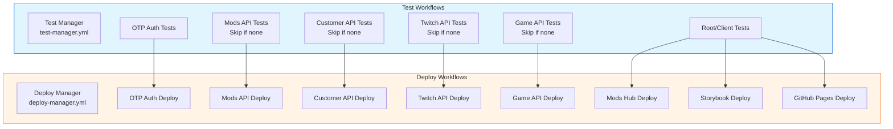

# Test Workflows Documentation

> **Complete guide to the test workflow system for Strixun Stream Suite**

## Overview

The test workflow system ensures that all services are tested before deployment, with proper isolation and rollback protection. Each service has its own independent test workflow that can run separately, preventing cross-service dependencies.

## Architecture



## Test Manager Workflow

**File:** `.github/workflows/test-manager.yml`

### Purpose

Allows manual testing of multiple services with checkboxes, similar to the deploy-manager workflow. Each service's tests run independently to prevent cross-service dependencies.

### Features

- **Service Isolation**: Each service's tests run in separate jobs
- **Automatic Skip**: Services without test scripts are automatically skipped
- **Test Summary**: Comprehensive summary of all test results

### Usage

1. Go to **Actions** ❓ **Test Service(s)**
2. Select which services to test using checkboxes
3. Click **Run workflow**

### Services

- **Root/Client**: Svelte component tests (`pnpm test`)
- **OTP Auth Service**: Unit and integration tests (`pnpm test` in `serverless/otp-auth-service`)
- **Mods API**: Tests if available, otherwise skipped
- **Customer API**: Tests if available, otherwise skipped
- **Twitch API**: Tests if available, otherwise skipped
- **Game API**: Tests if available, otherwise skipped

## Deploy Manager Integration

**File:** `.github/workflows/deploy-manager.yml`

### Test Requirements

Tests are **required** before deployment:

- **OTP Auth Service**: Requires `test_otp_auth` job to pass
- **Mods Hub**: Requires `test_root` job to pass
- **Storybook**: Requires `test_root` job to pass
- **GitHub Pages**: Requires `test_root` job to pass
- **Other Services**: Will require tests when test scripts are added

### Rollback Protection

All deployments include rollback protection:

```yaml
- name: Rollback on Failure
  if: failure()
  run: |
    echo "❌ Deployment failed - manual rollback required"
    echo "Please check Cloudflare dashboard and rollback if needed"
    exit 1
```

**Note**: Automatic rollback is not implemented (requires manual intervention via Cloudflare/GitHub dashboard) to prevent accidental data loss.

## Individual Service Deploy Workflows

Each service has its own deploy workflow that requires tests:

### OTP Auth Service

**File:** `.github/workflows/deploy-otp-auth.yml`

- **Test Job**: `test` - Runs `pnpm test` in `serverless/otp-auth-service`
- **Deploy Job**: `deploy` - Requires `test` job to pass
- **Rollback**: Manual rollback required on failure

### Mods API

**File:** `.github/workflows/deploy-mods-api.yml`

- **Test Job**: `test` - Checks for test script, runs if available, skips if not
- **Deploy Job**: `deploy` - Requires `test` job to pass or skip
- **Rollback**: Manual rollback required on failure

### Customer API

**File:** `.github/workflows/deploy-customer-api.yml`

- **Test Job**: `test` - Checks for test script, runs if available, skips if not
- **Deploy Job**: `deploy` - Requires `test` job to pass or skip
- **Rollback**: Manual rollback required on failure

### Twitch API

**File:** `.github/workflows/deploy-twitch-api.yml`

- **Test Job**: `test` - Checks for test script, runs if available, skips if not
- **Deploy Job**: `deploy` - Requires `test` job to pass or skip
- **Rollback**: Manual rollback required on failure

### Game API

**File:** `.github/workflows/deploy-game-api.yml`

- **Test Job**: `test` - Checks for test script, runs if available, skips if not
- **Deploy Job**: `deploy` - Requires `test` job to pass or skip
- **Rollback**: Manual rollback required on failure

### Frontend Deployments

**Files:**
- `.github/workflows/deploy-mods-hub.yml`
- `.github/workflows/deploy-storybook.yml`
- `.github/workflows/deploy-pages.yml`

- **Test Job**: `test` - Runs `pnpm test` (root/client tests)
- **Deploy Job**: `build`/`deploy` - Requires `test` job to pass
- **Rollback**: Manual rollback required on failure

## Test Script Detection

Services without test scripts are automatically detected and skipped:

```yaml
- name: Check for test script
  id: check_test
  working-directory: serverless/mods-api
  run: |
    if grep -q '"test"' package.json && ! grep -q '"test".*"Error: no test specified"' package.json; then
      echo "has_tests=true" >> $GITHUB_OUTPUT
    else
      echo "has_tests=false" >> $GITHUB_OUTPUT
    fi
```

This allows services to be added to workflows before tests are implemented, and tests will automatically run once test scripts are added.

## Benefits

### 1. Service Isolation

- Each service's tests run independently
- No cross-service dependencies
- One service's test failures don't block others

### 2. Required Checks

- Tests must pass before deployment
- Prevents deploying broken code
- Enforces quality gates

### 3. Rollback Protection

- Failed deployments are clearly marked
- Manual rollback instructions provided
- Prevents partial deployments

### 4. Future-Proof

- Services without tests are automatically skipped
- Tests automatically run when added
- No workflow changes needed when adding tests

## Adding Tests to a Service

When adding tests to a service that doesn't have them yet:

1. Add a `test` script to the service's `package.json`:
   ```json
   {
     "scripts": {
       "test": "vitest run"
     }
   }
   ```

2. The workflow will automatically detect and run the tests
3. No workflow changes needed!

## Workflow Summary

| Workflow | Purpose | Test Requirement |
|----------|---------|------------------|
| `test-manager.yml` | Manual testing of multiple services | N/A (this IS the test workflow) |
| `deploy-manager.yml` | Manual deployment of multiple services | Tests required before deployment |
| `deploy-otp-auth.yml` | Deploy OTP Auth Service | `test` job required |
| `deploy-mods-api.yml` | Deploy Mods API | `test` job required (skip if none) |
| `deploy-customer-api.yml` | Deploy Customer API | `test` job required (skip if none) |
| `deploy-twitch-api.yml` | Deploy Twitch API | `test` job required (skip if none) |
| `deploy-game-api.yml` | Deploy Game API | `test` job required (skip if none) |
| `deploy-mods-hub.yml` | Deploy Mods Hub | `test` job (root/client) required |
| `deploy-storybook.yml` | Deploy Storybook | `test` job (root/client) required |
| `deploy-pages.yml` | Deploy GitHub Pages | `test` job (root/client) required |

## Best Practices

1. **Always run tests before deploying**: Use the test-manager workflow or let deploy workflows handle it
2. **Check test results**: Review test summaries before deploying
3. **Monitor rollback instructions**: If deployment fails, follow rollback instructions
4. **Add tests gradually**: Services can be deployed without tests initially, but tests will be required once added

## Troubleshooting

### Tests are blocking deployment

- **Check test results**: Review the test job output to see what failed
- **Fix tests**: Update code or tests to make them pass
- **Temporary skip**: Not recommended, but you can manually trigger deployment after fixing tests

### Service without tests is being skipped

- This is expected behavior
- Add a test script to `package.json` to enable tests
- Tests will automatically run once added

### Rollback needed

- **Cloudflare Workers**: Go to Cloudflare Dashboard ❓ Workers ❓ Your Worker ❓ Versions ❓ Rollback
- **Cloudflare Pages**: Go to Cloudflare Dashboard ❓ Pages ❓ Your Project ❓ Deployments ❓ Rollback
- **GitHub Pages**: Go to Repository Settings ❓ Pages ❓ Deployments ❓ Rollback

