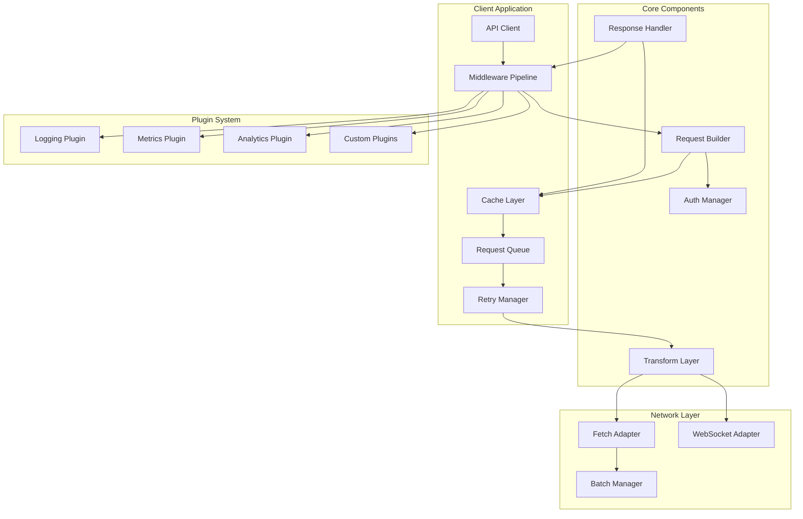

# API Framework Proposal - Facebook/Meta-Level Architecture

> **Comprehensive analysis and proposal for a production-grade, scalable API framework**

## Executive Summary

After auditing the codebase, I've identified significant opportunities to modernize and scale the API architecture. The current implementation uses scattered fetch calls, manual authentication, inconsistent error handling, and lacks many enterprise-grade features. This proposal outlines a Facebook/Meta-level API framework that will handle all current and future API needs with intelligence, dynamism, and scalability.

---

## Table of Contents

1. [Current State Analysis](#current-state-analysis)
2. [Identified Pain Points](#identified-pain-points)
3. [Requirements & Goals](#requirements--goals)
4. [Proposed Architecture](#proposed-architecture)
5. [Core Features](#core-features)
6. [Implementation Plan](#implementation-plan)
7. [Migration Strategy](#migration-strategy)
8. [Technical Specifications](#technical-specifications)

---

## Current State Analysis

### API Endpoints Identified

#### Twitch API Proxy (Cloudflare Worker)
- `GET /clips` - Fetch Twitch clips
- `GET /following` - Get followed channels
- `GET /game` - Get game information
- `GET /user` - Get user information

#### Cloud Storage API
- `POST /cloud/save` - Save configurations
- `GET /cloud/load` - Load configurations
- `GET /cloud/list` - List save slots
- `DELETE /cloud/delete` - Delete save slot
- `POST /cloud-save/save` - Authenticated save (new)
- `GET /cloud-save/load` - Authenticated load (new)
- `GET /cloud-save/list` - Authenticated list (new)
- `DELETE /cloud-save/delete` - Authenticated delete (new)

#### Authentication API
- `POST /auth/request-otp` - Request OTP
- `POST /auth/verify-otp` - Verify OTP
- `GET /auth/me` - Get current user
- `POST /auth/logout` - Logout
- `POST /auth/refresh` - Refresh token

#### Notes/Notebook API
- `POST /notes/save` - Save notes
- `GET /notes/load` - Load notes
- `GET /notes/list` - List notes
- `DELETE /notes/delete` - Delete notes

#### OBS Credentials API
- `POST /obs-credentials/save` - Save OBS credentials
- `GET /obs-credentials/load` - Load OBS credentials
- `DELETE /obs-credentials/delete` - Delete OBS credentials

#### System Endpoints
- `GET /health` - Health check
- `GET /test/email` - Test email
- `POST /debug/clear-rate-limit` - Debug endpoint

#### Chat Signaling API (Separate Worker)
- `POST /signaling/create-room` - Create WebRTC room
- `POST /signaling/join-room` - Join room
- `POST /signaling/offer` - Send WebRTC offer
- `GET /signaling/offer/:roomId` - Get offer
- `POST /signaling/answer` - Send WebRTC answer
- `GET /signaling/answer/:roomId` - Get answer
- `POST /signaling/heartbeat` - Heartbeat
- `GET /signaling/rooms` - List rooms
- `POST /signaling/leave` - Leave room

### Current API Patterns

#### Pattern 1: Direct Fetch (Scattered)
```typescript
// Found in: LoginModal.svelte, various components
const response = await fetch(`${apiUrl}/auth/request-otp`, {
  method: 'POST',
  headers: { 'Content-Type': 'application/json' },
  body: JSON.stringify({ email }),
});
```

#### Pattern 2: Authenticated Fetch (Auth Store)
```typescript
// Found in: src/stores/auth.ts
export async function authenticatedFetch(
  endpoint: string,
  options: RequestInit = {}
): Promise<Response>
```

#### Pattern 3: Cloud Request (Legacy)
```typescript
// Found in: assets/js/cloud-storage.js
async function cloudRequest(endpoint, options = {})
```

#### Pattern 4: WebSocket Communication
```typescript
// Found in: src/modules/websocket.ts
export function request(type: string, data: Record<string, unknown> = {}): Promise<unknown>
```

### Current Authentication Mechanisms

1. **Bearer Token (JWT)** - For authenticated endpoints
2. **CSRF Tokens** - For state-changing operations
3. **Device ID** - For legacy cloud storage
4. **App Access Tokens** - Managed server-side for Twitch API

### Current Caching Strategy

- **Server-side (Worker):**
  - App Access Token: 4 hours (KV)
  - User IDs: 24 hours (KV)
  - Game Data: 7 days (KV)
- **Client-side:** None (manual caching in some components)

### Current Error Handling

- Basic try/catch blocks
- Manual error parsing
- Inconsistent error response formats
- No retry logic
- No error recovery strategies

---

## Identified Pain Points

### ★ Critical Issues

1. **No Request Deduplication**
   - Multiple components can trigger identical requests
   - Wastes bandwidth and API quota

2. **No Automatic Retry Logic**
   - Network failures require manual retry
   - No exponential backoff
   - No circuit breaker pattern

3. **Inconsistent Error Handling**
   - Different error formats across endpoints
   - No centralized error transformation
   - Poor error recovery

4. **No Request Cancellation**
   - Can't cancel in-flight requests
   - Memory leaks from abandoned requests
   - No timeout management

5. **No Response Caching**
   - Every request hits the network
   - No cache invalidation strategy
   - No stale-while-revalidate pattern

6. **Manual Authentication Management**
   - Token refresh handled manually
   - CSRF token extraction is hacky
   - No automatic token rotation

7. **No Request Batching**
   - Multiple sequential requests instead of batching
   - No GraphQL-like query composition
   - Inefficient data fetching

8. **No Type Safety**
   - No TypeScript types for API responses
   - Runtime errors from type mismatches
   - No compile-time validation

### ★ Medium Priority Issues

9. **No Request Prioritization**
   - All requests treated equally
   - No way to prioritize critical requests

10. **No Offline Support**
    - Requests fail immediately when offline
    - No request queue for later sync

11. **No Request Interceptors**
    - Can't add logging, monitoring, or analytics
    - No request transformation pipeline

12. **No Response Transformation**
    - Manual data transformation in components
    - Inconsistent data shapes

13. **No Rate Limiting Awareness**
    - Client doesn't know about rate limits
    - No automatic backoff on 429 errors

14. **No Optimistic Updates**
    - UI waits for server response
    - Poor perceived performance

15. **No Request Queuing**
    - Can't queue requests for later
    - No request prioritization

---

## Requirements & Goals

### Functional Requirements

1. **Unified API Client**
   - Single entry point for all API calls
   - Consistent interface across all endpoints
   - Type-safe request/response handling

2. **Intelligent Request Management**
   - Automatic request deduplication
   - Request batching and debouncing
   - Request prioritization
   - Request cancellation

3. **Resilience & Reliability**
   - Automatic retry with exponential backoff
   - Circuit breaker pattern
   - Request timeout management
   - Offline queue with sync

4. **Performance Optimization**
   - Response caching with smart invalidation
   - Stale-while-revalidate pattern
   - Request deduplication
   - Request batching

5. **Developer Experience**
   - Type-safe API definitions
   - IntelliSense support
   - Clear error messages
   - Easy debugging

6. **Observability**
   - Request/response logging
   - Performance metrics
   - Error tracking
   - Analytics integration

### Non-Functional Requirements

1. **Scalability**
   - Handle thousands of concurrent requests
   - Support multiple API versions
   - Plugin architecture for extensibility

2. **Maintainability**
   - Modular architecture
   - Well-documented
   - Easy to test
   - Clear separation of concerns

3. **Performance**
   - Minimal overhead (< 5ms per request)
   - Efficient memory usage
   - Fast cache lookups

4. **Security**
   - Automatic token refresh
   - CSRF protection
   - Request signing (if needed)
   - Secure credential storage

---

## Proposed Architecture

### High-Level Architecture



### Component Breakdown

#### 1. API Client (Main Entry Point)
- Unified interface for all API calls
- Type-safe method generation
- Request builder pattern

#### 2. Middleware Pipeline
- Request/response interceptors
- Authentication injection
- Error handling
- Logging and monitoring
- Request transformation

#### 3. Cache Layer
- Multi-level caching (memory, IndexedDB)
- Smart invalidation strategies
- Stale-while-revalidate
- Cache versioning

#### 4. Request Queue
- Priority-based queuing
- Offline queue
- Request batching
- Request deduplication

#### 5. Retry Manager
- Exponential backoff
- Circuit breaker
- Retry strategies
- Error recovery

#### 6. Transform Layer
- Request normalization
- Response transformation
- Data validation
- Type coercion

#### 7. Auth Manager
- Token management
- Automatic refresh
- CSRF handling
- Credential storage

#### 8. Plugin System
- Extensible architecture
- Pre-built plugins
- Custom plugin support
- Plugin lifecycle management

---

## Core Features

### 1. Type-Safe API Definitions

```typescript
// Define API schema
const apiSchema = {
  twitch: {
    clips: {
      method: 'GET',
      path: '/clips',
      params: {
        channel: 'string',
        limit: 'number',
        shuffle: 'boolean',
      },
      response: 'ClipResponse',
    },
  },
  cloud: {
    save: {
      method: 'POST',
      path: '/cloud-save/save',
      body: 'CloudSaveRequest',
      response: 'CloudSaveResponse',
      auth: 'required',
    },
  },
};

// Auto-generated type-safe client
const clips = await api.twitch.clips({ channel: 'ninja', limit: 10 });
// TypeScript knows: clips.data is Clip[]
```

### 2. Request Deduplication

```typescript
// Multiple components request same data
api.twitch.clips({ channel: 'ninja' }); // Request 1
api.twitch.clips({ channel: 'ninja' }); // Request 2 (deduplicated)
api.twitch.clips({ channel: 'ninja' }); // Request 3 (deduplicated)

// Only one network request is made
// All promises resolve with same response
```

### 3. Automatic Retry with Exponential Backoff

```typescript
// Configure retry strategy
api.configure({
  retry: {
    maxAttempts: 3,
    backoff: 'exponential',
    retryableErrors: [408, 429, 500, 502, 503, 504],
  },
});

// Automatic retry on network errors
await api.twitch.clips({ channel: 'ninja' });
// Retries automatically with: 1s, 2s, 4s delays
```

### 4. Response Caching

```typescript
// Configure caching
api.configure({
  cache: {
    strategy: 'stale-while-revalidate',
    ttl: 5 * 60 * 1000, // 5 minutes
    maxAge: 10 * 60 * 1000, // 10 minutes
  },
});

// First request: network
const clips1 = await api.twitch.clips({ channel: 'ninja' });

// Second request: cached (instant)
const clips2 = await api.twitch.clips({ channel: 'ninja' });

// After TTL: stale-while-revalidate
// Returns cached data immediately, fetches fresh in background
```

### 5. Request Batching

```typescript
// Multiple requests batched automatically
const [clips, user, game] = await Promise.all([
  api.twitch.clips({ channel: 'ninja' }),
  api.twitch.user({ login: 'ninja' }),
  api.twitch.game({ id: '33214' }),
]);

// Framework batches compatible requests
// Single network round-trip for multiple endpoints
```

### 6. Request Cancellation

```typescript
// Cancel in-flight requests
const controller = new AbortController();
const promise = api.twitch.clips(
  { channel: 'ninja' },
  { signal: controller.signal }
);

// Cancel request
controller.abort();
// Request is cancelled, promise rejects with AbortError
```

### 7. Offline Queue

```typescript
// Queue requests when offline
api.configure({
  offline: {
    enabled: true,
    queueSize: 100,
    syncOnReconnect: true,
  },
});

// Request queued when offline
await api.cloud.save({ configs: {...} });
// Queued automatically, synced when connection restored
```

### 8. Optimistic Updates

```typescript
// Optimistic update with rollback
const result = await api.cloud.save(
  { configs: {...} },
  {
    optimistic: {
      data: { success: true, timestamp: Date.now() },
      rollback: (error) => {
        // Rollback on error
      },
    },
  }
);

// UI updates immediately
// Server response updates when received
// Rollback on error
```

### 9. Request Prioritization

```typescript
// Prioritize critical requests
api.cloud.save(
  { configs: {...} },
  { priority: 'high' }
);

api.twitch.clips(
  { channel: 'ninja' },
  { priority: 'low' }
);

// High priority requests processed first
// Low priority requests can be batched/debounced
```

### 10. Middleware Pipeline

```typescript
// Add custom middleware
api.use((request, next) => {
  // Before request
  console.log('Request:', request);
  
  return next(request).then((response) => {
    // After response
    console.log('Response:', response);
    return response;
  });
});

// Authentication middleware (built-in)
api.use(authMiddleware);
// Logging middleware (built-in)
api.use(loggingMiddleware);
// Metrics middleware (built-in)
api.use(metricsMiddleware);
```

### 11. Error Handling & Recovery

```typescript
// Centralized error handling
api.configure({
  errorHandler: (error, request) => {
    if (error.status === 401) {
      // Auto-refresh token
      return api.auth.refresh().then(() => {
        // Retry original request
        return api.request(request);
      });
    }
    
    if (error.status === 429) {
      // Rate limit: exponential backoff
      return delay(calculateBackoff(error)).then(() => {
        return api.request(request);
      });
    }
    
    // Default error handling
    throw error;
  },
});
```

### 12. WebSocket Integration

```typescript
// Unified API for WebSocket
const ws = api.websocket('ws://localhost:4455');

// Type-safe WebSocket requests
const response = await ws.request('GetSceneList', {});
// TypeScript knows response type

// Automatic reconnection
ws.on('disconnect', () => {
  // Auto-reconnect with exponential backoff
});

// Message queuing when disconnected
ws.send({ type: 'SetSourceVisibility', data: {...} });
// Queued if disconnected, sent on reconnect
```

---

## Implementation Plan

### Phase 1: Core Foundation (Week 1-2)

**Deliverables:**
- API Client base class
- Request/Response types
- Basic middleware system
- Type-safe API schema definition

**Files to Create:**
```
src/core/api/
  ├── client.ts              # Main API client
  ├── types.ts               # Type definitions
  ├── schema.ts              # API schema definitions
  ├── middleware/
  │   ├── index.ts
  │   ├── auth.ts            # Authentication middleware
  │   ├── error.ts           # Error handling middleware
  │   └── transform.ts       # Request/response transformation
  └── utils/
      ├── request-builder.ts
      └── response-handler.ts
```

### Phase 2: Request Management (Week 2-3)

**Deliverables:**
- Request deduplication
- Request queue
- Request cancellation
- Request prioritization

**Files to Create:**
```
src/core/api/
  ├── request/
  │   ├── deduplicator.ts    # Request deduplication
  │   ├── queue.ts           # Request queue
  │   ├── priority.ts        # Priority management
  │   └── cancellation.ts    # Request cancellation
```

### Phase 3: Resilience (Week 3-4)

**Deliverables:**
- Retry manager with exponential backoff
- Circuit breaker
- Request timeout
- Offline queue

**Files to Create:**
```
src/core/api/
  ├── resilience/
  │   ├── retry.ts           # Retry logic
  │   ├── circuit-breaker.ts # Circuit breaker
  │   ├── timeout.ts         # Timeout management
  │   └── offline.ts         # Offline queue
```

### Phase 4: Performance (Week 4-5)

**Deliverables:**
- Multi-level caching
- Cache invalidation
- Stale-while-revalidate
- Request batching

**Files to Create:**
```
src/core/api/
  ├── cache/
  │   ├── memory.ts          # Memory cache
  │   ├── indexeddb.ts       # IndexedDB cache
  │   ├── invalidation.ts    # Cache invalidation
  │   └── strategies.ts      # Caching strategies
  ├── batch/
  │   ├── batcher.ts         # Request batching
  │   └── debouncer.ts       # Request debouncing
```

### Phase 5: Advanced Features (Week 5-6)

**Deliverables:**
- Optimistic updates
- WebSocket integration
- Plugin system
- Observability

**Files to Create:**
```
src/core/api/
  ├── optimistic/
  │   └── updates.ts         # Optimistic updates
  ├── websocket/
  │   ├── client.ts          # WebSocket client
  │   └── adapter.ts         # WebSocket adapter
  ├── plugins/
  │   ├── index.ts
  │   ├── logging.ts         # Logging plugin
  │   ├── metrics.ts         # Metrics plugin
  │   └── analytics.ts       # Analytics plugin
```

### Phase 6: Migration & Testing (Week 6-7)

**Deliverables:**
- Migrate existing API calls
- Comprehensive tests
- Documentation
- Performance benchmarks

**Files to Create:**
```
src/core/api/
  ├── __tests__/            # Test suite
  ├── migrations/           # Migration utilities
  └── docs/                 # API documentation
```

---

## Migration Strategy

### Step 1: Parallel Implementation
- Build new framework alongside existing code
- No breaking changes to current implementation
- Gradual migration path

### Step 2: Feature-by-Feature Migration
1. Start with low-risk endpoints (health, test)
2. Migrate read-only endpoints (GET requests)
3. Migrate write endpoints (POST, PUT, DELETE)
4. Migrate WebSocket communication
5. Remove old implementations

### Step 3: Backward Compatibility
- Maintain old API functions during migration
- Deprecation warnings for old patterns
- Clear migration guide

### Step 4: Testing & Validation
- Comprehensive test coverage
- Performance benchmarks
- Load testing
- Error scenario testing

---

## Technical Specifications

### Type System

```typescript
// API Schema Definition
interface APISchema {
  [namespace: string]: {
    [endpoint: string]: EndpointDefinition;
  };
}

interface EndpointDefinition {
  method: 'GET' | 'POST' | 'PUT' | 'DELETE' | 'PATCH';
  path: string;
  params?: Record<string, ParamDefinition>;
  body?: string; // Type name
  response: string; // Type name
  auth?: 'required' | 'optional' | 'none';
  cache?: CacheConfig;
  retry?: RetryConfig;
}

// Generated Client Types
type APIClient<T extends APISchema> = {
  [K in keyof T]: {
    [E in keyof T[K]]: EndpointClient<T[K][E]>;
  };
};
```

### Middleware System

```typescript
interface Middleware {
  (request: APIRequest, next: NextFunction): Promise<APIResponse>;
}

type NextFunction = (request: APIRequest) => Promise<APIResponse>;

// Middleware execution order
// 1. Request transformation
// 2. Authentication
// 3. Caching (check)
// 4. Request deduplication
// 5. Request queue
// 6. Retry logic
// 7. Network request
// 8. Response transformation
// 9. Caching (store)
// 10. Error handling
```

### Cache Strategy

```typescript
interface CacheConfig {
  strategy: 'network-first' | 'cache-first' | 'stale-while-revalidate';
  ttl: number; // Time to live
  maxAge: number; // Maximum age
  invalidateOn?: string[]; // Invalidate on these mutations
  tags?: string[]; // Cache tags for bulk invalidation
}
```

### Retry Strategy

```typescript
interface RetryConfig {
  maxAttempts: number;
  backoff: 'exponential' | 'linear' | 'fixed';
  initialDelay: number;
  maxDelay: number;
  retryableErrors: number[];
  retryableErrors: (error: APIError) => boolean;
}
```

---

## Success Metrics

### Performance
- **Request Latency:** < 50ms overhead per request
- **Cache Hit Rate:** > 80% for read requests
- **Request Deduplication:** > 30% reduction in network requests
- **Retry Success Rate:** > 95% for transient failures

### Developer Experience
- **Type Safety:** 100% type coverage
- **Code Reduction:** > 40% reduction in API-related code
- **Error Reduction:** > 60% reduction in API-related bugs
- **Developer Satisfaction:** Improved DX metrics

### Reliability
- **Uptime:** 99.9% availability
- **Error Recovery:** > 90% automatic recovery rate
- **Offline Support:** 100% request queue success rate

---

## Next Steps

1. **Review & Approval:** Review this proposal and provide feedback
2. **Architecture Refinement:** Refine architecture based on feedback
3. **Implementation:** Begin Phase 1 implementation
4. **Iterative Development:** Build and test incrementally
5. **Migration:** Gradual migration from old to new system
6. **Documentation:** Comprehensive documentation and examples

---

## Questions for Review

1. **Priority:** Which features are highest priority?
2. **Timeline:** Is the 7-week timeline acceptable?
3. **Breaking Changes:** Are we okay with breaking changes, or need full backward compatibility?
4. **Dependencies:** Any concerns about adding new dependencies?
5. **Testing:** What level of test coverage is required?
6. **Documentation:** What documentation format/style is preferred?

---

**Ready for your review and approval! ★ **

