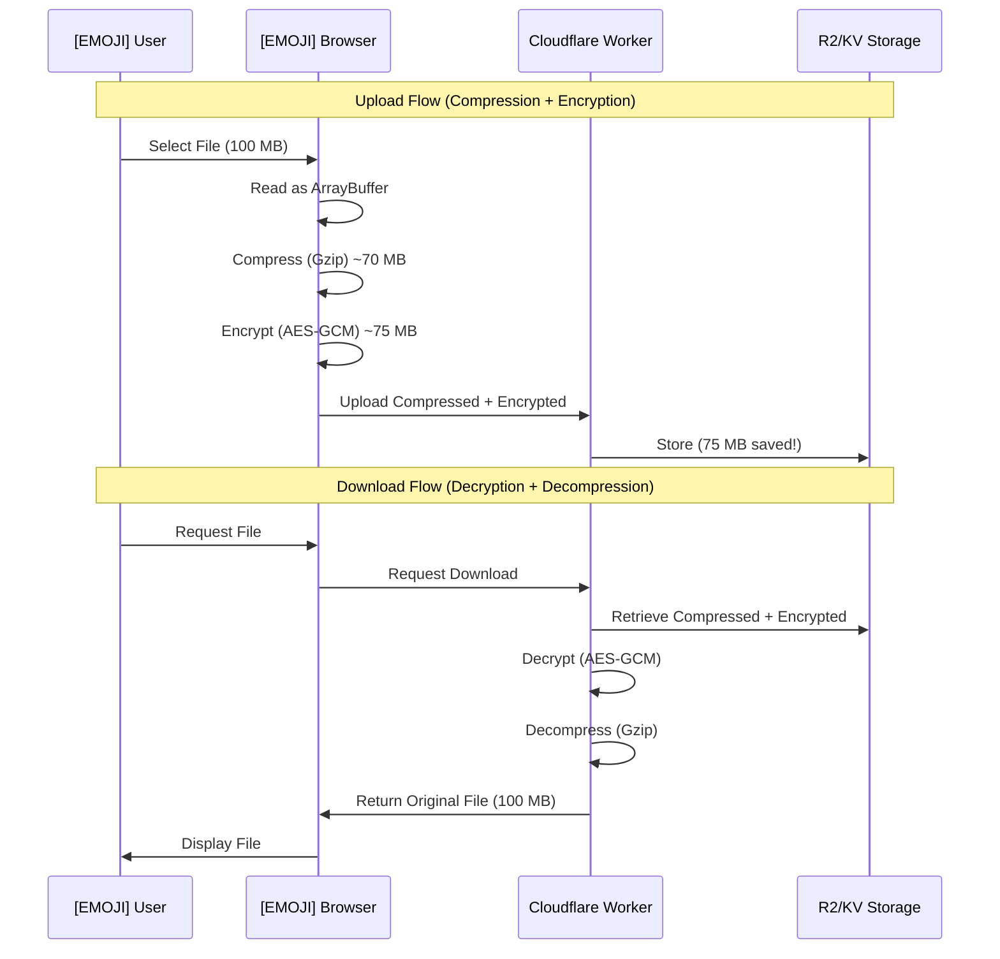

# [EMOJI] Strixun Encryption Suite

> **Your data's personal bodyguard, but cooler and way more reliable.**

Think of encryption like a super-secure lockbox. You put your important stuff inside, lock it with a key that only you have, and even if someone steals the box, they can't get to your stuff without that key. That's what this library does for your data—but with military-grade security and some pretty nifty features that make it perfect for modern applications.

---

## [EMOJI] What's This All About?

In simple terms, this library helps you **protect sensitive information** by scrambling it in a way that only authorized people can unscramble. Whether you're building a web app, an API, or handling files, this suite gives you the tools to keep data safe from prying eyes.

**The best part?** It works everywhere—in your browser, on Cloudflare Workers, and anywhere JavaScript runs. No complicated setup, no headaches—just import and go! [EMOJI]

---

## [FEATURE] Why Should You Care?

### For Non-Technical Folks
- **Your data stays private**: Even if someone intercepts it, they can't read it
- **Only authorized users can access it**: Think of it like a VIP club—you need the right credentials
- **It's automatic**: Once set up, it just works in the background
- **Industry standard**: We use the same encryption methods banks and governments use

### For Developers
- **Zero configuration**: Works out of the box with sensible defaults
- **Type-safe**: Full TypeScript support—your IDE will catch mistakes before runtime
- **Optimized**: Binary encryption reduces storage overhead by 40-45% compared to traditional methods
- **Flexible**: Supports single-party, multi-party, and route-level encryption
- **Battle-tested**: Comprehensive test suite with 39+ tests covering all edge cases

---

## [EMOJI] What Makes This Special?

### 1. **Universal Compatibility** [EMOJI]
Works seamlessly in both browser and server environments. No "works on my machine" moments here!

### 2. **Binary Encryption Magic** [PERF]
Our binary encryption format eliminates the 40-45% overhead from base64 encoding. A 100MB file becomes ~105MB instead of ~145MB. That's like fitting 38% more data in the same storage space!

### 3. **Multi-Party Encryption** [EMOJI]
Need to share data that requires multiple people to unlock? We've got you covered. Perfect for scenarios where you need owner + requester + auditor all to agree before data can be accessed.

### 4. **Order-Independent Decryption** [EMOJI]
With multi-party encryption, it doesn't matter what order people provide their keys. Party A, then B, then C? Sure! C, then A, then B? Also works! This makes it super flexible for real-world scenarios.

### 5. **Automatic Route Encryption** [EMOJI]️
Set it up once, and all your API responses are automatically encrypted. No need to remember to encrypt every endpoint manually.

---

## [EMOJI] Quick Start

### Installation
This package is part of the pnpm workspace and is automatically available to all packages. No installation needed—just import and use!

### Basic Usage (The Simplest Example)

```typescript
import { encryptWithJWT, decryptWithJWT } from '@strixun/api-framework';

// Encrypt some data
const secret = { email: 'user@example.com', creditCard: '****' };
const encrypted = await encryptWithJWT(secret, jwtToken);

// Later, decrypt it
const decrypted = await decryptWithJWT(encrypted, jwtToken);
// Result: { email: 'user@example.com', creditCard: '****' }
```

That's it! Your data is now encrypted and can only be decrypted by someone with the same JWT token. 

---

## [EMOJI] Features Overview

### Core Features

#### 1. **JWT-Based Encryption** [EMOJI]
Encrypt data using a JWT token. Only someone with that exact token can decrypt it.

**Use cases:**
- User-specific data encryption
- API response encryption
- Secure data storage

#### 2. **Binary File Encryption** [EMOJI]
Optimized encryption for files and large binary data. Eliminates base64 overhead.

**Use cases:**
- File uploads (mods, documents, media)
- Large data transfers
- Storage-optimized encryption

**Benefits:**
- 40-45% smaller than base64-encoded encryption
- Direct binary format—no JSON wrapping
- Perfect for R2, S3, or any object storage
- **Default compression enabled** - Maximizes Cloudflare free tier efficiency

**How It Works:**

```mermaid
flowchart TB
    subgraph Client["[EMOJI] Client Browser"]
        A[Original File<br/>100 MB] --> B[Read as ArrayBuffer]
        B --> C[Compress with Gzip<br/>~60-80 MB]
        C --> D[Encrypt with AES-GCM<br/>JWT Token Key]
        D --> E[Compressed + Encrypted<br/>~65-85 MB]
    end
    
    subgraph Network[" Network Transfer"]
        E --> F[Upload to Server<br/>Reduced Bandwidth]
    end
    
    subgraph Server[" Cloudflare Workers"]
        F --> G[Store in R2/KV<br/>Encrypted + Compressed]
    end
    
    style Client fill:#1a1611,stroke:#edae49,stroke-width:2px
    style Network fill:#252017,stroke:#6495ed,stroke-width:2px
    style Server fill:#0f0e0b,stroke:#28a745,stroke-width:2px
    style C fill:#edae49,color:#000
    style D fill:#edae49,color:#000
```



**Download Flow:**

```mermaid
flowchart TB
    subgraph Server[" Cloudflare Workers"]
        A[Retrieve from R2/KV<br/>Compressed + Encrypted] --> B[Decrypt with AES-GCM<br/>JWT Token Key]
        B --> C[Decompress Gzip]
        C --> D[Original File Data]
    end
    
    subgraph Network[" Network Transfer"]
        D --> E[Download to Client<br/>Full Size]
    end
    
    subgraph Client["[EMOJI] Client Browser"]
        E --> F[Display/Use File]
    end
    
    style Server fill:#0f0e0b,stroke:#28a745,stroke-width:2px
    style Network fill:#252017,stroke:#6495ed,stroke-width:2px
    style Client fill:#1a1611,stroke:#edae49,stroke-width:2px
    style B fill:#edae49,color:#000
    style C fill:#edae49,color:#000
```



#### 3. **Multi-Stage Encryption** [EMOJI]
Encrypt data that requires multiple parties (2-10) to decrypt. All parties must provide their keys.

**Use cases:**
- Owner + Requester scenarios
- Owner + Requester + Auditor scenarios
- Any multi-party data sharing

**Key feature:** Order-independent! Parties can provide keys in any order.

#### 4. **Two-Stage Encryption** [EMOJI]
A special case of multi-stage encryption with exactly 2 parties. Backward compatible with existing implementations.

**Use cases:**
- Owner's JWT + Request key
- User + Service encryption

#### 5. **Route-Level Encryption** 
Automatic encryption middleware for API routes. Set policies per route, and encryption happens automatically.

**Use cases:**
- Automatic API response encryption
- Per-route encryption strategies
- Public vs authenticated route handling

---

##  How It Works (Getting Technical)

### Encryption Process (High Level)

1. **You provide data**  The thing you want to protect
2. **You provide a key**  JWT token, request key, or custom key
3. **Library generates random values**  Salt and IV (initialization vector) for security
4. **Library derives encryption key**  Uses PBKDF2 to create a strong key from your key
5. **Library encrypts data**  Uses AES-GCM-256 (military-grade encryption)
6. **Library returns encrypted blob**  Safe to store or transmit

### Decryption Process (High Level)

1. **You provide encrypted data**  The scrambled data
2. **You provide the same key**  Must match the one used for encryption
3. **Library verifies key**  Checks that the key hash matches
4. **Library derives decryption key**  Uses the same process as encryption
5. **Library decrypts data**  Unscrambles your data
6. **Library returns original data**  Your data, safe and sound!

### Security Details (For the Curious)

- **Algorithm**: AES-GCM-256 (Authenticated Encryption)
  - This means it both encrypts AND verifies data integrity
  - If someone tampers with encrypted data, decryption fails
  
- **Key Derivation**: PBKDF2 with SHA-256
  - 100,000 iterations (makes brute-force attacks impractical)
  - Converts your JWT token into a proper encryption key
  
- **Random Values**: 
  - Salt: 16 bytes (unique per encryption)
  - IV: 12 bytes (unique per encryption)
  - These ensure the same data encrypted twice produces different results
  
- **Token Verification**: SHA-256 hash
  - Stored with encrypted data for verification
  - Prevents decryption with wrong token
  - Cannot be used to decrypt (one-way hash)

---

##  API Reference

### Core Functions

#### `encryptWithJWT(data: unknown, token: string): Promise<EncryptedData>`
Encrypts data using a JWT token. Returns a JSON object with encrypted data and metadata.

**Parameters:**
- `data`: Any data you want to encrypt (object, array, string, number, etc.)
- `token`: JWT token (must be at least 10 characters)

**Returns:** Encrypted data structure (version 3 format)

**Example:**
```typescript
const encrypted = await encryptWithJWT(
  { userId: '123', email: 'user@example.com' },
  jwtToken
);
// Returns: { version: 3, encrypted: true, algorithm: 'AES-GCM-256', ... }
```

#### `decryptWithJWT(encryptedData: EncryptedData | unknown, token: string): Promise<unknown>`
Decrypts data using a JWT token. Returns the original data.

**Parameters:**
- `encryptedData`: Encrypted data structure or unencrypted data (for backward compatibility)
- `token`: JWT token (must match the one used for encryption)

**Returns:** Original decrypted data

**Example:**
```typescript
const decrypted = await decryptWithJWT(encrypted, jwtToken);
// Returns: { userId: '123', email: 'user@example.com' }
```

#### `encryptBinaryWithJWT(data: ArrayBuffer | Uint8Array, token: string): Promise<Uint8Array>`
Encrypts binary data directly without base64/JSON overhead. Optimized for file encryption.

**Parameters:**
- `data`: Binary data (ArrayBuffer or Uint8Array)
- `token`: JWT token

**Returns:** Encrypted binary data with minimal header (version 4 format)

**Format:**
```
[4 bytes header][16 bytes salt][12 bytes IV][32 bytes token hash][encrypted data]
```

**Example:**
```typescript
const fileBuffer = await file.arrayBuffer();
const encrypted = await encryptBinaryWithJWT(fileBuffer, jwtToken);
// Returns: Uint8Array with encrypted binary data
```

#### `decryptBinaryWithJWT(encryptedBinary: ArrayBuffer | Uint8Array, token: string): Promise<Uint8Array>`
Decrypts binary encrypted data. Returns original binary data.

**Parameters:**
- `encryptedBinary`: Encrypted binary data (version 4 format)
- `token`: JWT token (must match the one used for encryption)

**Returns:** Decrypted binary data (Uint8Array)

**Example:**
```typescript
const decrypted = await decryptBinaryWithJWT(encryptedBinary, jwtToken);
// Returns: Uint8Array with original file data
```

### Multi-Stage Functions

#### `encryptMultiStage(data: unknown, parties: EncryptionParty[]): Promise<MultiStageEncryptedData>`
Encrypts data with multiple parties (2-10 parties). All parties' keys are required to decrypt.

**Parameters:**
- `data`: Data to encrypt
- `parties`: Array of parties, each with a key and identifier

**Returns:** Multi-stage encrypted data structure

**Example:**
```typescript
const encrypted = await encryptMultiStage(sensitiveData, [
  { id: 'owner', key: ownerJWT, keyType: 'jwt', label: 'Data Owner' },
  { id: 'requester', key: requesterJWT, keyType: 'jwt', label: 'Requester' },
  { id: 'auditor', key: auditorKey, keyType: 'custom', label: 'Auditor' },
]);
```

**Important:** All parties must be known at encryption time. All parties' keys are required for decryption.

#### `decryptMultiStage(encryptedData: MultiStageEncryptedData, parties: EncryptionParty[]): Promise<unknown>`
Decrypts multi-stage encrypted data. Requires ALL parties' keys.

**Parameters:**
- `encryptedData`: Multi-stage encrypted data
- `parties`: Array of parties (order does NOT matter!)

**Returns:** Original decrypted data

**Example:**
```typescript
// Order doesn't matter! These all work:
const decrypted1 = await decryptMultiStage(encrypted, [
  { id: 'owner', key: ownerJWT, keyType: 'jwt' },
  { id: 'requester', key: requesterJWT, keyType: 'jwt' },
  { id: 'auditor', key: auditorKey, keyType: 'custom' },
]);

const decrypted2 = await decryptMultiStage(encrypted, [
  { id: 'auditor', key: auditorKey, keyType: 'custom' }, // Different order!
  { id: 'owner', key: ownerJWT, keyType: 'jwt' },
  { id: 'requester', key: requesterJWT, keyType: 'jwt' },
]);
// Both return the same decrypted data!
```

#### `encryptTwoStage(data: unknown, userToken: string, requestKey: string): Promise<TwoStageEncryptedData>`
Encrypts data with two-stage encryption (backward compatible).

**Parameters:**
- `data`: Data to encrypt
- `userToken`: User's JWT token (stage 1)
- `requestKey`: Request key (stage 2)

**Returns:** Two-stage encrypted data structure

#### `decryptTwoStage(encryptedData: TwoStageEncryptedData, userToken: string, requestKey: string): Promise<unknown>`
Decrypts two-stage encrypted data (backward compatible).

**Parameters:**
- `encryptedData`: Two-stage encrypted data
- `userToken`: User's JWT token
- `requestKey`: Request key

**Returns:** Original decrypted data

### Utility Functions

#### `isMultiEncrypted(data: unknown): boolean`
Checks if data is multi-encrypted.

#### `isDoubleEncrypted(data: unknown): boolean`
Checks if data is double-encrypted (two-stage).

#### `generateRequestKey(): string`
Generates a secure random request key for two-stage encryption.

### Middleware Functions

#### `wrapWithEncryption(handlerResponse: Response, auth: AuthResult): Promise<RouteResult>`
Automatically encrypts a response if JWT token is present.

**Example:**
```typescript
async function handleGetUser(request: Request, env: Env, auth: AuthResult) {
  const user = await getUser(auth.userId, env);
  const response = new Response(JSON.stringify(user));
  return await wrapWithEncryption(response, auth); // Auto-encrypts if token present
}
```

#### `createEncryptionWrapper(handler: Function, options?: EncryptionWrapperOptions): Function`
Creates a wrapper function that automatically encrypts handler responses.

---

##  Architecture Deep Dive

### Multi-Stage Encryption Architecture

Multi-stage encryption uses a **master key approach** for order-independent decryption:

```
┌─────────────────────────────────────────────────────────┐
│                    Encryption Process                     │
├─────────────────────────────────────────────────────────┤
│                                                           │
│  1. Generate random master key                           │
│  2. Encrypt data with master key  Encrypted Data        │
│  3. Encrypt master key with each party's key:            │
│     • Party 1's key  Encrypted Master Key 1             │
│     • Party 2's key  Encrypted Master Key 2             │
│     • Party 3's key  Encrypted Master Key 3             │
│                                                           │
│  Result: Encrypted Data + All Encrypted Master Keys      │
│                                                           │
└─────────────────────────────────────────────────────────┘

┌─────────────────────────────────────────────────────────┐
│                    Decryption Process                     │
├─────────────────────────────────────────────────────────┤
│                                                           │
│  For each party (order doesn't matter!):                 │
│    Encrypted Master Key  [Decrypt with Party's Key]      │
│                         Master Key                       │
│                                                           │
│  Verify ALL parties' master keys match                    │
│                                                           │
│  Once ALL verified:                                       │
│    Master Key  [Decrypt Data]  Original Data           │
│                                                           │
└─────────────────────────────────────────────────────────┘
```

**Key Points:**
- All parties must be known at encryption time
- All parties' keys are required for decryption
- **Decryption order: COMPLETELY ORDER-INDEPENDENT**
- Parties can be provided in any order (matched by key hash)
- Each party can use JWT token, request key, or custom key
- Version 3+ uses order-independent architecture (backward compatible with version 2)

### Binary Encryption Format (Version 5)

Binary encryption uses a compact binary format with **default compression enabled**:

```
┌─────────────────────────────────────────────────────────┐
│              Binary Format Structure (Version 5)          │
├─────────────────────────────────────────────────────────┤
│                                                           │
│  [Header: 5 bytes]                                        │
│    • Version (1 byte): 5                                  │
│    • Compressed Flag (1 byte): 0 or 1                    │
│    • Salt Length (1 byte): 16                             │
│    • IV Length (1 byte): 12                               │
│    • Token Hash Length (1 byte): 32                       │
│                                                           │
│  [Salt: 16 bytes]                                         │
│  [IV: 12 bytes]                                           │
│  [Token Hash: 32 bytes]                                   │
│  [Encrypted Data: variable length]                        │
│    • If compressed: Encrypted(Compressed(Original Data))   │
│    • If not: Encrypted(Original Data)                    │
│                                                           │
│  Total overhead: ~65 bytes + encryption padding           │
│  (vs ~40-45% overhead with base64/JSON)                  │
│                                                           │
└─────────────────────────────────────────────────────────┘
```

**Complete Data Flow:**



**Benefits:**
- Minimal overhead (~5-10% vs 40-45% for base64)
- **Default compression** - Reduces storage by 20-40% for compressible data
- Direct binary storage (no JSON parsing needed)
- Faster encryption/decryption (no base64 conversion)
- Smaller storage footprint - **Maximizes Cloudflare free tier efficiency**
- **Client-side processing** - No server CPU used for compression/encryption on upload

### Version Information

- **Version 3**: JSON-encoded encryption (standard format)
  - Used for: API responses, JSON data, general encryption
  - Format: JSON object with base64-encoded fields
  
- **Version 4**: Binary encryption (optimized format) - **Legacy**
  - Used for: File uploads, binary data, storage optimization
  - Format: Binary with minimal header (no compression)
  
- **Version 5**: Binary encryption with compression (current, default)
  - Used for: File uploads, binary data, storage optimization
  - Format: Binary with compression flag + minimal header
  - **Default compression enabled** - Automatically compresses before encryption
  - Backward compatible with Version 4 (auto-detects format)
  
- **Multi-Stage Version 3+**: Order-independent architecture
  - Used for: Multi-party encryption
  - Feature: Parties can be verified in any order

---

## [EMOJI] Security Best Practices

### Do's [OK]

- **Always use HTTPS** in production (encryption protects data, HTTPS protects the connection)
- **Store JWT tokens securely** (never in localStorage for sensitive apps, use httpOnly cookies when possible)
- **Validate tokens** before using them for encryption
- **Use binary encryption** for files to save storage space
- **Use multi-stage encryption** when multiple parties need to authorize access
- **Test your encryption/decryption** flows thoroughly

### Don'ts [ERROR]

- **Don't log encrypted data** (it's not useful and clutters logs)
- **Don't reuse the same salt/IV** (library handles this automatically)
- **Don't share JWT tokens** (they're like passwords)
- **Don't skip token verification** (always verify the token hash matches)
- **Don't use weak tokens** (library enforces minimum 10 characters)

---

## [EMOJI] Type Definitions

### `EncryptedData` (Version 3 - JSON Format)
```typescript
interface EncryptedData {
  version: number;              // 3 for JSON format
  encrypted: boolean;            // Always true
  algorithm: string;             // 'AES-GCM-256'
  iv: string;                   // Base64 encoded IV
  salt: string;                 // Base64 encoded salt
  tokenHash?: string;           // SHA-256 hash of JWT token (version 3+)
  data: string;                 // Base64 encoded encrypted data
  timestamp?: string;           // ISO timestamp
}
```

### `MultiStageEncryptedData`
```typescript
interface MultiStageEncryptedData {
  version: number;               // 3+ for order-independent
  multiEncrypted: boolean;       // Always true
  stageCount: number;           // Number of parties (2-10)
  stages: Array<{
    stage: number;              // Stage number (1, 2, 3, ...)
    encrypted: boolean;         // Always true
    algorithm: string;          // 'AES-GCM-256'
    iv: string;                 // Base64 encoded IV
    salt: string;               // Base64 encoded salt
    keyHash: string;            // Hash of the key used
    keyType: 'jwt' | 'request-key' | 'custom';
    data: string;               // Base64 encoded encrypted master key
  }>;
  data?: string;                // Base64 encoded encrypted data + master IV/salt (version 3+)
  timestamp: string;            // ISO timestamp
}
```

### `EncryptionParty`
```typescript
interface EncryptionParty {
  id: string;                   // Unique identifier (e.g., userId, email)
  key: string;                   // Encryption key (JWT, request key, or custom)
  keyType: 'jwt' | 'request-key' | 'custom';
  label?: string;                // Optional description
}
```

---

## [EMOJI] Real-World Examples

### Example 1: Encrypting User Profile Data

```typescript
import { encryptWithJWT, decryptWithJWT } from '@strixun/api-framework';

// When saving user profile
async function saveUserProfile(userId: string, profile: UserProfile, token: string) {
  const encrypted = await encryptWithJWT(profile, token);
  await storage.save(`user:${userId}:profile`, encrypted);
}

// When loading user profile
async function loadUserProfile(userId: string, token: string): Promise<UserProfile> {
  const encrypted = await storage.get(`user:${userId}:profile`);
  return await decryptWithJWT(encrypted, token) as UserProfile;
}
```

### Example 2: Encrypting File Uploads (Binary)

```typescript
import { encryptBinaryWithJWT, decryptBinaryWithJWT } from '@strixun/api-framework';

// Client-side: Encrypt file before upload
async function uploadFile(file: File, token: string) {
  const fileBuffer = await file.arrayBuffer();
  const encrypted = await encryptBinaryWithJWT(fileBuffer, token);
  
  // Upload encrypted binary (much smaller than base64!)
  await fetch('/api/upload', {
    method: 'POST',
    body: encrypted,
    headers: { 'Authorization': `Bearer ${token}` }
  });
}

// Server-side: Decrypt file on download
async function downloadFile(fileId: string, token: string) {
  const encryptedBinary = await storage.get(fileId);
  const decrypted = await decryptBinaryWithJWT(encryptedBinary, token);
  
  return new Response(decrypted, {
    headers: { 'Content-Type': 'application/octet-stream' }
  });
}
```

### Example 3: Multi-Party Data Sharing

```typescript
import { encryptMultiStage, decryptMultiStage } from '@strixun/api-framework';

// Owner shares sensitive data with requester and auditor
async function shareData(
  data: SensitiveData,
  ownerToken: string,
  requesterToken: string,
  auditorKey: string
) {
  const encrypted = await encryptMultiStage(data, [
    { id: 'owner', key: ownerToken, keyType: 'jwt', label: 'Data Owner' },
    { id: 'requester', key: requesterToken, keyType: 'jwt', label: 'Requester' },
    { id: 'auditor', key: auditorKey, keyType: 'custom', label: 'Auditor' },
  ]);
  
  // Store encrypted data
  await storage.save('shared:data:123', encrypted);
}

// All three parties must provide keys to decrypt (order doesn't matter!)
async function accessSharedData(
  ownerToken: string,
  requesterToken: string,
  auditorKey: string
) {
  const encrypted = await storage.get('shared:data:123');
  
  // This works (order 1):
  const decrypted1 = await decryptMultiStage(encrypted, [
    { id: 'owner', key: ownerToken, keyType: 'jwt' },
    { id: 'requester', key: requesterToken, keyType: 'jwt' },
    { id: 'auditor', key: auditorKey, keyType: 'custom' },
  ]);
  
  // This also works (different order):
  const decrypted2 = await decryptMultiStage(encrypted, [
    { id: 'auditor', key: auditorKey, keyType: 'custom' },
    { id: 'requester', key: requesterToken, keyType: 'jwt' },
    { id: 'owner', key: ownerToken, keyType: 'jwt' },
  ]);
  
  // Both return the same data!
  return decrypted1; // or decrypted2
}
```

### Example 4: Automatic API Response Encryption

```typescript
import { wrapWithEncryption } from '@strixun/api-framework';

async function handleGetCustomer(
  request: Request,
  env: Env,
  auth: AuthResult
): Promise<RouteResult> {
  const customer = await getCustomer(auth.customerId, env);
  const response = new Response(JSON.stringify(customer), {
    headers: { 'Content-Type': 'application/json' },
  });
  
  // Automatically encrypts if JWT token is present
  return await wrapWithEncryption(response, auth);
}
```

---

## [EMOJI] Testing

We take testing seriously! The library includes comprehensive unit tests covering:

- [OK] Encryption/decryption round-trips
- [OK] Large file handling (1MB+ files)
- [OK] Error handling (invalid tokens, wrong formats, etc.)
- [OK] Storage efficiency validation
- [OK] Backward compatibility
- [OK] Edge cases (empty data, various data patterns)
- [OK] Multi-party scenarios (2-10 parties)
- [OK] Order-independent decryption verification
- [OK] Security properties (tampering detection, key verification)

### Running Tests

From the `serverless/otp-auth-service` directory:

```bash
# Run all encryption tests
pnpm test

# Run only binary encryption tests
pnpm test jwt-encryption-binary

# Run only multi-stage encryption tests
pnpm test multi-stage-encryption

# Run with coverage
pnpm test:coverage
```

**Test Results:**
- Binary encryption: 23/23 tests passing [OK]
- JWT encryption: 16/16 tests passing [OK]
- Multi-stage encryption: Comprehensive coverage [OK]
- **Total: 39+ tests, all passing** 

---

## [EMOJI] Migration Guide

### From Service-Specific Encryption

**Before:**
```typescript
import { encryptWithJWT } from '../utils/jwt-encryption.js';
```

**After:**
```typescript
import { encryptWithJWT } from '@strixun/api-framework';
```

The API is backward compatible—no changes needed to function calls!

### From Two-Stage Encryption

**Before:**
```typescript
import { encryptTwoStage } from '../utils/two-stage-encryption.js';
```

**After:**
```typescript
import { encryptTwoStage } from '@strixun/api-framework';
```

Same API, same behavior, just a different import path.

### Upgrading to Binary Encryption

If you're currently using JSON encryption for files, you can upgrade to binary encryption for better performance:

**Before (JSON format):**
```typescript
const fileBase64 = btoa(fileData);
const encrypted = await encryptWithJWT(fileBase64, token);
// Stores as JSON: ~140-145MB for 100MB file
```

**After (Binary format):**
```typescript
const encrypted = await encryptBinaryWithJWT(fileData, token);
// Stores as binary: ~105-110MB for 100MB file (35% savings!)
```

---

## [EMOJI] Troubleshooting

### "Valid JWT token is required for encryption"
- **Cause**: Token is too short (less than 10 characters) or empty
- **Fix**: Ensure you're passing a valid JWT token

### "Decryption failed - token does not match"
- **Cause**: The token used for decryption doesn't match the one used for encryption
- **Fix**: Use the same JWT token that was used for encryption

### "Unsupported binary encryption version"
- **Cause**: Trying to decrypt binary data with wrong version
- **Fix**: Ensure you're using `decryptBinaryWithJWT` for version 4 binary data

### "Invalid encrypted binary format"
- **Cause**: Data is corrupted or not in the expected format
- **Fix**: Verify the data wasn't modified during transmission/storage

---

## [EMOJI] Performance Characteristics

### Encryption Speed
- **Small data (< 1KB)**: ~1-5ms
- **Medium data (1KB - 100KB)**: ~5-50ms
- **Large data (100KB - 1MB)**: ~50-500ms
- **Very large data (1MB+)**: ~500ms - 5s

### Storage Efficiency
- **JSON format (v3)**: ~40-45% overhead (base64 + JSON wrapping)
- **Binary format (v4)**: ~5-10% overhead (just encryption padding)
- **Savings with binary**: ~35% reduction in storage size

### Memory Usage
- Encryption/decryption happens in memory
- For very large files (>100MB), consider streaming (future enhancement)

---

## [EMOJI] Use Case Recommendations

### Use JSON Encryption (v3) When:
- [OK] Encrypting API responses
- [OK] Encrypting JSON data structures
- [OK] You need human-readable encrypted format
- [OK] Data size is small to medium (< 10MB)

### Use Binary Encryption (v4) When:
- [OK] Encrypting files or binary data
- [OK] Storage efficiency is important
- [OK] Data size is large (> 10MB)
- [OK] You're storing in object storage (R2, S3, etc.)

### Use Multi-Stage Encryption When:
- [OK] Multiple parties need to authorize access
- [OK] You need audit trails (all parties must consent)
- [OK] Data sharing between owner, requester, and auditor
- [OK] Compliance requires multi-party authorization

### Use Route-Level Encryption When:
- [OK] You want automatic encryption for all API responses
- [OK] Different routes need different encryption strategies
- [OK] You want to enforce encryption at the framework level

---

##  Future Enhancements

- **Streaming encryption**: For very large files (>100MB)
- **Key rotation**: Support for rotating encryption keys
- **Performance optimizations**: WebAssembly acceleration for large files

## [OK] Completed Enhancements

- **[OK] Compression before encryption**: Default gzip compression enabled (Version 5)
  - Automatically compresses data before encryption
  - Only uses compression if it reduces size (smart detection)
  - Reduces storage by 20-40% for compressible data
  - Maximizes Cloudflare free tier efficiency
  - **Client-side processing** - Zero server CPU used for compression/encryption on upload

---

## [EMOJI] License

Part of Strixun Stream Suite - Internal use only.

---

##  Acknowledgments

Built with  for the Strixun Stream Suite. Special thanks to the security community for best practices and the Web Crypto API for making this possible!

---

**Questions? Issues?** Check the test files for examples, or reach out to the team. We're here to help! [EMOJI]
