# ASCIImoji Deployment Summary

## Quick Answers

### 1. CDN Route

**GitHub Pages (Primary):**
```
https://{username}.github.io/{repo}/packages/asciimoji/dist/js/index.min.js
```

**jsDelivr (Alternative):**
```
https://cdn.jsdelivr.net/gh/{owner}/{repo}@main/packages/asciimoji/dist/js/index.min.js
```

Replace `{username}`, `{repo}`, `{owner}` with your actual repository values.

### 2. GitHub Workflow

**File:** `.github/workflows/deploy-asciimoji-cdn.yml`

**What it does:**
1. ✅ Runs unit tests
2. ✅ Runs E2E tests (17 tests covering mixin + CDN usage)
3. ✅ Builds the package (creates 3 bundles: dev, prod, ESM)
4. ✅ Deploys to GitHub Pages as CDN
5. ✅ Uploads test reports as artifacts

**Triggers:**
- Push to `main`/`master` when `packages/asciimoji/**` changes
- Manual workflow dispatch

### 3. Test Reports/Evidence

**Automated Test Artifacts:**
- **Unit Test Coverage:** Uploaded to Codecov (flag: `asciimoji-unit`)
- **E2E Test Results:** Uploaded as `asciimoji-playwright-report` artifact (30 days retention)
- **E2E Screenshots:** Uploaded as `asciimoji-playwright-screenshots` artifact (7 days retention)
- **GitHub Step Summary:** Test results displayed in workflow run summary

**Test Coverage:**
- **17 E2E Tests** covering:
  - Mixin usage (8 tests)
  - CDN usage (4 tests)
  - Pattern coverage (2 tests)
  - Edge cases (3 tests)
- **Unit Tests:** Core functionality tests
- **Pattern Count:** 153 total patterns verified

**How to View Test Reports:**
1. Go to GitHub Actions tab
2. Click on "Deploy ASCIImoji CDN" workflow run
3. Expand "Test Results Summary" step
4. Download artifacts for detailed reports

## Complete Workflow Flow

```mermaid
graph TB
    A[Push to main/master] --> B[GitHub Actions Triggered]
    B --> C[Test Job]
    C --> D[Run Unit Tests]
    C --> E[Run E2E Tests]
    D --> F[Upload Coverage to Codecov]
    E --> G[Upload Playwright Reports]
    C --> H{Build Job}
    H --> I[Build Bundles]
    I --> J[Verify Build Output]
    J --> K[Create CDN Structure]
    K --> L[Deploy Job]
    L --> M[Deploy to GitHub Pages]
    M --> N[CDN Available]
    
    style A fill:#24292e,stroke:#0366d6
    style C fill:#2088ff,stroke:#0052cc
    style H fill:#28a745,stroke:#1e8449
    style L fill:#f38020,stroke:#fa8e39
    style N fill:#6f42c1,stroke:#5a32a3
```



## Files Created

1. **`.github/workflows/deploy-asciimoji-cdn.yml`** - Automated deployment workflow
2. **`packages/asciimoji/CDN_DEPLOYMENT.md`** - Complete deployment documentation
3. **`packages/asciimoji/DEPLOYMENT_SUMMARY.md`** - This file (quick reference)

## Verification Checklist

After deployment, verify:

- [ ] Workflow completed successfully (green checkmark)
- [ ] CDN URL is accessible (visit in browser)
- [ ] Bundle loads without errors
- [ ] Test artifacts are uploaded
- [ ] GitHub Pages shows deployment
- [ ] Version info file exists at `/version.json`

## Example CDN Usage

Once deployed, use it like this:

```html
<!DOCTYPE html>
<html>
<head>
  <script src="https://YOUR_USERNAME.github.io/YOUR_REPO/packages/asciimoji/dist/js/index.min.js"></script>
</head>
<body>
  <p>Hello (bear)!</p>
  <script>
    AsciimojiTransformer.init({ selector: 'body' });
  </script>
</body>
</html>
```

## Next Steps

1. **Enable GitHub Pages** (if not already enabled):
   - Go to repository Settings → Pages
   - Set source to "GitHub Actions"

2. **Push changes** to trigger deployment:
   ```bash
   git add .
   git commit -m "feat(asciimoji): add CDN deployment workflow"
   git push origin main
   ```

3. **Wait for workflow to complete** (~2-5 minutes)

4. **Verify CDN** by visiting the URL

## Support

- See [CDN_DEPLOYMENT.md](./CDN_DEPLOYMENT.md) for detailed deployment info
- See [CDN_USAGE.md](./CDN_USAGE.md) for usage examples
- See [E2E_TEST_COVERAGE.md](./E2E_TEST_COVERAGE.md) for test details
