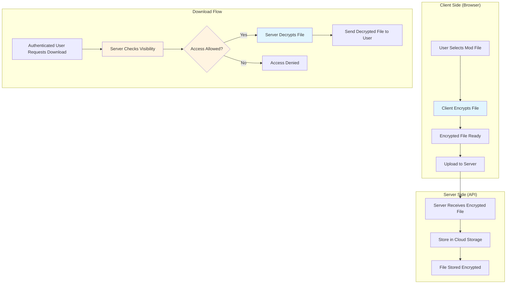
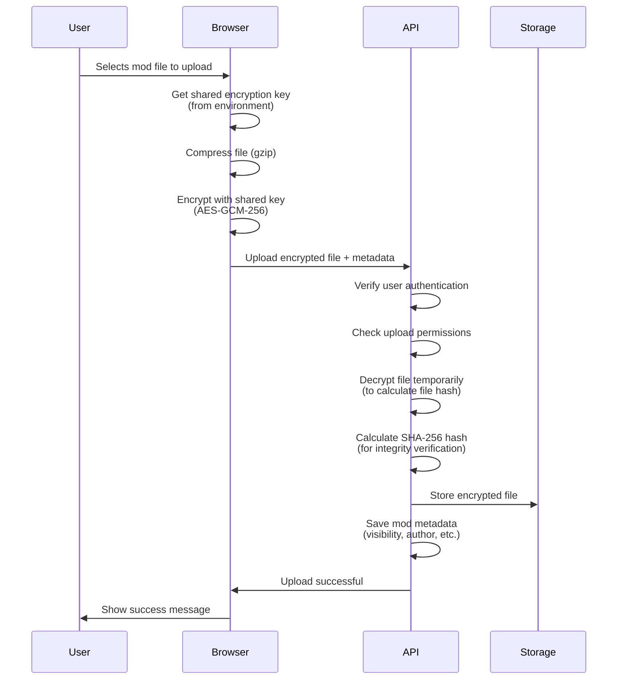
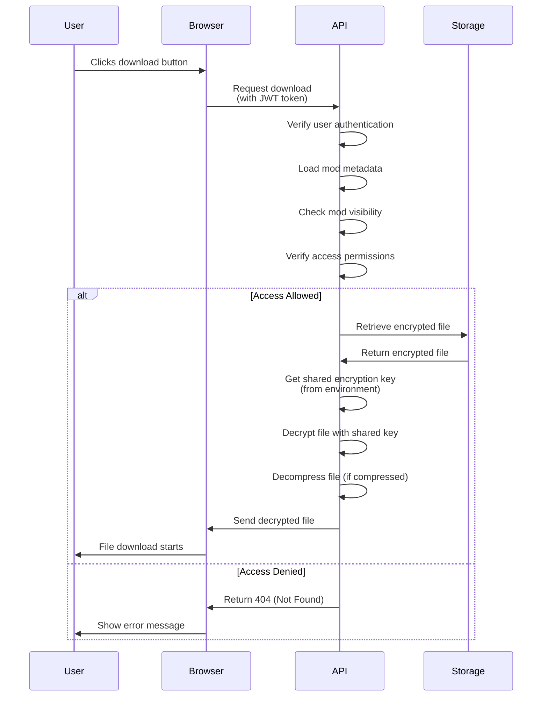
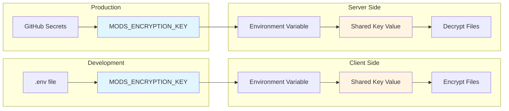
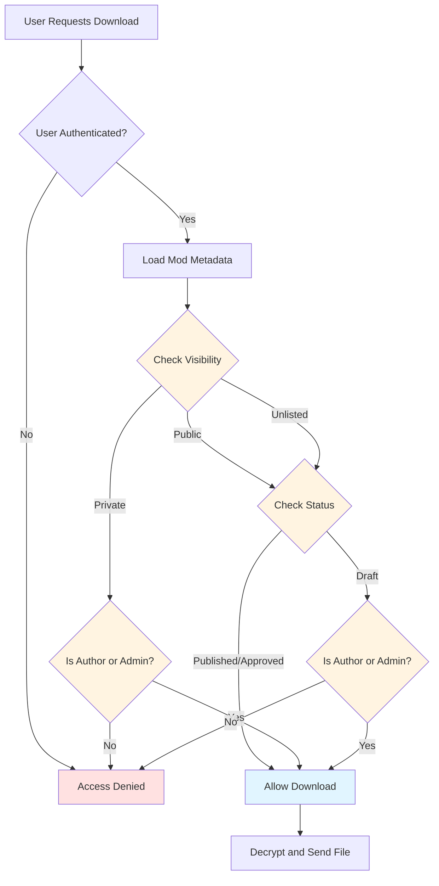
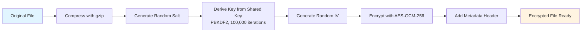
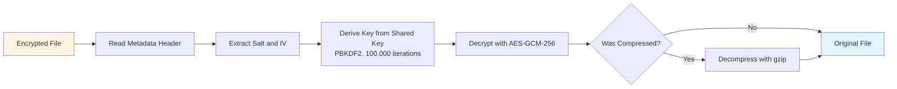
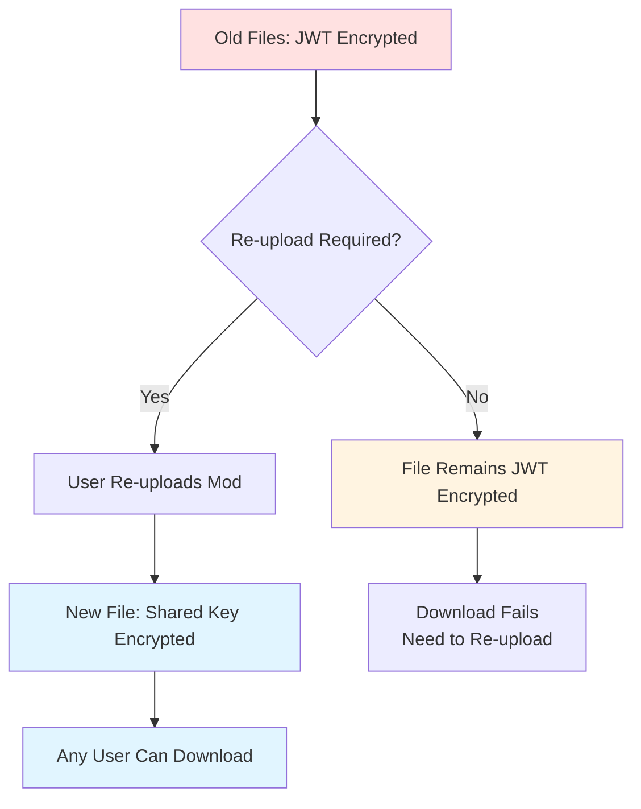
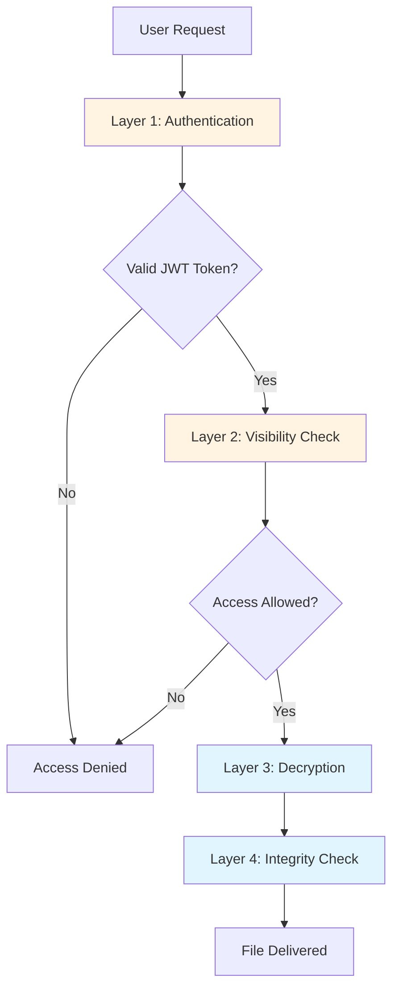

# Mod Hub Encryption Architecture - Shared Key System

> **Complete guide to how mod uploads and downloads are encrypted and secured**

**Date:** 2025-01-XX  
**Status:** Implementation Plan

---

## 📋 Executive Summary

This document explains how mod files are encrypted when uploaded and decrypted when downloaded. The system uses a **shared encryption key** that allows any authenticated user to download mods, while access is controlled by **visibility settings** (public/unlisted/private).

### Key Points

- ✓ **All mod files are encrypted** before being stored
- ✓ **Any authenticated user** can download and decrypt mods
- ✓ **Access control** is handled by mod visibility settings, not encryption
- ✓ **Encryption happens on the client** (before upload)
- ✓ **Decryption happens on the server** (during download)
- ✓ **Files are stored encrypted** in cloud storage

---

## 🔐 Security Architecture Overview



---

## 🔄 Complete Lifecycle: Upload to Download

### Phase 1: Upload Process



### Phase 2: Download Process



---

## 🔑 Encryption Key Management

### Shared Key System

The system uses a **single shared encryption key** for all mod files. This key is:

- ✓ Stored as a **GitHub environment secret** (for production)
- ✓ Stored in **local `.env` file** (for development)
- ✓ **Never sent to the client** (only used server-side for decryption)
- ✓ **Same key for all mods** (allows any authenticated user to decrypt)

### Key Flow Diagram



---

## 🛡️ Access Control System

### How Access is Controlled

**Important:** Encryption does NOT control access. Access is controlled by **mod visibility settings**.



### Visibility Settings Explained

| Visibility | Who Can Download | Notes |
|------------|------------------|-------|
| **Public** | Any authenticated user | Visible in mod listings |
| **Unlisted** | Any authenticated user | Not visible in listings (need direct link) |
| **Private** | Only author or admin | Completely hidden from others |

**Note:** All mods start as "pending" status and must be approved by an admin before they're accessible, regardless of visibility setting.

---

## 🔒 Encryption Technical Details

### Encryption Process (Client-Side)



### Decryption Process (Server-Side)



### Encryption Format

The encrypted file uses a **binary format (Version 5)** with the following structure:

```
[Header Section - 5 bytes]
├── Version (1 byte): Always 5
├── Compression Flag (1 byte): 1 = compressed, 0 = uncompressed
├── Salt Length (1 byte): Always 16
├── IV Length (1 byte): Always 12
└── Hash Length (1 byte): Always 32

[Data Section]
├── Salt (16 bytes): Random salt for key derivation
├── IV (12 bytes): Random initialization vector
├── Key Hash (32 bytes): SHA-256 hash of shared key (for verification)
└── Encrypted Data (variable): Encrypted and optionally compressed file content
```

---

## 🔄 Migration from JWT to Shared Key

### What Changed

**Before (JWT-Based):**
- Files encrypted with uploader's JWT token
- Only uploader could decrypt
- Each user had different encryption keys

**After (Shared Key):**
- Files encrypted with shared key
- Any authenticated user can decrypt
- All users use the same encryption key

### Migration Impact



**Note:** Files encrypted with the old JWT system will need to be re-uploaded to work with the new shared key system. The system will detect the encryption format and handle accordingly.

---

## 🎯 Security Benefits

### What This System Provides

1. **Encryption at Rest**
   - Files are encrypted before being stored
   - Even if storage is compromised, files are protected

2. **Access Control**
   - Visibility settings control who can download
   - Authentication required for all downloads
   - Private mods only accessible to author/admin

3. **Integrity Verification**
   - SHA-256 hash stored with each file
   - Verifies file hasn't been tampered with
   - Hash calculated on decrypted content

4. **Compression**
   - Files compressed before encryption
   - Reduces storage and bandwidth costs
   - Transparent to end users

### Security Layers



---

## 📊 Data Flow Summary

### Upload Flow

```
User File → Compress → Encrypt (Shared Key) → Upload → Server Decrypts (Temp) → Calculate Hash → Store Encrypted → Save Metadata
```

### Download Flow

```
User Request → Authenticate → Check Visibility → Retrieve Encrypted → Decrypt (Shared Key) → Decompress → Verify Hash → Send to User
```

---

## 🔧 Technical Implementation Notes

### Environment Variables

**Required Secret:**
- `MODS_ENCRYPTION_KEY` - Shared encryption key (minimum 32 characters)

**Where Used:**
- Client-side: For encrypting files before upload
- Server-side: For decrypting files during download

### API Framework Methods

**New Functions (to be created):**
- `encryptBinaryWithSharedKey()` - Encrypts binary data with shared key
- `decryptBinaryWithSharedKey()` - Decrypts binary data with shared key

**Reused Functions:**
- `compressData()` - Gzip compression
- `decompressData()` - Gzip decompression
- PBKDF2 key derivation (same as JWT encryption)

### File Format Detection

The system automatically detects encryption format:
- **Version 5** (binary with compression) - New shared key format
- **Version 4** (binary without compression) - Legacy format
- **Version 3** (JSON format) - Legacy format

---

## ✓ Summary

This architecture provides:

1. ✓ **Secure encryption** for all mod files
2. ✓ **Shared key system** allowing any authenticated user to download
3. ✓ **Visibility-based access control** (not encryption-based)
4. ✓ **Compression** to reduce storage costs
5. ✓ **Integrity verification** via SHA-256 hashes
6. ✓ **Backward compatibility** with format detection

The system is designed to be secure, efficient, and user-friendly while maintaining proper access controls through visibility settings rather than encryption keys.
