# Mods API - Cloudflare Worker

Dedicated Cloudflare Worker for mod hosting and version control. Provides a complete API for uploading, managing, and downloading mods with full version control support.

## Features

- ✓ **Mod Upload** - Upload mods with metadata and files
- ✓ **Version Control** - Full semantic versioning system
- ✓ **R2 Storage** - Files stored in Cloudflare R2
- ✓ **KV Metadata** - Fast metadata storage in Cloudflare KV
- ✓ **Authentication** - JWT-based auth integration
- ✓ **Direct Downloads** - Direct download links for mods
- ✓ **Multi-tenant** - Customer isolation support
- ✓ **TypeScript** - Fully typed API
- ✓ **Client-Side Encryption** - Files encrypted before upload (zero server CPU)
- ✓ **Default Compression** - Automatic gzip compression (maximizes free tier)

## Data Flow

### Upload Process (Client-Side Processing)

```mermaid
flowchart TB
    subgraph Client[" ★ Client Browser"]
        A[User Selects File] --> B[Read File as ArrayBuffer]
        B --> C[Compress with Gzip<br/>Default: Always Enabled]
        C --> D[Encrypt with AES-GCM<br/>JWT Token Key]
        D --> E[Create Encrypted File]
    end
    
    subgraph Upload[" Upload to API"]
        E --> F[POST /mods/upload<br/>Multipart Form Data]
    end
    
    subgraph Server[" Cloudflare Worker"]
        F --> G[Receive Compressed + Encrypted File]
        G --> H[Store in R2<br/>No Processing Needed!]
        H --> I[Save Metadata to KV]
    end
    
    style Client fill:#1a1611,stroke:#edae49,stroke-width:2px
    style C fill:#edae49,color:#000
    style D fill:#edae49,color:#000
    style Server fill:#0f0e0b,stroke:#28a745,stroke-width:2px
    style H fill:#28a745,color:#fff
```



### Download Process (Server-Side Processing)

```mermaid
flowchart TB
    subgraph Server[" Cloudflare Worker"]
        A[Receive Download Request] --> B[Retrieve from R2<br/>Compressed + Encrypted]
        B --> C[Decrypt with AES-GCM<br/>JWT Token Key]
        C --> D[Decompress Gzip]
        D --> E[Return Original File]
    end
    
    subgraph Client[" ★ Client Browser"]
        E --> F[Receive File]
        F --> G[Display/Download]
    end
    
    style Server fill:#0f0e0b,stroke:#28a745,stroke-width:2px
    style C fill:#edae49,color:#000
    style D fill:#edae49,color:#000
    style Client fill:#1a1611,stroke:#edae49,stroke-width:2px
```



**Key Benefits:**
- **Zero server CPU on upload** - All compression/encryption happens client-side
- **Reduced storage** - Compressed files save 20-40% space
- **Reduced bandwidth** - Smaller uploads = less data transfer
- **Maximizes free tier** - Efficient use of Cloudflare resources

## Setup

### Prerequisites

- Cloudflare account
- Wrangler CLI installed
- Node.js 18+

### Installation

```bash
cd serverless/mods-api
pnpm install
```

### Configuration

1. **Create KV Namespace:**
```bash
wrangler kv namespace create "MODS_KV"
```

2. **Create R2 Bucket:**
```bash
wrangler r2 bucket create "mods-storage"
```

3. **Update `wrangler.toml`** with the KV namespace ID

4. **Set Secrets:**
```bash
wrangler secret put JWT_SECRET          # REQUIRED: Must match OTP auth service
wrangler secret put MODS_ENCRYPTION_KEY # REQUIRED: Shared encryption key for mod files (minimum 32 characters)
wrangler secret put ALLOWED_EMAILS      # REQUIRED: Comma-separated allowed emails for upload/management
wrangler secret put ALLOWED_ORIGINS     # OPTIONAL: CORS origins (recommended for production)
wrangler secret put MODS_PUBLIC_URL      # OPTIONAL: Custom R2 domain
```

**Note:** See `SECRETS_AUDIT.md` for complete secrets documentation.

### Development

```bash
pnpm dev
```

### Deployment

```bash
pnpm deploy
```

## API Endpoints

### Mods

- `GET /mods` - List mods (supports filtering, pagination, search)
- `GET /mods/:modId` - Get mod detail with versions
- `POST /mods` - Upload new mod (requires auth)
- `PATCH /mods/:modId` - Update mod metadata (requires auth, author only)
- `DELETE /mods/:modId` - Delete mod (requires auth, author only)

### Versions

- `POST /mods/:modId/versions` - Upload new version (requires auth, author only)
- `GET /mods/:modId/versions/:versionId/download` - Download version file

### Health

- `GET /health` - Health check

## Request/Response Examples

### Upload Mod

```bash
curl -X POST https://mods-api.idling.app/mods \
  -H "Authorization: Bearer YOUR_JWT_TOKEN" \
  -F "file=@mod.zip" \
  -F 'metadata={"title":"My Mod","description":"A cool mod","category":"script","version":"1.0.0","visibility":"public"}'
```

### List Mods

```bash
curl https://mods-api.idling.app/mods?page=1&pageSize=20&category=script
```

### Download Version

```bash
curl https://mods-api.idling.app/mods/MOD_ID/versions/VERSION_ID/download
```

## Data Models

### ModMetadata

```typescript
{
  modId: string;
  authorId: string; // User ID from OTP auth service
  authorDisplayName?: string | null; // Display name (never use email)
  title: string;
  description: string;
  category: 'script' | 'overlay' | 'theme' | 'asset' | 'plugin' | 'other';
  tags: string[];
  thumbnailUrl?: string;
  createdAt: string;
  updatedAt: string;
  latestVersion: string;
  downloadCount: number;
  visibility: 'public' | 'unlisted' | 'private';
  featured: boolean;
  customerId: string | null; // Customer ID for data scoping
  // CRITICAL: authorEmail is NOT stored - email is ONLY for OTP authentication
}
```

### ModVersion

```typescript
{
  versionId: string;
  modId: string;
  version: string; // Semantic version
  changelog: string;
  fileSize: number;
  fileName: string;
  r2Key: string;
  downloadUrl: string;
  createdAt: string;
  downloads: number;
  gameVersions: string[];
  dependencies?: ModDependency[];
}
```

## Storage

### R2 Bucket Structure

```
mods-storage/
├── customer_{id}/
│   ├── mods/
│   │   ├── {modId}/
│   │   │   ├── {versionId}.zip
│   │   │   └── ...
│   │   └── ...
│   └── thumbnails/
│       ├── {modId}.png
│       └── ...
└── mods/  # Default tenant
    └── ...
```

### KV Structure

- `mod_{modId}` - Mod metadata
- `version_{versionId}` - Version metadata
- `mod_{modId}_versions` - List of version IDs for a mod
- `mods_list` - List of all mod IDs

## Authentication

All authenticated endpoints require a JWT token in the `Authorization` header:

```
Authorization: Bearer YOUR_JWT_TOKEN
```

The JWT token is obtained from the OTP auth service and must use the same `JWT_SECRET`.

## CORS

CORS is configured via the `ALLOWED_ORIGINS` environment variable. If not set, all origins are allowed (development only).

## Error Handling

All errors return JSON with this structure:

```json
{
  "error": "Error type",
  "message": "Detailed error message"
}
```

## Rate Limiting

Currently no rate limiting is implemented. Consider adding rate limiting for production use.

## Security

- JWT token verification on all authenticated endpoints
- Author-only access for mod management
- Visibility checks for private mods
- CORS protection
- Input validation

## Performance

- KV for fast metadata lookups
- R2 for efficient file storage
- CDN caching for public files
- Pagination for large result sets

## License

Private - Strixun Stream Suite

