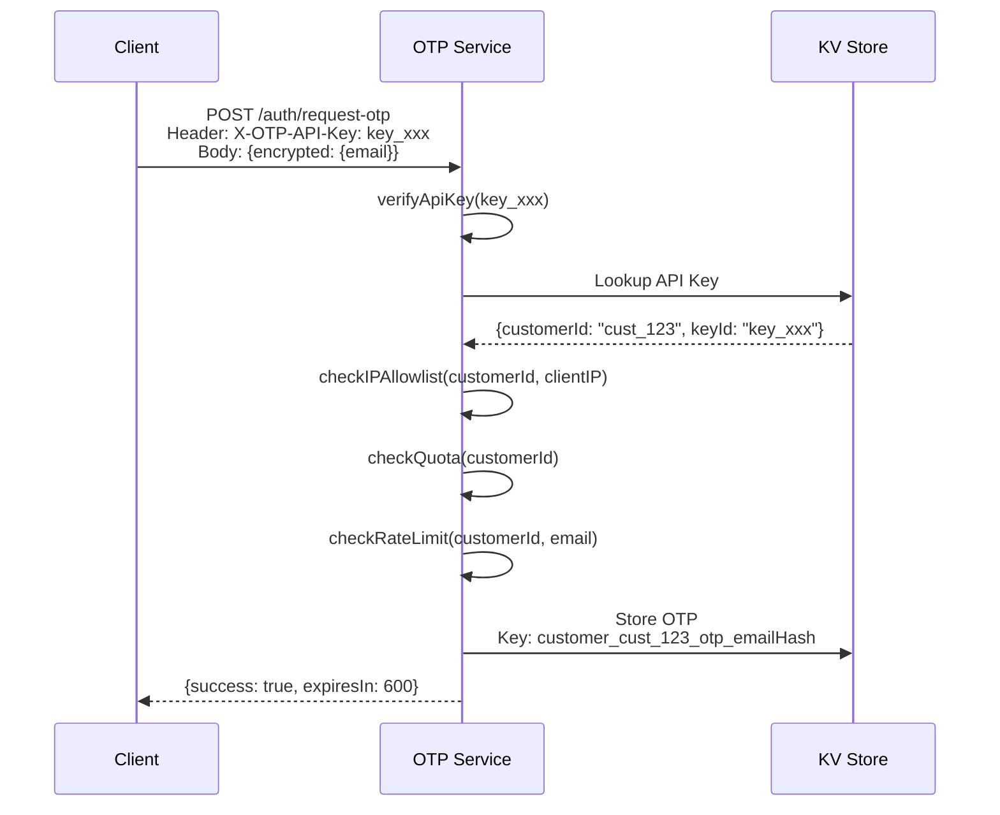
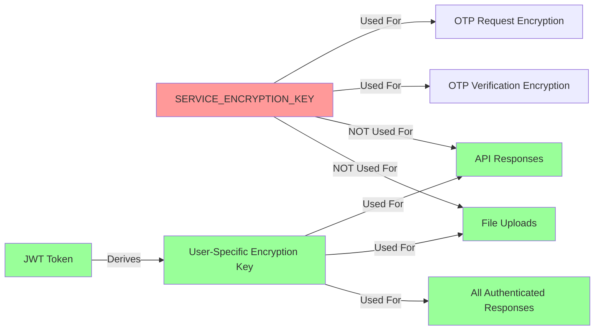

# JWT Authentication Security Architecture Diagram

**Date:** 2025-01-XX  
**Purpose:** Visualize JWT authentication flow with security layers and API key requirements

---

## 🔐 Security Architecture Overview

```mermaid
graph TB
    subgraph "Client (Browser/Frontend)"
        A[User] -->|1. Enters Email| B[OTP Login Component]
        B -->|2. Encrypts with SERVICE_ENCRYPTION_KEY| C[Encrypted Request Body]
        C -->|3. POST /auth/request-otp<br/>Header: X-OTP-API-Key?| D[OTP Auth Service]
    end
    
    subgraph "OTP Auth Service - Request OTP"
        D -->|4. Decrypts with SERVICE_ENCRYPTION_KEY| E{API Key Present?}
        E -->|Yes| F[Verify API Key<br/>Get Customer ID]
        E -->|No| G[Customer ID = null<br/>Backward Compatible]
        F --> H[Check IP Allowlist]
        G --> I[Skip IP Check]
        H -->|Allowed| J[Check Quota & Rate Limits]
        I --> J
        J -->|Pass| K[Generate OTP]
        K --> L[Store OTP in KV<br/>Customer-Isolated]
        L --> M[Send Email with OTP]
        M -->|5. Unencrypted Response<br/>No JWT Yet| N[Client Receives OTP]
    end
    
    subgraph "Client - Verify OTP"
        N -->|6. User Enters OTP| O[OTP Login Component]
        O -->|7. Encrypts {email, otp}<br/>with SERVICE_ENCRYPTION_KEY| P[Encrypted Request Body]
        P -->|8. POST /auth/verify-otp<br/>Header: X-OTP-API-Key?| Q[OTP Auth Service]
    end
    
    subgraph "OTP Auth Service - Verify OTP"
        Q -->|9. Decrypts with SERVICE_ENCRYPTION_KEY| R{API Key Present?}
        R -->|Yes| S[Verify API Key<br/>Get Customer ID]
        R -->|No| T[Customer ID = null]
        S --> U[Verify OTP from KV<br/>Customer-Isolated Lookup]
        T --> U
        U -->|Valid| V[Create/Get User Account]
        V --> W[Generate JWT Token<br/>Contains: userId, email, customerId]
        W -->|10. Unencrypted Response<br/>Contains JWT Token| X[Client Receives JWT]
    end
    
    subgraph "Client - Authenticated Requests"
        X -->|11. Store JWT in<br/>localStorage/auth-store| Y[JWT Token Stored]
        Y -->|12. All Subsequent Requests<br/>Header: Authorization: Bearer JWT| Z[Any API Endpoint]
    end
    
    subgraph "API Endpoints - Protected"
        Z -->|13. Extract JWT from Header| AA[API Framework]
        AA -->|14. Verify JWT Signature| AB{JWT Valid?}
        AB -->|Yes| AC[Decrypt Request Body<br/>with JWT]
        AB -->|No| AD[401 Unauthorized<br/>User-Friendly Message]
        AC --> AE[Process Request]
        AE -->|15. Encrypt Response<br/>with JWT| AF[Encrypted Response]
        AF -->|16. X-Encrypted: true| AG[Client Receives Response]
        AG -->|17. Decrypt with JWT| AH[Client Uses Data]
    end
    
    style A fill:#e1f5ff
    style W fill:#ffd700
    style Y fill:#ffd700
    style AA fill:#90ee90
    style AB fill:#ff6b6b
    style AD fill:#ff6b6b
    style AF fill:#90ee90
```

---

## 🔒 Security Layers Breakdown

### Layer 1: OTP Request Encryption (Pre-Authentication)

**Why SERVICE_ENCRYPTION_KEY is Required:**
- User doesn't have JWT yet (chicken-and-egg problem)
- Email must be encrypted in transit
- Prevents email harvesting from network traffic
- **API Key is OPTIONAL** but recommended for:
  - Multi-tenant customer isolation
  - IP allowlist enforcement
  - Per-customer quota management
  - Rate limiting per customer

**Flow:**
```
Client: encryptWithServiceKey({ email }, VITE_SERVICE_ENCRYPTION_KEY)
  ↓
Network: Encrypted payload
  ↓
Server: decryptWithServiceKey(body, SERVICE_ENCRYPTION_KEY)
```

**Security Properties:**
- ✅ Email encrypted in transit
- ✅ Service key never exposed to network
- ✅ API key optional (backward compatible)
- ✅ IP allowlist check (if API key provided)
- ✅ Rate limiting per email/IP/customer

---

### Layer 2: OTP Verification (Pre-Authentication)

**Why SERVICE_ENCRYPTION_KEY is Required:**
- User still doesn't have JWT
- OTP code must be encrypted in transit
- Prevents OTP interception
- **API Key is OPTIONAL** but recommended for customer isolation

**Flow:**
```
Client: encryptWithServiceKey({ email, otp }, VITE_SERVICE_ENCRYPTION_KEY)
  ↓
Network: Encrypted payload
  ↓
Server: decryptWithServiceKey(body, SERVICE_ENCRYPTION_KEY)
  ↓
Server: Verify OTP → Generate JWT
  ↓
Response: { access_token: "JWT_HERE", ... } (UNENCRYPTED - chicken-and-egg)
```

**Security Properties:**
- ✅ OTP encrypted in transit
- ✅ OTP verified with constant-time comparison
- ✅ JWT generated with user/customer data
- ⚠️ JWT response unencrypted (necessary - user needs JWT to decrypt)
- ✅ API key optional (backward compatible)

---

### Layer 3: JWT-Based Encryption (Post-Authentication)

**Why JWT is Required:**
- All API responses MUST be encrypted with JWT
- All file uploads MUST be encrypted with JWT
- No service key fallback (security hardening)
- User-specific encryption key (JWT-derived)

**Flow:**
```
Client: Request with Authorization: Bearer JWT
  ↓
Server: Extract JWT → Verify Signature → Derive Encryption Key
  ↓
Server: Process Request → Encrypt Response with JWT
  ↓
Response: { encrypted: true, data: "...", ... } + X-Encrypted: true
  ↓
Client: Decrypt with JWT → Use Data
```

**Security Properties:**
- ✅ All responses encrypted with user's JWT
- ✅ JWT signature verification (prevents tampering)
- ✅ User-specific encryption keys
- ✅ No service key fallback (prevents key exposure)
- ✅ Automatic token expiration handling

---

## 🛡️ API Key Security Model

### API Key Purpose (Multi-Tenancy)

**API Keys are NOT for authentication - they're for:**
1. **Customer Identification** - Multi-tenant isolation
2. **IP Allowlist Enforcement** - Restrict access by IP
3. **Quota Management** - Per-customer limits
4. **Rate Limiting** - Per-customer rate limits
5. **Audit Logging** - Track which customer made request

### API Key Flow



### API Key vs JWT

| Aspect | API Key | JWT Token |
|--------|---------|-----------|
| **Purpose** | Customer identification | User authentication |
| **Scope** | Per customer (multi-tenant) | Per user |
| **Encryption** | Not used for encryption | Used for encryption/decryption |
| **Required For** | OTP requests (optional) | All authenticated requests |
| **Storage** | KV Store (customer-scoped) | Client localStorage |
| **Lifetime** | Long-lived (until revoked) | Short-lived (7 hours default) |
| **Security** | IP allowlist, quota limits | Signature verification, expiration |

---

## 🔐 Encryption Key Hierarchy



**Key Separation:**
- **SERVICE_ENCRYPTION_KEY**: Pre-authentication only (OTP flow)
- **JWT-Derived Key**: Post-authentication only (all API calls)
- **No Overlap**: Service key never used for responses, JWT never used for OTP requests

---

## 🚨 Security Audit Findings

### ✅ Strengths

1. **Encryption at Every Layer**
   - OTP requests encrypted with SERVICE_ENCRYPTION_KEY
   - All API responses encrypted with JWT
   - File uploads encrypted with JWT

2. **Multi-Tenant Isolation**
   - API keys provide customer isolation
   - KV storage is customer-scoped
   - Quota/rate limits per customer

3. **Defense in Depth**
   - IP allowlist (if API key provided)
   - Rate limiting (per email, IP, customer)
   - Quota management (per customer)
   - JWT signature verification

4. **No Key Exposure**
   - Service key only on server (never in client bundle)
   - JWT-derived keys (user-specific)
   - No service key fallback for responses

### ⚠️ Current Implementation

1. **API Key is Currently Optional**
   - Backward compatibility allows requests without API key
   - Without API key: customerId = null, no IP allowlist
   - **Current Status**: API key optional, SERVICE_ENCRYPTION_KEY required for encryption
   - **For Third-Party Use**: API key should be required

2. **JWT Response Unencrypted**
   - `/auth/verify-otp` returns JWT in unencrypted response
   - **Necessary**: User needs JWT to decrypt future responses
   - **Mitigation**: JWT is short-lived, HTTPS required

3. **Service Key Encryption Requirement**
   - `VITE_SERVICE_ENCRYPTION_KEY` required in frontend for OTP encryption
   - `SERVICE_ENCRYPTION_KEY` required on server for OTP decryption
   - **Purpose**: Encrypt OTP requests (user doesn't have JWT yet)
   - **Security**: OTP has rate limits, short expiration, single-use

### 🔒 Security Recommendations

**For Third-Party Integration (External Users of OTP Service):**
- ✅ **SERVICE_ENCRYPTION_KEY is REQUIRED** - Must match between client and server for OTP encryption
- ✅ **API Key SHOULD BE REQUIRED** - For production third-party integrations
- **Current Status**: API key is optional (backward compatible)
- **Recommendation**: Enforce API key requirement for third-party integrations
- **Benefits of API Key**:
  - Customer isolation (multi-tenancy)
  - IP allowlist enforcement
  - Per-customer quota management
  - Per-customer rate limiting
  - Audit logging per customer

**Security Model:**
```
Third-Party Integration Requirements:
├── SERVICE_ENCRYPTION_KEY (REQUIRED)
│   └── Used for: Encrypting OTP requests/verification
│   └── Must match: Client VITE_SERVICE_ENCRYPTION_KEY = Server SERVICE_ENCRYPTION_KEY
│
└── API Key (SHOULD BE REQUIRED for production)
    └── Used for: Customer identification, IP allowlist, quota management
    └── Not used for: Encryption (that's SERVICE_ENCRYPTION_KEY's job)
    └── Header: X-OTP-API-Key or Authorization: Bearer <api_key>
```

---

## 📋 Security Checklist

### OTP Request Security
- [x] Email encrypted with SERVICE_ENCRYPTION_KEY
- [x] API key optional (backward compatible)
- [x] IP allowlist check (if API key provided)
- [x] Rate limiting (per email, IP, customer)
- [x] Quota management (per customer)
- [x] OTP expiration (10 minutes)
- [x] OTP single-use

### OTP Verification Security
- [x] OTP encrypted with SERVICE_ENCRYPTION_KEY
- [x] Constant-time OTP comparison
- [x] JWT generation with user/customer data
- [x] JWT signature verification
- [x] JWT expiration (7 hours default)

### Authenticated Request Security
- [x] All responses encrypted with JWT
- [x] JWT signature verification required
- [x] No service key fallback
- [x] User-friendly error messages
- [x] Automatic token refresh

---

## 🎯 Recommendations

1. **For Production Multi-Tenant Use:**
   - Require API key for all OTP requests
   - Enforce IP allowlist per customer
   - Monitor API key usage and rotate regularly

2. **For Single-Tenant Use:**
   - API key optional (backward compatible)
   - Still benefits from rate limiting and quota management

3. **Security Hardening:**
   - ✅ Already implemented: JWT-only encryption
   - ✅ Already implemented: No service key fallback
   - ✅ Already implemented: User-friendly error messages
   - ✅ Already implemented: Automatic token expiration

---

## 📊 Flow Summary

```
┌─────────────────────────────────────────────────────────────┐
│                    PRE-AUTHENTICATION                       │
│  (SERVICE_ENCRYPTION_KEY Required for OTP Encryption)       │
├─────────────────────────────────────────────────────────────┤
│ 1. Request OTP:                                             │
│    - Encrypt email with SERVICE_ENCRYPTION_KEY             │
│    - API Key optional (for customer isolation)             │
│    - Server decrypts, generates OTP, sends email            │
│                                                             │
│ 2. Verify OTP:                                              │
│    - Encrypt {email, otp} with SERVICE_ENCRYPTION_KEY       │
│    - API Key optional (for customer isolation)             │
│    - Server decrypts, verifies OTP, generates JWT           │
│    - Response contains JWT (unencrypted - necessary)         │
└─────────────────────────────────────────────────────────────┘

┌─────────────────────────────────────────────────────────────┐
│                   POST-AUTHENTICATION                       │
│  (JWT Required for All Encryption/Decryption)               │
├─────────────────────────────────────────────────────────────┤
│ 3. All API Requests:                                        │
│    - Header: Authorization: Bearer JWT                     │
│    - Server verifies JWT signature                         │
│    - Server encrypts response with JWT                     │
│    - Client decrypts response with JWT                      │
│                                                             │
│ 4. File Uploads:                                            │
│    - Encrypt file with JWT before upload                   │
│    - Server decrypts with JWT                               │
│    - All files encrypted with JWT (no service key)         │
└─────────────────────────────────────────────────────────────┘
```

---

**Key Security Principle:** 
- **Pre-Auth**: SERVICE_ENCRYPTION_KEY (shared, for OTP encryption)
- **Post-Auth**: JWT-Derived Key (user-specific, for all encryption)
- **Separation**: Never mix keys - service key for OTP only, JWT for everything else
