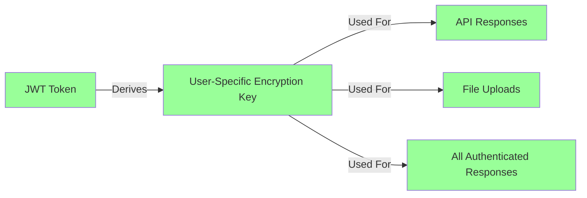

# JWT Authentication Security Architecture Diagram

**Date:** 2025-01-XX  
**Purpose:** Visualize JWT authentication flow with security layers and API key requirements

---

## 🔐 Security Architecture Overview

```mermaid
graph TB
    subgraph "Client (Browser/Frontend)"
        A[User] -->|1. Enters Email| B[OTP Login Component]
        B -->|2. Sends Request| C[Request Body]
        C -->|3. POST /auth/request-otp<br/>Header: X-OTP-API-Key?| D[OTP Auth Service]
    end
    
    subgraph "OTP Auth Service - Request OTP"
        D -->|4. Processes Request| E{API Key Present?}
        E -->|Yes| F[Verify API Key<br/>Get Customer ID]
        E -->|No| G[Customer ID = null<br/>Backward Compatible]
        F --> H[Check IP Allowlist]
        G --> I[Skip IP Check]
        H -->|Allowed| J[Check Quota & Rate Limits]
        I --> J
        J -->|Pass| K[Generate OTP]
        K --> L[Store OTP in KV<br/>Customer-Isolated]
        L --> M[Send Email with OTP]
        M -->|5. Unencrypted Response<br/>No JWT Yet| N[Client Receives OTP]
    end
    
    subgraph "Client - Verify OTP"
        N -->|6. User Enters OTP| O[OTP Login Component]
        O -->|7. Sends {email, otp}| P[Request Body]
        P -->|8. POST /auth/verify-otp<br/>Header: X-OTP-API-Key?| Q[OTP Auth Service]
    end
    
    subgraph "OTP Auth Service - Verify OTP"
        Q -->|9. Processes Request| R{API Key Present?}
        R -->|Yes| S[Verify API Key<br/>Get Customer ID]
        R -->|No| T[Customer ID = null]
        S --> U[Verify OTP from KV<br/>Customer-Isolated Lookup]
        T --> U
        U -->|Valid| V[Create/Get User Account]
        V --> W[Generate JWT Token<br/>Contains: userId, email, customerId]
        W -->|10. Unencrypted Response<br/>Contains JWT Token| X[Client Receives JWT]
    end
    
    subgraph "Client - Authenticated Requests"
        X -->|11. Store JWT in<br/>localStorage/auth-store| Y[JWT Token Stored]
        Y -->|12. All Subsequent Requests<br/>Header: Authorization: Bearer JWT| Z[Any API Endpoint]
    end
    
    subgraph "API Endpoints - Protected"
        Z -->|13. Extract JWT from Header| AA[API Framework]
        AA -->|14. Verify JWT Signature| AB{JWT Valid?}
        AB -->|Yes| AC[Decrypt Request Body<br/>with JWT]
        AB -->|No| AD[401 Unauthorized<br/>User-Friendly Message]
        AC --> AE[Process Request]
        AE -->|15. Encrypt Response<br/>with JWT| AF[Encrypted Response]
        AF -->|16. X-Encrypted: true| AG[Client Receives Response]
        AG -->|17. Decrypt with JWT| AH[Client Uses Data]
    end
    
    style A fill:#e1f5ff
    style W fill:#ffd700
    style Y fill:#ffd700
    style AA fill:#90ee90
    style AB fill:#ff6b6b
    style AD fill:#ff6b6b
    style AF fill:#90ee90
```

---

## 🔒 Security Layers Breakdown

### Layer 1: OTP Request Encryption (Pre-Authentication)

**Security:**
- HTTPS/TLS encrypts all traffic in transit
- **API Key is OPTIONAL** but recommended for:
  - Multi-tenant customer isolation
  - IP allowlist enforcement
  - Per-customer quota management
  - Rate limiting per customer

**Flow:**
```
Client: Sends { email } over HTTPS
  ↓
Network: HTTPS/TLS encrypted
  ↓
Server: Processes request
```

**Security Properties:**
- ✅ HTTPS/TLS encrypts all traffic
- ✅ API key optional (backward compatible)
- ✅ IP allowlist check (if API key provided)
- ✅ Rate limiting per email/IP/customer

---

### Layer 2: OTP Verification (Pre-Authentication)

**Security:**
- HTTPS/TLS encrypts all traffic in transit
- **API Key is OPTIONAL** but recommended for customer isolation

**Flow:**
```
Client: Sends { email, otp } over HTTPS
  ↓
Network: HTTPS/TLS encrypted
  ↓
Server: Processes request → Verify OTP → Generate JWT
  ↓
Response: { access_token: "JWT_HERE", ... } (UNENCRYPTED - chicken-and-egg)
```

**Security Properties:**
- ✅ OTP encrypted in transit
- ✅ OTP verified with constant-time comparison
- ✅ JWT generated with user/customer data
- ⚠️ JWT response unencrypted (necessary - user needs JWT to decrypt)
- ✅ API key optional (backward compatible)

---

### Layer 3: JWT-Based Encryption (Post-Authentication)

**Why JWT is Required:**
- All API responses MUST be encrypted with JWT
- All file uploads MUST be encrypted with JWT
- No service key fallback (security hardening)
- User-specific encryption key (JWT-derived)

**Flow:**
```
Client: Request with Authorization: Bearer JWT
  ↓
Server: Extract JWT → Verify Signature → Derive Encryption Key
  ↓
Server: Process Request → Encrypt Response with JWT
  ↓
Response: { encrypted: true, data: "...", ... } + X-Encrypted: true
  ↓
Client: Decrypt with JWT → Use Data
```

**Security Properties:**
- ✅ All responses encrypted with user's JWT
- ✅ JWT signature verification (prevents tampering)
- ✅ User-specific encryption keys
- ✅ No service key fallback (prevents key exposure)
- ✅ Automatic token expiration handling

---

## 🛡️ API Key Security Model

### API Key Purpose (Multi-Tenancy)

**API Keys are NOT for authentication - they're for:**
1. **Customer Identification** - Multi-tenant isolation
2. **IP Allowlist Enforcement** - Restrict access by IP
3. **Quota Management** - Per-customer limits
4. **Rate Limiting** - Per-customer rate limits
5. **Audit Logging** - Track which customer made request

### API Key Flow


### API Key vs JWT

| Aspect | API Key | JWT Token |
|--------|---------|-----------|
| **Purpose** | Customer identification | User authentication |
| **Scope** | Per customer (multi-tenant) | Per user |
| **Encryption** | Not used for encryption | Used for encryption/decryption |
| **Required For** | OTP requests (optional) | All authenticated requests |
| **Storage** | KV Store (customer-scoped) | Client localStorage |
| **Lifetime** | Long-lived (until revoked) | Short-lived (7 hours default) |
| **Security** | IP allowlist, quota limits | Signature verification, expiration |

---

## 🔐 Encryption Key Hierarchy



**Encryption:**
- **JWT-Derived Key**: All encryption uses JWT tokens (per-user, per-session)
- **HTTPS/TLS**: Pre-authentication traffic encrypted by HTTPS

---

## 🚨 Security Audit Findings

### ✅ Strengths

1. **Encryption at Every Layer**
   - OTP requests encrypted by HTTPS/TLS
   - All API responses encrypted with JWT
   - File uploads encrypted with JWT

2. **Multi-Tenant Isolation**
   - API keys provide customer isolation
   - KV storage is customer-scoped
   - Quota/rate limits per customer

3. **Defense in Depth**
   - IP allowlist (if API key provided)
   - Rate limiting (per email, IP, customer)
   - Quota management (per customer)
   - JWT signature verification

4. **No Key Exposure**
   - JWT-derived keys (user-specific, per-session)
   - No shared service keys

### ⚠️ Current Implementation

1. **API Key is Currently Optional**
   - Backward compatibility allows requests without API key
   - Without API key: customerId = null, no IP allowlist
   - **Current Status**: API key optional, HTTPS/TLS encrypts all traffic
   - **For Third-Party Use**: API key should be required

2. **JWT Response Unencrypted**
   - `/auth/verify-otp` returns JWT in unencrypted response
   - **Necessary**: User needs JWT to decrypt future responses
   - **Mitigation**: JWT is short-lived, HTTPS required

3. **OTP Request Security**
   - HTTPS/TLS encrypts all OTP requests in transit
   - **Security**: OTP has rate limits, short expiration, single-use

### 🔒 Security Recommendations

**For Third-Party Integration (External Users of OTP Service):**
- ✅ **HTTPS/TLS** - Encrypts all OTP requests in transit
- ✅ **API Key SHOULD BE REQUIRED** - For production third-party integrations
- **Current Status**: API key is optional (backward compatible)
- **Recommendation**: Enforce API key requirement for third-party integrations
- **Benefits of API Key**:
  - Customer isolation (multi-tenancy)
  - IP allowlist enforcement
  - Per-customer quota management
  - Per-customer rate limiting
  - Audit logging per customer

**Security Model:**
```
Third-Party Integration Requirements:
└── API Key (SHOULD BE REQUIRED for production)
    └── Used for: Customer identification, IP allowlist, quota management
    └── Header: X-OTP-API-Key or Authorization: Bearer <api_key>
```

---

## 📋 Security Checklist

### OTP Request Security
- [x] Email encrypted by HTTPS/TLS
- [x] API key optional (backward compatible)
- [x] IP allowlist check (if API key provided)
- [x] Rate limiting (per email, IP, customer)
- [x] Quota management (per customer)
- [x] OTP expiration (10 minutes)
- [x] OTP single-use

### OTP Verification Security
- [x] OTP encrypted by HTTPS/TLS
- [x] Constant-time OTP comparison
- [x] JWT generation with user/customer data
- [x] JWT signature verification
- [x] JWT expiration (7 hours default)

### Authenticated Request Security
- [x] All responses encrypted with JWT
- [x] JWT signature verification required
- [x] No service key fallback
- [x] User-friendly error messages
- [x] Automatic token refresh

---

## 🎯 Recommendations

1. **For Production Multi-Tenant Use:**
   - Require API key for all OTP requests
   - Enforce IP allowlist per customer
   - Monitor API key usage and rotate regularly

2. **For Single-Tenant Use:**
   - API key optional (backward compatible)
   - Still benefits from rate limiting and quota management

3. **Security Hardening:**
   - ✅ Already implemented: JWT-only encryption
   - ✅ Already implemented: No service key fallback
   - ✅ Already implemented: User-friendly error messages
   - ✅ Already implemented: Automatic token expiration

---

## 📊 Flow Summary

```
┌─────────────────────────────────────────────────────────────┐
│                    PRE-AUTHENTICATION                       │
│  (HTTPS/TLS Encrypts All Traffic)                          │
├─────────────────────────────────────────────────────────────┤
│ 1. Request OTP:                                             │
│    - Send email over HTTPS                                  │
│    - API Key optional (for customer isolation)             │
│    - Server generates OTP, sends email                      │
│                                                             │
│ 2. Verify OTP:                                              │
│    - Send {email, otp} over HTTPS                           │
│    - API Key optional (for customer isolation)             │
│    - Server verifies OTP, generates JWT                    │
│    - Response contains JWT (unencrypted - necessary)         │
└─────────────────────────────────────────────────────────────┘

┌─────────────────────────────────────────────────────────────┐
│                   POST-AUTHENTICATION                       │
│  (JWT Required for All Encryption/Decryption)               │
├─────────────────────────────────────────────────────────────┤
│ 3. All API Requests:                                        │
│    - Header: Authorization: Bearer JWT                     │
│    - Server verifies JWT signature                         │
│    - Server encrypts response with JWT                     │
│    - Client decrypts response with JWT                      │
│                                                             │
│ 4. File Uploads:                                            │
│    - Encrypt file with JWT before upload                   │
│    - Server decrypts with JWT                               │
│    - All files encrypted with JWT (no service key)         │
└─────────────────────────────────────────────────────────────┘
```

---

**Key Security Principle:** 
- **Pre-Auth**: HTTPS/TLS encrypts all traffic
- **Post-Auth**: JWT-Derived Key (user-specific, per-session, for all encryption)
