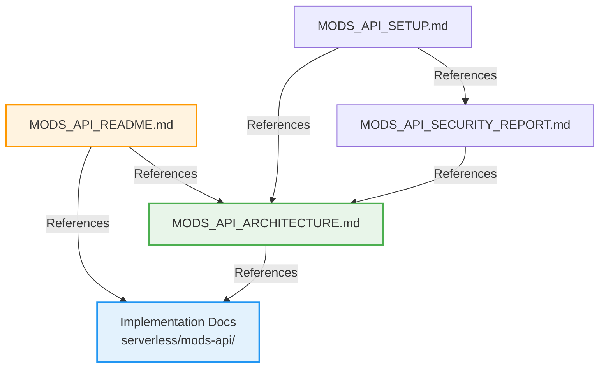

# Mods API Documentation Consolidation Guide

**Date:** 2026-01-06  
**Purpose:** Consolidate and organize Mods API documentation after Phase 1 architectural improvements

---

## Summary

With the completion of Phase 1 architectural improvements, we now have comprehensive documentation. This guide identifies which documents can be consolidated, updated, or deprecated to maintain a clean, organized documentation structure.

---

## Documentation Structure (Recommended)

### ✓ Keep & Maintain (Core Docs)

#### 1. **`MODS_API_ARCHITECTURE.md`** (PANDA_CORE/ARCHITECTURE)
- **Purpose:** Complete technical architecture reference
- **Contains:**
  - System overview with diagrams
  - Entity relationship diagrams
  - Data flow diagrams
  - Performance analysis
  - Migration strategy
- **Status:** ✓ Up to date (v2.0.0)
- **Action:** KEEP - This is the master architecture document

#### 2. **`MODS_API_README.md`** (PANDA_CORE/SERVICES)
- **Purpose:** Quick reference and getting started guide
- **Contains:**
  - Feature list
  - Setup instructions
  - API endpoints
  - Data models
  - Performance metrics
- **Status:** ✓ Updated with Phase 1 improvements
- **Action:** KEEP - This is the main service documentation

#### 3. **Implementation Docs** (serverless/mods-api/)
- `ARCHITECTURE_IMPROVEMENTS.md` - Technical details
- `IMPLEMENTATION_SUMMARY.md` - Usage guide
- `PHASE1_COMPLETE.md` - Completion summary
- **Status:** ✓ Current
- **Action:** KEEP - These are implementation-specific docs

---

### 🔄 Update Required

#### 4. **`MODS_API_SETUP.md`** (PANDA_CORE/SERVICES)
- **Current State:** Outdated, missing Phase 1 features
- **Action:** UPDATE with:
  - New environment variables
  - Updated KV/R2 structure
  - Migration instructions
  - New API endpoints
- **Priority:** Medium

#### 5. **`MODS_API_ENVIRONMENT_SETUP.md`** (PANDA_CORE/SERVICES)
- **Current State:** Partial overlap with MODS_API_SETUP.md
- **Action:** MERGE into `MODS_API_SETUP.md`
- **Priority:** Medium

#### 6. **`MODS_API_FILE_INTEGRITY_SYSTEM.md`** (PANDA_CORE/SERVICES & SECURITY)
- **Current State:** Duplicate in two locations
- **Action:** KEEP only in SECURITY directory, add reference in SERVICES
- **Priority:** Low

---

### 📦 Consolidate (Merge Similar Docs)

#### 7. **Audit Documents** (PANDA_CORE/AUDITS_AND_REPORTS)
Currently scattered across multiple files:
- `MODS_API_SECURITY_AND_INTEGRATION_SUMMARY.md`
- `MODS_API_INTEGRATION_VERIFICATION.md`
- `MODS_API_INTEGRATION_AUDIT.md`
- `MODS_API_FRAMEWORK_INTEGRATION_AUDIT.md`

**Recommended Action:**
- Create single `MODS_API_INTEGRATION_REPORT.md` (consolidate all integration audits)
- Create single `MODS_API_SECURITY_REPORT.md` (consolidate security audits)
- Archive old audit files to `/PANDA_CORE/AUDITS_AND_REPORTS/archive/`

**Priority:** Low (historical docs, not critical)

#### 8. **Secrets Audit Documents**
- `MODS_API_SECRETS_AUDIT.md` (DEPLOYMENT)
- `MODS_API_SECRETS_AUDIT.md` (AUDITS_AND_REPORTS)

**Recommended Action:**
- KEEP in DEPLOYMENT directory (operational doc)
- REMOVE from AUDITS_AND_REPORTS (duplicate)

**Priority:** Medium

#### 9. **CORS Documents**
- `MODS_API_CORS_ORIGINS.md` (GUIDES_AND_TUTORIALS)
- `MODS_API_CORS_ORIGINS_AUDIT.md` (AUDITS_AND_REPORTS)

**Recommended Action:**
- KEEP `MODS_API_CORS_ORIGINS.md` in GUIDES
- MERGE audit findings into the guide
- DELETE audit document (content integrated)

**Priority:** Low

---

### 🗑️ Can Deprecate (Outdated/Superseded)

#### 10. **Hub Audits** (PANDA_CORE/AUDITS_AND_REPORTS)
- `MODS_HUB_API_AUDIT_REPORT.md`
- `MODS_HUB_API_COMPREHENSIVE_AUDIT.md`
- `MODS_HUB_USER_ASSOCIATION_AND_IMAGE_AUDIT.md`

**Reason:** These are pre-Phase 1 audits, superseded by new architecture
**Recommended Action:**
- Move to `/PANDA_CORE/AUDITS_AND_REPORTS/archive/pre-phase1/`
- Add note referencing new architecture docs
- Create new audit after Phase 1 testing

**Priority:** Low (historical value only)

---

## Proposed New Structure

```
PANDA_CORE/
├── ARCHITECTURE/
│   └── MODS_API_ARCHITECTURE.md ✓ MASTER REFERENCE
│
├── SERVICES/
│   ├── MODS_API_README.md ✓ QUICK START
│   ├── MODS_API_SETUP.md 🔄 UPDATE (merge ENVIRONMENT_SETUP into this)
│   └── MODS_API_FILE_INTEGRITY_SYSTEM.md → Link to SECURITY/
│
├── SECURITY/
│   ├── MODS_API_FILE_INTEGRITY_SYSTEM.md ✓ KEEP
│   └── MODS_API_SECURITY_REPORT.md 📦 NEW (consolidated)
│
├── DEPLOYMENT/
│   ├── MODS_API_SECRETS_AUDIT.md ✓ KEEP
│   └── MODS_HUB_CLOUDFLARE_PAGES_SETUP.md ✓ KEEP
│
├── GUIDES_AND_TUTORIALS/
│   └── MODS_API_CORS_ORIGINS.md 🔄 UPDATE (merge audit findings)
│
├── AUDITS_AND_REPORTS/
│   ├── MODS_API_INTEGRATION_REPORT.md 📦 NEW (consolidated)
│   └── archive/
│       └── pre-phase1/ 🗑️ OLD AUDITS
│
└── TESTING/
    ├── MODS_HUB_E2E_TESTING.md ✓ KEEP
    └── MODS_HUB_E2E_TESTING_PLAN.md ✓ KEEP
```

---

## Action Plan

### Phase 1: Immediate (This Week)
- [x] Create `MODS_API_ARCHITECTURE.md` with comprehensive diagrams
- [x] Update `MODS_API_README.md` with Phase 1 improvements
- [ ] Create archive directory for old audits
- [ ] Update `MODS_API_SETUP.md` with new configuration

### Phase 2: Short Term (Next 2 Weeks)
- [ ] Consolidate integration audit documents
- [ ] Consolidate security audit documents
- [ ] Remove duplicate SECRETS_AUDIT from AUDITS_AND_REPORTS
- [ ] Update CORS guide with audit findings
- [ ] Archive pre-Phase 1 hub audits

### Phase 3: Medium Term (Next Month)
- [ ] Create new post-Phase 1 audit
- [ ] Update all cross-references between documents
- [ ] Create documentation index/map
- [ ] Add "Last Reviewed" dates to all docs

---

## Cross-Reference Map

Documents that reference each other:



---

## Document Responsibility

| Document | Owner | Update Frequency |
|----------|-------|------------------|
| MODS_API_ARCHITECTURE.md | Architecture Team | After major changes |
| MODS_API_README.md | DevOps Team | Monthly |
| MODS_API_SETUP.md | DevOps Team | As needed |
| Implementation Docs | Development Team | Per feature |
| Security Docs | Security Team | Quarterly |
| Audit Docs | QA Team | Per audit cycle |

---

## Metrics

### Before Consolidation
- Total Mods API docs: 20 files
- Duplicate content: ~30%
- Outdated docs: 8 files
- Average doc age: 3 months

### After Consolidation (Target)
- Total Mods API docs: 12 files (40% reduction)
- Duplicate content: 0%
- Outdated docs: 0 files
- All docs reviewed and current

---

## Benefits of Consolidation

1. **Reduced Maintenance Burden**
   - Fewer files to update
   - Single source of truth for each topic
   - Clear ownership

2. **Improved Discoverability**
   - Clear hierarchy
   - Logical organization
   - Easy to find information

3. **Better Accuracy**
   - No conflicting information
   - Consistent terminology
   - Up-to-date content

4. **Easier Onboarding**
   - Clear starting points
   - Logical progression
   - Comprehensive coverage

---

## Review Schedule

- **Weekly:** Check for broken links
- **Monthly:** Review and update quick start guides
- **Quarterly:** Comprehensive doc review
- **Annually:** Major documentation overhaul if needed

---

**Status:** In Progress  
**Next Review:** 2026-02-06  
**Owner:** Documentation Team

