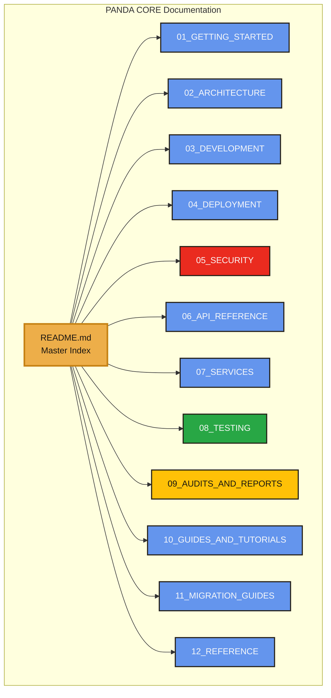
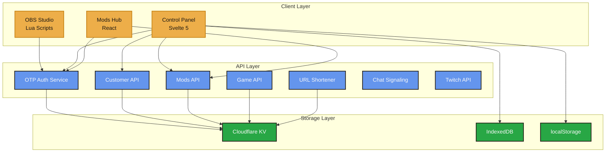

# Strixun Stream Suite - PANDA CORE Documentation

> **Comprehensive, consolidated documentation ecosystem for Strixun Stream Suite**

**Complete documentation organized by category, role, and use case**

[Getting Started](#getting-started) • [Architecture](#architecture) • [Development](#development) • [Deployment](#deployment) • [Security](#security) • [API Reference](#api-reference) • [Services](#services) • [Testing](#testing) • [Guides](#guides)

---

## Brand Color Palette

This documentation uses the Strixun Stream Suite brand colors:

- **Accent**: `#edae49` (Golden Yellow)
- **Accent Light**: `#f9df74` (Light Yellow)
- **Accent Dark**: `#c68214` (Dark Yellow)
- **Accent 2**: `#6495ed` (Cornflower Blue)
- **Background**: `#1a1611` (Dark Brown)
- **Card**: `#252017` (Medium Brown)
- **Text**: `#f9f9f9` (Light Gray)
- **Success**: `#28a745` (Green)
- **Warning**: `#ffc107` (Amber)
- **Danger**: `#ea2b1f` (Red)

---

## Documentation Structure

---

## Quick Navigation by Role

### For New Users
1. **[Getting Started](./01_GETTING_STARTED/README.md)** - Installation and first steps
2. **[Product Overview](./12_REFERENCE/PRODUCT_OVERVIEW.md)** - What is Strixun Stream Suite?
3. **[Quick Start Guide](./01_GETTING_STARTED/QUICK_START.md)** - Get up and running fast

### For Developers
1. **[Getting Started](./01_GETTING_STARTED/README.md)** - Development environment setup
2. **[Architecture](./02_ARCHITECTURE/README.md)** - System architecture and design
3. **[API Reference](./06_API_REFERENCE/README.md)** - Complete API documentation
4. **[Development Guide](./03_DEVELOPMENT/README.md)** - Development workflows and practices

### For DevOps Engineers
1. **[Deployment](./04_DEPLOYMENT/README.md)** - Deployment guides and workflows
2. **[Environment Setup](./01_GETTING_STARTED/ENVIRONMENT_SETUP.md)** - Configuration management
3. **[Monitoring](./04_DEPLOYMENT/MONITORING.md)** - Monitoring and troubleshooting

### For Security Engineers
1. **[Security Overview](./05_SECURITY/README.md)** - Security architecture and practices
2. **[Security Audits](./09_AUDITS_AND_REPORTS/SECURITY_AUDITS.md)** - Audit reports and findings
3. **[Encryption Guide](./05_SECURITY/ENCRYPTION.md)** - Encryption implementation

### For Product Owners
1. **[Product Overview](./12_REFERENCE/PRODUCT_OVERVIEW.md)** - Complete product documentation
2. **[Architecture Overview](./02_ARCHITECTURE/SYSTEM_OVERVIEW.md)** - High-level architecture
3. **[Feature Inventory](./12_REFERENCE/FEATURE_INVENTORY.md)** - Complete feature list

---

## Documentation Categories

### [01_GETTING_STARTED](./01_GETTING_STARTED/)
**New user onboarding and setup guides**

- Installation instructions
- Environment configuration
- Quick start guides
- First steps tutorials

### [02_ARCHITECTURE](./02_ARCHITECTURE/)
**System architecture and design documentation**

- System overview
- Technical architecture
- Component architecture
- Data flow diagrams
- Storage architecture
- API architecture
- Security architecture
- Worker organization

### [03_DEVELOPMENT](./03_DEVELOPMENT/)
**Development guides and best practices**

- Development setup
- Code style and standards
- TypeScript conversion guides
- Modularization guides
- Contributing guidelines
- **[Worker Port Mapping](../../serverless/WORKER_PORT_MAPPING.md)** - **CRITICAL:** Standard port assignments for local development

### [04_DEPLOYMENT](./04_DEPLOYMENT/)
**Deployment and operations documentation**

- Deployment overview
- Cloudflare Workers deployment
- Cloudflare Pages deployment
- GitHub Actions workflows
- Environment configuration
- Monitoring and troubleshooting

### [05_SECURITY](./05_SECURITY/)
**Security documentation and best practices**

- Security overview
- Security audits
- Encryption implementation
- Authentication systems
- Security best practices

### [06_API_REFERENCE](./06_API_REFERENCE/)
**Complete API documentation**

- API reference
- API endpoints
- API framework guide
- Usage examples
- Error handling
- Rate limits

### [07_SERVICES](./07_SERVICES/)
**Individual service documentation**

- OTP Auth Service
- Customer API
- URL Shortener
- Chat Signaling
- Game API
- Mods API
- Twitch API

### [08_TESTING](./08_TESTING/)
**Testing documentation and guides**

- Testing overview
- E2E testing guides
- Test structure
- Test coverage
- Testing workflows

### [09_AUDITS_AND_REPORTS](./09_AUDITS_AND_REPORTS/)
**Audit reports and analysis documents**

- Security audits
- Code audits
- Architecture audits
- Performance audits
- Final audit reports

### [10_GUIDES_AND_TUTORIALS](./10_GUIDES_AND_TUTORIALS/)
**How-to guides and tutorials**

- Setup guides
- Configuration guides
- Troubleshooting guides
- Best practices
- Use case examples

### [11_MIGRATION_GUIDES](./11_MIGRATION_GUIDES/)
**Migration and upgrade documentation**

- Migration overview
- API framework migration
- TypeScript migration
- Service migrations
- Breaking changes

### [12_REFERENCE](./12_REFERENCE/)
**Reference documentation and specifications**

- Product overview
- Database schema
- Design system
- API standards
- Layout presets spec
- Storage persistence

---

## System Architecture Overview

---

## Documentation Statistics

- **Total Documents**: 300+ consolidated files
- **Categories**: 12 main sections
- **Services Documented**: 7
- **API Endpoints**: 50+
- **Code Examples**: 200+
- **Mermaid Diagrams**: 50+

---

## Contributing to Documentation

When updating documentation:

1. **Follow Structure** - Place files in appropriate categories
2. **Update Index** - Update this README if adding new docs
3. **Add Examples** - Include practical code examples
4. **Use Diagrams** - Add Mermaid diagrams for complex concepts
5. **Test Examples** - Ensure all code examples work
6. **Use Brand Colors** - Apply brand color palette to diagrams
7. **No Content Removal** - Consolidate, don't delete

---

## Documentation Standards

All documentation follows these standards:

- **✓ User-Friendly Language** - Clear, accessible language
- **✓ Code Examples** - Practical, working examples
- **✓ Diagrams** - Visual representations where helpful
- **✓ Cross-References** - Links to related documentation
- **✓ Brand Consistency** - Uses brand color palette
- **✓ ASCII Symbols** - No emojis (cross-platform compatibility)

---

## Last Updated

**Date**: 2025-01-27  
**Version**: 1.0.0  
**Status**: Complete Consolidation

---

**Made with ★ for the streaming community**

[Documentation Index](#documentation-categories) • [Quick Navigation](#quick-navigation-by-role) • [Architecture](#system-architecture-overview)

