# OpenID Connect (OIDC) Architecture

> **A comprehensive guide to how modern identity verification works -- in general and in Strixun Stream Suite**

---

## Table of Contents

- [Part 1: What the Hell is OIDC?](#part-1-what-the-hell-is-oidc)
  - [The Real-World Analogy](#the-real-world-analogy)
  - [The Three Core Problems](#the-three-core-problems)
  - [Key Concepts for Humans](#key-concepts-for-humans)
  - [How OIDC Fits Into the Identity Stack](#how-oidc-fits-into-the-identity-stack)
  - [The Standard OIDC Flow](#the-standard-oidc-flow)
  - [Tokens Explained](#tokens-explained)
  - [Discovery and Trust](#discovery-and-trust)
  - [Scopes and Claims](#scopes-and-claims)
  - [Token Verification: Symmetric vs Asymmetric Signing](#token-verification-symmetric-vs-asymmetric-signing)
- [Part 2: How Strixun Implements OIDC](#part-2-how-strixun-implements-oidc)
  - [Architecture Overview](#architecture-overview)
  - [Our Custom OTP Grant Type](#our-custom-otp-grant-type)
  - [Token Creation and Signing](#token-creation-and-signing)
  - [OIDC Discovery and JWKS](#oidc-discovery-and-jwks)
  - [How Other Services Verify Tokens](#how-other-services-verify-tokens)
  - [Session Management and Cookies](#session-management-and-cookies)
  - [Refresh Tokens and Token Rotation](#refresh-tokens-and-token-rotation)
  - [Token Introspection](#token-introspection)
  - [Logout and Token Revocation](#logout-and-token-revocation)
  - [Scopes in Strixun](#scopes-in-strixun)
  - [Endpoint Reference](#endpoint-reference)
  - [Environment Configuration](#environment-configuration)
- [Glossary](#glossary)

---

## Part 1: What the Hell is OIDC?

### The Real-World Analogy

Imagine you want to enter a private building. You walk up to security, and they ask:
**"Who are you, and can you prove it?"**

You show your government-issued ID. Security checks the photo, checks the expiration date, and maybe calls the issuing authority to confirm it has not been revoked. Once satisfied, they give you a visitor badge that says your name, your role (guest, employee, VIP), and what floors you can access.

That entire process -- proving who you are, getting verified, and receiving a badge that other parts of the building trust -- is exactly what **OpenID Connect (OIDC)** does for software applications.

- **You** = the user (a person or a program)
- **Your government ID** = your credentials (email, password, one-time code, etc.)
- **Security at the desk** = the **Identity Provider** (the service that verifies you)
- **The visitor badge** = a **Token** (a piece of data that proves you were verified)
- **Each floor's door scanner** = a **Resource Server** (the APIs/services that check your badge)

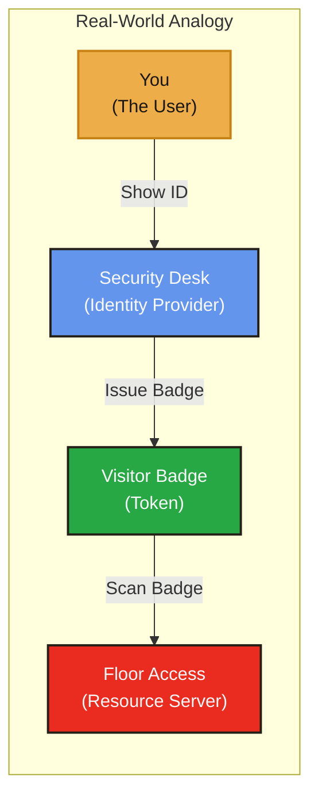
```mermaid
graph LR
    subgraph "Real-World Analogy"
        A["You<br/>(The User)"] -->|Show ID| B["Security Desk<br/>(Identity Provider)"]
        B -->|Issue Badge| C["Visitor Badge<br/>(Token)"]
        C -->|Scan Badge| D["Floor Access<br/>(Resource Server)"]
    end

    style A fill:#edae49,stroke:#c68214,stroke-width:2px,color:#1a1611
    style B fill:#6495ed,stroke:#252017,stroke-width:2px,color:#f9f9f9
    style C fill:#28a745,stroke:#252017,stroke-width:2px,color:#f9f9f9
    style D fill:#ea2b1f,stroke:#252017,stroke-width:2px,color:#f9f9f9
```

### The Three Core Problems

Every application on the internet that has user accounts must solve three problems:

1. **Authentication** -- *"Who are you?"*
   Confirming that a user is who they claim to be.

2. **Authorization** -- *"What are you allowed to do?"*
   Determining what resources or actions a verified user can access.

3. **Federation** -- *"Can I trust someone else's verification?"*
   Allowing one service to accept proof of identity issued by a different service, without those services sharing passwords.

OIDC is an **industry standard protocol** (a set of rules everyone agrees to follow) that solves all three of these problems in a secure, interoperable way.

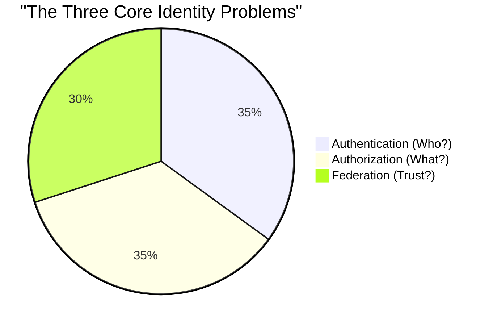
```mermaid
pie title "The Three Core Identity Problems"
    "Authentication (Who?)" : 35
    "Authorization (What?)" : 35
    "Federation (Trust?)" : 30
```

### Key Concepts for Humans

Before we go deeper, here are the key players in an OIDC system. Think of them as roles in a play:

| Role | What It Does | Real-World Equivalent |
|------|-------------|----------------------|
| **User** | The human (or program) trying to access something | You, walking into the building |
| **Client Application** | The app or website the user is interacting with | The reception kiosk where you check in |
| **Identity Provider (IdP)** | The trusted authority that verifies identity | Government ID office + security desk |
| **Resource Server** | The service that holds protected data/features | The locked rooms in the building |
| **Token** | A piece of signed data proving verification | Your visitor badge |

### How OIDC Fits Into the Identity Stack

OIDC did not appear out of thin air. It is built on top of two older standards. Think of it like layers of a cake:

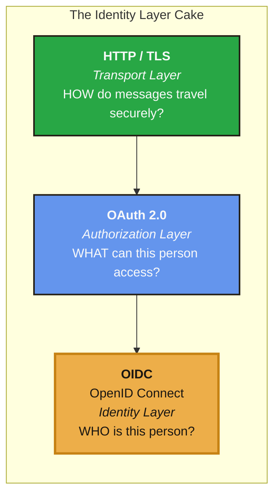
```mermaid
graph BT
    subgraph "The Identity Layer Cake"
        A["<b>OIDC</b><br/>OpenID Connect<br/><i>Identity Layer</i><br/>WHO is this person?"]
        B["<b>OAuth 2.0</b><br/><i>Authorization Layer</i><br/>WHAT can this person access?"]
        C["<b>HTTP / TLS</b><br/><i>Transport Layer</i><br/>HOW do messages travel securely?"]
    end

    C --> B
    B --> A

    style A fill:#edae49,stroke:#c68214,stroke-width:3px,color:#1a1611
    style B fill:#6495ed,stroke:#252017,stroke-width:2px,color:#f9f9f9
    style C fill:#28a745,stroke:#252017,stroke-width:2px,color:#f9f9f9
```

| Layer | Purpose | Analogy |
|-------|---------|---------|
| **HTTP / TLS** | Encrypts the communication channel so nobody can eavesdrop | The sealed envelope your letter travels in |
| **OAuth 2.0** | Defines how to grant limited access to resources without sharing passwords | The rules about what your visitor badge allows |
| **OIDC** | Adds identity verification on top of OAuth, so services know *who* the user is | The photo and name printed on the badge |

**In plain English:** OAuth 2.0 lets you give apps limited access to your stuff without handing over your password. OIDC adds a standardized way to also prove *who you are* during that process.

### The Standard OIDC Flow

Here is how a typical OIDC login works, step by step. This is called the **Authorization Code Flow** and it is the most common pattern on the internet (used by "Sign in with Google," "Sign in with GitHub," etc.):

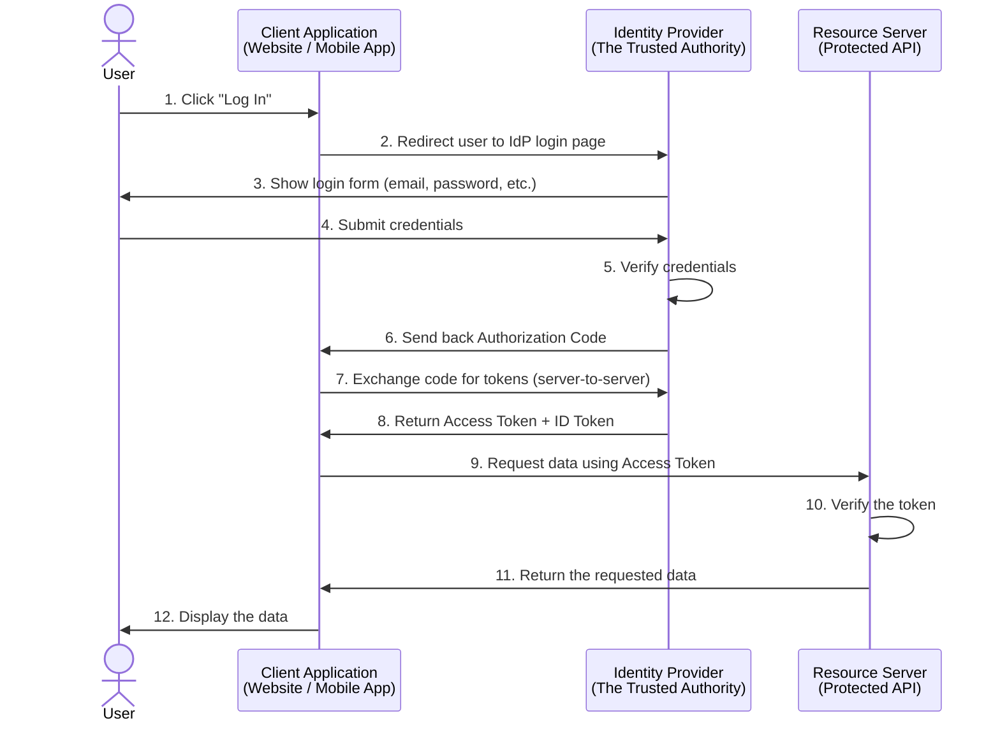
```mermaid
sequenceDiagram
    actor User
    participant App as Client Application<br/>(Website / Mobile App)
    participant IdP as Identity Provider<br/>(The Trusted Authority)
    participant API as Resource Server<br/>(Protected API)

    User->>App: 1. Click "Log In"
    App->>IdP: 2. Redirect user to IdP login page
    IdP->>User: 3. Show login form (email, password, etc.)
    User->>IdP: 4. Submit credentials
    IdP->>IdP: 5. Verify credentials
    IdP->>App: 6. Send back Authorization Code
    App->>IdP: 7. Exchange code for tokens (server-to-server)
    IdP->>App: 8. Return Access Token + ID Token
    App->>API: 9. Request data using Access Token
    API->>API: 10. Verify the token
    API->>App: 11. Return the requested data
    App->>User: 12. Display the data
```

**What is happening at each step:**

1. The user clicks a login button on the website or app.
2. The app redirects the user's browser to the Identity Provider's login page.
3. The Identity Provider shows a login form.
4. The user types in their credentials (email + password, or a one-time code, etc.).
5. The Identity Provider checks if the credentials are valid.
6. If valid, the IdP sends a short-lived **authorization code** back to the app.
7. The app exchanges that code for actual tokens (this happens server-to-server, not in the browser, for security).
8. The IdP returns two tokens: an **Access Token** (for accessing APIs) and an **ID Token** (proving who the user is).
9. The app includes the Access Token when requesting protected data from an API.
10. The API verifies the token is legitimate, not expired, and not revoked.
11. If everything checks out, the API returns the requested data.
12. The app displays the data to the user.

### Tokens Explained

OIDC uses something called **JSON Web Tokens (JWTs)**. A JWT is a compact, URL-safe string that contains verifiable information. Think of it as a digitally signed note.

A JWT has three parts, separated by dots:

```
eyJhbGciOi... . eyJzdWIiOi... . SflKxwRJSM...
|_____________|   |_____________|   |_____________|
    Header            Payload          Signature
```

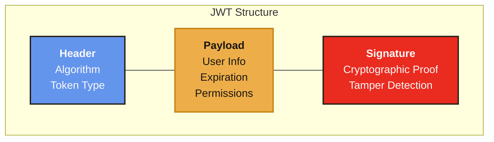
```mermaid
graph LR
    subgraph "JWT Structure"
        direction LR
        H["<b>Header</b><br/>Algorithm<br/>Token Type"]
        P["<b>Payload</b><br/>User Info<br/>Expiration<br/>Permissions"]
        S["<b>Signature</b><br/>Cryptographic Proof<br/>Tamper Detection"]
    end

    H --- P --- S

    style H fill:#6495ed,stroke:#252017,stroke-width:2px,color:#f9f9f9
    style P fill:#edae49,stroke:#c68214,stroke-width:2px,color:#1a1611
    style S fill:#ea2b1f,stroke:#252017,stroke-width:2px,color:#f9f9f9
```

| Part | What It Contains | Purpose |
|------|-----------------|---------|
| **Header** | The algorithm used to sign the token (e.g., RS256) and the token type (JWT) | Tells the verifier how to check the signature |
| **Payload** | The "claims" -- pieces of information like user ID, email, expiration time, permissions | Carries the actual data about the user and session |
| **Signature** | A cryptographic hash of the header + payload, signed with a secret or private key | Proves the token was not tampered with and was issued by a trusted authority |

**OIDC defines two primary token types:**

| Token | Purpose | Who Reads It | Typical Lifetime |
|-------|---------|-------------|-----------------|
| **Access Token** | Grants permission to call APIs | Resource Servers (APIs) | Minutes to hours |
| **ID Token** | Proves the user's identity | The Client Application | Minutes to hours |

There is also a **Refresh Token** (used to get new access tokens without re-logging in). Strixun uses opaque refresh tokens with rotation -- see the [Refresh Tokens and Token Rotation](#refresh-tokens-and-token-rotation) section for details.

### Discovery and Trust

One of the most elegant parts of OIDC is **discovery**. Instead of every application manually configuring where to find the Identity Provider's login page, token endpoint, public keys, etc., OIDC defines a standard URL where all of this information lives:

```
https://your-identity-provider.com/.well-known/openid-configuration
```

This URL returns a JSON document (a structured data file) that describes everything about the Identity Provider:

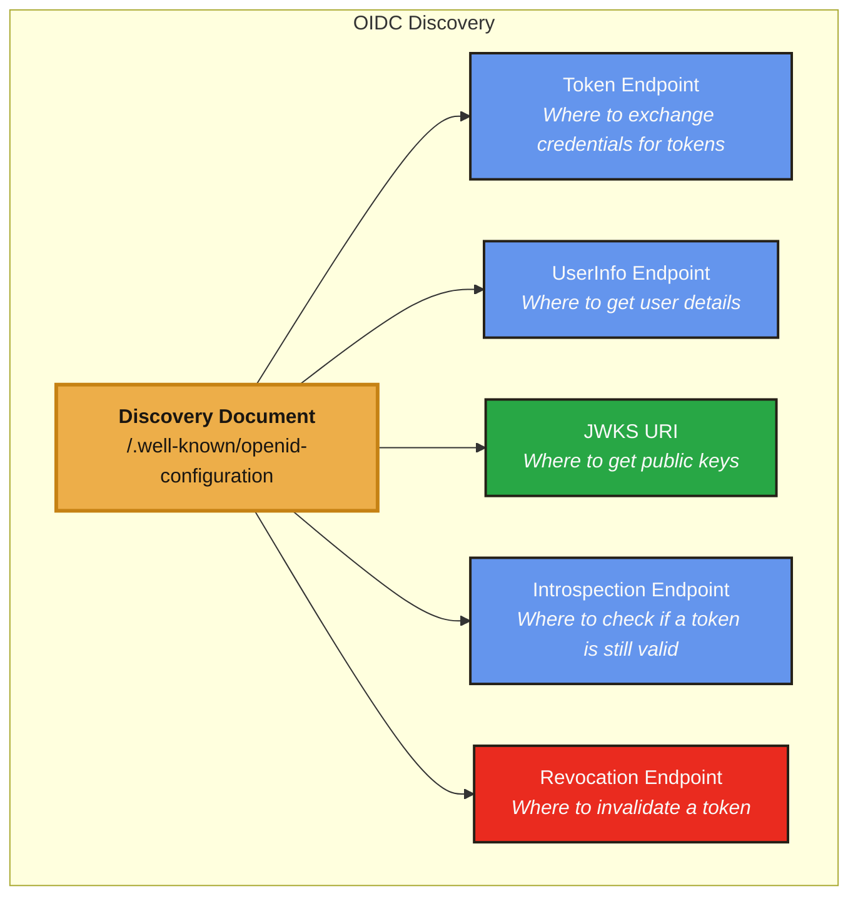
```mermaid
graph TB
    subgraph "OIDC Discovery"
        D["<b>Discovery Document</b><br/>/.well-known/openid-configuration"]
        T["Token Endpoint<br/><i>Where to exchange credentials for tokens</i>"]
        U["UserInfo Endpoint<br/><i>Where to get user details</i>"]
        J["JWKS URI<br/><i>Where to get public keys</i>"]
        I["Introspection Endpoint<br/><i>Where to check if a token is still valid</i>"]
        R["Revocation Endpoint<br/><i>Where to invalidate a token</i>"]
    end

    D --> T
    D --> U
    D --> J
    D --> I
    D --> R

    style D fill:#edae49,stroke:#c68214,stroke-width:3px,color:#1a1611
    style T fill:#6495ed,stroke:#252017,stroke-width:2px,color:#f9f9f9
    style U fill:#6495ed,stroke:#252017,stroke-width:2px,color:#f9f9f9
    style J fill:#28a745,stroke:#252017,stroke-width:2px,color:#f9f9f9
    style I fill:#6495ed,stroke:#252017,stroke-width:2px,color:#f9f9f9
    style R fill:#ea2b1f,stroke:#252017,stroke-width:2px,color:#f9f9f9
```

The **JWKS URI** deserves special attention. It points to a URL that returns the Identity Provider's **public keys**. These keys are what allow any service in the world to verify that a token was truly issued by that Identity Provider, without ever needing to share a secret. More on this in the next section.

### Scopes and Claims

**Scopes** are like permission categories that the application requests during login. They control what information the Identity Provider includes in the tokens.

**Claims** are the individual pieces of information inside a token's payload.

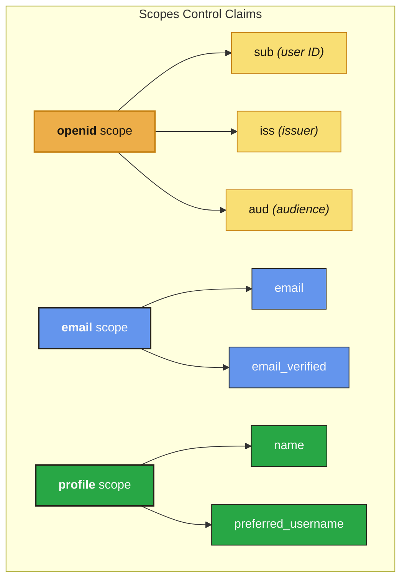
```mermaid
graph TB
    subgraph "Scopes Control Claims"
        S1["<b>openid</b> scope"]
        S2["<b>email</b> scope"]
        S3["<b>profile</b> scope"]

        C1["sub <i>(user ID)</i>"]
        C2["iss <i>(issuer)</i>"]
        C3["aud <i>(audience)</i>"]
        C4["email"]
        C5["email_verified"]
        C6["name"]
        C7["preferred_username"]
    end

    S1 --> C1
    S1 --> C2
    S1 --> C3
    S2 --> C4
    S2 --> C5
    S3 --> C6
    S3 --> C7

    style S1 fill:#edae49,stroke:#c68214,stroke-width:2px,color:#1a1611
    style S2 fill:#6495ed,stroke:#252017,stroke-width:2px,color:#f9f9f9
    style S3 fill:#28a745,stroke:#252017,stroke-width:2px,color:#f9f9f9
    style C1 fill:#f9df74,stroke:#c68214,stroke-width:1px,color:#1a1611
    style C2 fill:#f9df74,stroke:#c68214,stroke-width:1px,color:#1a1611
    style C3 fill:#f9df74,stroke:#c68214,stroke-width:1px,color:#1a1611
    style C4 fill:#6495ed,stroke:#252017,stroke-width:1px,color:#f9f9f9
    style C5 fill:#6495ed,stroke:#252017,stroke-width:1px,color:#f9f9f9
    style C6 fill:#28a745,stroke:#252017,stroke-width:1px,color:#f9f9f9
    style C7 fill:#28a745,stroke:#252017,stroke-width:1px,color:#f9f9f9
```

| Standard Scope | What It Unlocks |
|---------------|-----------------|
| `openid` | Required. Tells the IdP "this is an OIDC request." Returns the user's unique ID (`sub`), the issuer (`iss`), and the intended audience (`aud`). |
| `email` | The user's email address and whether it has been verified. **Note:** Strixun intentionally omits the raw `email` claim for privacy; only `email_verified` is returned. |
| `profile` | Basic profile info like display name. |
| `address` | The user's mailing address (rarely used in web apps). |
| `phone` | The user's phone number (rarely used in web apps). |

### Token Verification: Symmetric vs Asymmetric Signing

This is one of the most important concepts in OIDC and it is worth understanding clearly.

When the Identity Provider creates a token, it **signs** it. Signing means creating a mathematical proof that the token has not been altered. There are two approaches:

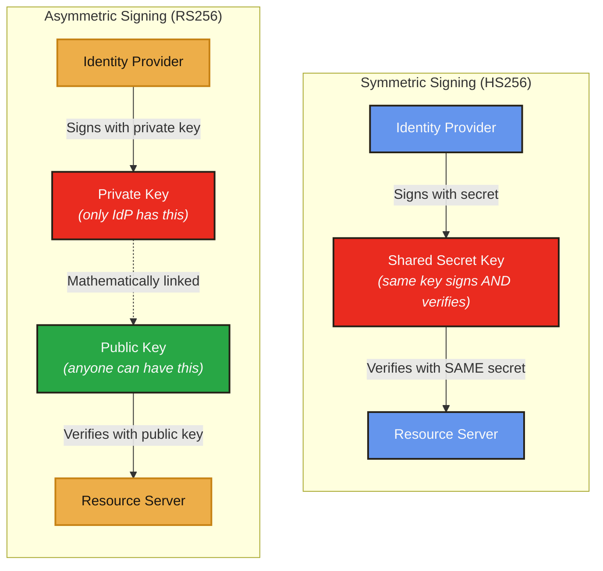
```mermaid
graph TB
    subgraph "Symmetric Signing (HS256)"
        direction TB
        SA["Identity Provider"]
        SB["Shared Secret Key<br/><i>(same key signs AND verifies)</i>"]
        SC["Resource Server"]
        SA -->|Signs with secret| SB
        SB -->|Verifies with SAME secret| SC
    end

    subgraph "Asymmetric Signing (RS256)"
        direction TB
        AA["Identity Provider"]
        AB["Private Key<br/><i>(only IdP has this)</i>"]
        AC["Public Key<br/><i>(anyone can have this)</i>"]
        AD["Resource Server"]
        AA -->|Signs with private key| AB
        AB -.->|Mathematically linked| AC
        AC -->|Verifies with public key| AD
    end

    style SA fill:#6495ed,stroke:#252017,stroke-width:2px,color:#f9f9f9
    style SB fill:#ea2b1f,stroke:#252017,stroke-width:2px,color:#f9f9f9
    style SC fill:#6495ed,stroke:#252017,stroke-width:2px,color:#f9f9f9
    style AA fill:#edae49,stroke:#c68214,stroke-width:2px,color:#1a1611
    style AB fill:#ea2b1f,stroke:#252017,stroke-width:2px,color:#f9f9f9
    style AC fill:#28a745,stroke:#252017,stroke-width:2px,color:#f9f9f9
    style AD fill:#edae49,stroke:#c68214,stroke-width:2px,color:#1a1611
```

| Approach | How It Works | Pros | Cons |
|----------|-------------|------|------|
| **Symmetric (HS256)** | One secret key is shared between the IdP and every service that needs to verify tokens. | Simple to set up. Fast. | Every service must have the secret. If any one service is compromised, all tokens are compromised. |
| **Asymmetric (RS256)** | The IdP keeps a **private key** secret and publishes a **public key** that anyone can use to verify tokens. | Services never need the secret. Public keys can be shared freely. A compromised service cannot forge tokens. | Slightly more complex setup. Slightly slower verification. |

**Why asymmetric signing matters:** In a system with many services (like Strixun Stream Suite, which has 8+ APIs), distributing a shared secret to every service is a security risk and an operational headache. With RS256, you only need to protect the private key in one place -- the Identity Provider.

---

## Part 2: How Strixun Implements OIDC

Now that you understand the general concepts, let us walk through exactly how Strixun Stream Suite implements OIDC. We take the standard and adapt it to our specific needs.

### Architecture Overview

Strixun Stream Suite is a **monorepo** (a single code repository containing multiple services). All backend services run as **Cloudflare Workers** -- lightweight, serverless functions deployed at the network edge around the world.

Our OIDC system has one **Identity Provider** (the OTP Auth Service at `auth.idling.app`) and multiple **Resource Servers** (Customer API, Streamkit API, Mods API, etc.) that trust tokens issued by the Identity Provider.

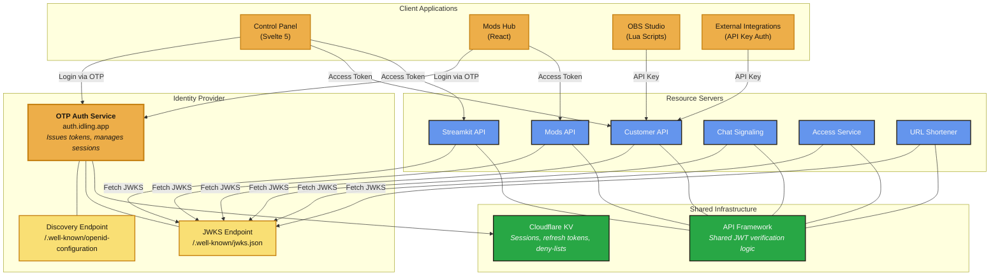
```mermaid
graph TB
    subgraph "Client Applications"
        CP["Control Panel<br/>(Svelte 5)"]
        MH["Mods Hub<br/>(React)"]
        OBS["OBS Studio<br/>(Lua Scripts)"]
        EXT["External Integrations<br/>(API Key Auth)"]
    end

    subgraph "Identity Provider"
        IDP["<b>OTP Auth Service</b><br/>auth.idling.app<br/><i>Issues tokens, manages sessions</i>"]
        DISC["Discovery Endpoint<br/>/.well-known/openid-configuration"]
        JWKS["JWKS Endpoint<br/>/.well-known/jwks.json"]
    end

    subgraph "Resource Servers"
        CAPI["Customer API"]
        SAPI["Streamkit API"]
        MAPI["Mods API"]
        CHAT["Chat Signaling"]
        ACC["Access Service"]
        URL["URL Shortener"]
    end

    subgraph "Shared Infrastructure"
        FW["API Framework<br/><i>Shared JWT verification logic</i>"]
        KV["Cloudflare KV<br/><i>Sessions, refresh tokens, deny-lists</i>"]
    end

    CP -->|Login via OTP| IDP
    MH -->|Login via OTP| IDP
    OBS -->|API Key| CAPI
    EXT -->|API Key| CAPI

    CP -->|Access Token| CAPI
    CP -->|Access Token| SAPI
    MH -->|Access Token| MAPI

    IDP --- DISC
    IDP --- JWKS

    CAPI -->|Fetch JWKS| JWKS
    SAPI -->|Fetch JWKS| JWKS
    MAPI -->|Fetch JWKS| JWKS
    CHAT -->|Fetch JWKS| JWKS
    ACC -->|Fetch JWKS| JWKS
    URL -->|Fetch JWKS| JWKS

    CAPI --- FW
    SAPI --- FW
    MAPI --- FW
    CHAT --- FW
    ACC --- FW
    URL --- FW

    IDP --> KV

    style IDP fill:#edae49,stroke:#c68214,stroke-width:3px,color:#1a1611
    style DISC fill:#f9df74,stroke:#c68214,stroke-width:2px,color:#1a1611
    style JWKS fill:#f9df74,stroke:#c68214,stroke-width:2px,color:#1a1611
    style CAPI fill:#6495ed,stroke:#252017,stroke-width:2px,color:#f9f9f9
    style SAPI fill:#6495ed,stroke:#252017,stroke-width:2px,color:#f9f9f9
    style MAPI fill:#6495ed,stroke:#252017,stroke-width:2px,color:#f9f9f9
    style CHAT fill:#6495ed,stroke:#252017,stroke-width:2px,color:#f9f9f9
    style ACC fill:#6495ed,stroke:#252017,stroke-width:2px,color:#f9f9f9
    style URL fill:#6495ed,stroke:#252017,stroke-width:2px,color:#f9f9f9
    style FW fill:#28a745,stroke:#252017,stroke-width:2px,color:#f9f9f9
    style KV fill:#28a745,stroke:#252017,stroke-width:2px,color:#f9f9f9
    style CP fill:#edae49,stroke:#c68214,stroke-width:2px,color:#1a1611
    style MH fill:#edae49,stroke:#c68214,stroke-width:2px,color:#1a1611
    style OBS fill:#edae49,stroke:#c68214,stroke-width:2px,color:#1a1611
    style EXT fill:#edae49,stroke:#c68214,stroke-width:2px,color:#1a1611
```

### Our Custom OTP Grant Type

Standard OIDC typically uses passwords or third-party login (Google, GitHub, etc.) for authentication. Strixun uses a **passwordless, one-time-password (OTP)** system instead. This means users never create or remember a password -- they receive a code via email every time they log in.

We register this with a custom grant type identifier:
`urn:ietf:params:oauth:grant-type:otp`

Here is the complete login flow:

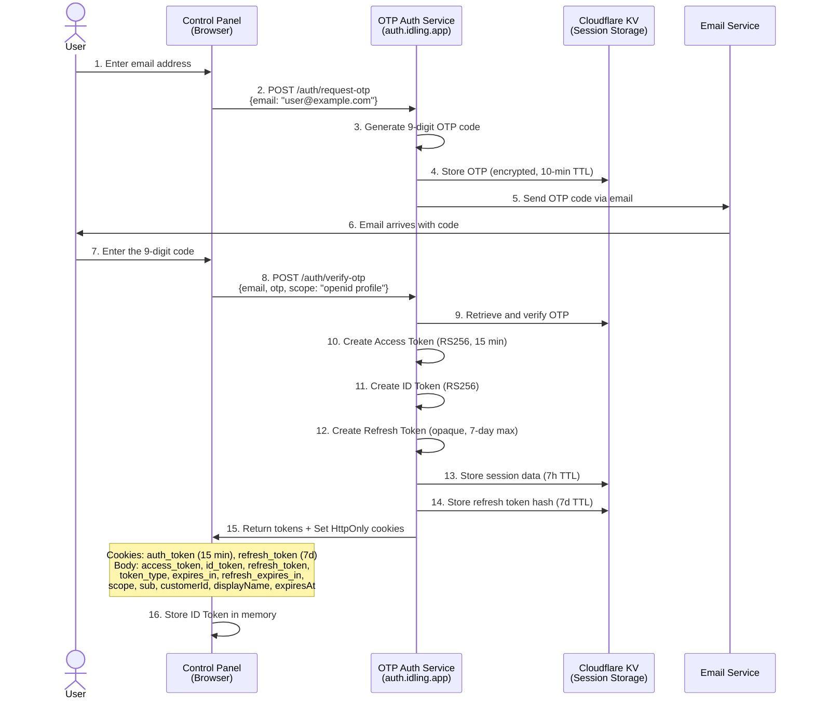
```mermaid
sequenceDiagram
    actor User
    participant App as Control Panel<br/>(Browser)
    participant Auth as OTP Auth Service<br/>(auth.idling.app)
    participant KV as Cloudflare KV<br/>(Session Storage)
    participant Email as Email Service

    User->>App: 1. Enter email address
    App->>Auth: 2. POST /auth/request-otp<br/>{email: "user@example.com"}
    Auth->>Auth: 3. Generate 9-digit OTP code
    Auth->>KV: 4. Store OTP (encrypted, 10-min TTL)
    Auth->>Email: 5. Send OTP code via email
    Email->>User: 6. Email arrives with code
    User->>App: 7. Enter the 9-digit code
    App->>Auth: 8. POST /auth/verify-otp<br/>{email, otp, scope: "openid profile"}
    Auth->>KV: 9. Retrieve and verify OTP
    Auth->>Auth: 10. Create Access Token (RS256, 15 min)
    Auth->>Auth: 11. Create ID Token (RS256)
    Auth->>Auth: 12. Create Refresh Token (opaque, 7-day max)
    Auth->>KV: 13. Store session data (7h TTL)
    Auth->>KV: 14. Store refresh token hash (7d TTL)
    Auth->>App: 15. Return tokens + Set HttpOnly cookies
    Note over App: Cookies: auth_token (15 min), refresh_token (7d)<br/>Body: access_token, id_token, refresh_token,<br/>token_type, expires_in, refresh_expires_in,<br/>scope, sub, customerId, displayName, expiresAt
    App->>App: 16. Store ID Token in memory
```

**Key differences from standard OIDC:**

| Standard OIDC | Strixun OIDC |
|--------------|-------------|
| Password or third-party login | Passwordless OTP via email |
| Authorization Code Flow (redirect-based) | Direct token exchange (OTP replaces the code) |
| Access token in response body only | Access token also set as HttpOnly cookie for SSO |
| `email` claim commonly in tokens | **Email intentionally excluded** from all JWTs and API responses -- `customerId` is the sole external identifier |
| Refresh tokens common | Opaque refresh tokens with 7-day max lifetime + token rotation |

> **Architectural Principle -- Email Privacy:**
> Email addresses are **never** included in JWT payloads (access token or ID token), token response bodies, or any API response across the entire platform. The `customerId` is the sole external identifier. Email exists only in server-side KV storage (session data, refresh token metadata, and customer records) for internal operations like OTP delivery and access provisioning. The `email_verified` boolean claim is included to confirm OTP verification occurred, but the raw address is withheld.

### Token Creation and Signing

When a user successfully verifies their OTP code, the Auth Service creates three tokens:

**1. Access Token** (JWT) -- Used by APIs to authorize requests.

Contains these claims (pieces of information):

| Claim | Description | Example Value |
|-------|------------|---------------|
| `sub` | The user's unique customer ID (OIDC subject) | `"cust_abc123"` |
| `iss` | Who issued the token (OIDC issuer) | `"https://auth.idling.app"` |
| `aud` | Who the token is intended for (API key ID when present, else customer ID) | `"cust_abc123"` or `"key_456"` |
| `exp` | When the token expires (Unix timestamp) -- 15 min from issuance | `1740000900` |
| `iat` | When the token was issued (Unix timestamp) | `1740000000` |
| `jti` | Unique token identifier (UUID, used for deny-list tracking) | `"550e8400-e29b-..."` |
| `email_verified` | Whether the user's email has been verified via OTP (raw email is **never** included) | `true` |
| `scope` | Granted OIDC permission scopes | `"openid profile"` |
| `customerId` | Customer ID (custom claim, same value as `sub`) | `"cust_abc123"` |
| `client_id` | API key ID if using API key auth (acts as OIDC client_id) | `"key_456"` or `null` |
| `csrf` | CSRF protection token (per-session random UUID) | `"a1b2c3d4-..."` |
| `isSuperAdmin` | Whether the user has super admin privileges (checked via Access Service) | `false` |
| `keyId` | API key ID for tenant identification (same as `client_id`) | `"key_456"` or `null` |
| `ssoScope` | API keys allowed to share this session (`["*"]` = all, `["key_456"]` = isolated) | `["key_456"]` |

**2. ID Token** (JWT) -- Proves the user's identity to the client application.

Contains a subset of claims: `iss`, `sub`, `aud`, `exp`, `iat`, `at_hash`, `email_verified`. Raw email is intentionally excluded.

The `at_hash` is a cryptographic fingerprint of the Access Token, which links the ID Token to its corresponding Access Token.

**3. Refresh Token** (opaque) -- Used to obtain new access and ID tokens without re-authenticating.

This is **not** a JWT. It is 64 cryptographically random bytes, base64url-encoded. It cannot be decoded or inspected by clients. The server stores a SHA-256 hash of the token in KV alongside metadata (customer ID, absolute expiry, SSO scope). See [Refresh Tokens and Token Rotation](#refresh-tokens-and-token-rotation) for the complete flow.

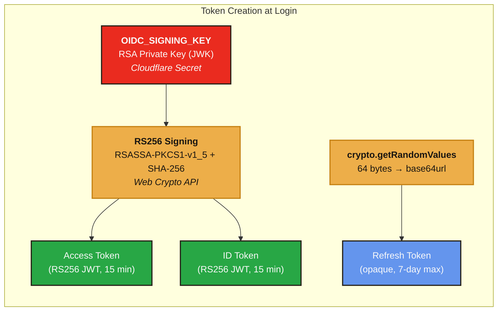
```mermaid
graph LR
    subgraph "Token Creation at Login"
        KEY["<b>OIDC_SIGNING_KEY</b><br/>RSA Private Key (JWK)<br/><i>Cloudflare Secret</i>"]
        SIGN["<b>RS256 Signing</b><br/>RSASSA-PKCS1-v1_5 + SHA-256<br/><i>Web Crypto API</i>"]
        RNG["<b>crypto.getRandomValues</b><br/>64 bytes → base64url"]
        AT["Access Token<br/>(RS256 JWT, 15 min)"]
        IT["ID Token<br/>(RS256 JWT, 15 min)"]
        RT["Refresh Token<br/>(opaque, 7-day max)"]
    end

    KEY --> SIGN
    SIGN --> AT
    SIGN --> IT
    RNG --> RT

    style KEY fill:#ea2b1f,stroke:#252017,stroke-width:2px,color:#f9f9f9
    style SIGN fill:#edae49,stroke:#c68214,stroke-width:2px,color:#1a1611
    style RNG fill:#edae49,stroke:#c68214,stroke-width:2px,color:#1a1611
    style AT fill:#28a745,stroke:#252017,stroke-width:2px,color:#f9f9f9
    style IT fill:#28a745,stroke:#252017,stroke-width:2px,color:#f9f9f9
    style RT fill:#6495ed,stroke:#252017,stroke-width:2px,color:#f9f9f9
```

**Token details:**

| Token | Signing | Lifetime | Format |
|-------|---------|----------|--------|
| Access Token | RS256 (RSASSA-PKCS1-v1_5 + SHA-256, Web Crypto API) | **15 minutes** (900 seconds) | Compact JWT (`header.payload.signature`) |
| ID Token | RS256 (same key pair) | **15 minutes** (same `exp` as access token) | Compact JWT |
| Refresh Token | None (not signed) | **7 days** absolute max from login | Opaque (64 random bytes, base64url-encoded) |

- **Private key storage:** Stored as an RSA JWK (JSON Web Key) in the `OIDC_SIGNING_KEY` Cloudflare Worker secret.
- **No fallback:** `OIDC_SIGNING_KEY` is required. The auth service will fail with a clear error if it is not configured, ensuring misconfiguration is caught immediately rather than silently degrading.
- **Refresh token storage:** The server stores `SHA-256(refresh_token)` as the KV key. The raw token value is never stored -- only the hash. KV TTL is set to the remaining seconds until the `absoluteExpiresAt` timestamp.

### OIDC Discovery and JWKS

Just like any OIDC-compliant Identity Provider, Strixun publishes a discovery document.

**Discovery endpoint:** `GET https://auth.idling.app/.well-known/openid-configuration`

This returns a JSON document describing all our OIDC capabilities:

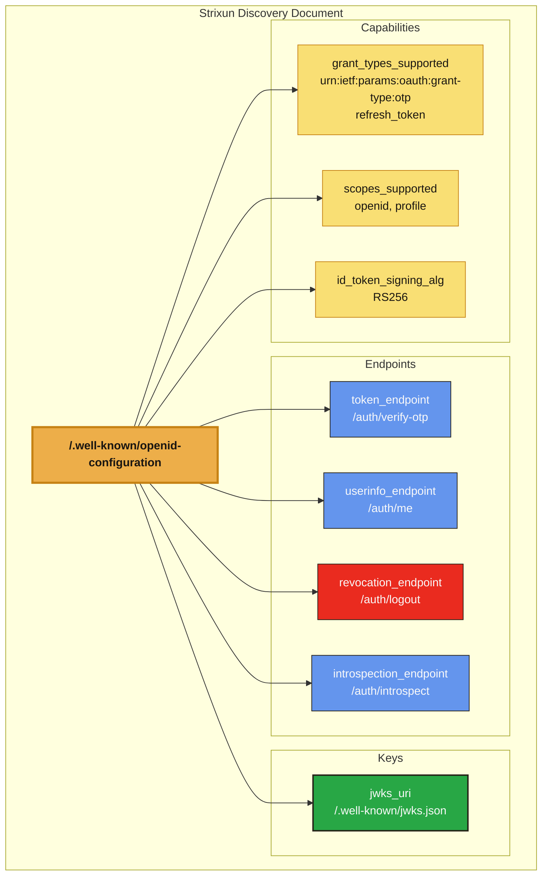
```mermaid
graph TB
    subgraph "Strixun Discovery Document"
        D["<b>/.well-known/openid-configuration</b>"]

        subgraph "Endpoints"
            TE["token_endpoint<br/>/auth/verify-otp"]
            UE["userinfo_endpoint<br/>/auth/me"]
            RE["revocation_endpoint<br/>/auth/logout"]
            IE["introspection_endpoint<br/>/auth/introspect"]
        end

        subgraph "Keys"
            JK["jwks_uri<br/>/.well-known/jwks.json"]
        end

        subgraph "Capabilities"
            GT["grant_types_supported<br/>urn:ietf:params:oauth:grant-type:otp<br/>refresh_token"]
            SC["scopes_supported<br/>openid, profile"]
            ALG["id_token_signing_alg<br/>RS256"]
        end
    end

    D --> TE
    D --> UE
    D --> RE
    D --> IE
    D --> JK
    D --> GT
    D --> SC
    D --> ALG

    style D fill:#edae49,stroke:#c68214,stroke-width:3px,color:#1a1611
    style TE fill:#6495ed,stroke:#252017,stroke-width:1px,color:#f9f9f9
    style UE fill:#6495ed,stroke:#252017,stroke-width:1px,color:#f9f9f9
    style RE fill:#ea2b1f,stroke:#252017,stroke-width:1px,color:#f9f9f9
    style IE fill:#6495ed,stroke:#252017,stroke-width:1px,color:#f9f9f9
    style JK fill:#28a745,stroke:#252017,stroke-width:2px,color:#f9f9f9
    style GT fill:#f9df74,stroke:#c68214,stroke-width:1px,color:#1a1611
    style SC fill:#f9df74,stroke:#c68214,stroke-width:1px,color:#1a1611
    style ALG fill:#f9df74,stroke:#c68214,stroke-width:1px,color:#1a1611
```

**JWKS endpoint:** `GET https://auth.idling.app/.well-known/jwks.json`

This returns the **public key** that any service can use to verify tokens. The response contains a JWK Set (a collection of keys, though we currently expose one):

| JWK Field | Description |
|-----------|------------|
| `kty` | Key type: `"RSA"` |
| `use` | Key usage: `"sig"` (signing) |
| `alg` | Algorithm: `"RS256"` |
| `kid` | Key ID (first 8 characters of the RFC 7638 thumbprint) |
| `n` | The RSA modulus (the large number that makes RSA work) |
| `e` | The RSA exponent (typically `"AQAB"` which is 65537 in base64url) |

Both endpoints are cached for 1 hour (`Cache-Control: public, max-age=3600`).

### How Other Services Verify Tokens

When a user makes a request to any Strixun API (say, the Customer API), that API must verify the token is legitimate. All services use a shared `@strixun/api-framework` package that handles this automatically.

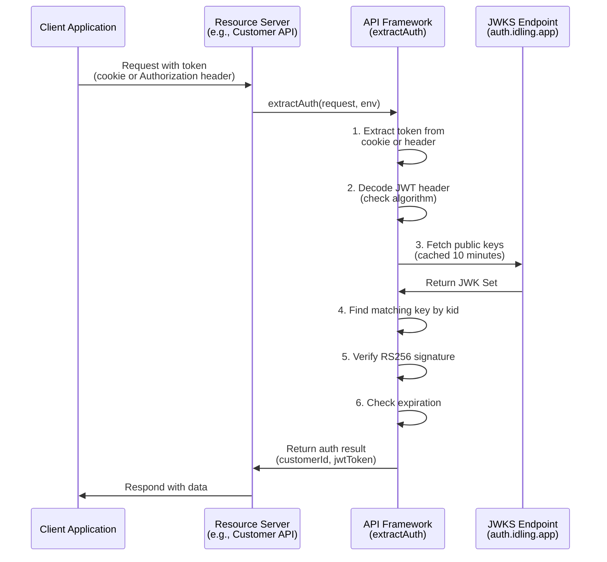
```mermaid
sequenceDiagram
    participant App as Client Application
    participant API as Resource Server<br/>(e.g., Customer API)
    participant FW as API Framework<br/>(extractAuth)
    participant JWKS as JWKS Endpoint<br/>(auth.idling.app)

    App->>API: Request with token<br/>(cookie or Authorization header)
    API->>FW: extractAuth(request, env)
    FW->>FW: 1. Extract token from<br/>cookie or header
    FW->>FW: 2. Decode JWT header<br/>(check algorithm)

    FW->>JWKS: 3. Fetch public keys<br/>(cached 10 minutes)
    JWKS->>FW: Return JWK Set
    FW->>FW: 4. Find matching key by kid
    FW->>FW: 5. Verify RS256 signature
    FW->>FW: 6. Check expiration
    FW->>API: Return auth result<br/>(customerId, jwtToken)
    API->>App: Respond with data
```

**The verification steps in detail:**

1. **Extract the token:** Look for an `auth_token` cookie first, then fall back to the `Authorization: Bearer <token>` header.
2. **Decode the header:** Read the `alg` (algorithm) and `kid` (key ID) from the token header. Only RS256 tokens are accepted.
3. **Fetch the JWKS:** Retrieve the public keys from `{JWT_ISSUER}/.well-known/jwks.json`. This response is cached for 10 minutes to avoid hitting the Auth Service on every single request.
4. **Match the key:** Find the public key in the JWKS whose `kid` matches the token's `kid` header. If no match, use the first key in the set.
5. **Verify the signature:** Use the Web Crypto API to mathematically confirm the token was signed by the corresponding private key.
6. **Check expiration:** Ensure the token's `exp` claim is in the future.

### Session Management and Cookies

Strixun uses **HttpOnly cookies** for session management across its subdomains. This is how Single Sign-On (SSO) works -- you log in once at `auth.idling.app` and your session works across `api.idling.app`, `streamkit.idling.app`, etc.

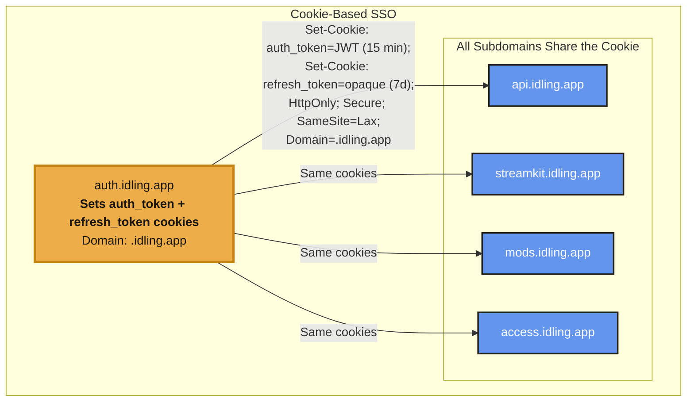
```mermaid
graph TB
    subgraph "Cookie-Based SSO"
        AUTH["auth.idling.app<br/><b>Sets auth_token + refresh_token cookies</b><br/>Domain: .idling.app"]

        subgraph "All Subdomains Share the Cookie"
            S1["api.idling.app"]
            S2["streamkit.idling.app"]
            S3["mods.idling.app"]
            S4["access.idling.app"]
        end
    end

    AUTH -->|"Set-Cookie: auth_token=JWT (15 min);<br/>Set-Cookie: refresh_token=opaque (7d);<br/>HttpOnly; Secure; SameSite=Lax;<br/>Domain=.idling.app"| S1
    AUTH -->|Same cookies| S2
    AUTH -->|Same cookies| S3
    AUTH -->|Same cookies| S4

    style AUTH fill:#edae49,stroke:#c68214,stroke-width:3px,color:#1a1611
    style S1 fill:#6495ed,stroke:#252017,stroke-width:2px,color:#f9f9f9
    style S2 fill:#6495ed,stroke:#252017,stroke-width:2px,color:#f9f9f9
    style S3 fill:#6495ed,stroke:#252017,stroke-width:2px,color:#f9f9f9
    style S4 fill:#6495ed,stroke:#252017,stroke-width:2px,color:#f9f9f9
```

**Cookie properties:**

| Property | Value | Why |
|----------|-------|-----|
| `HttpOnly` | `true` | Prevents JavaScript from reading the cookie (protects against XSS attacks) |
| `Secure` | `true` (production only) | Cookie is only sent over HTTPS (encrypted connections). Omitted in local dev so `http://localhost` works. |
| `SameSite` | `Lax` | Allows the cookie to be sent on top-level navigations to the same site while blocking cross-site subrequests (good balance of security and usability for same-root-domain SSO) |
| `Domain` | `.idling.app` (production) / `localhost` (dev) | Shared across all subdomains for SSO. Derived from `ALLOWED_ORIGINS`. |
| `Path` | `/` | Available on all paths |
| `Max-Age` (auth_token) | `900` (15 minutes) | Matches access token lifetime |
| `Max-Age` (refresh_token) | up to `604800` (7 days) | Remaining time until absolute refresh expiry |

**Two cookies are set on login and on each refresh:**

| Cookie Name | Content | Lifetime | Purpose |
|-------------|---------|----------|---------|
| `auth_token` | RS256 JWT access token | 15 minutes | Authorizes API requests |
| `refresh_token` | Opaque random string | Up to 7 days from login | Exchanges for a new access token when the old one expires |

**Server-side session storage:**

Each session is also stored in **Cloudflare KV** (a globally distributed key-value store) under the key pattern `otp-auth:session:{customerId}`. The session record contains:

| Field | Description |
|-------|------------|
| `customerId` | The user's unique identifier (MANDATORY) |
| `email` | The user's email address (plaintext lowercase, stored for internal use only -- never exposed in API responses) |
| `token` | A SHA-256 hash of the current access token (used for session/token correlation during logout and deny-list operations) |
| `expiresAt` | When the access token expires (ISO 8601 timestamp) |
| `createdAt` | When the session was created or last refreshed (ISO 8601 timestamp) |
| `ipAddress` | The client IP address at login/refresh time (from `CF-Connecting-IP` header) |
| `userAgent` | The browser/client User-Agent string (optional) |
| `country` | Geographic location derived from `CF-IPCountry` header (optional) |
| `fingerprint` | SHA-256 device fingerprint hash combining User-Agent, Accept-Language, and other browser characteristics (optional) |

Session records have a TTL (time-to-live) of **7 hours** (the "inactive cleanup" window). If the user is active and refreshes tokens, the session TTL is reset to 7 hours on each refresh. If the user is idle for 7+ hours, the session record auto-expires.

### Refresh Tokens and Token Rotation

Access tokens expire after **15 minutes**. Rather than forcing the user to re-authenticate via OTP every 15 minutes, Strixun issues an **opaque refresh token** alongside the access token. The client can silently exchange the refresh token for a brand-new access token (and a brand-new refresh token) without any user interaction.

**Key properties:**

| Property | Value | Why |
|----------|-------|-----|
| Format | Opaque (64 random bytes, base64url) | Not a JWT -- cannot be decoded client-side; validated by KV lookup only |
| Delivery | HttpOnly cookie (`refresh_token`) | Same security model as the access token cookie |
| Max lifetime | **7 days** from the original login | Enforced by an immutable `absoluteExpiresAt` timestamp set once at login |
| Rotation | Single-use -- each refresh issues a new refresh token and invalidates the old one | Mitigates stolen-token replay attacks |
| Storage key | `otp-auth:refresh-token:{SHA256(token)}` in KV | KV TTL = remaining seconds until absolute expiry |

**Refresh token KV record structure** (stored as JSON under the key above):

| Field | Type | Description |
|-------|------|-------------|
| `customerId` | `string` | The customer this refresh token belongs to |
| `email` | `string` | Plaintext lowercase email (server-side only -- carried to session KV on refresh, **never** placed in JWTs or API responses) |
| `absoluteExpiresAt` | `string` (ISO 8601) | Immutable timestamp set at login = `loginTime + 7 days`. Inherited across all rotations. |
| `createdAt` | `string` (ISO 8601) | When this particular refresh token was generated (changes on each rotation) |
| `ipAddress` | `string` | Client IP at the time this token was issued |
| `keyId` | `string` or `null` | API key ID for inter-tenant SSO scoping (if the login was initiated via an API key) |
| `ssoScope` | `string[]` | Which API keys can use sessions created from this token (`['*']` = all, `[keyId]` = isolated) |

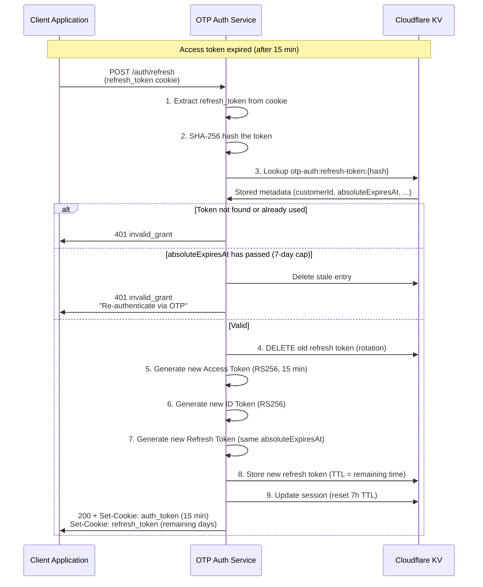
```mermaid
sequenceDiagram
    participant Client as Client Application
    participant Auth as OTP Auth Service
    participant KV as Cloudflare KV

    Note over Client,KV: Access token expired (after 15 min)
    Client->>Auth: POST /auth/refresh<br/>(refresh_token cookie)
    Auth->>Auth: 1. Extract refresh_token from cookie
    Auth->>Auth: 2. SHA-256 hash the token
    Auth->>KV: 3. Lookup otp-auth:refresh-token:{hash}
    KV->>Auth: Stored metadata (customerId, absoluteExpiresAt, ...)

    alt Token not found or already used
        Auth->>Client: 401 invalid_grant
    else absoluteExpiresAt has passed (7-day cap)
        Auth->>KV: Delete stale entry
        Auth->>Client: 401 invalid_grant<br/>"Re-authenticate via OTP"
    else Valid
        Auth->>KV: 4. DELETE old refresh token (rotation)
        Auth->>Auth: 5. Generate new Access Token (RS256, 15 min)
        Auth->>Auth: 6. Generate new ID Token (RS256)
        Auth->>Auth: 7. Generate new Refresh Token (same absoluteExpiresAt)
        Auth->>KV: 8. Store new refresh token (TTL = remaining time)
        Auth->>KV: 9. Update session (reset 7h TTL)
        Auth->>Client: 200 + Set-Cookie: auth_token (15 min)<br/>Set-Cookie: refresh_token (remaining days)
    end
```

**How the client handles it (automatic, transparent):**

Both the Zustand (React) and Svelte auth store adapters follow the same pattern:

1. Call `/auth/me` to check authentication status.
2. If `/auth/me` returns null (401 -- token expired), call `POST /auth/refresh`.
3. If refresh succeeds (server sets new cookies), retry `/auth/me`.
4. If refresh fails (token expired or invalid), treat the user as logged out.

This means the user stays logged in silently for up to 7 days without ever re-entering an OTP code, as long as they visit the app at least once every 7 hours (the session inactive-cleanup window). After 7 days from the original login, the refresh token itself expires and the user must log in again.

**Stolen token mitigation:**

Because each refresh token is single-use (deleted from KV after one exchange), an attacker who steals a refresh token can only use it once. If the legitimate user refreshes first, the attacker's token becomes invalid. If the attacker refreshes first, the legitimate user's next refresh fails, alerting them to log in again (which invalidates the attacker's new token via session replacement).

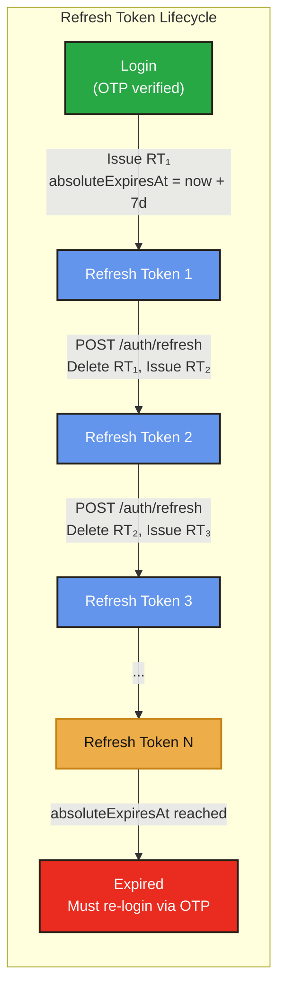
```mermaid
graph LR
    subgraph "Refresh Token Lifecycle"
        LOGIN["Login<br/>(OTP verified)"] -->|"Issue RT₁<br/>absoluteExpiresAt = now + 7d"| RT1["Refresh Token 1"]
        RT1 -->|"POST /auth/refresh<br/>Delete RT₁, Issue RT₂"| RT2["Refresh Token 2"]
        RT2 -->|"POST /auth/refresh<br/>Delete RT₂, Issue RT₃"| RT3["Refresh Token 3"]
        RT3 -->|"..."| RTN["Refresh Token N"]
        RTN -->|"absoluteExpiresAt reached"| EXPIRED["Expired<br/>Must re-login via OTP"]
    end

    style LOGIN fill:#28a745,stroke:#252017,stroke-width:2px,color:#f9f9f9
    style RT1 fill:#6495ed,stroke:#252017,stroke-width:2px,color:#f9f9f9
    style RT2 fill:#6495ed,stroke:#252017,stroke-width:2px,color:#f9f9f9
    style RT3 fill:#6495ed,stroke:#252017,stroke-width:2px,color:#f9f9f9
    style RTN fill:#edae49,stroke:#c68214,stroke-width:2px,color:#1a1611
    style EXPIRED fill:#ea2b1f,stroke:#252017,stroke-width:2px,color:#f9f9f9
```

### Token Introspection

Token introspection (defined in RFC 7662) allows any service to ask the Identity Provider: **"Is this token still valid right now?"**

This is useful because a token might have been revoked (e.g., the user logged out) even though its expiration date has not passed yet.

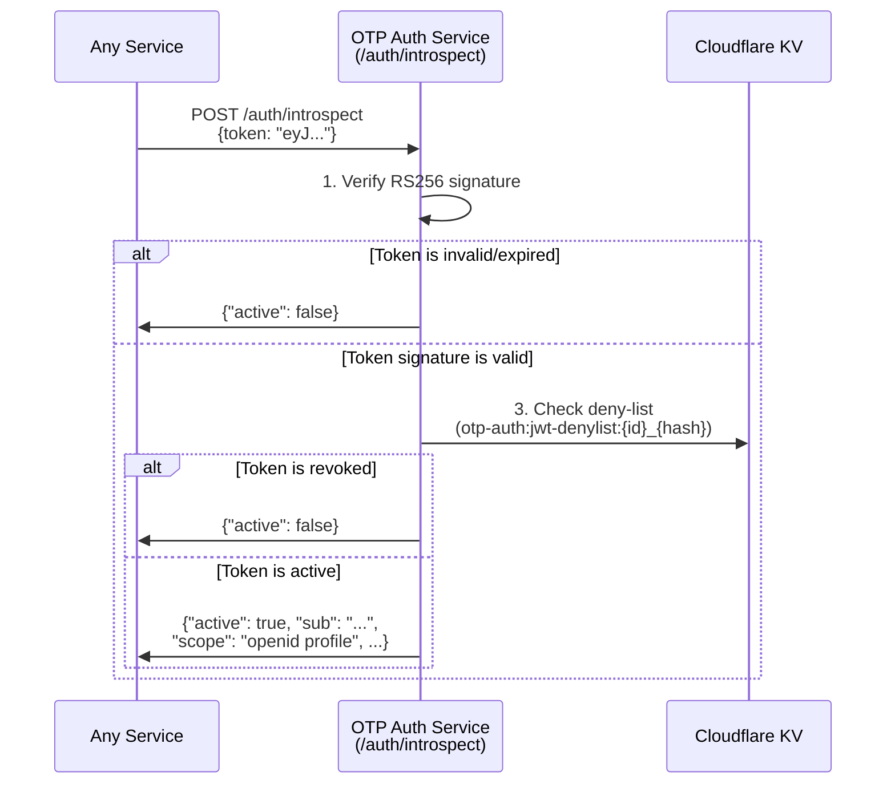
```mermaid
sequenceDiagram
    participant Service as Any Service
    participant Auth as OTP Auth Service<br/>(/auth/introspect)
    participant KV as Cloudflare KV

    Service->>Auth: POST /auth/introspect<br/>{token: "eyJ..."}
    Auth->>Auth: 1. Verify RS256 signature
    alt Token is invalid/expired
        Auth->>Service: {"active": false}
    else Token signature is valid
        Auth->>KV: 3. Check deny-list<br/>(otp-auth:jwt-denylist:{id}_{hash})
        alt Token is revoked
            Auth->>Service: {"active": false}
        else Token is active
            Auth->>Service: {"active": true, "sub": "...",<br/>"scope": "openid profile", ...}
        end
    end
```

**Introspection response (when active):**

| Field | Description |
|-------|------------|
| `active` | `true` -- the token is valid and not revoked |
| `sub` | The user's customer ID |
| `client_id` | The API key ID (if applicable) |
| `scope` | The granted scopes |
| `token_type` | `"Bearer"` |
| `exp` | Expiration timestamp |
| `iat` | Issued-at timestamp |
| `iss` | Issuer URL |
| `aud` | Intended audience |
| `email_verified` | Whether the email is verified |
| `customerId` | Customer ID (custom claim) |

### Logout and Token Revocation

When a user logs out, the system must ensure their token cannot be used anymore, even though the JWT itself has not expired. Strixun handles this with a **deny-list** pattern:

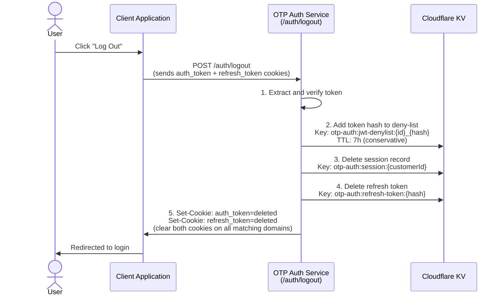
```mermaid
sequenceDiagram
    actor User
    participant App as Client Application
    participant Auth as OTP Auth Service<br/>(/auth/logout)
    participant KV as Cloudflare KV

    User->>App: Click "Log Out"
    App->>Auth: POST /auth/logout<br/>(sends auth_token + refresh_token cookies)
    Auth->>Auth: 1. Extract and verify token
    Auth->>KV: 2. Add token hash to deny-list<br/>Key: otp-auth:jwt-denylist:{id}_{hash}<br/>TTL: 7h (conservative)
    Auth->>KV: 3. Delete session record<br/>Key: otp-auth:session:{customerId}
    Auth->>KV: 4. Delete refresh token<br/>Key: otp-auth:refresh-token:{hash}
    Auth->>App: 5. Set-Cookie: auth_token=deleted<br/>Set-Cookie: refresh_token=deleted<br/>(clear both cookies on all matching domains)
    App->>User: Redirected to login
```

**Why a deny-list instead of deleting the token?**

JWTs are "stateless" by design -- once issued, they are self-contained and do not need the Identity Provider to be valid. This is both their strength (no database lookup needed for verification) and their weakness (they cannot be "deleted"). The deny-list pattern solves this by maintaining a short list of explicitly revoked tokens. Deny-list entries have a TTL of **7 hours** (matching the session cleanup window), which is intentionally conservative -- it covers any in-flight access tokens (15-minute lifetime) with a wide safety margin and ensures backward compatibility during migration from older token lifetimes. Entries automatically clean themselves up after 7 hours.

### Scopes in Strixun

Strixun supports three OIDC scopes that control what information is returned by the `/auth/me` (UserInfo) endpoint:

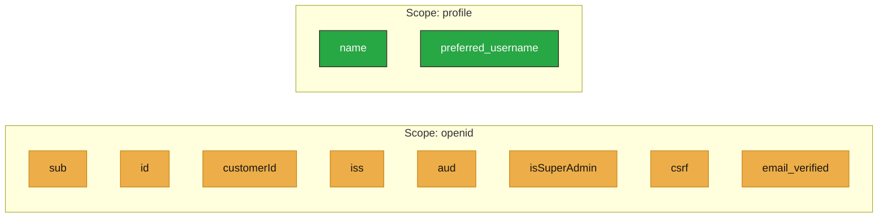
```mermaid
graph LR
    subgraph "Scope: openid"
        A1["sub"]
        A2["id"]
        A3["customerId"]
        A4["iss"]
        A5["aud"]
        A6["isSuperAdmin"]
        A7["csrf"]
        A8["email_verified"]
    end

    subgraph "Scope: profile"
        C1["name"]
        C2["preferred_username"]
    end

    style A1 fill:#edae49,stroke:#c68214,stroke-width:1px,color:#1a1611
    style A2 fill:#edae49,stroke:#c68214,stroke-width:1px,color:#1a1611
    style A3 fill:#edae49,stroke:#c68214,stroke-width:1px,color:#1a1611
    style A4 fill:#edae49,stroke:#c68214,stroke-width:1px,color:#1a1611
    style A5 fill:#edae49,stroke:#c68214,stroke-width:1px,color:#1a1611
    style A6 fill:#edae49,stroke:#c68214,stroke-width:1px,color:#1a1611
    style A7 fill:#edae49,stroke:#c68214,stroke-width:1px,color:#1a1611
    style A8 fill:#edae49,stroke:#c68214,stroke-width:1px,color:#1a1611
    style C1 fill:#28a745,stroke:#252017,stroke-width:1px,color:#f9f9f9
    style C2 fill:#28a745,stroke:#252017,stroke-width:1px,color:#f9f9f9
```

**Privacy note:** The raw email address is **never** included in JWT payloads, token responses, or the UserInfo endpoint. Only `email_verified` (a true/false flag) is included, confirming that the user authenticated via OTP. The `customerId` is the sole external identifier. Email exists only in server-side KV storage (session and refresh token records) for internal operations like OTP verification and access provisioning.

### Endpoint Reference

All OIDC-related endpoints on the OTP Auth Service:

| Endpoint | Method | Auth Required | Description |
|----------|--------|--------------|-------------|
| `/.well-known/openid-configuration` | GET | No | OIDC Discovery document |
| `/.well-known/jwks.json` | GET | No | Public signing keys |
| `/auth/request-otp` | POST | No | Request a one-time password |
| `/auth/verify-otp` | POST | No | Exchange OTP for access token + ID token + refresh token (sets both HttpOnly cookies) |
| `/auth/me` | GET | Yes (cookie or Bearer) | Get current user info (UserInfo) |
| `/auth/logout` | POST | Yes (cookie or Bearer) | Revoke access token (deny-list), delete session and refresh token from KV, clear both cookies |
| `/auth/refresh` | POST | No (refresh_token cookie) | Exchange refresh token for new access + refresh tokens (rotation) |
| `/auth/introspect` | POST | No (token in body) | Check if a token is still active |

### Environment Configuration

Each service in the monorepo requires certain environment variables for OIDC to function:

| Variable | Required By | Required? | Description |
|----------|------------|-----------|-------------|
| `OIDC_SIGNING_KEY` | OTP Auth Service only | **REQUIRED** | The RSA private key (JWK format) used for RS256 signing. Without this, the auth service will not issue tokens. |
| `JWT_ISSUER` | All services | **REQUIRED** | The issuer URL (e.g., `https://auth.idling.app`). Resource servers use this to locate the JWKS endpoint for token verification. |
| `AUTH_SERVICE_URL` | All services | Optional | Fallback for `JWT_ISSUER`. Also used for service-to-service calls (e.g., `POST /auth/service/issue-token`). |
| `JWT_SECRET` | OTP Auth Service | **REQUIRED** | Used **only** for AES-GCM encryption of API keys at rest (via `encryptData`/`decryptData`). **Not** used for JWT signing or verification. |
| `ALLOWED_ORIGINS` | OTP Auth Service | **REQUIRED** (prod) | Comma-separated list of allowed CORS origins. Also used to derive cookie domains for SSO. |

These are configured in each service's `wrangler.toml` (for non-secret values) and via Cloudflare's secret management (for `JWT_SECRET` and `OIDC_SIGNING_KEY`).

### Generating and Deploying the OIDC Signing Key

The `OIDC_SIGNING_KEY` is the RSA private key that the OTP Auth Service uses to sign all tokens. Without it, the auth service **will not start** -- RS256 signing is required, not optional.

**Step 1: Generate the key**

Run this command in any terminal with Node.js installed:

```bash
node -e "crypto.subtle.generateKey({name:'RSASSA-PKCS1-v1_5',modulusLength:2048,publicExponent:new Uint8Array([1,0,1]),hash:'SHA-256'},true,['sign','verify']).then(k=>crypto.subtle.exportKey('jwk',k.privateKey)).then(j=>console.log(JSON.stringify(j)))"
```

This outputs a JSON string -- the RSA private key in JWK format.

**Step 2: Deploy to Cloudflare (production)**

```bash
cd serverless/otp-auth-service
wrangler secret put OIDC_SIGNING_KEY
# Paste the JSON output from Step 1 when prompted
```

**Step 3: Add to GitHub Actions secrets (CI/CD)**

If deploying via GitHub Actions:
1. Go to your repository on GitHub
2. Navigate to **Settings** > **Secrets and variables** > **Actions**
3. Click **New repository secret**
4. Name: `OIDC_SIGNING_KEY`
5. Value: The JSON output from Step 1
6. Reference it in your workflow: `wrangler secret put OIDC_SIGNING_KEY <<< "${{ secrets.OIDC_SIGNING_KEY }}"`

**Local development:**

The development environment already has a pre-generated dev-only RSA key embedded in the `[env.development.vars]` section of `serverless/otp-auth-service/wrangler.toml`. No manual setup needed for local dev.

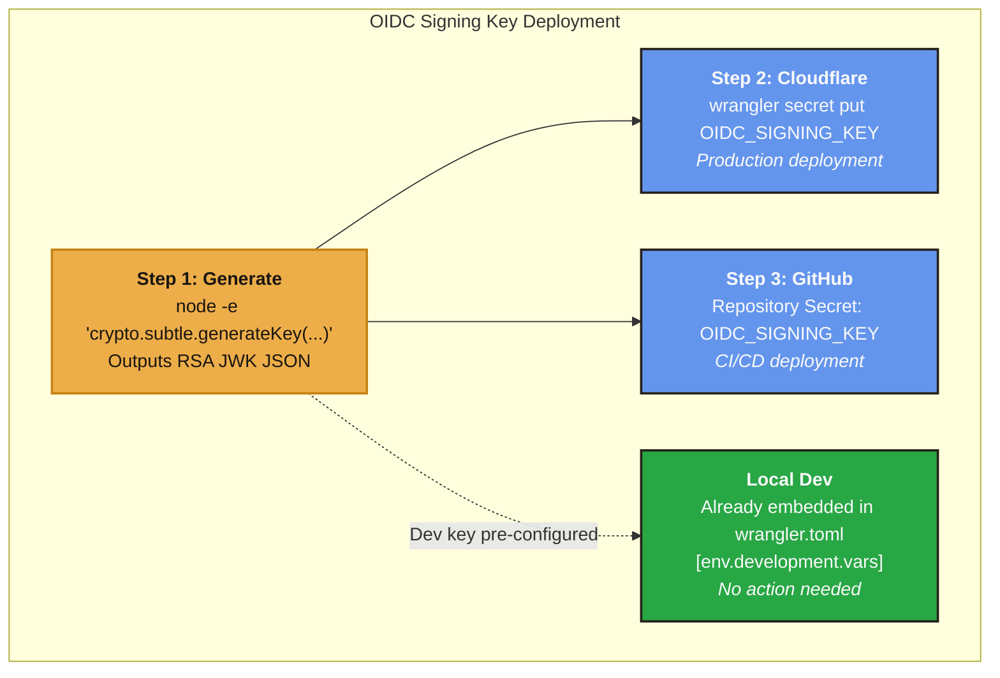
```mermaid
graph TB
    subgraph "OIDC Signing Key Deployment"
        GEN["<b>Step 1: Generate</b><br/>node -e 'crypto.subtle.generateKey(...)'<br/>Outputs RSA JWK JSON"]
        CF["<b>Step 2: Cloudflare</b><br/>wrangler secret put OIDC_SIGNING_KEY<br/><i>Production deployment</i>"]
        GH["<b>Step 3: GitHub</b><br/>Repository Secret: OIDC_SIGNING_KEY<br/><i>CI/CD deployment</i>"]
        LOCAL["<b>Local Dev</b><br/>Already embedded in wrangler.toml<br/>[env.development.vars]<br/><i>No action needed</i>"]
    end

    GEN --> CF
    GEN --> GH
    GEN -.->|"Dev key pre-configured"| LOCAL

    style GEN fill:#edae49,stroke:#c68214,stroke-width:2px,color:#1a1611
    style CF fill:#6495ed,stroke:#252017,stroke-width:2px,color:#f9f9f9
    style GH fill:#6495ed,stroke:#252017,stroke-width:2px,color:#f9f9f9
    style LOCAL fill:#28a745,stroke:#252017,stroke-width:2px,color:#f9f9f9
```

**Key rotation:** To rotate the key, generate a new one, deploy it to Cloudflare, update GitHub secrets, and redeploy. Active access tokens (up to 15 minutes old) signed with the old key will fail verification once the JWKS endpoint serves the new public key. Users with valid refresh tokens will automatically get new access tokens signed with the new key on their next refresh. Others will need to re-authenticate.

### Local Development Setup

All services are pre-configured for local OIDC development out of the box:

| Service | Local Port | `JWT_ISSUER` in Dev |
|---------|-----------|-------------------|
| OTP Auth Service (Identity Provider) | `:8787` | `http://localhost:8787` |
| Customer API | `:8790` | `http://localhost:8787` |
| Streamkit API | varies | `http://localhost:8787` |
| Access Service | `:8795` | `http://localhost:8787` |
| Chat Signaling | varies | `http://localhost:8787` |
| Mods API | varies | `http://localhost:8787` |
| URL Shortener | varies | `http://localhost:8787` |

All resource servers point `JWT_ISSUER` to the local auth service (`http://localhost:8787`) in development mode. When verifying tokens, they fetch the JWKS from `http://localhost:8787/.well-known/jwks.json` -- the local auth worker, not production.

The OTP Auth Service's development environment includes a pre-generated `OIDC_SIGNING_KEY` so RS256 token signing works locally without any manual key setup.

---

## Glossary

| Term | Definition |
|------|-----------|
| **API** | Application Programming Interface -- a set of rules that allows different software programs to communicate with each other. |
| **Asymmetric Encryption** | A method using two mathematically linked keys: a private key (kept secret) and a public key (shared openly). What one encrypts, only the other can decrypt. |
| **Bearer Token** | A token that grants access to whoever "bears" (possesses) it. Sent in the `Authorization` header of HTTP requests. |
| **Claim** | A piece of information inside a JWT, such as the user ID, expiration time, or permissions. Strixun intentionally excludes email from all JWT claims. |
| **Cloudflare KV** | A globally distributed key-value data store provided by Cloudflare. Used for storing sessions, deny-lists, and other ephemeral data. |
| **Cloudflare Worker** | A lightweight, serverless function that runs at the edge of Cloudflare's global network, close to users. |
| **Cookie** | A small piece of data stored by the browser and automatically sent with every request to the matching domain. |
| **CORS** | Cross-Origin Resource Sharing -- a security feature that controls which websites can make requests to an API. |
| **CSRF** | Cross-Site Request Forgery -- an attack where a malicious site tricks a user's browser into making unwanted requests. CSRF tokens prevent this. |
| **Discovery Document** | A JSON file at a well-known URL that describes an Identity Provider's capabilities, endpoints, and configuration. |
| **Grant Type** | The method used to obtain an access token. Standard types include authorization code, client credentials, and refresh_token. Strixun supports `urn:ietf:params:oauth:grant-type:otp` (custom OTP grant) and `refresh_token`. |
| **HttpOnly** | A cookie flag that prevents JavaScript from accessing the cookie, protecting against cross-site scripting (XSS) attacks. |
| **HS256** | HMAC-SHA256 -- a symmetric signing algorithm where the same secret key is used to both create and verify signatures. |
| **Identity Provider (IdP)** | A service that authenticates users and issues tokens proving their identity. |
| **JSON** | JavaScript Object Notation -- a lightweight, human-readable format for structuring data. |
| **JWK** | JSON Web Key -- a JSON format for representing cryptographic keys. |
| **JWKS** | JSON Web Key Set -- a collection of JWKs, typically published at a well-known URL. |
| **JWT** | JSON Web Token -- a compact, signed token format used to securely transmit information between parties. |
| **KV** | Key-Value store -- a simple database where each piece of data is stored under a unique key. |
| **Monorepo** | A single code repository containing multiple projects or services. |
| **OAuth 2.0** | An authorization framework that enables limited, scoped access to resources without sharing credentials. |
| **OIDC** | OpenID Connect -- an identity layer built on top of OAuth 2.0 that provides authentication (identity verification). |
| **OTP** | One-Time Password -- a temporary code sent to a user's email or phone for passwordless authentication. Strixun uses 9-digit codes generated via cryptographically secure randomness. |
| **Refresh Token** | An opaque credential used to obtain a new access token without requiring the user to re-authenticate. In Strixun, refresh tokens are single-use, stored hashed in KV, and have a 7-day absolute max lifetime. |
| **Resource Server** | An API or service that hosts protected resources and verifies tokens before granting access. |
| **RS256** | RSA Signature with SHA-256 -- an asymmetric signing algorithm using a public/private key pair. |
| **Scope** | A permission category that limits what information or actions a token grants access to. |
| **Serverless** | A cloud computing model where the cloud provider manages the server infrastructure; developers only write the application code. |
| **SSO** | Single Sign-On -- the ability to log in once and access multiple services without re-authenticating. |
| **Symmetric Encryption** | A method using a single shared key for both encryption and decryption. Both parties must possess the same key. |
| **Token** | A digitally signed piece of data that represents a user's identity or permissions. |
| **Token Rotation** | A security practice where each use of a refresh token issues a new one and invalidates the old one. This means a stolen refresh token can only be used once before it becomes invalid. |
| **TTL** | Time-To-Live -- the duration for which a piece of data is valid before it expires and is automatically deleted. |
| **UserInfo Endpoint** | An OIDC endpoint that returns claims about the authenticated user based on the granted scopes. |
| **Web Crypto API** | A browser and server-side API for performing cryptographic operations (hashing, signing, encryption) securely. |
| **XSS** | Cross-Site Scripting -- an attack where malicious scripts are injected into trusted websites. |

---

**Related Documentation:**
- [End-to-End Service Integration](./SERVICE_INTEGRATION_E2E.md) -- How all services connect, authenticate, and trust each other
- [Authentication Methods](../╠═══ SECURITY  ═══════════╣/AUTHENTICATION_METHODS.md)
- [OTP Auth Service README](../╠═══ SERVICES  ═══════════╣/OTP_AUTH_SERVICE_README.md)
- [Multi-Stage Encryption Diagram](./MULTI_STAGE_ENCRYPTION_DIAGRAM.md)
- [OTP Auth Storage Architecture](./OTP_AUTH_STORAGE_ARCHITECTURE.md)
- [API Framework Enhanced Architecture](./API_FRAMEWORK_ENHANCED_ARCHITECTURE.md)

---

**Last Updated**: 2026-02-19
**Version**: 1.2.0
**Status**: Complete
