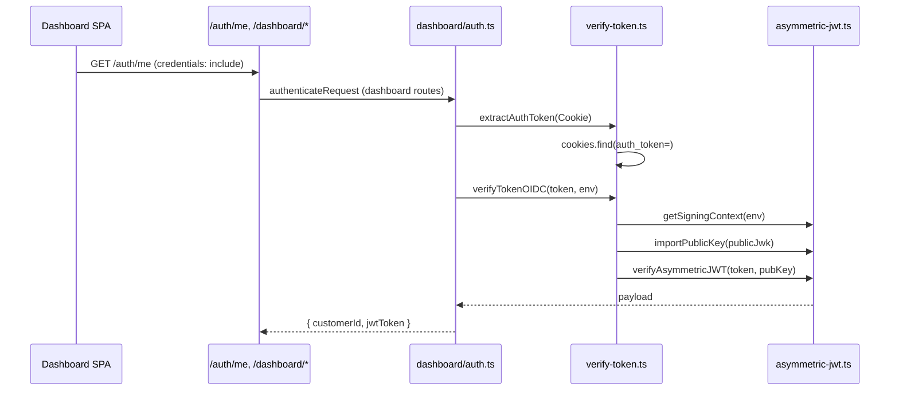
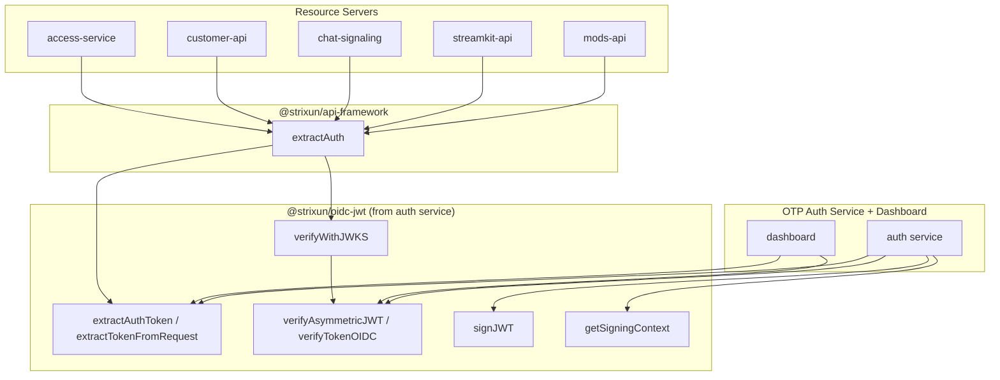

# OIDC/JWT Consolidation Audit

**Purpose:** Map duplicate OIDC/JWT-related functions across the codebase and propose consolidated shared utilities for consistent, maintainable auth flow.

**Canonical reference:** The auth service developer dashboard works completely. The shared/consolidated solution must be **based on that working implementation** — extract it into a shared package and have all other services use it.

---

## Executive Summary

| Area | Current State | Recommendation |
|------|---------------|----------------|
| **Auth service dashboard** | ✅ Working — `verify-token.ts` + `asymmetric-jwt.ts` + `dashboard/auth.ts` | **Source of truth** — extract to shared package |
| **Resource server auth** | Uses api-framework `extractAuth` (JWKS path) | Migrate to shared package (same verify, JWKS key source) |
| **Token extraction** | Duplicated; dashboard uses `extractAuthToken` | Consolidate — dashboard pattern is canonical |
| **RS256 verification** | Dashboard: `verifyAsymmetricJWT`; api-framework: `verifyRS256JWT` | Unify — dashboard implementation is canonical |
| **Signing** | `asymmetric-jwt.ts` (issuer only) | Move to shared package with verification |

---

## 0. Canonical Implementation: Auth Service Dashboard

**The dashboard works.** Its flow is the reference for consolidation.

### Dashboard Auth Flow



### Key Files (Source of Truth)

| File | Exports | Purpose |
|------|---------|---------|
| `otp-auth-service/utils/verify-token.ts` | `extractAuthToken`, `verifyTokenOIDC` | Token extraction (cookie), RS256 verification |
| `otp-auth-service/utils/asymmetric-jwt.ts` | `getSigningContext`, `signJWT`, `verifyAsymmetricJWT`, `importPublicKey`, `toPublicJwk` | Signing, verification, key handling |
| `otp-auth-service/router/dashboard/auth.ts` | `authenticateRequest` | Full auth flow: extract + verify + denylist check |

### Consolidation Strategy

**Extract** the auth service's `verify-token` + `asymmetric-jwt` into a shared package. Resource servers use the **same verification logic** but with JWKS-fetched keys instead of local `OIDC_SIGNING_KEY`. No behavioral change to the working dashboard — we lift it out and have others import it.

---

## 1. Token Extraction (Cookie + Bearer)

**Duplication:** Same logic repeated in multiple files.

| Location | Function | Scope | Bearer? |
|----------|----------|-------|---------|
| `packages/api-framework/route-protection.ts` | `extractAuth` (inline) | Cookie + Bearer | ✓ |
| `serverless/otp-auth-service/utils/verify-token.ts` | `extractAuthToken` | Cookie only | ✗ |
| `serverless/otp-auth-service/router/auth-routes.ts` | `authenticateJWT` (inline) | Cookie + Bearer | ✓ |
| `serverless/otp-auth-service/router.ts` | Inline | Cookie | ✗ |
| `serverless/otp-auth-service/handlers/auth/session.ts` | Inline | Cookie | ✗ |
| `serverless/url-shortener/router/routes.ts` | Inline (4+ places) | Cookie + Bearer | ✓ |
| `serverless/mods-api/worker.ts` | Inline | Cookie | ✗ |
| `serverless/customer-api/worker.ts` | Inline | Cookie | ✗ |

**Pattern:** `cookies.find(c => c.startsWith('auth_token='))` then `substring('auth_token='.length).trim()`.

**Canonical:** `verify-token.ts` → `extractAuthToken(cookieHeader)`. Dashboard uses cookie-only; auth-routes and session use cookie + Bearer.

**Recommendation:** Extract `extractAuthToken` to shared package. Add `extractTokenFromRequest(request)` that does cookie + Bearer (auth-routes pattern). Dashboard keeps cookie-only path; others use full extraction.

---

## 2. RS256 JWT Verification

**Two implementations doing the same thing:**

| Location | Function | Input | Used By |
|----------|----------|-------|---------|
| `packages/api-framework/jwt.ts` | `verifyRS256JWT(token, jwk)` | JWK (from JWKS) | Resource servers |
| `serverless/otp-auth-service/utils/asymmetric-jwt.ts` | `verifyAsymmetricJWT(token, publicKey)` | CryptoKey | Auth service (issuer) |

**Flow difference:**
- **Auth service (dashboard):** `getSigningContext` → `importPublicKey(publicJwk)` → `verifyAsymmetricJWT(token, cryptoKey)` — **canonical, works**
- **Resource servers:** Fetch JWKS → get JWK → `verifyRS256JWT(token, jwk)` — same algorithm, different key source

**Recommendation:** Extract `verifyAsymmetricJWT` from auth service into shared package. Add `verifyRS256JWT(token, jwk)` that imports JWK to CryptoKey and calls the same core verify. Single implementation; both paths use it.

---

## 3. Auth Service (Issuer) — Canonical Implementation

**Current:** Auth service dashboard uses `verify-token.ts` + `asymmetric-jwt.ts`. This is the **working reference**.

| File | What It Does |
|------|--------------|
| `utils/verify-token.ts` | `verifyTokenOIDC(token, env)`, `extractAuthToken(cookieHeader)` — **canonical** |
| `utils/asymmetric-jwt.ts` | `verifyAsymmetricJWT`, `getSigningContext`, `signJWT` — **canonical** |
| `router/dashboard/auth.ts` | `authenticateRequest` — uses verify-token, **dashboard entry point** |
| `router/auth-routes.ts` | `authenticateJWT` — duplicate extraction; should use verify-token |
| `handlers/auth/session.ts` | Inline verification — should use verify-token |
| `handlers/auth/introspect.ts` | Uses verifyAsymmetricJWT — keep or use verify-token |

**Recommendation:** Extract `verify-token` + `asymmetric-jwt` to shared package. Auth service imports from shared (no behavior change). Resource servers use same verify with JWKS key source.

---

## 4. Resource Server Auth — Already Aligned

| Service | Auth Util | Source |
|---------|-----------|--------|
| mods-api | `authenticateRequest` → `extractAuth` | api-framework |
| streamkit-api | `extractCustomerFromJWT` → `extractAuth` | api-framework |
| chat-signaling | `authenticateRequest` → `extractAuth` | api-framework |
| customer-api | `authenticateRequest` → `extractAuth` | api-framework |
| access-service | `authenticateRequest` → `extractAuth` | api-framework |

**Status:** ✅ All resource servers use `extractAuth` from api-framework. No change needed.

---

## 5. Base64url Helpers

| Location | Functions |
|----------|-----------|
| `otp-auth-service/utils/asymmetric-jwt.ts` | `base64urlEncode`, `base64urlDecode` |
| `api-framework/jwt.ts` | Inline in `verifyRS256JWT`, `decodeJWTHeader` |

**Recommendation:** Add `base64urlEncode`/`base64urlDecode` to api-framework (or a small `@strixun/crypto-utils` package). Both jwt.ts and asymmetric-jwt can use them.

---

## 6. JWKS Fetching

| Location | Function | Notes |
|----------|----------|-------|
| `api-framework/route-protection.ts` | `fetchJWKS(env)` | Private, 10-min cache |

**Status:** Single implementation. No duplication.

---

## 7. Signing (Issuer Only)

| Location | Functions |
|----------|-----------|
| `otp-auth-service/utils/asymmetric-jwt.ts` | `signJWT`, `getSigningContext`, `toPublicJwk`, `computeHashClaim` |

**Status:** Single location. Only the auth service signs tokens. Could move to `@strixun/oidc-provider` if we want a dedicated OIDC package, but not required for consolidation.

---

## 8. Inline `auth_token` Checks (Non-Extraction)

Many files check `cookieHeader?.includes('auth_token=')` for **detecting** HttpOnly cookie mode (to disable encryption). This is a different use case — not extraction.

| Pattern | Purpose |
|---------|---------|
| `cookieHeader?.includes('auth_token=')` | Detect browser/cookie auth vs service-to-service |
| `cookies.find(c => c.startsWith('auth_token='))` | Extract token value |

**Recommendation:** Add `hasAuthTokenCookie(request: Request): boolean` to api-framework for the detection case. Reduces repeated string checks.

---

## Proposed Consolidation Plan

**Principle:** Extract the working auth service dashboard implementation. Do not rewrite it.

### Phase 1: Create Shared Package from Auth Service (Extract, Don't Rewrite)

1. **Create `@strixun/oidc-jwt`** (or add to api-framework) by **copying** from auth service:
   - `asymmetric-jwt.ts` → shared (signJWT, verifyAsymmetricJWT, getSigningContext, importPublicKey, toPublicJwk, base64url helpers)
   - `verify-token.ts` → shared (extractAuthToken, verifyTokenOIDC)

2. **Add resource-server path** to shared package:
   - `verifyWithJWKS(token, env)` — fetch JWKS, get matching key, call verifyAsymmetricJWT with imported key
   - `extractTokenFromRequest(request)` — cookie + Bearer (from auth-routes pattern)

3. **Auth service** — switch to importing from shared package. Verify dashboard still works.

### Phase 2: Migrate Resource Servers

1. **api-framework** — replace internal verifyRS256JWT/fetchJWKS with shared package's verifyWithJWKS
2. **extractAuth** — use shared extractTokenFromRequest + verifyWithJWKS
3. **All resource servers** — no change (they use extractAuth)

### Phase 3: Auth Service Internal Cleanup

1. **auth-routes `authenticateJWT`** — use shared extractTokenFromRequest + verifyTokenOIDC
2. **session.ts handleGetMe** — use verifyTokenOIDC from shared
3. **introspect.ts** — use verifyTokenOIDC from shared

### Package Structure

**Option A: New package `@strixun/oidc-jwt`**
```
packages/oidc-jwt/
├── asymmetric.ts     # From otp-auth-service/utils/asymmetric-jwt.ts
├── verify-token.ts   # From otp-auth-service/utils/verify-token.ts
├── jwks.ts           # verifyWithJWKS (for resource servers)
└── index.ts
```

**Option B: Add to api-framework** (if we want one package)
```
packages/api-framework/
├── oidc/
│   ├── asymmetric.ts   # Lifted from auth service
│   ├── verify-token.ts
│   └── jwks.ts
├── jwt.ts             # Re-export or thin wrapper
└── route-protection.ts
```

**Recommendation:** Option A — `@strixun/oidc-jwt` keeps OIDC concerns separate. Auth service and api-framework both depend on it. Dashboard implementation is the source; we extract, not rewrite.

---

## Dependency Graph (Target State)



---

## Files to Extract (Phase 1)

| Source (auth service) | Destination (shared) |
|-----------------------|----------------------|
| `utils/asymmetric-jwt.ts` | `@strixun/oidc-jwt` or `api-framework/oidc/` |
| `utils/verify-token.ts` | Same package |

**New file:** `verifyWithJWKS(token, env)` for resource servers — fetches JWKS, selects key, calls shared verify.

---

## Summary

- **Canonical:** Auth service dashboard (`verify-token` + `asymmetric-jwt`) — extract, don't rewrite.
- **Shared package:** `@strixun/oidc-jwt` contains the lifted auth service implementation.
- **Resource servers:** Use shared `verifyWithJWKS` (same verify logic, JWKS key source).
- **Auth service:** Import from shared; dashboard behavior unchanged.
