# End-to-End Service Integration Architecture

> How every service in the Strixun platform authenticates, communicates, and trusts each other.

This document is the bridge between the [OIDC Architecture](./OIDC_ARCHITECTURE.md) (which covers the Identity Provider in depth) and the individual service READMEs. It shows the **full picture** -- from a user typing their email to a resource server responding with data.

---

## Table of Contents

- [Who Is This For?](#who-is-this-for)
- [The Cast of Characters](#the-cast-of-characters)
- [The Big Picture](#the-big-picture)
- [Authentication: User → Platform](#authentication-user--platform)
  - [Login Flow (End-to-End)](#login-flow-end-to-end)
  - [Silent Refresh Flow](#silent-refresh-flow)
  - [Logout Flow](#logout-flow)
- [Authorization: Service → Service](#authorization-service--service)
  - [How Resource Servers Verify JWTs](#how-resource-servers-verify-jwts)
  - [Service-to-Service Calls](#service-to-service-calls)
  - [Admin Route Protection](#admin-route-protection)
- [The Trust Model](#the-trust-model)
- [Every Service at a Glance](#every-service-at-a-glance)
  - [OTP Auth Service](#otp-auth-service)
  - [Customer API](#customer-api)
  - [Access Service](#access-service)
  - [Streamkit API](#streamkit-api)
  - [Other Services](#other-services)
- [Cross-Service Communication Map](#cross-service-communication-map)
- [Environment Variables That Wire It All Together](#environment-variables-that-wire-it-all-together)
- [Privacy Architecture](#privacy-architecture)
- [What Happens When Things Go Wrong](#what-happens-when-things-go-wrong)
- [Developer Quick Reference](#developer-quick-reference)
- [Glossary](#glossary)

---

## Who Is This For?

| If you are... | Read these sections |
|---------------|-------------------|
| A developer integrating with the API | [Authentication](#authentication-user--platform), [Developer Quick Reference](#developer-quick-reference) |
| A platform engineer adding a new service | [How Resource Servers Verify JWTs](#how-resource-servers-verify-jwts), [Environment Variables](#environment-variables-that-wire-it-all-together) |
| A security reviewer | [The Trust Model](#the-trust-model), [Privacy Architecture](#privacy-architecture) |
| Someone who wants the full E2E picture | Read top to bottom |

---

## The Cast of Characters

Every Strixun service is a **Cloudflare Worker** -- a small, serverless function that runs at the edge of Cloudflare's global network. They communicate over HTTPS and trust each other via cryptographic tokens.

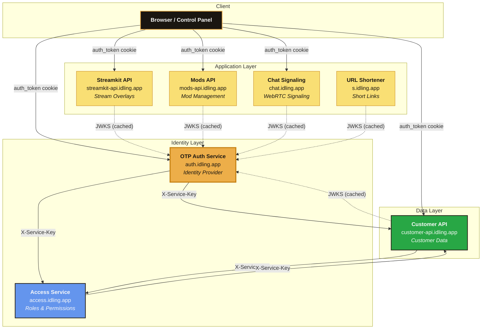

**Solid arrows** = direct API calls (HTTP requests with credentials).
**Dashed arrows** = JWKS fetches (public key retrieval for JWT verification, cached for 10 minutes).

---

## The Big Picture

Think of the platform like a building with a security desk:

1. **The Security Desk** (OTP Auth Service) checks your ID and gives you a badge (JWT).
2. **The Badge** has your `customerId` on it, is signed with the building's stamp (RS256 private key), and expires in 15 minutes.
3. **Every Office** (Streamkit, Customer API, Mods, etc.) can verify the stamp using the building's public key (JWKS). They never need to call the security desk to check -- they verify independently.
4. **If your badge expires**, you have a special renewal slip (refresh token) that lets the security desk give you a new badge without showing your ID again. This works for up to 7 days.
5. **The HR Department** (Customer API) holds all your personal information, looked up by the `customerId` on your badge.
6. **The Permissions Office** (Access Service) knows what rooms you're allowed to enter, also looked up by `customerId`.

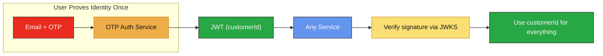

---

## Authentication: User → Platform

### Login Flow (End-to-End)

This is the complete sequence from "I want to log in" to "I can use any service."

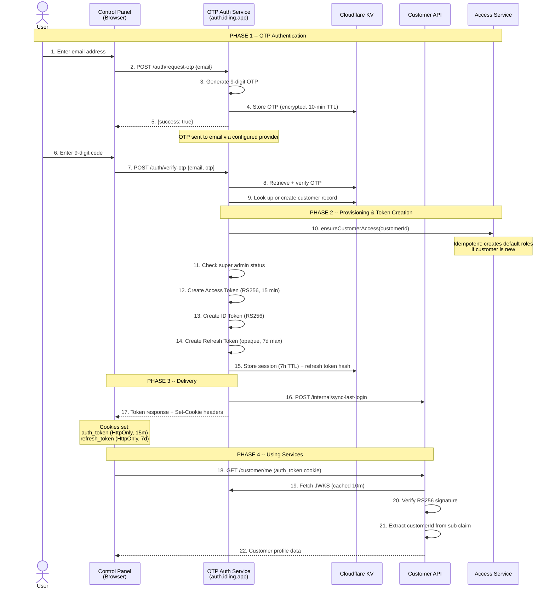

**Key points:**
- The email is used ONLY in Phase 1 (OTP delivery). After that, `customerId` is the sole identifier.
- Phase 2 happens entirely server-side. The browser never sees the email again.
- Phase 4 can happen with ANY service -- Streamkit, Mods, Chat, etc. They all verify the same JWT the same way.

### Silent Refresh Flow

Access tokens expire every 15 minutes. The client-side auth stores (`@strixun/auth-store`) handle this automatically:

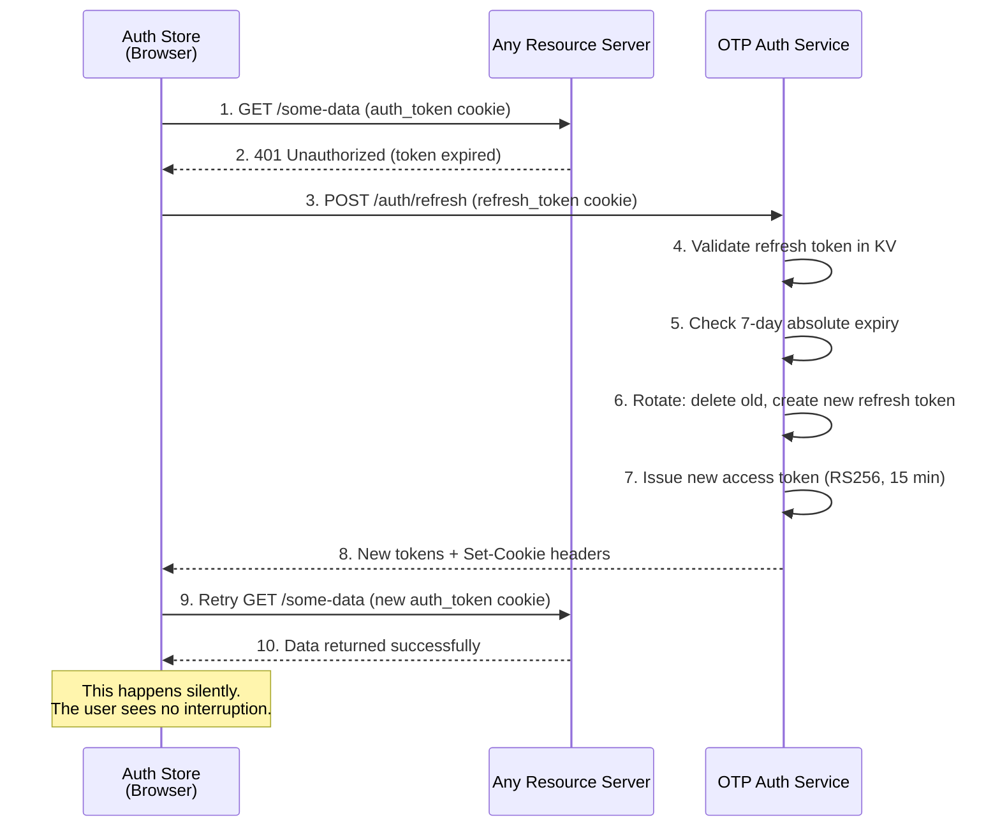

The auth store implementations (`zustand.ts` for React, `svelte.ts` for Svelte) use **both** proactive and reactive refresh:

**1. Proactive refresh (prevents logouts while the app is open)**  
While the tab is **visible** and the user is logged in, the client calls `POST /auth/refresh` every **14 minutes** (1 minute before the 15-minute access token expires). The access token is renewed before it expires, so the user does not see 401s or logouts as long as the tab stays active. When the tab is hidden, the timer is stopped; when the user brings the tab back, the 14-minute timer is rescheduled. This is the early session refresh that keeps the session alive when the application is still open/active.

**2. Reactive refresh (fallback when a request gets 401)**  
If any request returns 401 (e.g. tab was in background past 15 min, or first load after expiry), the store calls `refreshAuth()`, then retries the original call. If refresh fails (e.g. 7-day max reached), the user is logged out.

Example with tab kept visible:

```
[page load]     GET  /auth/me           → 200  (you're logged in)
[user action]   GET  /some-api          → 200
                ... 14 min, tab still visible ...
[proactive]     POST /auth/refresh      → 200  (new tokens; no user action)
                ... 14 min ...
[proactive]     POST /auth/refresh      → 200
                ... continues for up to 7 days from login ...
```

The `auth_token` HttpOnly cookie is sent automatically with every request. Refresh is deduped (one in-flight refresh shared by concurrent callers) and retried once on transient failure. If refresh fails and the user must request an OTP again, the server allows one OTP request without counting toward the rate limit when that email had a successful login or refresh in the last 30 minutes (recovery pass). See [OIDC_ARCHITECTURE.md](./OIDC_ARCHITECTURE.md) "Critical: Refresh reliability and OTP rate limiting."

### Logout Flow

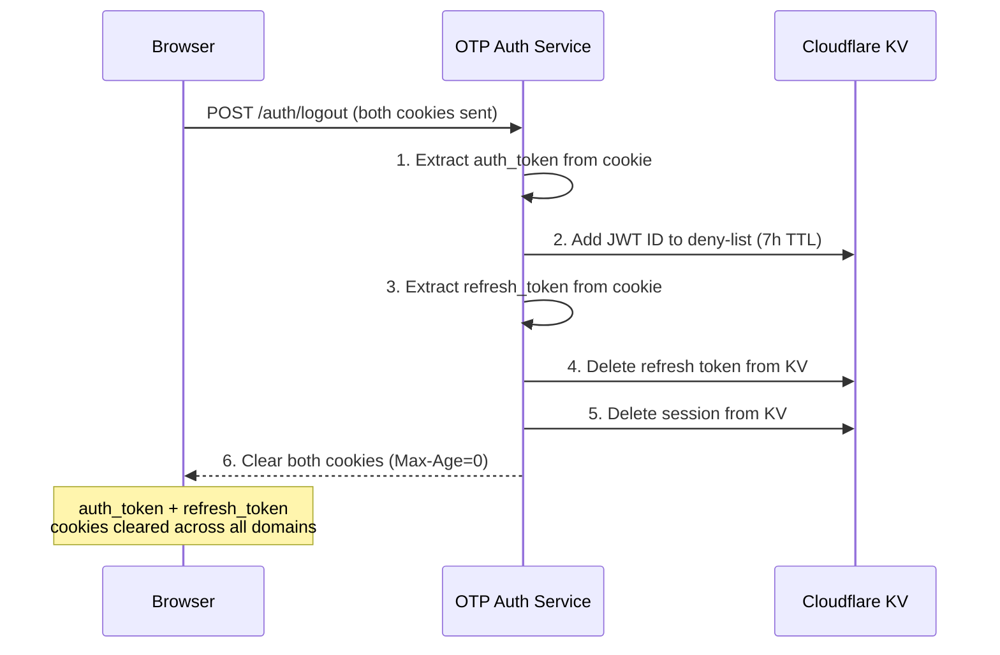

---

## Authorization: Service → Service

### How Resource Servers Verify JWTs

Every Strixun service that receives user requests uses the **shared `@strixun/api-framework`** package for JWT verification. This package provides a unified auth extraction pipeline:

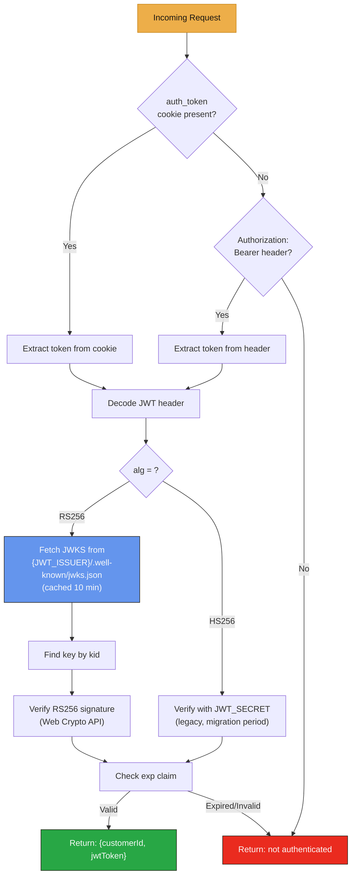

**The auth result contains ONLY `customerId` and `jwtToken`.** No email, no display name, no permissions. If a service needs customer data, it calls the Customer API. If it needs permissions, it calls the Access Service.

### Service-to-Service Calls

Services communicate with each other using two authentication mechanisms:

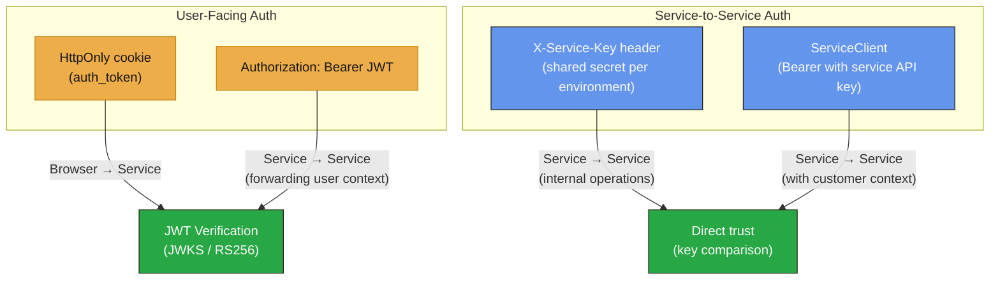

| Auth Method | When It's Used | Example |
|-------------|---------------|---------|
| **HttpOnly cookie** | Browser → any service | User visits the Control Panel, cookie sent automatically |
| **Bearer JWT** | Service forwarding user context | OTP Auth proxying `/customer/*` requests to Customer API |
| **X-Service-Key** | Internal operations (no user context) | OTP Auth calling `POST /internal/sync-last-login` on Customer API |
| **ServiceClient** | Service acting on behalf of platform | API Framework checking customer roles via Access Service |

### Admin Route Protection

Admin routes require both a valid JWT AND verified admin/super-admin role from the Access Service:

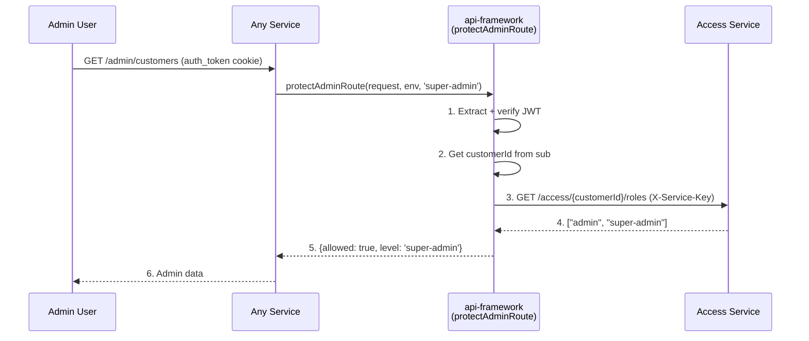

---

## The Trust Model

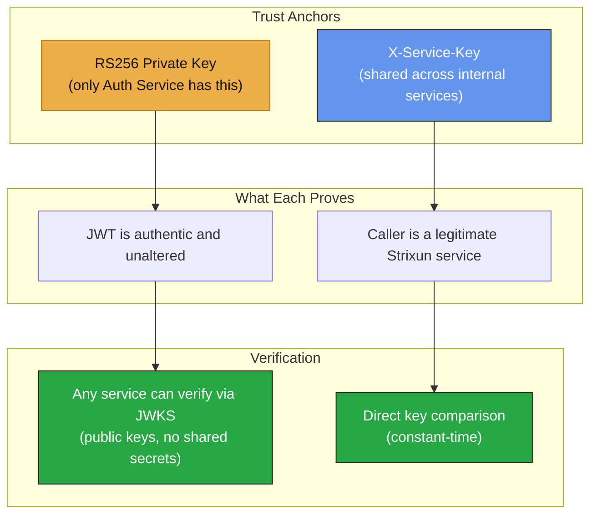

| Trust Anchor | Scope | Compromise Impact |
|-------------|-------|-------------------|
| **OIDC_SIGNING_KEY** (RS256 private key) | Token issuance | Attacker can forge JWTs. Rotate key immediately, all services pick up new JWKS automatically. |
| **X-Service-Key** | Internal service calls | Attacker can impersonate services. Rotate in all `wrangler.toml` files and redeploy. |
| **JWKS cache (10 min)** | Token verification | If a key is rotated, services may accept tokens signed with the old key for up to 10 minutes. |

---

## Every Service at a Glance

### OTP Auth Service

**Domain:** `auth.idling.app` | **Role:** Identity Provider (IdP)

The only service that handles email, OTP codes, JWT issuance, and session management. All other services trust it implicitly via its RS256 signatures.

| Endpoint | Method | Auth | Purpose |
|----------|--------|------|---------|
| `/auth/request-otp` | POST | API Key (optional) | Request a 9-digit OTP code |
| `/auth/verify-otp` | POST | API Key (optional) | Exchange email+OTP for tokens |
| `/auth/refresh` | POST | refresh_token cookie | Rotate tokens (silent refresh) |
| `/auth/me` | GET | JWT (cookie/Bearer) | UserInfo (OIDC) |
| `/auth/logout` | POST | JWT (cookie/Bearer) | Revoke tokens, clear cookies |
| `/auth/introspect` | POST | API Key | Token introspection (RFC 7662) |
| `/.well-known/openid-configuration` | GET | None | OIDC Discovery |
| `/.well-known/jwks.json` | GET | None | Public signing keys |
| `/customer/*` | Various | JWT | Proxied to Customer API |

**Outbound calls:**
- Customer API: `POST /internal/sync-last-login` (X-Service-Key)
- Customer API: `GET /customer/{id}` (ServiceClient Bearer)
- Access Service: super admin checks (X-Service-Key)

---

### Customer API

**Domain:** `customer-api.idling.app` | **Role:** Customer Data Store

Owns all customer profile data: display name, company, subscription, preferences, flairs. Identified exclusively by `customerId`.

| Endpoint | Method | Auth | Purpose |
|----------|--------|------|---------|
| `/customer/me` | GET | JWT | Current customer profile |
| `/customer/me` | PUT | JWT | Update current customer |
| `/customer/{id}` | GET/PUT | JWT or X-Service-Key | Customer by ID |
| `/customer/{id}/preferences` | GET/PUT | JWT | Customer preferences |
| `/customer/{id}/display-name` | PUT | JWT | Update display name |
| `/admin/customers` | GET | JWT + super-admin | List all customers |
| `/internal/sync-last-login` | POST | X-Service-Key only | Internal last-login sync |

**Outbound calls:**
- Access Service: role checks for admin routes (X-Service-Key / JWT)

---

### Access Service

**Domain:** `access.idling.app` | **Role:** Authorization (Roles, Permissions, Quotas)

Manages what each customer is allowed to do. Called by other services to check permissions.

| Endpoint | Method | Auth | Purpose |
|----------|--------|------|---------|
| `/access/{customerId}` | GET | X-Service-Key or JWT | Full access record |
| `/access/{customerId}/roles` | GET/PUT | Auth required | Customer roles |
| `/access/{customerId}/permissions` | GET/PUT | Auth required | Customer permissions |
| `/access/{customerId}/quotas` | GET/PUT | Auth required | Usage quotas |
| `/access/check-permission` | POST | Auth required | Permission check |
| `/access/roles` | GET/PUT | Super-admin or X-Service-Key | Role definitions |

**Outbound calls:**
- Customer API: `GET /customer/by-email/{email}` (X-Service-Key, for super-admin bootstrap only)

---

### Streamkit API

**Domain:** `streamkit-api.idling.app` | **Role:** Stream Overlay Configurations

Manages overlay configurations and scene activity tracking. Pure resource server -- no outbound service calls.

| Endpoint | Method | Auth | Purpose |
|----------|--------|------|---------|
| `/configs/{type}` | GET/POST | JWT | List/create configs |
| `/configs/{type}/{id}` | GET/PUT/DELETE | JWT | Config CRUD |
| `/scene-activity/record` | POST | JWT | Record scene switch |
| `/scene-activity/top` | GET | JWT | Top scenes |

---

### Other Services

| Service | Domain | Auth Method | Notes |
|---------|--------|-------------|-------|
| **Mods API** | mods-api.idling.app | JWT (cookie/Bearer) | Mod file management, integrity checks |
| **Chat Signaling** | chat.idling.app | JWT (cookie/Bearer) | WebRTC signaling, Durable Objects |
| **URL Shortener** | s.idling.app | JWT (cookie/Bearer) | Short link creation + redirect |

All follow the same pattern: verify JWT via JWKS, extract `customerId`, serve the request.

---

## Cross-Service Communication Map

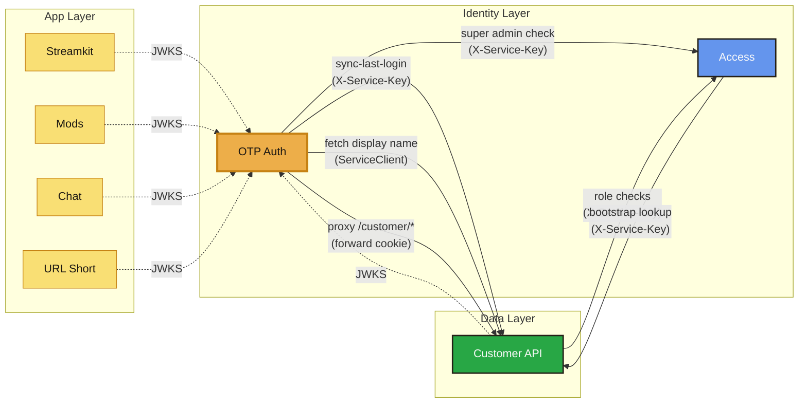

| Caller | → Target | Method | Auth | Endpoint | Purpose |
|--------|----------|--------|------|----------|---------|
| OTP Auth | Customer API | POST | X-Service-Key | `/internal/sync-last-login` | Sync last login timestamp after OTP verification |
| OTP Auth | Customer API | GET | ServiceClient Bearer | `/customer/{id}` | Fetch display name for token response |
| OTP Auth | Customer API | * | Forward cookie | `/customer/*` | Proxy unhandled customer routes |
| OTP Auth | Access Service | GET | X-Service-Key | `/access/{id}/roles` | Super admin check during token creation |
| Customer API | Access Service | GET | X-Service-Key | `/access/{id}/roles` | Admin route protection |
| Access Service | Customer API | GET | X-Service-Key | `/customer/by-email/{email}` | Bootstrap super-admin on first deploy |
| All services | OTP Auth | GET | None | `/.well-known/jwks.json` | Public key fetch for JWT verification |

---

## Environment Variables That Wire It All Together

Every service needs specific environment variables to participate in the trust network. These are set in each service's `wrangler.toml`.

| Variable | Set In | Purpose | Example (local dev) |
|----------|--------|---------|-------------------|
| `JWT_ISSUER` | All resource servers | Base URL for JWKS fetching and `iss` claim validation | `http://localhost:8787` |
| `AUTH_SERVICE_URL` | Fallback for JWT_ISSUER | Same as above (legacy name) | `http://localhost:8787` |
| `JWT_SECRET` | All services | HS256 signing key (legacy, migration period) | `dev-secret` |
| `OIDC_SIGNING_KEY` | OTP Auth only | RS256 private key (JWK format) for token signing | `{"kty":"RSA",...}` |
| `SERVICE_API_KEY` | All serverless services | X-Service-Key for internal service-to-service calls | `dev-service-key` |
| `CUSTOMER_API_URL` | OTP Auth, Access, api-framework | Customer API base URL | `http://localhost:8788` |
| `ACCESS_SERVICE_URL` | Customer API, OTP Auth, Mods API | Access Service base URL | `http://localhost:8790` |
| `NETWORK_INTEGRITY_KEYPHRASE` | ServiceClient, encryption wrapper | Additional integrity header for service calls | `dev-keyphrase` |
| `ALLOWED_ORIGINS` | All services | CORS allowed origins (comma-separated) | `http://localhost:5173` |

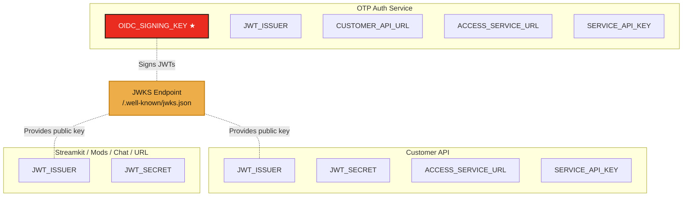

**★ The `OIDC_SIGNING_KEY` is the crown jewel.** Only the OTP Auth Service has it. It's a full RSA private key in JWK format. See [OIDC Architecture: Production Key Generation](./OIDC_ARCHITECTURE.md#token-signing-decision) for how to generate and deploy it.

---

## Privacy Architecture

A core design principle: **email addresses never leave the auth service.**

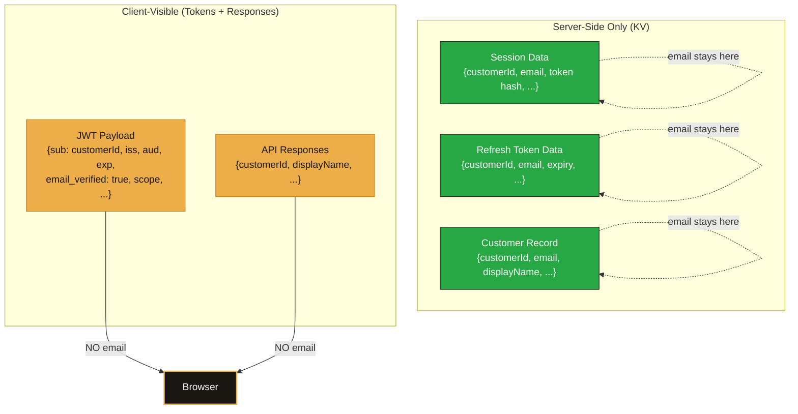

| Data | Where it lives | Who can see it |
|------|---------------|---------------|
| **Email** | OTP Auth KV only (session, refresh token, customer records) | Auth service server-side code only |
| **customerId** | JWT `sub` claim, all API responses | Every service, every client |
| **displayName** | Customer API, JWT response body | Every service, every client |
| **email_verified** | JWT payload (boolean only) | Every service -- confirms OTP was verified, reveals nothing |

---

## What Happens When Things Go Wrong

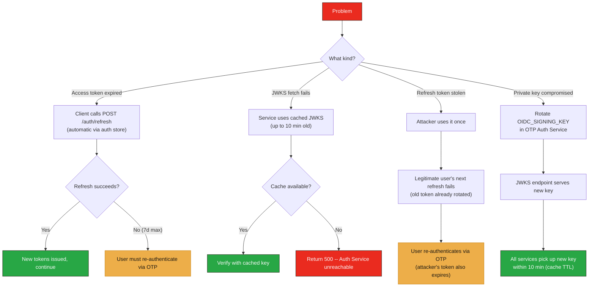

---

## Developer Quick Reference

### Adding JWT verification to a new service

1. Install the shared package: `@strixun/api-framework`
2. Add to your `wrangler.toml`:
   ```toml
   [env.development.vars]
   JWT_ISSUER = "http://localhost:8787"
   JWT_SECRET = "your-dev-secret"
   ```
3. In your request handler:
   ```typescript
   import { extractAuth } from '@strixun/api-framework/route-protection';
   import { verifyJWT } from '@strixun/api-framework/jwt';

   const auth = await extractAuth(request, env, verifyJWT);
   if (!auth) return new Response('Unauthorized', { status: 401 });
   
   const customerId = auth.customerId; // This is all you need
   ```

### Testing with the dev portal

1. Generate a test HTML snippet: `GET /api-key/test-snippet?apiKey=YOUR_KEY`
2. Open the downloaded HTML in a browser
3. Walk through the 5-step flow: Request OTP → Verify → Refresh → Get User Info → Logout
4. The OIDC section lets you inspect Discovery, JWKS, and Introspection

### Cookie properties at a glance

| Cookie | Max-Age | HttpOnly | SameSite | Secure | Domain |
|--------|---------|----------|----------|--------|--------|
| `auth_token` | 900 (15 min) | Yes | Lax | Production only | Root domain |
| `refresh_token` | ≤604800 (7 days) | Yes | Lax | Production only | Root domain |

---

## Glossary

| Term | Definition |
|------|-----------|
| **Resource Server** | Any service that verifies JWTs and serves protected data (Streamkit, Customer API, Mods, etc.). |
| **Identity Provider (IdP)** | The OTP Auth Service -- it authenticates users and issues tokens. |
| **JWKS** | JSON Web Key Set -- the public keys published by the Auth Service that resource servers use to verify token signatures. |
| **X-Service-Key** | A shared secret used for service-to-service calls that don't carry user context. |
| **ServiceClient** | A helper from `@strixun/api-framework` that makes authenticated service-to-service HTTP calls. |
| **Token Rotation** | Each use of a refresh token invalidates the old one and issues a new one. Limits the damage of a stolen token. |
| **Deny-List** | A KV store of revoked JWT IDs, checked during introspection and (optionally) by services during logout. |

---

**Related Documentation:**
- [OIDC Architecture (deep dive)](./OIDC_ARCHITECTURE.md) -- Token signing, OIDC Discovery, refresh tokens, session management
- [OTP Auth Service README](../╠═══ SERVICES  ═══════════╣/OTP_AUTH_SERVICE_README.md) -- Service-specific setup and endpoints
- [API Framework Enhanced Architecture](./API_FRAMEWORK_ENHANCED_ARCHITECTURE.md) -- The shared framework internals
- [Multi-Stage Encryption Diagram](./MULTI_STAGE_ENCRYPTION_DIAGRAM.md) -- E2E encryption layer
- [Authentication Methods](../╠═══ SECURITY  ═══════════╣/AUTHENTICATION_METHODS.md) -- All auth methods across the platform

---

**Last Updated**: 2026-02-19
**Version**: 1.0.0
**Status**: Complete
