# Strixun Stream Suite - Technical Architecture

> **For Developers, Engineers, and Technical Stakeholders**

This document provides a comprehensive technical overview of the Strixun Stream Suite architecture, including system design, component interactions, data flows, and implementation details.

---

## Table of Contents

1. [System Overview](#system-overview)
2. [Component Architecture](#component-architecture)
3. [Data Flow & Communication](#data-flow--communication)
4. [Storage Architecture](#storage-architecture)
5. [API Architecture](#api-architecture)
6. [Security Model](#security-model)
7. [Performance Considerations](#performance-considerations)
8. [Deployment Architecture](#deployment-architecture)

---

## System Overview

Strixun Stream Suite is a distributed system consisting of:

1. **Client-Side Components** (OBS Studio environment)
   - Lua scripts for OBS automation
   - Browser-based control panel
   - Browser sources for visual displays

2. **Serverless Backend** (Cloudflare Workers)
   - Twitch API proxy
   - Cloud storage service
   - Token management and caching

3. **Storage Systems**
   - Local: IndexedDB + localStorage (client)
   - Cloud: Cloudflare KV (serverless)

```mermaid
graph TB
    subgraph Client["Client Environment (OBS Studio)"]
        subgraph Lua["Lua Scripts"]
            SA[source_animations.lua]
            SS[source_swap.lua]
            SL[source_layouts.lua]
            TC[text_cycler.lua]
        end
        
        subgraph Browser["Browser Environment"]
            CP[Control Panel<br/>control_panel.html]
            TCD[Text Display<br/>text_cycler_display.html]
            CLIPS[Clips Player<br/>clips.html]
        end
        
        subgraph LocalStorage["Local Storage"]
            IDB[(IndexedDB)]
            LS[(localStorage)]
        end
    end
    
    subgraph Network["Network Layer"]
        WS[OBS WebSocket<br/>ws://localhost:4455]
        HTTP[HTTP/HTTPS]
    end
    
    subgraph Cloud["Cloudflare Edge"]
        subgraph Worker["Cloudflare Worker"]
            API[API Handler]
            TWITCH[Twitch Proxy]
            CLOUD[Cloud Storage]
        end
        
        KV[(Cloudflare KV)]
    end
    
    subgraph External["External Services"]
        TWITCH_API[Twitch API<br/>api.twitch.tv]
    end
    
    Lua <-->|OBS API| CP
    CP <-->|WebSocket| WS
    CP <-->|HTTP| HTTP
    CP <-->|BroadcastChannel| TCD
    CP <-->|BroadcastChannel| CLIPS
    CP <-->|Read/Write| IDB
    CP <-->|Read/Write| LS
    
    HTTP --> Worker
    Worker --> TWITCH
    Worker --> CLOUD
    TWITCH --> TWITCH_API
    CLOUD --> KV
    
    style Client fill:#1a1611,stroke:#edae49,stroke-width:2px
    style Cloud fill:#e3f2fd,stroke:#2196f3,stroke-width:2px
    style External fill:#9146ff,stroke:#772ce8,stroke-width:2px
```

---

## Component Architecture

### Client-Side Components

#### Lua Scripts Layer

The Lua scripts run within OBS Studio's Lua runtime and interact directly with OBS sources and scenes.

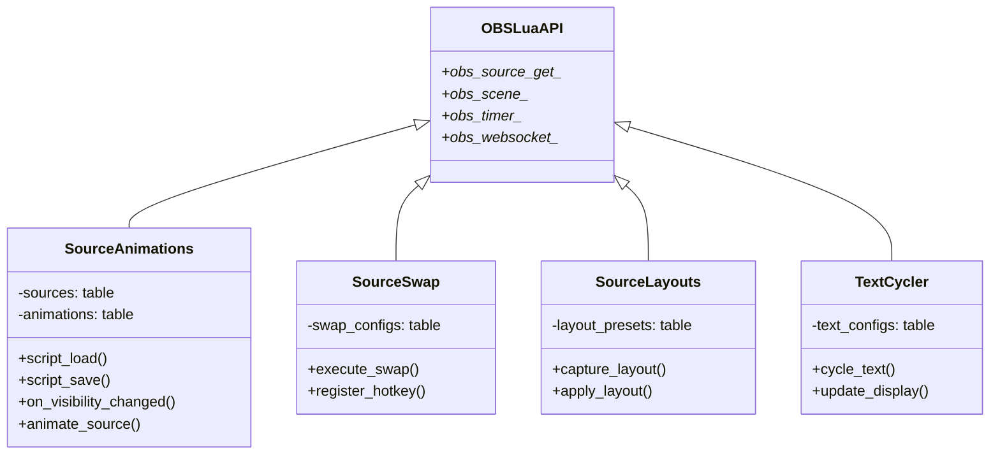

**Key Implementation Details:**

- **Script Lifecycle:** Each script implements `script_load()`, `script_save()`, `script_properties()`, and `script_update()`
- **Timer Management:** Uses `obs.timer_add()` and `obs.timer_remove()` for animations
- **WebSocket Communication:** Scripts listen for WebSocket messages from the control panel
- **State Persistence:** Settings saved via `script_save()` callback

#### Browser Components Layer

The browser-based components run in OBS's embedded Chromium browser (CEF).

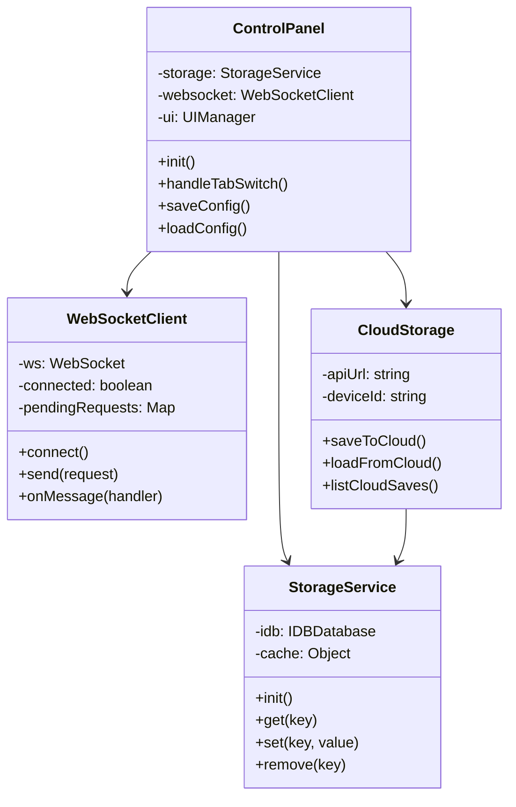

**Communication Patterns:**

1. **WebSocket (OBS ↔ Control Panel)**
   - Bidirectional communication
   - Request/response pattern with message IDs
   - Automatic reconnection on failure

2. **BroadcastChannel (Control Panel → Browser Sources)**
   - One-way messaging from control panel to displays
   - Used for text cycler and clips player updates
   - No response mechanism (fire-and-forget)

3. **Storage Events (Internal)**
   - Synchronous localStorage updates
   - Asynchronous IndexedDB operations
   - Cache-first read strategy

---

## Data Flow & Communication

### Request Flow: Executing a Source Swap

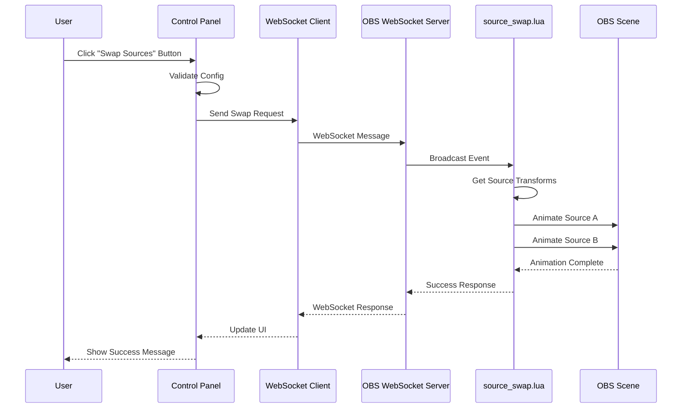

### Data Flow: Cloud Storage Save

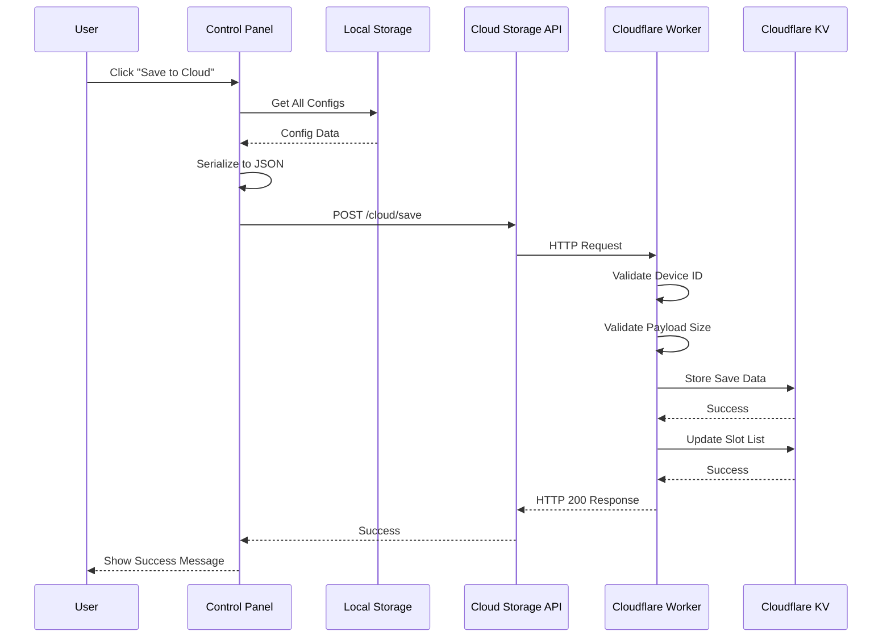

### Data Flow: Loading Configurations

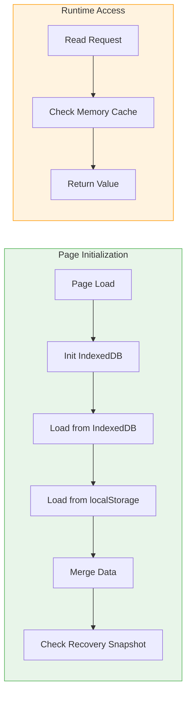

---

## Storage Architecture

### Local Storage Schema

#### IndexedDB Structure

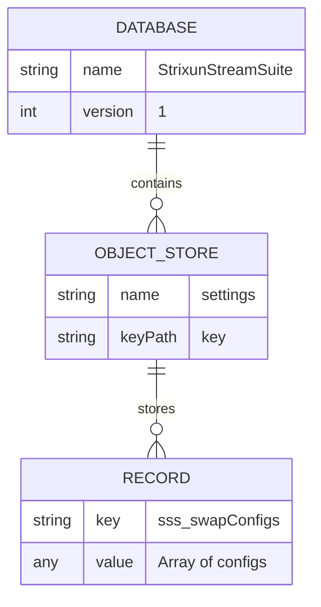

**Storage Keys (Prefix: `sss_`):**

| Key | Type | Description |
|-----|------|-------------|
| `swapConfigs` | Array | Source swap configurations |
| `textCyclerConfigs` | Array | Text cycler configurations |
| `clipsConfigs` | Array | Twitch clips player configurations |
| `sourceOpacityConfigs` | Object | Source opacity settings |
| `layoutPresets` | Array | Layout preset configurations |
| `obs_connection` | Object | OBS WebSocket connection settings |
| `ui_state` | Object | UI state (active tab, etc.) |
| `sss_device_id` | String | Cloud storage device identifier |
| `sss_auto_sync_enabled` | Boolean | Auto-sync preference |
| `sss_last_cloud_sync` | String | Last sync timestamp (ISO) |

#### localStorage Structure

Mirrors IndexedDB structure with `sss_` prefix. Used as backup and for synchronous access.

**Recovery Snapshot Key:**
- `sss_recovery_snapshot`: Auto-saved every 60 seconds, contains critical configs

### Cloud Storage Schema

#### Cloudflare KV Structure

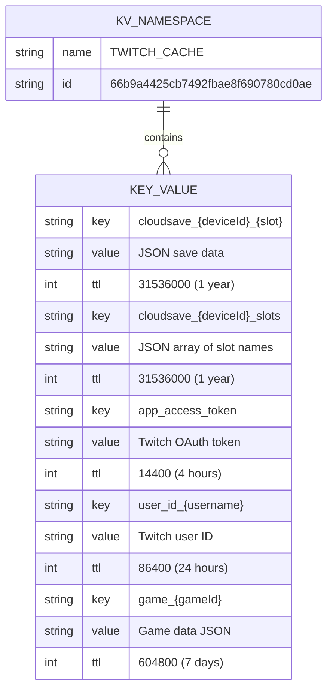

#### Cloud Save Data Structure

```typescript
interface CloudSaveData {
    version: number;              // Schema version (currently 2)
    deviceId: string;             // Device identifier
    slot: string;                 // Save slot name
    timestamp: string;            // ISO 8601 timestamp
    userAgent: string;            // Browser user agent
    configs: {
        swapConfigs?: SwapConfig[];
        layoutPresets?: LayoutPreset[];
        textCyclerConfigs?: TextCyclerConfig[];
        clipsConfigs?: ClipsConfig[];
        sourceOpacityConfigs?: Record<string, number>;
    };
    metadata?: {
        source?: string;          // 'manual' | 'autosave'
        note?: string;            // User-provided note
        description?: string;      // User-provided description
        configCounts?: Record<string, number>;
    };
}
```

### Storage Access Patterns

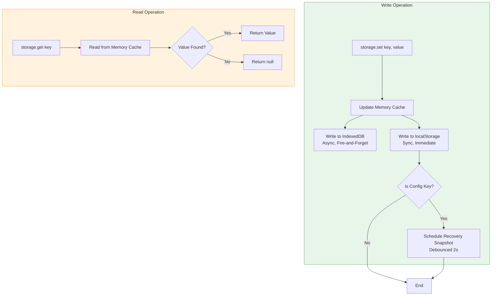

---

## API Architecture

### Cloudflare Worker Endpoints

```mermaid
graph TB
    subgraph Router["Request Router"]
        REQ[Incoming Request]
        PATH{Path Match}
    end
    
    subgraph Twitch["Twitch API Endpoints"]
        CLIPS[/clips]
        FOLLOWING[/following]
        GAME[/game]
        USER[/user]
    end
    
    subgraph Cloud["Cloud Storage Endpoints"]
        SAVE[/cloud/save POST]
        LOAD[/cloud/load GET]
        LIST[/cloud/list GET]
        DELETE[/cloud/delete DELETE]
    end
    
    subgraph System["System Endpoints"]
        HEALTH[/health GET]
        ROOT[/ GET]
    end
    
    REQ --> PATH
    PATH -->|/clips| CLIPS
    PATH -->|/following| FOLLOWING
    PATH -->|/game| GAME
    PATH -->|/user| USER
    PATH -->|/cloud/save| SAVE
    PATH -->|/cloud/load| LOAD
    PATH -->|/cloud/list| LIST
    PATH -->|/cloud/delete| DELETE
    PATH -->|/health or /| HEALTH
    PATH -->|Not Found| ERROR[404 Response]
    
    style Router fill:#e3f2fd,stroke:#2196f3
    style Twitch fill:#9146ff,stroke:#772ce8
    style Cloud fill:#4caf50,stroke:#2e7d32
    style System fill:#ff9800,stroke:#f57c00
```

### API Request/Response Flow

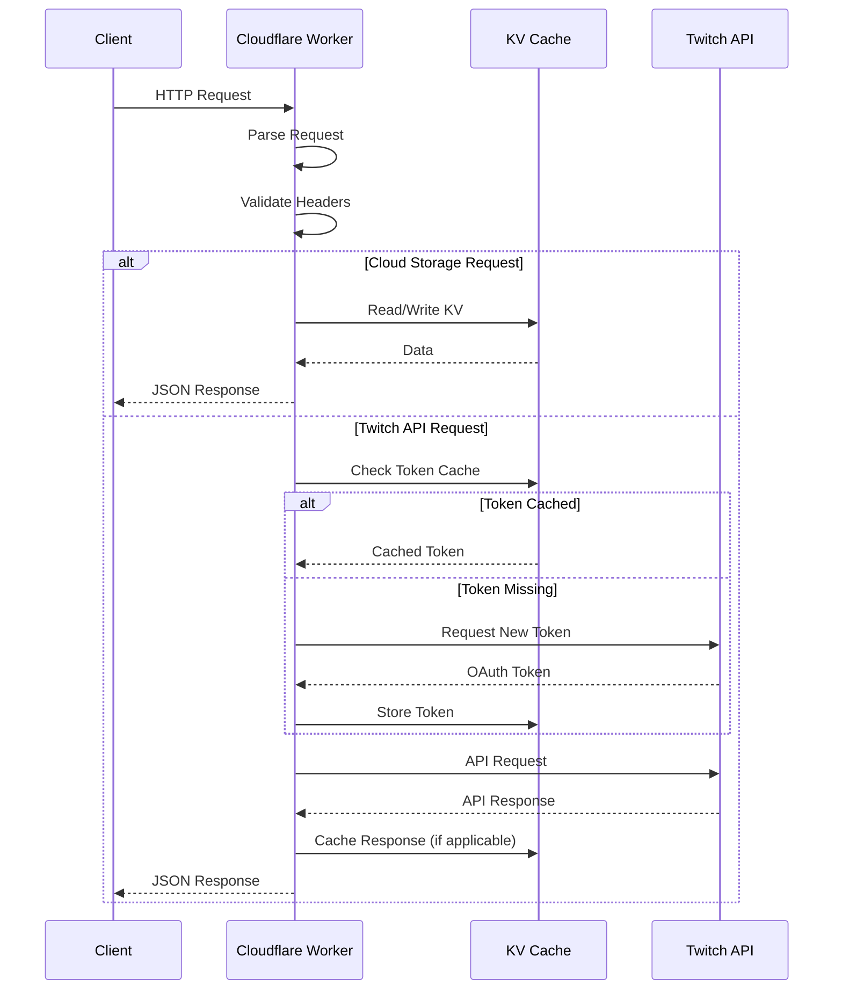

### Caching Strategy

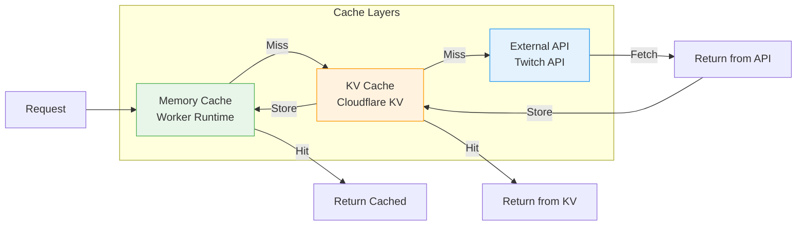

**Cache TTLs:**
- App Access Token: 4 hours (14400 seconds)
- User IDs: 24 hours (86400 seconds)
- Game Data: 7 days (604800 seconds)
- Cloud Saves: 1 year (31536000 seconds)

---

## Security Model

### Authentication & Authorization

```mermaid
flowchart TB
    subgraph Client["Client Side"]
        DEVICE[Device ID Generation]
        STORAGE[Local Storage]
    end
    
    subgraph Worker["Cloudflare Worker"]
        VALIDATE[Device ID Validation]
        REGEX[Regex: /^[a-zA-Z0-9_-]{8,64}$/]
    end
    
    subgraph KV["Cloudflare KV"]
        DATA[(Encrypted at Rest)]
    end
    
    DEVICE -->|Generate| STORAGE
    STORAGE -->|Send in Header| VALIDATE
    VALIDATE --> REGEX
    REGEX -->|Valid| DATA
    REGEX -->|Invalid| REJECT[400 Bad Request]
    
    style Client fill:#e8f5e9,stroke:#4caf50
    style Worker fill:#fff3e0,stroke:#ff9800
    style KV fill:#e3f2fd,stroke:#2196f3
```

**Security Features:**

1. **Device ID Validation**
   - Format: `sss_<timestamp>_<random>`
   - Regex validation: `/^[a-zA-Z0-9_-]{8,64}$/`
   - Prevents injection attacks

2. **Slot Name Validation**
   - Regex: `/^[a-zA-Z0-9_-]{1,32}$/`
   - Prevents path traversal

3. **Payload Size Limits**
   - Max 10MB per save (KV limit is 25MB, we use 10MB for safety)
   - Prevents DoS attacks

4. **CORS Protection**
   - Configurable origin whitelist
   - Prevents unauthorized access

5. **Data Encryption**
   - Cloudflare KV encrypted at rest
   - HTTPS in transit
   - No sensitive data in logs

---

## Performance Considerations

### Client-Side Performance

**Optimization Strategies:**

1. **Memory Cache First**
   - All reads from memory cache (synchronous)
   - IndexedDB and localStorage populate cache on init

2. **Debounced Writes**
   - Recovery snapshots debounced to 2 seconds
   - Reduces write operations

3. **Lazy Loading**
   - Configs loaded on-demand per tab
   - Reduces initial load time

4. **WebSocket Connection Pooling**
   - Single WebSocket connection reused
   - Request/response correlation via message IDs

### Server-Side Performance

**Cloudflare Worker Optimizations:**

1. **Edge Caching**
   - Responses cached at Cloudflare edge
   - Reduces latency globally

2. **KV Read Optimization**
   - Parallel reads where possible
   - Batch operations for slot lists

3. **Token Caching**
   - OAuth tokens cached in KV
   - Reduces Twitch API calls

4. **Response Streaming**
   - Large responses streamed
   - Reduces memory usage

### Performance Metrics

| Operation | Target | Actual |
|-----------|--------|--------|
| Local Storage Read | < 1ms | ~0.5ms |
| IndexedDB Read | < 10ms | ~5ms |
| Cloud Save Upload | < 500ms | ~200-300ms |
| Cloud Save Download | < 300ms | ~150-200ms |
| Twitch API Proxy | < 200ms | ~100-150ms |

---

## Deployment Architecture

### GitHub Actions Workflow

```mermaid
flowchart TB
    subgraph GitHub["GitHub Repository"]
        CODE[Source Code]
        PUSH[Push to main]
    end
    
    subgraph Actions["GitHub Actions"]
        TRIGGER[Workflow Triggered]
        BUILD[Build & Test]
        DEPLOY1[Deploy Pages]
        DEPLOY2[Deploy Worker]
    end
    
    subgraph Cloudflare["Cloudflare"]
        WORKER[Cloudflare Worker]
        KV[(Cloudflare KV)]
        PAGES[GitHub Pages<br/>via Cloudflare]
    end
    
    CODE --> PUSH
    PUSH --> TRIGGER
    TRIGGER --> BUILD
    BUILD --> DEPLOY1
    BUILD --> DEPLOY2
    DEPLOY1 --> PAGES
    DEPLOY2 --> WORKER
    WORKER --> KV
    
    style GitHub fill:#24292e,stroke:#0366d6
    style Actions fill:#2088ff,stroke:#0052cc
    style Cloudflare fill:#f38020,stroke:#fa8e39
```

### Deployment Environments

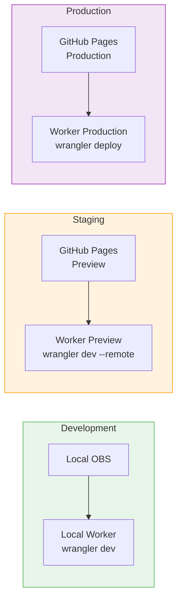

---

## Error Handling & Resilience

### Error Handling Strategy

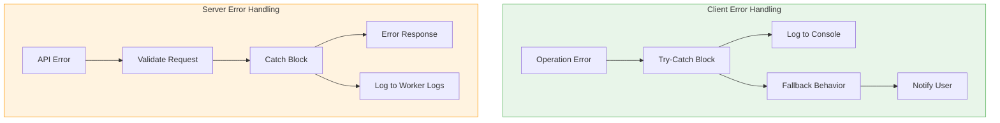

**Resilience Patterns:**

1. **Storage Fallback Chain**
   - IndexedDB → localStorage → Recovery Snapshot → User Prompt

2. **WebSocket Reconnection**
   - Automatic reconnection with exponential backoff
   - Queue requests during disconnection

3. **Cloud Storage Retry**
   - Retry failed requests up to 3 times
   - Graceful degradation (continue without cloud)

4. **Token Refresh**
   - Automatic token refresh on expiry
   - Fallback to new token request

---

## Monitoring & Observability

### Logging Strategy

**Client-Side Logging:**
- Console logs with prefixes: `[Storage]`, `[WebSocket]`, `[CloudStorage]`
- Error logs include stack traces
- Debug logs only in development mode

**Server-Side Logging:**
- Cloudflare Worker logs via `wrangler tail`
- Error responses include error messages
- Health endpoint for monitoring

### Metrics to Monitor

1. **Client Metrics**
   - Storage operation success rate
   - WebSocket connection uptime
   - Cloud save success rate

2. **Server Metrics**
   - API response times
   - Error rates by endpoint
   - KV operation latency
   - Token cache hit rate

---

## Future Architecture Considerations

### Scalability

- **Current:** Single Cloudflare Worker, single KV namespace
- **Future:** Multiple workers for different features, sharded KV if needed

### Extensibility

- **Plugin System:** Allow custom Lua scripts
- **API Extensions:** Webhook support for external integrations
- **Theme System:** Customizable control panel themes

### Performance Improvements

- **CDN Caching:** Cache static assets
- **WebSocket Pooling:** Multiple connections for high-volume operations
- **Batch Operations:** Batch cloud saves for efficiency

---

*For API reference documentation, see [API_REFERENCE.md](../06_API_REFERENCE/API_REFERENCE.md)*  
*For database schema details, see [DATABASE_SCHEMA.md](../12_REFERENCE/DATABASE_SCHEMA.md)*  
*For deployment instructions, see [DEPLOYMENT.md](../04_DEPLOYMENT/DEPLOYMENT.md)*
