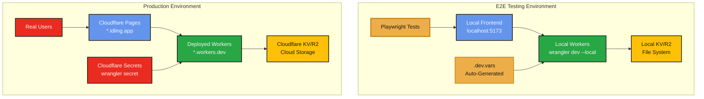
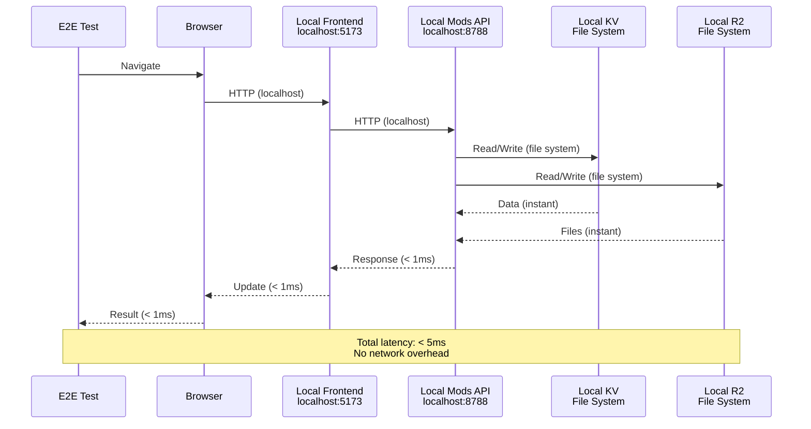
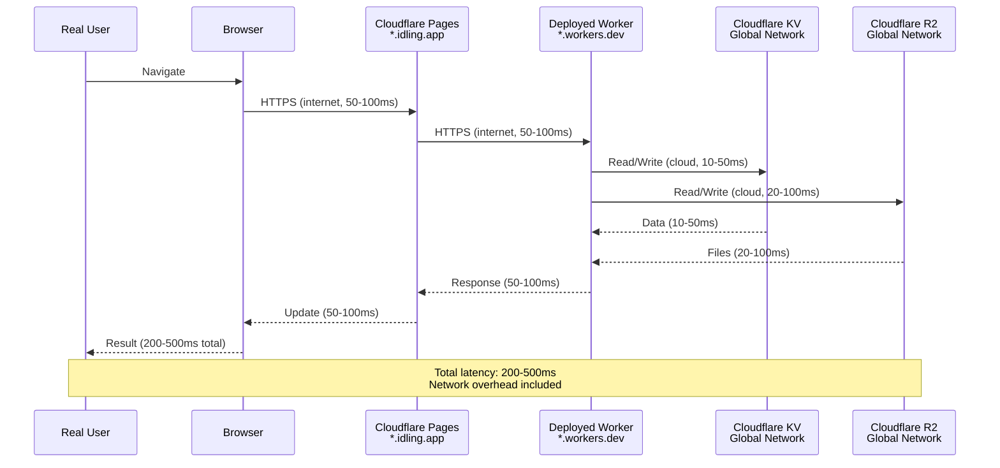
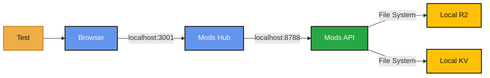
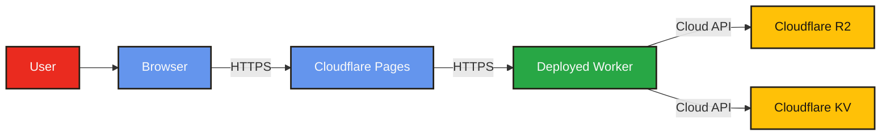
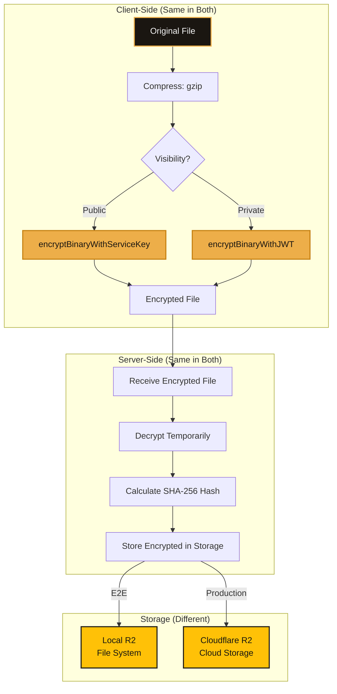
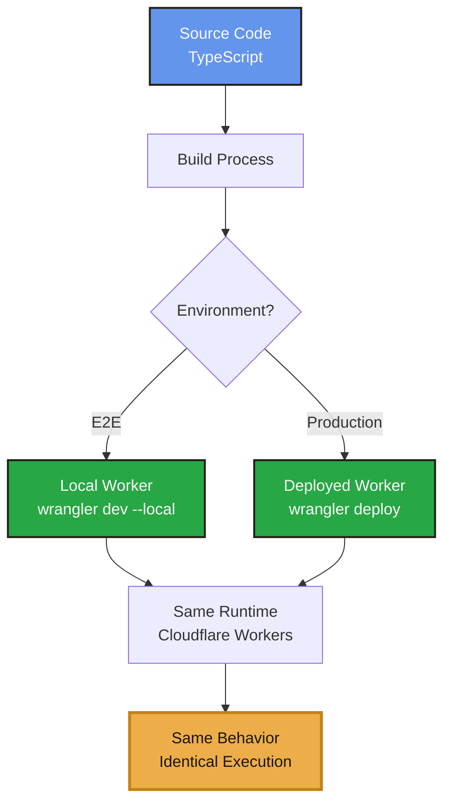

# E2E Testing vs Production - Complete Comparison

> **Side-by-side comparison of E2E testing environment and production environment**

**Last Updated:** 2025-12-30  
**Status:** ✓ Complete - Comprehensive comparison documented

---

## ★ Overview

This document provides a detailed comparison between the E2E testing environment (using local workers) and the production environment. Understanding these differences helps developers write better tests and ensures tests accurately reflect production behavior.

---

## ≡ Architecture Comparison

### Complete System Architecture

---

## ≡ Detailed Comparison Tables

### Infrastructure Comparison

| Aspect | E2E Testing | Production |
|--------|-------------|------------|
| **Workers** | Local (`wrangler dev --local`) | Deployed (`wrangler deploy`) |
| **Worker URLs** | `localhost:8787+` | `*.workers.dev` or `*.idling.app` |
| **Frontend** | `localhost:5173` / `localhost:3001` | `*.idling.app` (Cloudflare Pages) |
| **Storage Type** | Local file system | Cloud storage (Cloudflare) |
| **Storage Location** | `~/.wrangler/state/` | Cloudflare data centers |
| **Storage Persistence** | Ephemeral (cleared on restart) | Persistent (permanent) |
| **Network** | Localhost (no internet needed) | Internet (requires connectivity) |
| **Latency** | < 1ms (localhost) | 50-200ms (network round-trip) |
| **Bandwidth** | Unlimited (local) | Limited by internet connection |
| **Cost** | Free (local execution) | Cloudflare usage costs apply |
| **Setup Time** | Automatic (seconds) | Manual deployment (minutes) |
| **Debugging Access** | Full (logs, state, breakpoints) | Limited (wrangler tail) |

### Storage Comparison

| Storage Type | E2E (Local) | Production |
|--------------|-------------|------------|
| **KV Namespaces** | File-based (`--local` flag) | Cloudflare KV (cloud) |
| **R2 Buckets** | File-based (`--local` flag) | Cloudflare R2 (cloud) |
| **Data Location** | `~/.wrangler/state/kv/` | Cloudflare global network |
| **Persistence** | Cleared when worker stops | Permanent (until deleted) |
| **Replication** | Single file (local) | Global replication (cloud) |
| **Backup** | None (ephemeral) | Automatic (cloud) |
| **Access Method** | Direct file access | API only |
| **Performance** | Very fast (local disk) | Fast (edge network) |
| **Isolation** | Per-worker instance | Per-namespace (cloud) |

### Secret Management Comparison

| Aspect | E2E (Local) | Production |
|--------|-------------|------------|
| **Source** | `.dev.vars` files | `wrangler secret` (cloud) |
| **Location** | `serverless/{service}/.dev.vars` | Cloudflare Secrets API |
| **Generation** | Automatic (`setup:test-secrets`) | Manual (`wrangler secret put`) |
| **Values** | Test/development values | Production secrets |
| **Security** | Gitignored (not committed) | Encrypted in cloud |
| **Access** | File system read | API only (encrypted) |
| **Rotation** | Regenerate `.dev.vars` | Update via `wrangler secret` |
| **Sharing** | Local files (per developer) | Shared across deployments |

### Network Comparison

| Aspect | E2E (Local) | Production |
|--------|-------------|------------|
| **Protocol** | HTTP (localhost) | HTTPS (internet) |
| **Domain** | `localhost` | `*.idling.app` / `*.workers.dev` |
| **SSL/TLS** | Not required (localhost) | Required (HTTPS) |
| **CORS** | Same-origin (no CORS) | Cross-origin (CORS configured) |
| **Latency** | < 1ms | 50-200ms typical |
| **Bandwidth** | Unlimited | Limited by connection |
| **Reliability** | 100% (no network issues) | Variable (network conditions) |
| **Offline Support** | Works offline | Requires internet |

### Data Flow Comparison

#### E2E Testing Data Flow

#### Production Data Flow

---

## ≡ Request/Response Comparison

### Mod Upload Request Flow

#### E2E Testing

**Characteristics:**
- **✓ Latency:** < 5ms total
- **✓ Network:** Localhost only
- **✓ Storage:** File system (instant)
- **✓ Reliability:** 100% (no network issues)

#### Production

**Characteristics:**
- **~ Latency:** 200-500ms total
- **~ Network:** Internet (variable)
- **~ Storage:** Cloud API (10-100ms)
- **~ Reliability:** Variable (network conditions)

---

## ≡ Encryption/Decryption Comparison

### File Encryption Flow

Both environments use **identical encryption** - the same code runs in both:

**✓ Encryption is identical** - same algorithms, same keys, same behavior

---

## ≡ Test Execution Comparison

### E2E Test Execution Timeline

```mermaid
gantt
    title E2E Test Execution Timeline
    dateFormat X
    axisFormat %Ls
    
    section Startup
    Load Config           :0, 100
    Start Workers         :100, 3000
    Start Frontend        :100, 2000
    Health Checks         :3100, 500
    
    section Test Execution
    Test 1: Upload        :3600, 2000
    Test 2: Download      :5600, 1500
    Test 3: Detail Page   :7100, 1000
    
    section Cleanup
    Stop Workers          :8100, 500
    Generate Report       :8600, 400
```

**Total Time:** ~9 seconds (including startup)

### Production Request Timeline

```mermaid
gantt
    title Production Request Timeline
    dateFormat X
    axisFormat %Lms
    
    section Network
    DNS Lookup            :0, 20
    TCP Connection        :20, 30
    TLS Handshake         :50, 40
    
    section Request
    HTTP Request          :90, 50
    Worker Processing     :140, 100
    KV Read               :240, 30
    R2 Read               :270, 80
    
    section Response
    HTTP Response         :350, 50
    Network Transfer      :400, 100
```

**Total Time:** ~500ms (typical production request)

---

## ≡ Key Similarities

### What's the Same

1. **✓ Worker Code** - Exact same source code runs in both
2. **✓ API Behavior** - Identical request/response handling
3. **✓ Encryption** - Same algorithms and key derivation
4. **✓ Business Logic** - Same validation, processing, rules
5. **✓ Error Handling** - Same error responses and codes
6. **✓ Authentication** - Same JWT verification logic
7. **✓ Data Models** - Same TypeScript types and interfaces

### What's Different

1. **✗ Storage Location** - Local file vs cloud
2. **✗ Network** - Localhost vs internet
3. **✗ Secrets Source** - `.dev.vars` vs cloud secrets
4. **✗ Persistence** - Ephemeral vs permanent
5. **✗ Latency** - < 1ms vs 50-200ms
6. **✗ Cost** - Free vs Cloudflare usage

---

## ≡ Production Parity Guarantees

### Code Parity

**✓ Same Code = Same Behavior**

The local workers run the **exact same compiled code** as production. The only differences are:
- Where data is stored (local file vs cloud)
- How secrets are loaded (`.dev.vars` vs cloud secrets)
- Network location (localhost vs internet)

---

## ≡ When to Use Each

### Use E2E Testing When:

- **✓ Writing new tests** - Fast feedback loop
- **✓ Debugging issues** - Full access to logs and state
- **✓ Developing features** - Test before deploying
- **✓ CI/CD pipelines** - Automated testing
- **✓ Offline development** - No internet required
- **✓ Cost-sensitive testing** - No Cloudflare usage

### Use Production When:

- **✓ Final verification** - Confirm deployment works
- **✓ Performance testing** - Real network conditions
- **✓ Load testing** - Production-scale testing
- **✓ User acceptance** - Real user scenarios
- **✓ Monitoring** - Production metrics

---

## ★ Summary

### E2E Testing Advantages

**✓ Zero deployment time** - Tests start in seconds  
**✓ Fast execution** - Localhost speed, no network latency  
**✓ Complete isolation** - Can't affect production data  
**✓ Free** - No Cloudflare usage costs  
**✓ Full debugging** - Access to all logs and state  
**✓ Offline capable** - Works without internet  

### Production Characteristics

**~ Real network conditions** - Actual latency and bandwidth  
**~ Persistent data** - Data survives restarts  
**~ Global scale** - Real user load and distribution  
**~ Production monitoring** - Real metrics and analytics  
**~ Cost implications** - Cloudflare usage costs apply  

### The Bottom Line

**E2E tests provide production parity with zero deployment overhead.** The same code runs in both environments, ensuring tests accurately reflect production behavior while providing the speed and safety of local execution.

---

## ≡ Related Documentation

- [E2E Architecture and Local Workers](./E2E_ARCHITECTURE_AND_LOCAL_WORKERS.md) - Complete E2E architecture
- [E2E Testing Guide](./E2E_TESTING_GUIDE.md) - How to write and run tests
- [E2E Environment Verification](./E2E_ENVIRONMENT_VERIFICATION.md) - Environment checks

---

**Last Updated:** 2025-12-30

